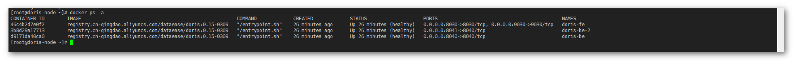

## 1 标准安装

!!! Abstract ""
	可以参考官网的集群部署文档：https://doris.apache.org/zh-CN/installing/install-deploy.html#%E9%9B%86%E7%BE%A4%E9%83%A8%E7%BD%B2
	
## 2 Docker-Compose 安装 

!!! Abstract ""
	**需要在服务器上提前安装 Docker 与 Docker-Compose，**
	在 Doris 节点上，使用 DataEase 提供的 Doris 镜像安装和运行 Apache Doris。

### 2.1 准备工作

!!! Abstract ""
    **Doris 服务器信息：**

    * IP： 10.1.11.183

### 2.2 环境要求
  
!!! Abstract ""
    **部署 Doris 服务器要求：**

    * 操作系统：CentOS 7.x
    * CPU/内存：4 核 16G
    * 磁盘空间：500G    

### 2.3 创建文件夹

!!! Abstract ""
    ```
    mkdir -p /opt/doris/conf /opt/doris/bin /opt/doris/data/fe /opt/doris/data/be /opt/doris/data/be-2 /opt/doris/logs/fe /opt/doris/logs/be /opt/doris/logs/be-2
    ```

### 2.4 准备配置文件

!!! Abstract ""
    **准备 fe.conf，放置在 /opt/doris/conf/fe.conf：**
    ```
    # Licensed to the Apache Software Foundation (ASF) under one
    # or more contributor license agreements.  See the NOTICE file
    # distributed with this work for additional information
    # regarding copyright ownership.  The ASF licenses this file
    # to you under the Apache License, Version 2.0 (the
    # "License"); you may not use this file except in compliance
    # with the License.  You may obtain a copy of the License at
    #
    #   http://www.apache.org/licenses/LICENSE-2.0
    #
    # Unless required by applicable law or agreed to in writing,
    # software distributed under the License is distributed on an
    # "AS IS" BASIS, WITHOUT WARRANTIES OR CONDITIONS OF ANY
    # KIND, either express or implied.  See the License for the
    # specific language governing permissions and limitations
    # under the License.
    
    #####################################################################
    ## The uppercase properties are read and exported by bin/start_fe.sh.
    ## To see all Frontend configurations,
    ## see fe/src/org/apache/doris/common/Config.java
    #####################################################################
    
    # the output dir of stderr and stdout
    LOG_DIR = ${DORIS_HOME}/log
    
    DATE = `date +%Y%m%d-%H%M%S`
    JAVA_OPTS="-Xmx4096m -XX:+UseMembar -XX:SurvivorRatio=8 -XX:MaxTenuringThreshold=7 -XX:+PrintGCDateStamps -XX:+PrintGCDetails -XX:+UseConcMarkSweepGC -XX:+UseParNewGC -XX:+CMSClassUnloadingEnabled -XX:-CMSParallelRemarkEnabled -XX:CMSInitiatingOccupancyFraction=80 -XX:SoftRefLRUPolicyMSPerMB=0 -Xloggc:$DORIS_HOME/log/fe.gc.log.$DATE"
    
    # For jdk 9+, this JAVA_OPTS will be used as default JVM options
    JAVA_OPTS_FOR_JDK_9="-Xmx4096m -XX:SurvivorRatio=8 -XX:MaxTenuringThreshold=7 -XX:+CMSClassUnloadingEnabled -XX:-CMSParallelRemarkEnabled -XX:CMSInitiatingOccupancyFraction=80 -XX:SoftRefLRUPolicyMSPerMB=0 -Xlog:gc*:$DORIS_HOME/log/fe.gc.log.$DATE:time"
    
    ##
    ## the lowercase properties are read by main program.
    ##
    
    # INFO, WARN, ERROR, FATAL
    sys_log_level = INFO
    
    # store metadata, must be created before start FE.
    # Default value is ${DORIS_HOME}/doris-meta
    # meta_dir = ${DORIS_HOME}/doris-meta
    
    http_port = 8030
    rpc_port = 9020
    query_port = 9030
    edit_log_port = 9010
    mysql_service_nio_enabled = true
    
    # Choose one if there are more than one ip except loopback address.
    # Note that there should at most one ip match this list.
    # If no ip match this rule, will choose one randomly.
    # use CIDR format, e.g. 10.10.10.0/24
    # Default value is empty.
    # priority_networks = 10.10.10.0/24;192.168.0.0/16
    
    # Advanced configurations
    # log_roll_size_mb = 1024
    # sys_log_dir = ${DORIS_HOME}/log
      sys_log_roll_num = 1
    # sys_log_verbose_modules =
    # audit_log_dir = ${DORIS_HOME}/log
    # audit_log_modules = slow_query, query
      audit_log_roll_num = 1
    # meta_delay_toleration_second = 10
      qe_max_connection = 65535
      max_conn_per_user = 1024
    # qe_query_timeout_second = 300
    # qe_slow_log_ms = 5000
      sys_log_delete_age=1d
      audit_log_delete_age=3d
      exec_mem_limit=8589934592
      tablet_create_timeout_second=30
      catalog_trash_expire_second = 60
      enable_batch_delete_by_default=true
      max_layout_length_per_row=10000000
      stream_load_default_timeout_second=6000
    ```
    准备 be.conf，放置在 /opt/doris/conf/be.conf：
    ```
    # Licensed to the Apache Software Foundation (ASF) under one
    # or more contributor license agreements.  See the NOTICE file
    # distributed with this work for additional information
    # regarding copyright ownership.  The ASF licenses this file
    # to you under the Apache License, Version 2.0 (the
    # "License"); you may not use this file except in compliance
    # with the License.  You may obtain a copy of the License at
    #
    #   http://www.apache.org/licenses/LICENSE-2.0
    #
    # Unless required by applicable law or agreed to in writing,
    # software distributed under the License is distributed on an
    # "AS IS" BASIS, WITHOUT WARRANTIES OR CONDITIONS OF ANY
    # KIND, either express or implied.  See the License for the
    # specific language governing permissions and limitations
    # under the License.
    
    PPROF_TMPDIR="$DORIS_HOME/log/"
    
    # INFO, WARNING, ERROR, FATAL
    sys_log_level = INFO
    
    # ports for admin, web, heartbeat service
    be_port = 9060
    be_rpc_port = 9070
    webserver_port = 8040
    heartbeat_service_port = 9050
    brpc_port = 8060
    
    # Choose one if there are more than one ip except loopback address.
    # Note that there should at most one ip match this list.
    # If no ip match this rule, will choose one randomly.
    # use CIDR format, e.g. 10.10.10.0/24
    # Default value is empty.
    # priority_networks = 10.10.10.0/24;192.168.0.0/16
    
    # data root path, separate by ';'
    # you can specify the storage medium of each root path, HDD or SSD
    # you can add capacity limit at the end of each root path, seperate by ','
    # eg:
    # storage_root_path = /home/disk1/doris.HDD,50;/home/disk2/doris.SSD,1;/home/disk2/doris
    # /home/disk1/doris.HDD, capacity limit is 50GB, HDD;
    # /home/disk2/doris.SSD, capacity limit is 1GB, SSD;
    # /home/disk2/doris, capacity limit is disk capacity, HDD(default)
    #
    # you also can specify the properties by setting '<property>:<value>', seperate by ','
    # property 'medium' has a higher priority than the extension of path
    #
    # Default value is ${DORIS_HOME}/storage, you should create it by hand.
    # storage_root_path = ${DORIS_HOME}/storage
    
    # Advanced configurations
    # sys_log_dir = ${DORIS_HOME}/log
    # sys_log_roll_mode = SIZE-MB-1024
      sys_log_roll_num = 1
      load_error_log_reserve_hours=1
    # sys_log_verbose_modules = *
    # log_buffer_level = -1
    # palo_cgroups
      trash_file_expire_time_sec = 60
      snapshot_expire_time_sec = 60
      pending_data_expire_time_sec = 60
    exec_mem_limit = 8G
    streaming_load_max_mb=102400
    ```
    准备初始化脚本 init.sql，放置在 /opt/doris/bin/init.sql：
    ```
    ALTER SYSTEM ADD BACKEND '172.19.0.199:9050';
    ALTER SYSTEM ADD BACKEND '172.19.0.200:9050';
    CREATE DATABASE dataease;
    SET PASSWORD FOR 'root' = PASSWORD('Password123@doris');
    ```
    准备 docker-compose 文件，放置在 /opt/doris/docker-compose.yml：
    ```
    version: '2.1'
    services:
    
      doris-fe:
        image: registry.cn-qingdao.aliyuncs.com/dataease/doris:0.15-0309
        container_name: doris-fe
        environment:
          - DORIS_ROLE=fe-leader
          - FORMAT_MESSAGES_PATTERN_DISABLE_LOOKUPS=true
        ports:
          - 8030:8030
          - 9030:9030
        volumes:
          - /opt/doris/data/fe:/opt/doris/fe/doris-meta
          - /opt/doris/logs/fe:/opt/doris/fe/log
          - /opt/doris/conf/fe.conf:/opt/doris/fe/conf/fe.conf
          - /opt/doris/bin:/docker-entrypoint-initdb.d/
        networks:
          doris-network :
            ipv4_address: 172.19.0.198
        restart: always
        depends_on:
          doris-be:
            condition: service_healthy
          doris-be-2:
            condition: service_healthy
        healthcheck:
          test: [ "CMD-SHELL", "curl -sS 127.0.0.1:8030 || exit 1" ]
          interval: 10s
          timeout: 5s
          retries: 3
    
      doris-be:
        image: registry.cn-qingdao.aliyuncs.com/dataease/doris:0.15-0309
        container_name: doris-be
        environment:
          - DORIS_ROLE=be
          - FORMAT_MESSAGES_PATTERN_DISABLE_LOOKUPS=true
        ports:
          - 8040:8040
        volumes:
          - /opt/doris/data/be:/opt/doris/be/storage
          - /opt/doris/logs/be:/opt/doris/be/log
          - /opt/doris/conf/be.conf:/opt/doris/be/conf/be.conf
        networks:
          doris-network :
            ipv4_address: 172.19.0.199
        restart: always
        healthcheck:
          test: [ "CMD-SHELL", "curl -sS 127.0.0.1:8040 || exit 1" ]
          interval: 10s
          timeout: 5s
          retries: 3
    
      doris-be-2:
        image: registry.cn-qingdao.aliyuncs.com/dataease/doris:0.15-0309
        container_name: doris-be-2
        environment:
          - DORIS_ROLE=be
          - FORMAT_MESSAGES_PATTERN_DISABLE_LOOKUPS=true
        ports:
          - 8041:8040
        volumes:
          - /opt/doris/data/be-2:/opt/doris/be/storage
          - /opt/doris/logs/be-2:/opt/doris/be/log
          - /opt/doris/conf/be.conf:/opt/doris/be/conf/be.conf
        networks:
          doris-network :
            ipv4_address: 172.19.0.200
        restart: always
        healthcheck:
          test: [ "CMD-SHELL", "curl -sS 127.0.0.1:8040 || exit 1" ]
          interval: 10s
          timeout: 5s
          retries: 3
    
    networks:
      doris-network:
        driver: bridge
        ipam:
          driver: default
          config:
            - subnet: 172.19.0.0/16
              gateway: 172.19.0.1
    ```

### 2.5 运行 Apache Doris 

!!! Abstract ""
    ```
    cd /opt/doris
    docker-compose up -d
    ```
{ width="900px" }

### 2.6 检查

!!! Abstract ""
    **用 MySQL 客户端接入 doris-fe，查看 doris be 节点是否成功添加：**
    ```
    mysql> show proc "/backends";
    ```
{ width="900px" }
	

