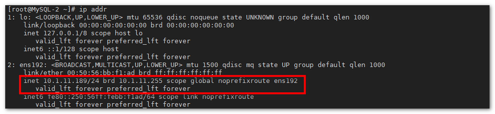

## 1 准备工作

### 1.1 服务器准备

!!! Abstract ""
    **此处在 MySQL 集群节点上进行 Keepalived 的安装，一起实现负载均衡和 MySQL 的高可用，节点规划如下：**

    * Keepalived-1 节点，IP 为 10.1.11.187
    * Keepalived-2 节点，IP 为 10.1.11.189

    其他信息：

    * VIP：10.1.11.137

### 1.2 软件准备

!!! Abstract ""
    可以在 Keepalived 官网下载对应的安装包，此处下载的是 keepalived-2.2.7.tar.gz。
    ```shell
    wget --no-check-certificate https://www.keepalived.org/software/keepalived-2.2.7.tar.gz
    ```

## 2 安装 Keepalived

!!! Abstract ""
	**在两个节点上分别执行以下命令安装 Keepalived：**  
    ```
    # 安装依赖包
    yum install -y gcc-c++ pcre-devel openssl-devel popt-devel gcc automake autoconf libtool make ca-certificates
    
    tar zxvf keepalived-2.2.7.tar.gz -C /opt
    
    cd /opt/keepalived-2.2.7
    
    ./configure --prefix=/usr/local/keepalived
    
    make && make install
    ```
## 3 配置系统服务

!!! Abstract ""
    在两个节点上分别执行以下命令：

    ```shell
    cp /usr/local/keepalived/etc/sysconfig/keepalived  /etc/sysconfig/keepalived
    cp /usr/local/keepalived/sbin/keepalived /usr/sbin/keepalived
    cp /opt/keepalived-2.2.7/keepalived/etc/init.d/keepalived /etc/init.d/keepalived
    mkdir -p /etc/keepalived
    ```
    加为系统服务且开机自启动：

    ```
    chkconfig --add keepalived
    chkconfig keepalived on
    ```

## 4 编写 Keepalived 切换脚本

!!! Abstract ""
	**在两个节点上执行以下命令创建 Keepalived 切换脚本：**
    ```
    cat <<EOF >> /usr/local/keepalived/down.sh
    #!/bin/bash
    pkill keepalived
    EOF
    
    # 赋予切换脚本执行权限
    chmod +x /usr/local/keepalived/down.sh
    ```

## 5 配置 Keepalived

### 5.1 配置 Keepalived-1 节点

!!! Abstract ""
	**将 Keepalived-1 上的 Keepalived 配置文件 /etc/keepalived/keepalived.conf 修改为以下内容：** 
    ```
    ! Configuration File for keepalived
    
    global_defs {
       router_id DE_HA
    }
    
    vrrp_instance VI_1 {
        state MASTER
        interface ens192
        virtual_router_id 51
        priority 100
        advert_int 1
        #本机 ip
        unicast_src_ip 10.1.11.187
        unicast_peer {
            #对端 ip
            10.1.11.189
    }
        authentication {
            auth_type PASS
            auth_pass 1111
        }
        virtual_ipaddress {
            10.1.11.137
        }
    }
    
    virtual_server 10.1.11.137 3306 {
        delay_loop 2
        persistence_timeout 50
        protocol TCP
    
        real_server 10.1.11.187 3306 {
            weight 3
            notify_down /usr/local/keepalived/down.sh
            TCP_CHECK {
                connect_timeout 3
                nb_get_retry 3
                delay_before_retry 3
            }
        }
    }
    
    virtual_server 10.1.11.137 80 {
        delay_loop 2
        persistence_timeout 50
        protocol TCP
    
        real_server 10.1.11.187 80 {
            weight 3
            notify_down /usr/local/keepalived/down.sh
            TCP_CHECK {
                connect_timeout 3
                nb_get_retry 3
                delay_before_retry 3
            }
        }
    }
    ```

!!! Abstract ""
    **注意：**

    1. 配置文件中的 “interface ens192”，需要视具体环境设置对应的网卡，如 “eth0” 等；       
    2. 注意配置文件中的 "state MASTER"、"priority 100"。


### 5.2 配置 Keepalived-2 节点

!!! Abstract ""
	**将 Keepalived-2 节点上的 Keepalived 配置文件 /etc/keepalived/keepalived.conf 修改为以下内容：**
    ```
    ! Configuration File for keepalived
    
    global_defs {
       router_id DE_HA
    }
    
    vrrp_instance VI_1 {
        state BACkUP
        interface ens192
        virtual_router_id 51
        priority 50
        advert_int 1
        #本机ip
        unicast_src_ip 10.1.11.189
        unicast_peer {
            #对端ip
            10.1.11.187
        }
        authentication {
            auth_type PASS
            auth_pass 1111
        }
        virtual_ipaddress {
            10.1.11.137
        }
    }
    
    virtual_server 10.1.11.137 3306 {
        delay_loop 2
        persistence_timeout 50
        protocol TCP
    
        real_server 10.1.11.189 3306 {
            weight 3
            notify_down /usr/local/keepalived/down.sh
            TCP_CHECK {
                connect_timeout 3
                nb_get_retry 3
                delay_before_retry 3
            }
        }
    }
    
    virtual_server 10.1.11.137 80 {
        delay_loop 2
        persistence_timeout 50
        protocol TCP
    
        real_server 10.1.11.189 80 {
            weight 3
            notify_down /usr/local/keepalived/down.sh
            TCP_CHECK {
                connect_timeout 3
                nb_get_retry 3
                delay_before_retry 3
            }
        }
    }
    ```
    
!!! Abstract ""
    **注意：**
    
    1. 配置文件中的 “interface eth0”，需要视具体环境设置对应的网卡，如 “ens192” 等；       
    2. 注意配置文件中的 "state BACKUP"、"priority 50"。

## 6 启动 Keepalived 服务

!!! Abstract ""
	**在两个节点上分别启动 Keepalived 服务：** 
    ```
    service keepalived start
    ```
{ width="900px" }

## 7 验证高可用配置

!!! Abstract ""
	**Keepalived 配置的 MASTER 节点为 Keepalived-1 节点，可以通过在两个节点上执行命令，查看配置的 VIP 在哪台机器上。** 

    ```shell
    ip addr
    ```

    在 Keepalived-1 节点上可以看到对应的网卡上存在两个 IP，分别是自身 IP 10.1.11.187 和 VIP 10.1.11.137，而节点 B 上只会看到 IP 10.1.11.137。

{ width="900px" }
    
!!! Abstract ""
    而 Keepalived-2 节点上只会看到 IP 10.1.11.189。

{ width="900px" }

!!! Abstract ""
    当在 Keepalived-1 节点上关闭 Nginx 服务后，再次执行上述命令，可以看到 Keepalived-2 节点上存在两个 IP，VIP 已经漂移到了 Keepalived-2 节点上。

{ width="900px" }
