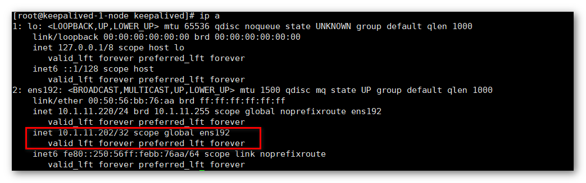

## 1 准备工作

!!! Abstract ""
    **本文配合前文 【[Nginx 部署](nginx_installation.md)】 和 【[MySQL 部署](mysql_installation.md)】 一起实现负载均衡和 MySQL 的高可用。**
    
    Keepalived 环境的搭建需要准备以下资源：
    
    * VIP: 10.1.11.202
    * Nginx 节点 A： 10.1.11.198
    * Nginx 节点 B： 10.1.11.199
    * MySQL 节点 A： 10.1.11.180
    * MySQL 节点 B： 10.1.11.181
    * Keepalived 节点 A： 10.1.11.220
    * Keepalived 节点 B： 10.1.11.221

## 2 环境要求

!!! Abstract ""
    **部署 Keepalived 服务器要求：**

    * 操作系统：CentOS 7.x
    * CPU/内存：4 核 8G
    * 磁盘空间：500G

## 3 安装 Keepalived

!!! Abstract ""
	**在两个节点上分别执行以下命令安装 Keepalived：**  
    ```
    #安装依赖包
    yum install -y gcc-c++ pcre-devel openssl-devel popt-devel gcc automake autoconf libtool make ca-certificates
    
    #下载安装包
    wget www.keepalived.org/software/keepalived-1.2.7.tar.gz
    
    tar zxvf keepalived-1.2.7.tar.gz
    
    cd keepalived-1.2.7
    
    ./configure --prefix=/usr/local/keepalived
    
    make && make install
    ```
    
## 4 编写 Keepalived 切换脚本

!!! Abstract ""
	**在两个节点上执行以下命令创建 Keepalived 切换脚本：**
    ```
    cat <<EOF >> /usr/local/keepalived/down.sh
    #!/bin/bash
    pkill keepalived
    EOF
    
    # 赋予切换脚本执行权限
    chmod +x /usr/local/keepalived/down.sh
    ```
{ width="900px" }

## 5 配置系统服务

!!! Abstract ""
	**在两个节点上分别执行以下命令：**
    ```
    cp /usr/local/keepalived/etc/rc.d/init.d/keepalived /etc/init.d/
    cp /usr/local/keepalived/etc/sysconfig/keepalived /etc/sysconfig/
    mkdir /etc/keepalived/
    cp /usr/local/keepalived/etc/keepalived/keepalived.conf /etc/keepalived/
    cp /usr/local/keepalived/sbin/keepalived /usr/sbin/
    ```

## 6 配置 Keepalived

### 6.1 配置节点 A

!!! Abstract ""
	**将节点 A 上的 Keepalived 配置文件 /etc/keepalived/keepalived.conf 修改为以下内容：** 
    ```
    ! Configuration File for keepalived
    
    global_defs {
       router_id DE_HA
    }
    
    vrrp_instance VI_1 {
        state MASTER
        interface eth0
        virtual_router_id 51
        priority 100
        advert_int 1
        authentication {
            auth_type PASS
            auth_pass 1111
        }
        virtual_ipaddress {
            10.1.11.202
        }
    }
    
    virtual_server 10.1.11.202 3306 {
        delay_loop 2
        persistence_timeout 50
        protocol TCP
    
        real_server 10.1.11.180 3306 {
            weight 3
            notify_down /usr/local/keepalived/down.sh
            TCP_CHECK {
                connect_timeout 3
                nb_get_retry 3
                delay_before_retry 3
            }
        }
    }
    
    virtual_server 10.1.11.202 80 {
        delay_loop 2
        persistence_timeout 50
        protocol TCP
    
        real_server 10.1.11.198 80 {
            weight 3
            notify_down /usr/local/keepalived/down.sh
            TCP_CHECK {
                connect_timeout 3
                nb_get_retry 3
                delay_before_retry 3
            }
        }
    }
    ```

!!! Abstract ""
    **注意：**

    1. 配置文件中的 “interface eth0”，需要视具体环境设置对应的网卡，如 “ens192” 等；       
    2. 注意配置文件中的 "state MASTER"、"priority 100"。


### 6.2 配置节点 B

!!! Abstract ""
	**将节点 B 上的 Keepalived 配置文件 /etc/keepalived/keepalived.conf 修改为以下内容：**
    ```
    ! Configuration File for keepalived
    
    global_defs {
       router_id DE_HA
    }
    
    vrrp_instance VI_1 {
        state BACkUP
        interface eth0
        virtual_router_id 51
        priority 90
        advert_int 1
        authentication {
            auth_type PASS
            auth_pass 1111
        }
        virtual_ipaddress {
            10.1.11.202
        }
    }
    
    virtual_server 10.1.11.202 3306 {
        delay_loop 2
        persistence_timeout 50
        protocol TCP
    
        real_server 10.1.11.181 3306 {
            weight 3
            notify_down /usr/local/keepalived/down.sh
            TCP_CHECK {
                connect_timeout 3
                nb_get_retry 3
                delay_before_retry 3
            }
        }
    }
    
    virtual_server 10.1.11.202 80 {
        delay_loop 2
        persistence_timeout 50
        protocol TCP
    
        real_server 10.1.11.199 80 {
            weight 3
            notify_down /usr/local/keepalived/down.sh
            TCP_CHECK {
                connect_timeout 3
                nb_get_retry 3
                delay_before_retry 3
            }
        }
    }
    ```
    
!!! Abstract ""
    **注意：**
    
    1. 配置文件中的 “interface eth0”，需要视具体环境设置对应的网卡，如 “ens192” 等；       
    2. 注意配置文件中的 "state BACKUP"、"priority 90"。

## 7 启动 Keepalived 服务

!!! Abstract ""
	**在两个节点上分别启动 Keepalived 服务：** 
    ```
    service keepalived start
    ```
{ width="900px" }

## 8 验证高可用配置

!!! Abstract ""
	**Keepalived 配置的 MASTER 节点为节点 A，可以通过在两个节点上执行命令，查看配置的 VIP 在哪台机器上。** 
    ```
    ip a
    ```
    
    在主节点 A 上可以看到对应的网卡上存在两个 IP，分别是自身 IP 10.1.11.220 和 VIP 10.1.11.202，而节点 B 上只会看到 IP 10.1.11.221。
    
    当在节点 A 上关闭 Nginx 服务后，再次执行上述命令，可以看到节点 B 上存在两个 IP，VIP 已经漂移到了节点 B 上。
{ width="900px" }
