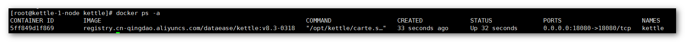

## 1 标准安装

!!! Abstract ""
    可以参考网络上的文档，在各个 Kettle 节点上进行安装：
    https://www.ubuntupit.com/how-to-install-pentaho-data-integration-pdi-tool-on-ubuntu/

## 2 Docker-Compose 安装

!!! Abstract ""
    **需要在服务器上提前安装 Docker 与 Docker-Compose，**
    在各个 Kettle 节点上，使用 DataEase 提供的 Kettle 8.3 镜像安装和运行 Kettle，该镜像经过精简，仅包含 Spoon 相关功能。

### 2.1 准备工作

!!! Abstract ""
    **Kettle HA 环境的搭建需要准备以下服务器：**

    * 节点 A： 10.1.11.195
    * 节点 B： 10.1.11.196

### 2.2 环境要求

!!! Abstract ""
    **部署 Kettle 服务器要求：**
    
    * 操作系统：CentOS 7.x
    * CPU/内存：4 核 8G
    * 磁盘空间：500G
      
### 2.3 准备 Kettle 运行环境

!!! Abstract ""
    **和 【[NFS 服务搭建](nfs_installation.md)】 文档中的路径保持一致，此处 Kettle 数据目录为 /opt/kettle/data；**    
    **执行以下操作之前，请先按照 【[NFS 服务搭建](nfs_installation.md)】 文档中，将 Kettle 数据目录进行挂载。**

!!! Abstract ""
    
    ```
    #创建文件夹
    mkdir -p /opt/kettle/conf/.kettle
    
    #编辑 repositories.xml 文件
    cat > /opt/kettle/conf/.kettle/repositories.xml <<EOF
    <?xml version="1.0" encoding="UTF-8"?>
    <repositories>
        <repository>
	    <id>KettleFileRepository</id>
            <name>repo</name>
            <description>File repository</description>
            <is_default>false</is_default>
            <base_directory>/opt/kettle/data</base_directory>
            <read_only>N</read_only>
            <hides_hidden_files>N</hides_hidden_files>
        </repository>
    </repositories>
    EOF
    
    #编辑 kettle.properties 文件
    cat > /opt/kettle/conf/.kettle/kettle.properties <<EOF    
    # This file was generated by Pentaho Data Integration version 8.3.0.0-371.
    #
    # Here are a few examples of variables to set:
    #
    # PRODUCTION_SERVER = hercules
    # TEST_SERVER = zeus
    # DEVELOPMENT_SERVER = thor
    #
    # Note: lines like these with a # in front of it are comments
    #
    EOF
    
    #创建 docker-compose.yml 文件
    cat > /opt/kettle/docker-compose.yml <<EOF    
    version: '2.1'
    services:   
      kettle:
        image: registry.cn-qingdao.aliyuncs.com/dataease/kettle:v8.3-0318
        container_name: kettle
        environment:
          - PENTAHO_DI_JAVA_OPTIONS=-Xms1024m -Xmx4096m -XX:MaxPermSize=256m -Dfile.encoding=utf-8
        ports:
          - 18080:18080
        volumes:
          - /opt/kettle/conf/:/opt/dataease/conf
          - /opt/kettle/data:/opt/dataease/data/kettle
        restart: always
    EOF
    ```

### 2.4 运行 Kettle 

!!! Abstract ""
    ```
    cd /opt/kettle
    docker-compose up -d
    ```
{ width="900px"}
