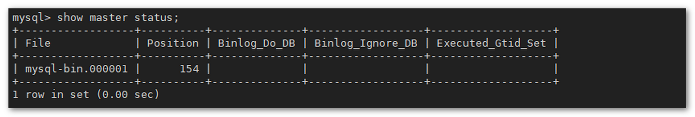
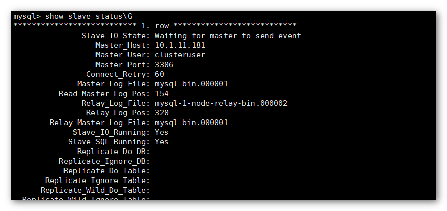
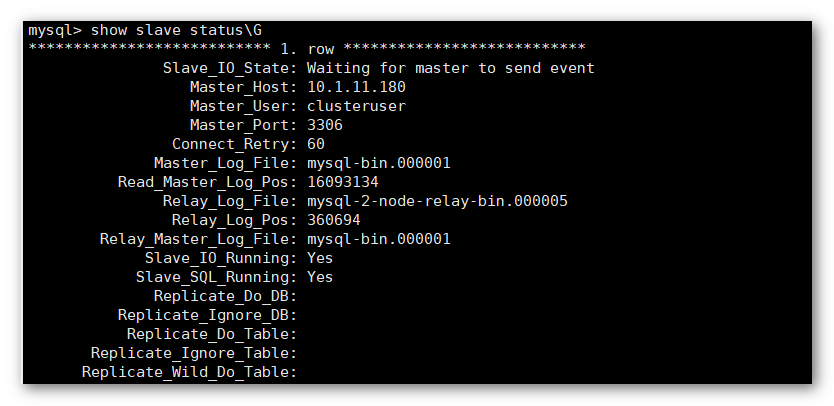
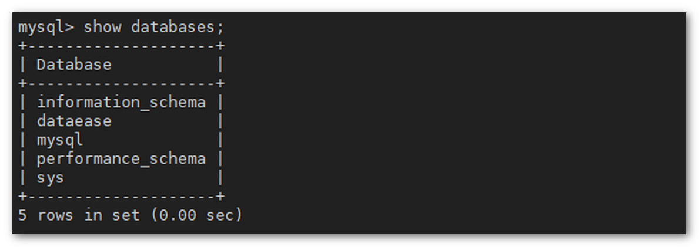

## 1 准备工作

### 1.1 服务器准备

!!! Abstract ""
    DataEase HA 部署模式依赖外部高可用 MySQL 数据库方案，您可自行选择自身已有的成熟 MySQL 数据库方案，本文仅提供参考的 MySQL 数据库部署方案。  
    **提示：** 以下涉及到节点 IP 的地方，请自行替换成实际 IP。

	**此处搭建互为主主的 MySQL 集群，集群节点规划：**

    * MySQL-1 节点，IP 为 10.1.11.187
    * MySQL-2 节点，IP 为 10.1.11.189

    所有服务器的操作系统均为 CentOS 7，这里使用的是 CentOS 7.7，服务器硬件配置视数据规模而定。

### 1.2 软件准备 

!!! Abstract ""
    可以在 MySQL 官网下载对应的安装包，此处下载的是 mysql-5.7.38-1.el7.x86_64.rpm-bundle.tar。
    ```shell
    wget https://dev.mysql.com/get/Downloads/MySQL-5.7/mysql-5.7.38-1.el7.x86_64.rpm-bundle.tar
    ```
### 1.3 防火墙

!!! Abstract ""
    MySQL 默认通过 3306 端口通信，需要打开防火墙的 3306 端口：
    ```shell
    firewall-cmd --zone=public --add-port=3306/tcp --permanent
    firewall-cmd --reload
    ```

## 2 安装 MySQL

### 2.1 解压安装包

!!! Abstract ""
    登录 MySQL 各节点，将 MySQL 安装包进行解压：

    ```shell
    tar xvf mysql-5.7.38-1.el7.x86_64.rpm-bundle.tar
    ```
### 2.2 安装 MySQL

!!! Abstract ""
    在 MySQL 各节点执行以下命令安装 MySQL：
    ```
    # 移除已有的 MariaDB libs
    yum -y remove mariadb-libs
    
    # 安装 MySQL rpm
    rpm -ivh mysql-community-common-5.7*.rpm
    rpm -ivh mysql-community-libs-5.7*.rpm
    rpm -ivh mysql-community-devel-5.7*.rpm
    rpm -ivh mysql-community-client-5.7*.rpm
    rpm -ivh mysql-community-server-5.7*.rpm
    ```

## 3 初始化 MySQL

!!! Abstract ""
	**安装完成后，在 MySQL 各节点启动 MySQL，并获取 MySQL 初始化安装密码：**  
    ```shell
    systemctl start mysqld
    grep 'temporary password' /var/log/mysqld.log
    ```
{ width="900px" }

!!! Abstract ""
    **以初始化密码登录 MySQL 后，执行以下命令重置密码为 'Password123@mysql'。**

    ```shell
    mysql -uroot -p

    mysql> ALTER USER USER() IDENTIFIED BY 'Password123@mysql';
    ```

## 4 配置 MySQL 集群

### 4.1 MySQL-1 节点设置

!!! Abstract ""
    添加复制用户及权限，在 MySQL-1 节点上创建用于复制数据的用户 clusteruser，并授权 MySQL-2 节点访问：

    ```
    # 开启 root 用户远程访问

    mysql> grant all privileges on *.* to 'root'@'%' identified by 'Password123@mysql';
    
    # 添加 MySQL 主从复制⽤户 clusteruser，并授权 MySQL-2 节点可访问 MySQL-1 节点

    mysql> grant replication slave,file on *.* to 'clusteruser'@'10.1.11.189' identified by 'Replication@123';
    
    # 刷新授权

    mysql> flush privileges;
    ```

    **我们在 MySQL-1 节点上添加一个复制账户 'clusteruser'，允许 '10.1.11.189' 客户端来访问，密码为 'Replication@123'。**
    
    **如果有多个从服务器需要共享这一个复制账号，可以使用 '10.1.11.%' 来替代整个网段。**

### 4.2 MySQL-2 节点设置

!!! Abstract ""
    添加复制用户及权限，在 MySQL-2 节点上创建用于复制数据的用户 clusteruser，并授权 MySQL-1 节点访问：

    ```shell
    # 修改 MySQL root 用户的密码为 "Password123@mysql"，且 root 用户可远程访问

    mysql> grant all privileges on *.* to 'root'@'%' identified by 'Password123@mysql';

    # 添加 MySQL 主从复制用户 clusteruser，并授权 MySQL-1 节点可访问 MySQL-2 节点

    mysql> grant replication slave,file on *.* to 'clusteruser'@'10.1.11.187' identified by 'Replication@123';

    # 刷新授权

    mysql> flush privileges;
    ```

    **在 MySQL 节点 B 上添加一个复制账户 'clusteruser'，允许 '10.1.11.187' 客户端来访问，密码为 'Replication@123'。**
    
    **如果有多个从服务器需要共享这一个复制账号，可以使用 '10.1.11.%' 来替代整个网段。**

## 5 修改集群配置文件

### 5.1 MySQL-1 节点

!!! Abstract ""
	**登录到 MySQL 节点 A 上，将 /etc/my.cnf 文件内容修改如下：** 

    ```properties
    [mysqld]
    datadir=/var/lib/mysql
    default-storage-engine=INNODB
    character_set_server=utf8
    lower_case_table_names=1
    table_open_cache=128
    max_connections=2000
    max_connect_errors=6000
    innodb_file_per_table=1
    innodb_buffer_pool_size=1G
    max_allowed_packet=64M
    transaction_isolation=READ-COMMITTED
    innodb_flush_method=O_DIRECT
    innodb_flush_log_at_trx_commit=0
    sync_binlog=0
    innodb_lock_wait_timeout=1800
    bind-address=0.0.0.0
    group_concat_max_len=1024000
    sql_mode=STRICT_TRANS_TABLES,NO_ZERO_IN_DATE,NO_ZERO_DATE,ERROR_FOR_DIVISION_BY_ZERO,NO_ENGINE_SUBSTITUTION
    skip-name-resolve
    
    server-id=101
    log-bin=mysql-bin
    auto_increment_increment=2
    auto_increment_offset=1
    expire_logs_days=30
    
    [mysql]
    default-character-set=utf8
    
    [mysql.server]
    default-character-set=utf8
    ```

	配置完成后重启 MySQL 服务： 
    ```shell
    systemctl restart mysqld
    ```

### 5.2 MySQL-2 节点

!!! Abstract ""
	**登录到 MySQL 从节点上，将 /etc/my.cnf 文件内容修改如下：** 
    ```
    [mysqld]
    datadir=/var/lib/mysql
    default-storage-engine=INNODB
    character_set_server=utf8
    lower_case_table_names=1
    table_open_cache=128
    max_connections=2000
    max_connect_errors=6000
    innodb_file_per_table=1
    innodb_buffer_pool_size=1G
    max_allowed_packet=64M
    transaction_isolation=READ-COMMITTED
    innodb_flush_method=O_DIRECT
    innodb_flush_log_at_trx_commit=0
    sync_binlog=0
    innodb_lock_wait_timeout=1800
    bind-address=0.0.0.0
    group_concat_max_len=1024000
    sql_mode=STRICT_TRANS_TABLES,NO_ZERO_IN_DATE,NO_ZERO_DATE,ERROR_FOR_DIVISION_BY_ZERO,NO_ENGINE_SUBSTITUTION
    skip-name-resolve

    server-id=102
    log-bin=mysql-bin
    auto_increment_increment=2
    auto_increment_offset=2
    expire_logs_days=30
    
    [mysql]
    default-character-set=utf8
    
    [mysql.server]
    default-character-set=utf8
    ```

	配置完成后重启 MySQL 服务： 
    ```
    systemctl restart mysqld
    ```

## 6 配置 MySQL 主从关系

!!! Abstract ""
    **分别登录到 MySQL 的两个节点上，配置相互的主从关系。**

### 6.1 获取各节点状态信息

!!! Abstract ""
	**到各节点上获取节点状态信息：**

    ```properties
    mysql -uroot -p'Password123@mysql'

    mysql> flush tables with read lock\G
    Query OK, 0 rows affected (0.00 sec)

    mysql> show master status;
    ```
    可以获取到 'File' 和 'Position' 两个值，用于设置主从关系。

{ width="900px" }

### 6.2 配置 MySQL-1 节点的主从关系

!!! Abstract ""
	**在 MySQL-1 节点上执行以下命令：**
    ```
    mysql> change master to master_host='10.1.11.189', master_user='clusteruser', master_password='Replication@123', master_log_file='mysql-bin.000001', master_log_pos=154;
    mysql> start slave;
    mysql> show slave status\G
    ```

    **提示：master_host 为 MySQL-2 节点的 IP，master_log_file 为 MySQL-2 节点上查询到的 "File" 值，master_log_pos 为 MySQL-2 节点上查询到的 "Position" 值。**  
	当 "show slave status\G" 命令执行结果中，查询到 Slave_IO_Running 和 Slave_SQL_Running 都为 Yes 则表明配置成功。

{ width="900px" }

!!! Abstract ""
	最后执行 MySQL 命令解锁：
    ```
    mysql> UNLOCK TABLES;
    ```

### 6.3 配置 MySQL-2 节点的主从关系

!!! Abstract ""
	**在节点 B 上 MySQL 中执行以下命令：**
    ```
    mysql> change master to master_host='10.1.11.187', master_user='clusteruser', master_password='Replication@123', master_log_file='mysql-bin.000001', master_log_pos=154;
    mysql> start slave;
    mysql> show slave status\G
    ```

    **提示：
    master_host 为 MySQL-1 节点的 IP，master_log_file 为 MySQL-1 节点上查询到的 "File" 值，master_log_pos 为 MySQL-1 节点上查询到的 "Position" 值。**
	当 "show slave status\G" 命令执行结果中，查询到 Slave_IO_Running 和 Slave_SQL_Running 都为 Yes 则表明配置成功。
    
{ width="900px" }

!!! Abstract ""
	最后执行 MySQL 命令解锁：
    ```
    mysql> UNLOCK TABLES;
    ```

## 7 创建 DataEase 所需的数据库

!!! Abstract ""
	**配置好主主节点后，登录到任意节点上的 MySQL 中创建 DataEase 所需的数据库：**
    ```
    mysql> CREATE DATABASE `dataease` DEFAULT CHARACTER SET utf8mb4 COLLATE utf8mb4_general_ci;
    ```
    在另一个节点上，用 MySQL 命令可以同样查看到新建的数据库：
    ```
    mysql> show databases;
    ```
{ width="900px" }

