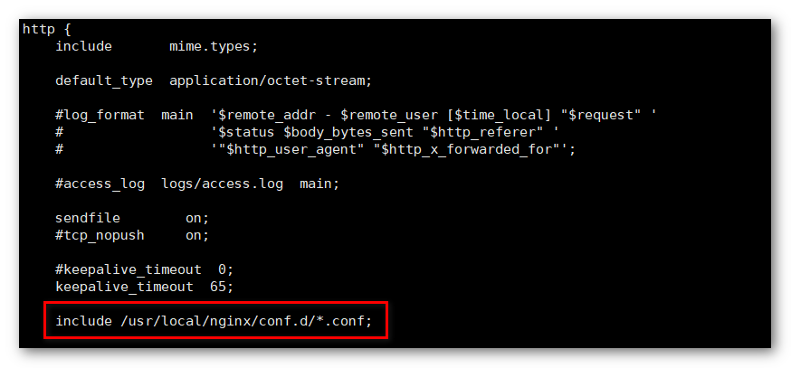
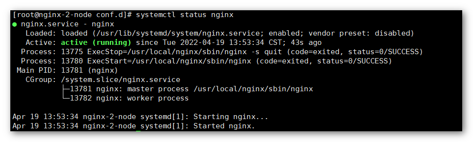

!!! Abstract ""
    **这里选择 Nginx 实现服务的负载均衡，如有 F5 或其他公有云的 SLB 服务，可略过该部分内容。**

## 1 准备工作

!!! Abstract ""
    **Nginx 环境的搭建需要准备以下资源：**

    * VIP : 10.1.11.202
    * Nginx 节点 A : 10.1.11.198
    * Nginx 节点 B : 10.1.11.199
    * DataEase 节点 A : 10.1.11.174
    * DataEase 节点 B : 10.1.11.175

## 2 环境要求

!!! Abstract ""
    **部署 Nginx 服务器要求：**

    * 操作系统：CentOS 7.x
    * CPU/内存：2 核 4G
    * 磁盘空间：200G

## 3 Nginx 安装

!!! Abstract ""
	**分别登录到两个节点上，执行以下命令进行 Nginx 的安装：**  
    ```
    # 安装依赖
    yum install -y gcc-c++ pcre pcre-devel zlib zlib-devel openssl openssl-devel
    
    # 下载 nginx
    wget http://nginx.org/download/nginx-1.14.2.tar.gz
    
    # 解压 nginx
    tar zxvf nginx-1.14.2.tar.gz
    
    # 配置安装 nginx
    cd nginx-1.14.2
    
    ./configure --user=nobody --group=nobody --prefix=/usr/local/nginx --with-http_gzip_static_module --with-http_ssl_module --with-stream
    
    make && make install
    ```

## 4 添加 Nginx 服务

!!! Abstract ""
	**在两个节点上添加 Nginx 系统服务：** 
    ```
    cat <<EOF >> /lib/systemd/system/nginx.service
    [Unit]
    Description=nginx
    After=network.target
    [Service]
    Type=forking
    ExecStart=/usr/local/nginx/sbin/nginx
    ExecReload=/usr/local/nginx/sbin/nginx -s reload
    ExecStop=/usr/local/nginx/sbin/nginx -s quit
    PrivateTmp=true
    [Install]
    WantedBy=multi-user.target
    EOF
    ```


    启动 Nginx 服务，并设置为开机自启动：
    ```shell
    systemctl start nginx
    systemctl enable nginx
    ```

## 5 配置 Nginx

!!! Abstract ""
	**修改 /usr/local/nginx/conf/nginx.conf 文件，加上 include /usr/local/nginx/conf.d/*.conf;**  

{ width="900px" }

!!! Abstract ""
	**创建配置文件目录 /usr/local/nginx/conf.d，并进入到该目录下：**
    ```
    mkdir -p /usr/local/nginx/conf.d && cd $_
    ```

    创建配置文件 de.conf。
    
    **提示：** 以下配置可根据用户环境的实际情况进行调整
    ```shell
    upstream 10.1.11.202{
        ip_hash;
        server 10.1.11.174:80 fail_timeout=100s max_fails=10;
        server 10.1.11.175:80 fail_timeout=100s max_fails=10;
    }
    server {
        listen 80;
        client_max_body_size 50m;
        location / {
            proxy_pass http://10.1.11.202;
            add_header X-Upstream $upstream_addr;
            proxy_set_header X-Real-IP $remote_addr;
            proxy_next_upstream error timeout http_404 http_500 http_502 http_503;
        }
    }
    ```

## 6 重启 Nginx 服务

!!! Abstract ""
	**执行命令重启两个节点上的 Nginx 服务：**
    ```
    systemctl restart nginx
    ```
{ width="900px" }
