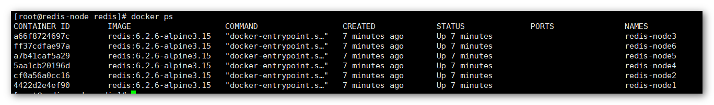
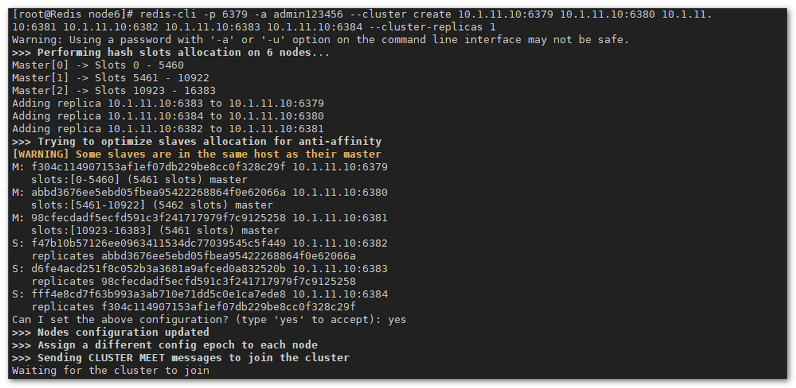
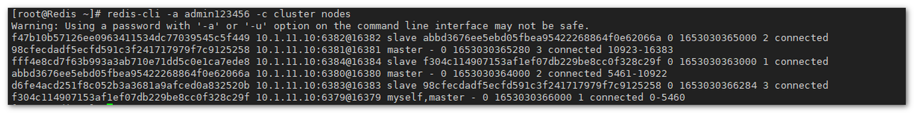

## 1 准备工作

### 1.1 服务器准备

!!! Abstract ""
	此处在同一台服务器上部署了 6 个 Redis 节点，以端口区分，模拟组建 3 主 3 从的 Redis Cluster 集群。  
	Redis 服务器信息如下：

	- IP 为 10.1.11.64

### 1.2 软件准备

!!! Abstract ""
	从 Redis 官网[下载 Redis 的安装包](https://redis.io/download/)。
	
	```shell
	wget http://download.redis.io/releases/redis-6.2.6.tar.gz
	```
	
## 2 安装 Redis

### 2.1 依赖准备

!!! Abstract ""
	```shell
	yum -y install gcc-c++ centos-release-scl
	yum -y install devtoolset-9-gcc devtoolset-9-gcc-c++ devtoolset-9-binutils
	scl enable devtoolset-9 bash
	echo "source /opt/rh/devtoolset-9/enable" >> /etc/profile
	```

### 2.2 编译 Redis

!!! Abstract ""
	```shell
	tar -zxvf redis-6.2.6.tar.gz -C /opt/
	cd /opt/redis-6.2.6
	make && make install
	```

### 2.3 配置系统服务

!!! Abstract ""
	```shell
	ln -s /opt/redis-6.2.6/src/redis-server /usr/bin/redis-server
	ln -s /opt/redis-6.0.6/src/redis-cli /usr/bin/redis-cli
	```


### 2.4 准备 Redis 配置文件

!!! Abstract ""
	创建 Redis 文件目录 /opt/redis。
	```shell
	mkdir /opt/redis
	```
	准备 Redis 配置文件 redis.conf，创建 redis.conf，放置于 /opt/redis，命令如下：  
	示例设置了密码为 admin123456
	```shell
	[root@Redis ]# cat /opt/redis/redis.conf
	daemonize yes
	protected-mode no
	maxmemory-policy allkeys-lru
	requirepass admin123456
	masterauth admin123456
	cluster-enabled yes
	cluster-config-file nodes-c.conf
	pidfile redis.pid
	logfile redis-server.log
	dbfilename dump.rdb

	# 创建 Redis 节点目录及配置文件

	cd  /opt/redis
	mkdir node{1..6}
	for i in {1..6};do \cp redis.conf node$i;echo "port $(($i + 6378))" >> node$i/redis.conf;done
	```

### 2.5 启动 Redis 服务

!!! Abstract ""
	```shell
	for i in {1..6};do cd /opt/redis/node$i;redis-server redis.conf;done
	
	# 查看 Redis 状态

	ps -aux | grep redis
	```

{ width="900px"}

## 3 组建 cluster 集群

!!! Abstract ""
	将 6 个节点设置为 3 主 3 从模式。
	```shell
	redis-cli -p 6379 -a admin123456 --cluster create 10.1.11.10:6379 10.1.11.10:6380 10.1.11.10:6381 10.1.11.10:6382 10.1.11.10:6383 10.1.11.10:6384 --cluster-replicas 1
	```
{ width="900px" }  
{ width="900px" }

## 4 验证集群

!!! Abstract ""
	查看集群节点，可以看到 3 主 3 从的节点信息。
	```shell
	redis-cli -a admin123456 -c cluster nodes
	```

{ width="900px" }

!!! Abstract ""
	如果存在防火墙问题，可以将 Redis 的端口打开。
	```shell
	firewall-cmd --add-port=6379-6384/tcp --zone=public --permanent
	firewall-cmd --reload
	```