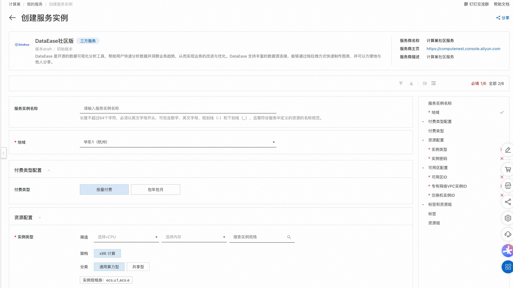
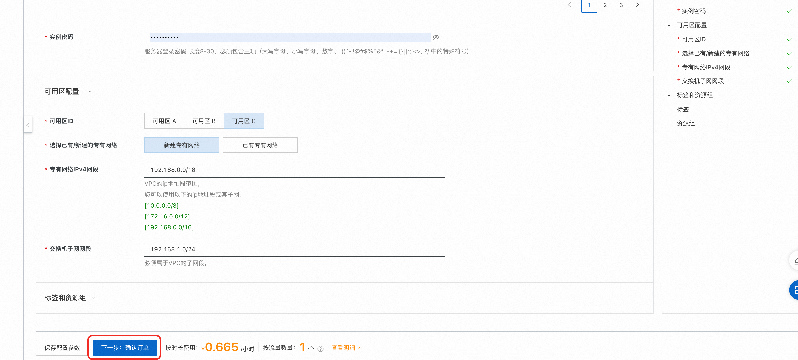
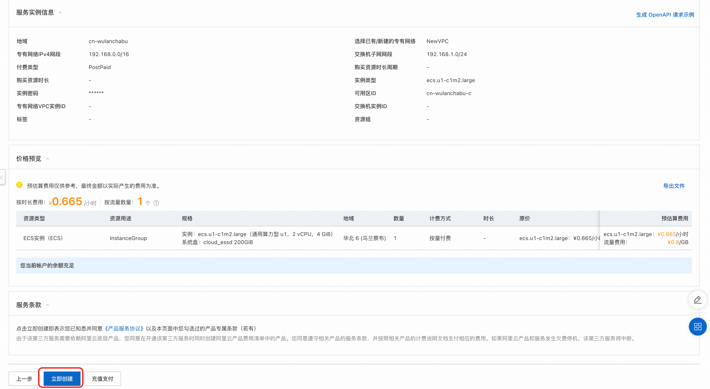
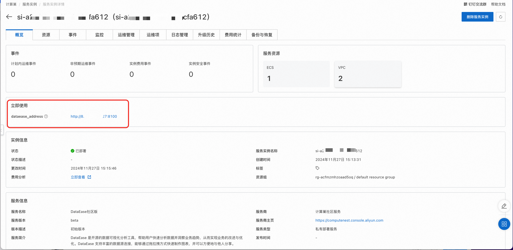

# 阿里云计算巢部署DataEase

阿里云计算巢提供了软件与资源的一体化交付的完善基础能力，助力服务商、开发者的提升服务能力和降低运营成本。计算巢已经支持快速部署 DataEase 社区版。

## 部署流程
1.访问计算巢 DataEase 社区版服务[部署链接](https://computenest.console.aliyun.com/service/instance/create/default?type=user&ServiceName=%20DataEase%E7%A4%BE%E5%8C%BA%E7%89%88)，按提示填写部署参数：

{ width="900px" }

2.参数填写完成后可以看到对应询价明细，确认参数后点击**下一步：确认订单**。确认订单完成后同意服务协议并点击**立即创建**进入部署阶段。

{ width="900px" }

{ width="900px" }

3.等待部署完成后进入服务实例管理, 在控制台找到 DataEase 服务访问链接。

{ width="900px" }

4.单击链接访问 DataEase 服务, 输入默认账号: admin，默认密码: DataEase@123456，即可访问。

{ width="900px" }
