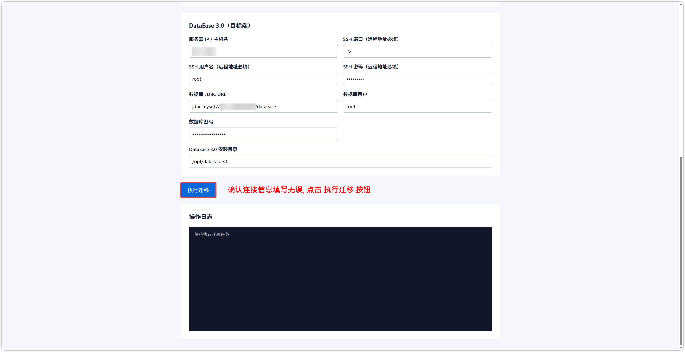
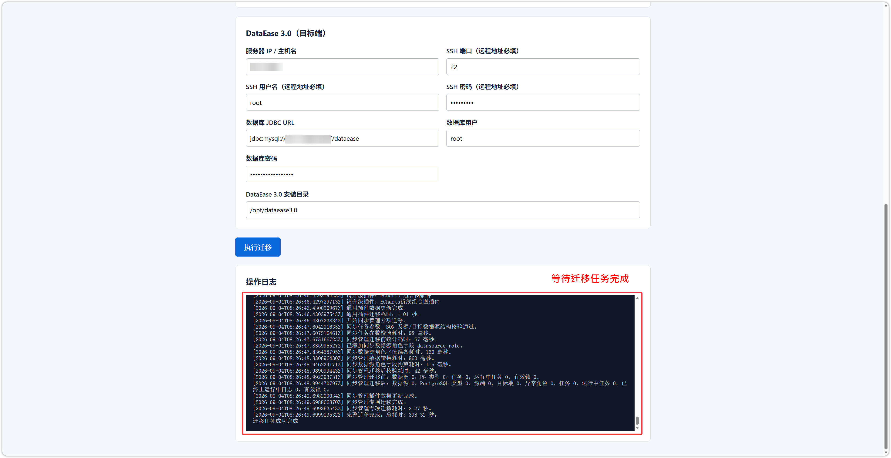

## 1 概述

!!! Abstract ""
    DataEase 提供官方迁移工具，用于将 **DataEase 2.0** 的文件与元数据库迁移到 **DataEase 3.0**。

    工具仓库：[https://github.com/dataease/dataease-migration](https://github.com/dataease/dataease-migration)

    官方已发布公共镜像，可直接拉取使用（多架构，含 amd64 与 arm64），无需自行构建：

    ```
    registry.cn-qingdao.aliyuncs.com/dataease/dataease-migration:latest
    ```

    启动示例：

    ```
    docker run -d --name migration \
      -p 8080:8080 \
      -e SERVER_PORT=8080 \
      registry.cn-qingdao.aliyuncs.com/dataease/dataease-migration:latest
    ```

    浏览器访问 `http://本机IP:8080`。也可克隆仓库后自行编译 JAR，或按仓库说明用 Dockerfile 构建镜像。

    工具通过网页填写源端、目标端信息后执行完整迁移，支持：

    - 本地到本地、本地到远程、远程到本地、远程到远程
    - 远程服务器通过 SSH 操作；本机地址直接读写本地安装目录
    - 直接运行 JAR，或使用 Docker 镜像

    迁移内容包括业务数据目录、MySQL 元数据库，以及必要的 V3 升级脚本与插件数据更新。

## 2 适用条件

!!! Abstract ""

    | 项目 | 要求 |
    | --- | --- |
    | 源端版本 | DataEase 2.0，镜像标签为 **v2.10.26 及以上** |
    | 目标端版本 | 已安装 DataEase 3.0（如 v3.0.0） |
    | 元数据库 | **仅支持 MySQL**，JDBC URL 形如 `jdbc:mysql://127.0.0.1:3306/dataease` |
    | 安装目录 | 源端、目标端均需填写对应服务器上的非根目录绝对路径，默认分别为 `/opt/dataease2.0`、`/opt/dataease3.0` |

!!! Abstract ""
    运行迁移程序的机器必须能通过 JDBC **直连** 源库和目标库。内置 MySQL 默认不把 3306 映射到宿主机，请提前确认连通性（例如加入同一 Docker 网络、临时映射端口，或改用外部库）。

## 3 迁移前准备

!!! Abstract ""

    1. 在目标环境安装好 DataEase 3.0，并准备一个可连接的 **空目标数据库**（迁移开始后该库仍会被删除并重建）。
    2. **停止** 源端 V2、目标端 V3 的 DataEase 应用容器，**不要停止 MySQL 容器** 。
    3. 迁移期间暂停源端业务写入，避免文件与库数据被并发修改。
    4. 数据库用户需具备：源库读取权限；目标库 `DROP`、`CREATE`、写入，以及执行升级脚本所需的 `ALTER`、`UPDATE`、`INSERT`、`DELETE` 权限。
    5. 源库与目标库不能是同一个库。

## 4 启动迁移工具

### 4.1 使用 Docker 镜像（推荐）

!!! Abstract ""
    可直接使用官方已发布的公共镜像（`docker run` 时会自动拉取）：

    ```
    docker run -d --name migration \
      -p 8080:8080 \
      -e SERVER_PORT=8080 \
      registry.cn-qingdao.aliyuncs.com/dataease/dataease-migration:latest
    ```

    浏览器访问 `http://本机IP:8080`。

### 4.2 使用 JAR

!!! Abstract ""
    也可在具备 JDK 的机器上直接运行发行包中的 JAR（发行包同时包含 `tools`、`plugins` 目录）：

    ```
    java -jar dataease-migration-1.0.0.jar
    ```

    默认控制台端口为 **8080**。

## 5 执行迁移

!!! Abstract ""
    在页面中分别填写 DataEase 2.0（源端）与 DataEase 3.0（目标端）：

    - 服务器 IP / 主机名
    - SSH 端口、用户名、密码（远程地址必填；本机可留空）
    - 数据库 JDBC URL、用户名、密码
    - DataEase 安装目录

    本机地址可填写 `localhost`、`127.x`、`::1` 或本机网卡地址，工具会直接操作本地目录。

    确认目标库可被覆盖后，点击「执行迁移」。页面日志会显示各阶段进度。填写完成后如下图所示：

{ width="900px" }

!!! Abstract ""
    迁移顺序概览：

    1. 复制源端实际存在的数据目录（如 `i18n`、`font`、`exportData`、`map`、`geo`、`appearance`、`static-resource`、`excel`）到目标端 `data` 目录，并写入 V3 插件 JAR。
    2. 复制 MySQL 库结构与数据（优先使用配套 `mysql` / `mysqldump`，否则回退到内置 JDBC）。
    3. 删除并重建目标库，写入迁移内容。
    4. 执行内置 `upgrade.sql`。
    5. 更新已支持的插件数据（如飞书多维表格、Hive、达梦、同步管理 PostgreSQL 等）。源端若存在其他插件，日志会提示需另行升级。

    同步任务物理日志默认不复制。如需复制，可在页面勾选，或启动时增加：

    ```
    java -jar dataease-migration-1.0.0.jar --migration.files.copy-sync-task-logs=true
    ```

## 6 迁移完成后

!!! Abstract ""

    操作日志出现「迁移任务成功完成」即表示本次迁移结束，如下图所示：

{ width="900px" }

!!! Abstract ""

    1. 启动目标端 DataEase 3.0 服务。
    2. 使用原 V2 账号登录，抽查数据源、数据集、仪表板、大屏及附件类资源。
    3. 企业版如使用插件，请按日志提示更新不兼容插件后重启。

## 7 注意事项

!!! Abstract ""

    - 目标库会被 **删除并重建** ，请勿填写仍需保留的库。
    - 任一阶段失败会终止整个任务，已完成的文件复制或目标库重建 **不会自动回滚** ，也不会修改 V2 源库。失败后请按日志处理后，换全新目标库重新完整迁移，不要在失败库上补跑。
    - 本地直接操作文件目前适用于 macOS / Linux，并需要本机提供 `/bin/sh` 与 `tar`。
    - 同版本环境搬迁（非 2.0 → 3.0）不属于本工具范围。


