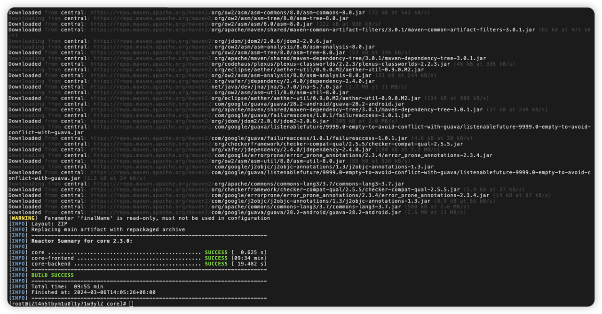
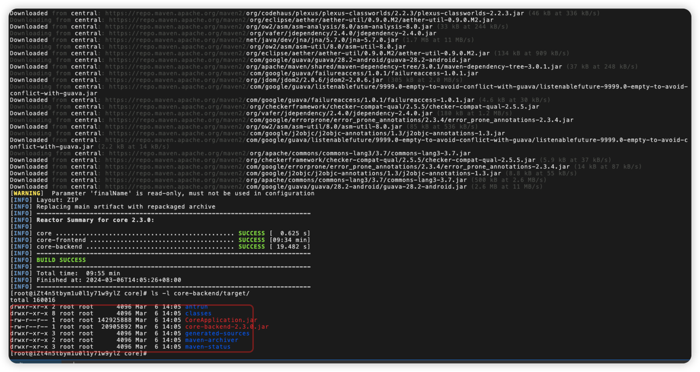
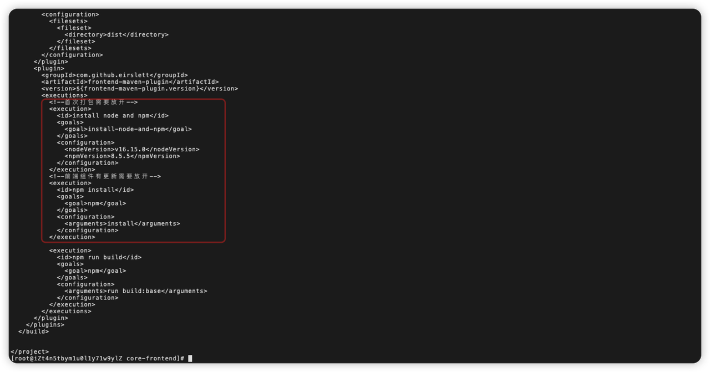
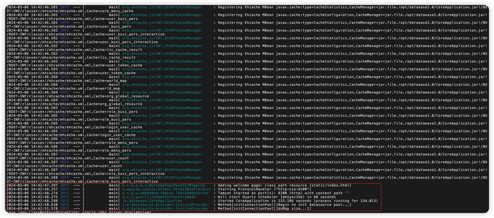
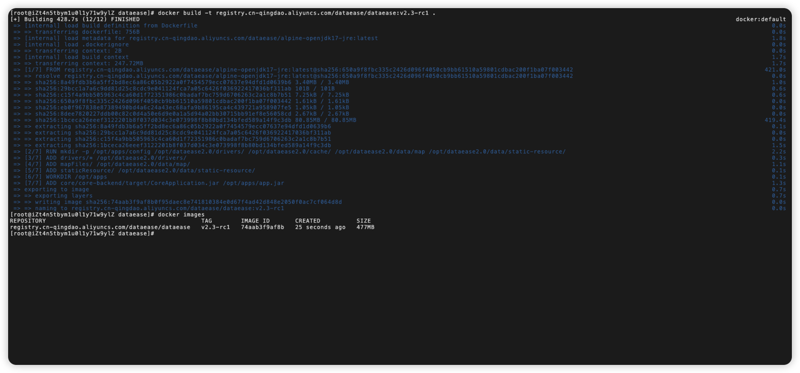
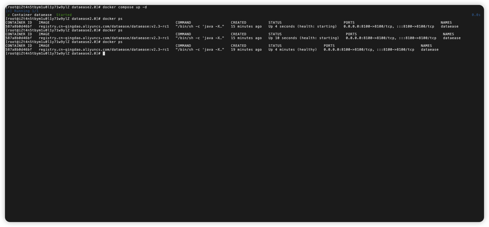
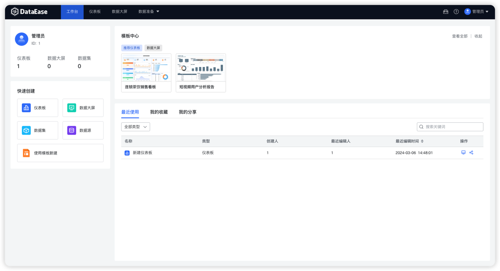

!!! Abstract ""
    请使用 v2.3、v2.2 等已发布分支的代码运行 DataEase。请勿使用 dev 等分支，dev 等分支代码均处于开发或测试阶段，部分依赖并没有上传到中央仓库，编译时可能出现依赖缺失。   
    本文所使用源码为 DataEase v2.3 分支，操作系统为 CentOS 7.9，举例说明如何以源码的形式编译 DataEase 工程。所有操作均在阿里云（新加坡区） 4核8G 环境中执行。
## 1 项目结构

     ```
     ├── CODE_OF_CONDUCT.md
     ├── CONTRIBUTING.md
     ├── Dockerfile                                # 构建容器镜像使用的 Dockerfile
     ├── LICENSE                                   # License 申明
     ├── README.md
     ├── SECURITY.md
     ├── core                                      # 社区版功能源码
     ├── de-xpack                                  # 企业版功能源码（不开源）
     ├── drivers                                   # 数据源驱动文件
     ├── installer                                 # 安装工程源码
     ├── mapFiles                                  # 地图文件
     ├── pom.xml                                   # 整体 maven 项目使用的 pom 文件
     ├── sdk                                       # DataEase 基础接口工程源码
     └── staticResource                            # 静态资源文件
     ```

## 2 配置环境

### 2.1 安装 JDK 17
!!! Abstract ""
    DataEase v2 使用 JDK17， [Oracle 官网下载 JDK17 安装包](https://www.oracle.com/java/technologies/downloads/#java17)，根据 CPU 架构，选择对应安装包。本文档所用测试服务器 CPU 架构为 x64，下载的 x64 架构的 rpm 安装包。
    ```
    # 下载 JDK17 RPM 安装包
    wget https://download.oracle.com/java/17/latest/jdk-17_linux-x64_bin.rpm

    # 安装 RPM 安装包
    yum -y install jdk-17_linux-x64_bin.rpm
    ```
!!! Abstract ""
    验证 JDK 正确安装。
    ```
    [root@iZt4n8oa58aqukyv8sf1ciZ ~]# java -version
    java version "17.0.10" 2024-01-16 LTS
    Java(TM) SE Runtime Environment (build 17.0.10+11-LTS-240)
    Java HotSpot(TM) 64-Bit Server VM (build 17.0.10+11-LTS-240, mixed mode, sharing)
    ```
### 2.2 安装 Git
!!! Abstract ""
    执行命令安装 Git。
    ```
    yum install -y git
    ```
!!! Abstract ""
    验证 Git。
    ```
    [root@iZt4n8oa58aqukyv8sf1ciZ ~]# git --version
    git version 1.8.3.1
    ```

### 2.3 安装配置 Maven
!!! Abstract ""
    到 Apache Maven 官网下载最新版本的 Maven，官网地址如下：https://maven.apache.org/download.cgi 。
!!! Abstract ""
    执行命令安装 Maven。
    ```
    # 下载并安装 Maven
    wget https://dlcdn.apache.org/maven/maven-3/3.9.6/binaries/apache-maven-3.9.6-bin.tar.gz
    tar zxvf apache-maven-3.9.6-bin.tar.gz
    mv apache-maven-3.9.6 /opt

    echo "export M2_HOME=/opt/apache-maven-3.9.6" >> ~/.bashrc
    echo "export PATH=\$PATH:\$M2_HOME/bin" >> ~/.bashrc

    source ~/.bashrc
    ```
!!! Abstract ""
    验证 Maven。
    ```
    [root@iZt4n8oa58aqukyv8sf1ciZ ~]# mvn -v
    Apache Maven 3.9.6 (bc0240f3c744dd6b6ec2920b3cd08dcc295161ae)
    Maven home: /opt/apache-maven-3.9.6
    Java version: 17.0.10, vendor: Oracle Corporation, runtime: /usr/lib/jvm/jdk-17-oracle-x64
    Default locale: zh_CN, platform encoding: UTF-8
    OS name: "linux", version: "3.10.0-1160.105.1.el7.x86_64", arch: "amd64", family: "unix"
    ```
### 2.4  安装配置 nodejs
!!! Abstract ""
    执行命令安装 nodejs。
    ```
    # 下载并安装 nodejs
    wget https://nodejs.org/dist/v16.15.0/node-v16.15.0-linux-x64.tar.xz
    tar xvf node-v16.15.0-linux-x64.tar.xz
    mv node-v16.15.0-linux-x64 /opt
    
    echo "export PATH=\$PATH:/opt/node-v16.15.0-linux-x64/bin" >> ~/.bashrc
    
    source ~/.bashrc
    ```
!!! Abstract ""
    验证 nodejs。
    ```
    [root@iZt4n8oa58aqukyv8sf1ciZ ~]# node --version
    v16.15.0
    
    [root@iZt4n8oa58aqukyv8sf1ciZ ~]# npm version
    {
        npm: '8.5.5',
        node: '16.15.0',
        v8: '9.4.146.24-node.20',
        uv: '1.43.0',
        zlib: '1.2.11',
        brotli: '1.0.9',
        ares: '1.18.1',
        modules: '93',
        nghttp2: '1.47.0',
        napi: '8',
        llhttp: '6.0.4',
        openssl: '1.1.1n+quic',
        cldr: '40.0',
        icu: '70.1',
        tz: '2021a3',
        unicode: '14.0',
        ngtcp2: '0.1.0-DEV',
        nghttp3: '0.1.0-DEV'
    }
    ```

## 3  代码运行

### 3.1 源码准备
!!! Abstract ""
    下载源码到本地
    ```
    cd /opt
    git clone -b v2.3 https://github.com/dataease/dataease.git
    ```
    **注意：前后端项目目录在下载后的内容的 core 目录下。**

### 3.2 源码编译
!!! Abstract ""

    ```
    cd dataease
    mvn clean install
    
    cd core
    mvn clean package -Pstandalone -U -Dmaven.test.skip=true
    ```

!!! Abstract ""
    如下图所示输出，则编译成功。
{ width="900px" }

{ width="900px" }
!!! Abstract ""
    编译完成后，可以在 core-backend/target 目录下看到编译后的 jar 包 CoreApplication.jar
{ width="900px" }
!!! Abstract ""
    core-backend 源码引用到 calcite-core 依赖，是 DataEase 基于 Apache Calcite 工程修改后的依赖包，不属于开源部分。该依赖包会持续迭代，并上传到公共仓库中，对社区版源码的编译和使用不会造成任何影响。     
    **注意：编译前端代码如果出现网络问题导致编译失败，可以将 npm 镜像源换为淘宝镜像源，并使用 pnpm 进行编译。手动编译前端，将下图前端 pom 文件相关插件注释,然后再执行 mvn clean package -Pstandalone -U -Dmaven.test.skip=true。**
{ width="900px" }

### 3.3 配置运行环境
!!! Abstract ""
    **操作系统设置**  

    参数设置，增加系统监听文件数量。
    ```
    echo fs.inotify.max_user_watches=524288 | sudo tee -a /etc/sysctl.conf && sudo sysctl -p
    ```
!!! Abstract ""
    **MySQL 配置**  

    使用 MySQL 8.0 及以上版本进行，以下是推荐的 MySQL 配置。
    ```
    [mysqld]
    datadir=/var/lib/mysql
    
    default-storage-engine=INNODB
    character_set_server=utf8
    lower_case_table_names=1
    table_open_cache=128
    max_connections=2000
    max_connect_errors=6000
    innodb_file_per_table=1
    innodb_buffer_pool_size=1G
    max_allowed_packet=64M
    transaction_isolation=READ-COMMITTED
    innodb_flush_method=O_DIRECT
    innodb_lock_wait_timeout=1800
    innodb_flush_log_at_trx_commit=0
    sync_binlog=0
    group_concat_max_len=1024000
    sql_mode=STRICT_TRANS_TABLES,NO_ZERO_IN_DATE,NO_ZERO_DATE,ERROR_FOR_DIVISION_BY_ZERO,NO_AUTO_CREATE_USER,NO_ENGINE_SUBSTITUTION
    skip-name-resolve
    
    [mysql]
    default-character-set=utf8
    
    [mysql.server]
    default-character-set=utf8
    ```
    创建 DataEase 运行时使用的数据库。本文档使用 dataeaseV2demo。
    ```
    CREATE DATABASE `dataeaseV2demo` DEFAULT CHARACTER SET utf8mb4 COLLATE utf8mb4_0900_ai_ci;
    ```

!!! Abstract ""
    **运行目录设置**  

    创建 DataEase 运行目录。
    ```
    mkdir -p /opt/dataease2.0/config /opt/dataease2.0/drivers/ /opt/dataease2.0/cache/ /opt/dataease2.0/data/map /opt/dataease2.0/data/static-resource
    ```
    进入到 DataEase 源码目录，将 DataEase 源码目录下的 drivers 目录的驱动复制到 /opt/dataease2.0/drivers。
    ```
    cp -rp /opt/dataease/drivers/* /opt/dataease2.0/drivers/
    ```
    将源码 mapFiles 目录下的地图文件复制到 /opt/dataease2.0/data/map 目录下。
    ```
    cp -rp /opt/dataease/mapFiles/* /opt/dataease2.0/data/map/
    ```
    将源码staticResource 目录下的资源文件复制到 /opt/dataease2.0/data/static-resource 目录下。
    ```
    cp -rp /opt/dataease/staticResource/* /opt/dataease2.0/data/static-resource/
    ```
    进入 DataEase 配置文件目录。
    ```
    cd /opt/dataease2.0/config
    ```
    在配置文件目录下创建 DataEase 配置文件 application.yml，YOUR_IP:PORTS/YOUR_DATABASE/YOUR_USER/YOUR_PASSWORD 部分请修改成实际数据库配置。
    ```
    server:
        tomcat:
            connection-timeout: 70000
    spring:
        servlet:
            multipart:
                max-file-size: 500MB
                max-request-size: 500MB
        datasource:
            url: jdbc:mysql://YOUR_IP:PORTS/YOUR_DATABASE?autoReconnect=false&useUnicode=true&characterEncoding=UTF-8&characterSetResults=UTF-8&zeroDateTimeBehavior=convertToNull&useSSL=false&allowPublicKeyRetrieval=true
            username: YOUR_USER
            password: YOUR_PASSWORD
    ```

### 3.4 运行 jar
!!! Abstract ""
    在 core-backend/target 目录下找到编译后的 jar 包 CoreApplication.jar，复制到运行目录下，运行 jar 包。
    ```
    cp /opt/dataease/core/core-backend/target/CoreApplication.jar /opt/dataease2.0/
    cd /opt/dataease2.0
    java -jar CoreApplication.jar
    ```
!!! Abstract ""
    如下代码准备就绪，说明 DataEase 已成功运行，此时已经可以通过 IP:8100 访问服务。
{ width="900px" }

## 4 镜像制作
### 4.1 安装 Docker
!!! Abstract ""
    在服务器上安装 Docker，本文使用 DataEase 项目组编写安装脚本进行安装，用户可自行选择如何安装 Docker（需安装 docker compsose）。
    ```
    curl -fsSL https://resource.fit2cloud.com/get-docker-linux.sh | bash
    
    # 设置 docker 开机自启，并启动 docker 服务
    systemctl enable docker; systemctl daemon-reload; service docker start
    ```
### 4.2 制作镜像
!!! Abstract ""
    进入 DataEase 项目根目录，执行镜像制作命令。
    ```
    cd /opt/dataease
    docker build -t registry.cn-qingdao.aliyuncs.com/dataease/dataease:v2.3-rc1 .
    ```
!!! Abstract ""
    如下输出日志参考，使用 docker images 可查看镜像是否成功打包。

{ width="900px" }

## 5 镜像运行
### 5.1 配置运行环境
!!! Abstract ""
    创建运行目录。
    ```
    mkdir -p /opt/dataease2.0
    ```
    在运行目录下创建 docker-compose.yml，内容如下：
    ```
    version: '2.1'
    services:
    
        dataease:
            image: registry.cn-qingdao.aliyuncs.com/dataease/dataease:v2.3-rc1
            container_name: dataease
            ports:
                - 8100:8100
            volumes:
                - /opt/dataease2.0/conf:/opt/apps/config
    ```
    创建配置文件目录及配置文件 application.yml.
    ```
    mkdir -p /opt/dataease2.0/conf
    touch application.yml
    ```
    在配置文件目录下创建 DataEase 配置文件 application.yml，内容如下。YOUR_IP:PORTS/YOUR_DATABASE/YOUR_USER/YOUR_PASSWORD 部分请修改成实际数据库配置。
    ```
    server:
        tomcat:
            connection-timeout: 70000
    spring:
        servlet:
            multipart:
                max-file-size: 500MB
                max-request-size: 500MB
    datasource:
        url: jdbc:mysql://YOUR_IP:PORTS/YOUR_DATABASE?autoReconnect=false&useUnicode=true&characterEncoding=UTF-8&characterSetResults=UTF-8&zeroDateTimeBehavior=convertToNull&useSSL=false&allowPublicKeyRetrieval=true
        username: YOUR_USER
        password: YOUR_PASSWORD
    ```

### 5.2 运行镜像
!!! Abstract ""
    在运行目录下执行 docker-compose(docker compose) 命令。
    ```
    docker-compose up -d
    # 或者 docker compose up -d
    ```
!!! Abstract ""
    验证 DataEase 服务状态，状态为 health 则正常，浏览器输入 IP:PORTS 访问服务。

{ width="900px" }
{ width="900px" }