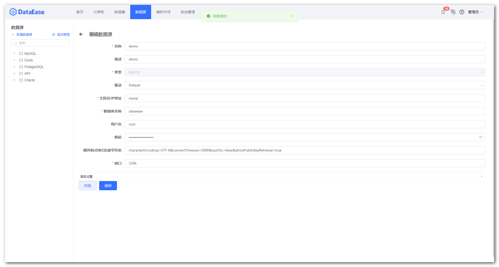

## 1 环境要求

!!! Abstract ""
    **部署服务器要求：**

    * 操作系统: CentOS 7.x
    * CPU/内存: 4核8G
    * 磁盘空间: 200G

## 2 下载安装包

!!! Abstract ""
    **请自行下载 DataEase 最新版本的离线安装包，并复制到目标机器的 /tmp 目录下：**  
    安装包下载链接: https://community.fit2cloud.com/#/products/dataease/downloads

## 3 解压安装包

!!! Abstract ""
    **以 root 用户 ssh 登录到目标机器, 并执行如下命令：**  

    ```sh
    cd /tmp
    # 解压安装包
    tar zxvf dataease-v1.5.0-offline.tar.gz
    ```

## 4 设置安装参数（可选）

!!! Abstract ""
	**注意：强烈建议不要将安装包的路径作为 DataEase 的安装目录，对日常的维护以及后续版本的升级会带来一些不必要的麻烦。**  

    从 v1.5.0 版本开始，DataEase 支持以配置文件的形式来设置安装参数，如安装目录、服务运行端口、数据库配置参数等，具体参数请参见安装包中的 install.conf 文件：
    
    **从 v1.9.0 版本开始，DataEase 支持多种部署模式，调整 install.conf 文件中 DE_ENGINE_MODE 参数来设置不同的安装部署模式，DE_ENGINE_MODE 可选值有 local、simple、cluster，分别对应本地模式、精简模式、集群模式，具体可参考【安装模式】说明。**  
    如不调整，则模式安装精简模式。
    ```properties
    # 基础配置
    ## 安装目录
    DE_BASE=/opt
    ## Service 端口
    DE_PORT=80
    ## 部署及运行模式
    DE_ENGINE_MODE=local
    
    # 数据库配置
    ## 是否使用外部数据库
    DE_EXTERNAL_MYSQL=false
    ## 数据库地址
    DE_MYSQL_HOST=mysql
    ## 数据库端口
    DE_MYSQL_PORT=3306
    ## DataEase 数据库库名
    DE_MYSQL_DB=dataease
    ## 数据库用户名
    DE_MYSQL_USER=root
    ## 数据库密码
    DE_MYSQL_PASSWORD=Password123@mysql
    
    # Apache Doris 配置
    ## 是否使用外部 Apache Doris
    DE_EXTERNAL_DORIS=false
    ## Doris 地址
    DE_DORIS_HOST=doris-fe
    ## Doris 查询连接端口
    DE_DORIS_PORT=9030
    ## Doris http端口
    DE_DORIS_HTTPPORT=8030
    ## Doris 数据库名称
    DE_DORIS_DB=dataease
    ## Doris 用户名
    DE_DORIS_USER=root
    ## Doris 密码
    DE_DORIS_PASSWORD=Password123@doris
    
    # Kettle 配置
    ## 是否使用外部 Kettle - (目前还不支持外部Kettle，除非不需运行Kettle，否则请不要修改此参数)
    DE_EXTERNAL_KETTLE=false
    ## Kettle 服务器地址
    DE_CARTE_HOST=kettle
    ## Kettle 访问端口
    DE_CARTE_PORT=18080
    ## Kettle 用户名
    DE_CARTE_USER=cluster
    ## Kettle 密码
    DE_CARTE_PASSWORD=cluster
    ```

## 5 执行安装脚本

!!! Abstract ""
    ```sh
    # 进入安装包目录
    cd dataease-v1.5.0-offline
    # 运行安装脚本
    /bin/bash install.sh
    ```
    **注意：如果使用外部数据库进行安装，推荐使用 MySQL 5.7 版本。同时 DataEase 对数据库部分配置项有要求，请参考下附的数据库配置，修改环境中的数据库配置文件。**

    ```
    [mysqld]
	datadir=/var/lib/mysql

	default-storage-engine=INNODB
	character_set_server=utf8
	lower_case_table_names=1
	table_open_cache=128
	max_connections=2000
	max_connect_errors=6000
	innodb_file_per_table=1
	innodb_buffer_pool_size=1G
	max_allowed_packet=64M
	transaction_isolation=READ-COMMITTED
	innodb_flush_method=O_DIRECT
	innodb_lock_wait_timeout=1800
	innodb_flush_log_at_trx_commit=0
	sync_binlog=0
	group_concat_max_len=1024000
	sql_mode=STRICT_TRANS_TABLES,NO_ZERO_IN_DATE,NO_ZERO_DATE,ERROR_FOR_DIVISION_BY_ZERO,NO_AUTO_CREATE_USER,NO_ENGINE_SUBSTITUTION
	skip-name-resolve

	[mysql]
	default-character-set=utf8

	[mysql.server]
	default-character-set=utf8
    ```

	**特别注意以下几个参数的设置：**  
	```
	character_set_server=utf8
	lower_case_table_names=1
	group_concat_max_len=1024000
	```

    **请参考文档中的建库语句创建 DataEase 使用的数据库，DataEase 服务启动时会自动在配置的库中创建所需的表结构及初始化数据。**
    ```mysql
    CREATE DATABASE `dataease` DEFAULT CHARACTER SET utf8mb4 COLLATE utf8mb4_general_ci;
    ```

!!! Abstract ""
    安装脚本默认使用 /opt/dataease 使用的数据库，DataEase 的配置文件、数据及日志等均存放在该安装目录。  
    **安装目录目录结构说明：**
    ```
    /opt/dataease/
	├── bin                                         #-- 安装过程中需要加载到容器中的脚本
	├── conf                                        #-- DataEase 各组件及数据库等中间件的配置文件
	├── data                                        #-- DataEase 各组件及数据库等中间件的数据持久化目录
	├── docker-compose-kettle-doris.yml             #-- DataEase 内建的 kettle 和 doris 所需的 Docker Compose 文件 
	├── docker-compose-mysql.yml                    #-- DataEase 内建的 MySQl 所需的 Docker Compose 文件 
	├── docker-compose.yml                          #-- DataEase 基础 Docker Compose 文件，定义了网络等基础信息 
	├── logs                                        #-- DataEase 各组件的日志文件持久化目录
	└── templates                                   #-- DataEase 各组件及数据库等中间件的配置文件的原始文件
    ```

!!! Abstract ""
    **安装成功后，通过浏览器访问如下页面登录 DataEase：**

    ```
    地址: http://目标服务器IP地址:服务运行端口
    用户名: admin
    密码: dataease
    ```

## 6 其他注意事项

!!! Abstract ""
    内置示例数据以 flyway 的形式在 DataEase 启动时自动插入到了 MySQL 数据库中，如果使用了外部 MySQL 或者修改了内置 MySQL 的容器名称的话，需要登录到 DataEase 控制台，进入到【数据源】页面，选择 "demo" 数据源，将 "demo" 数据源的相关连接信息修改正确，保存后即可正常使用内置示例数据。

{ width="900" }