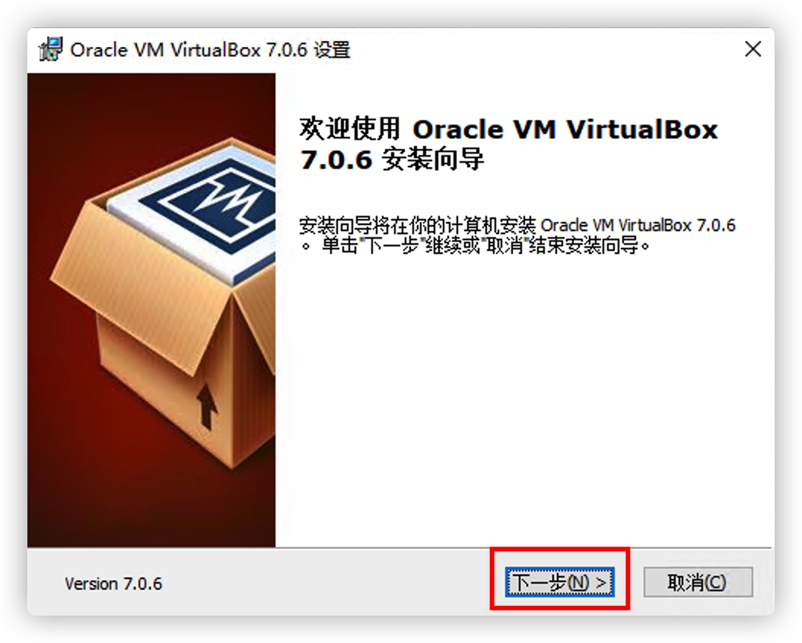
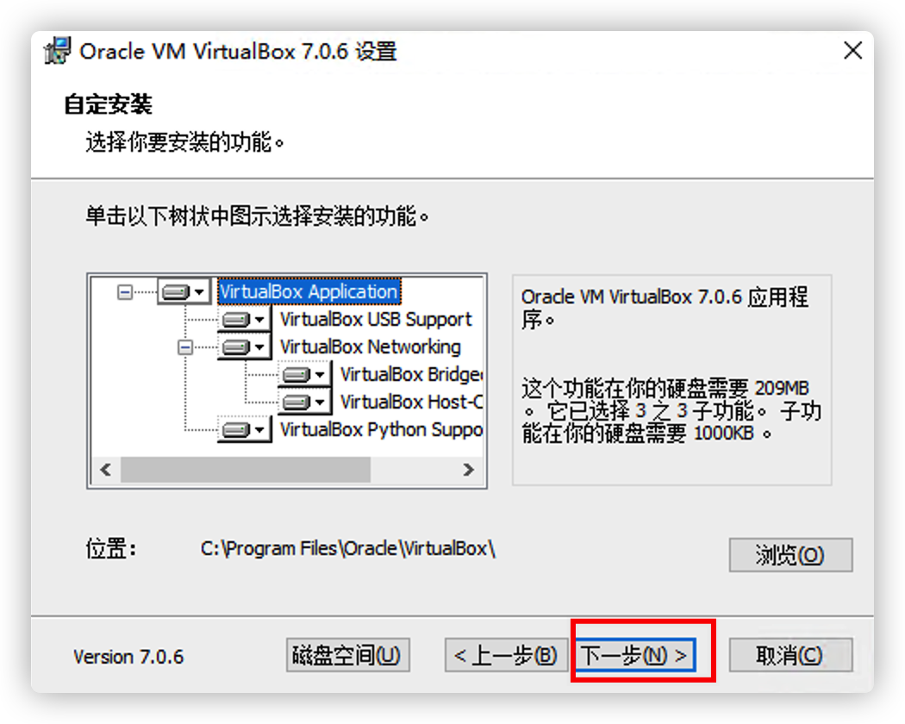
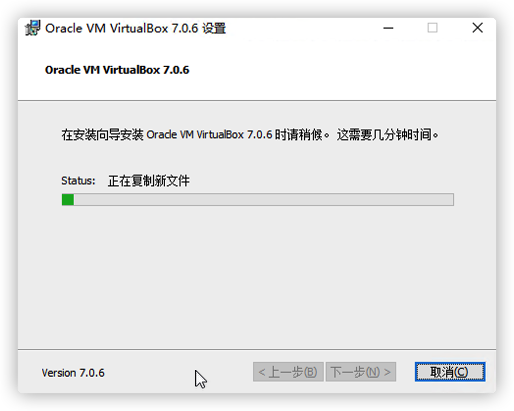
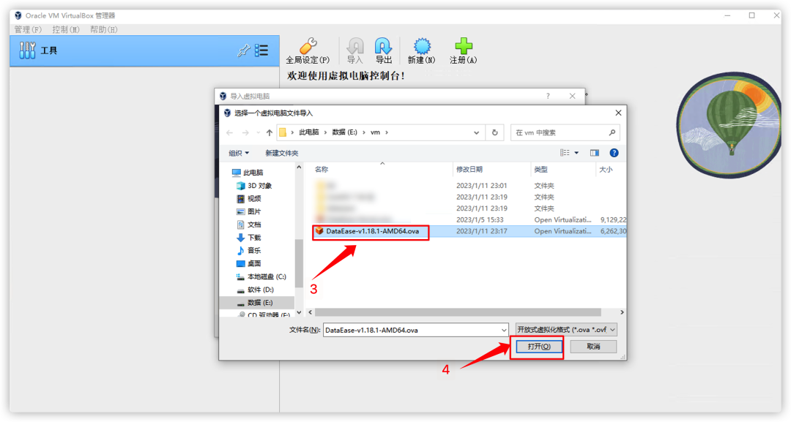
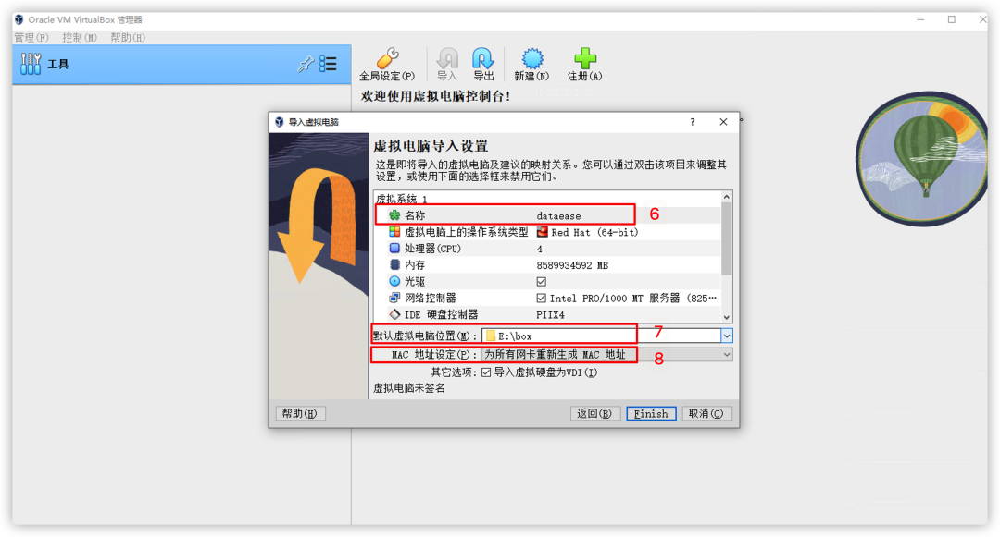
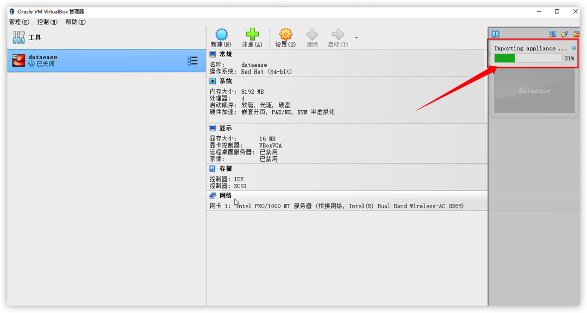
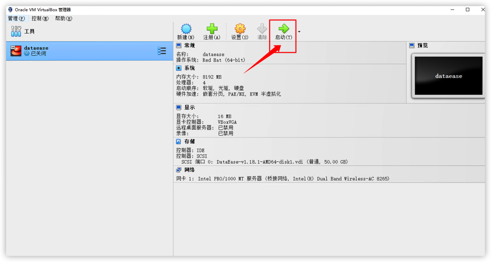
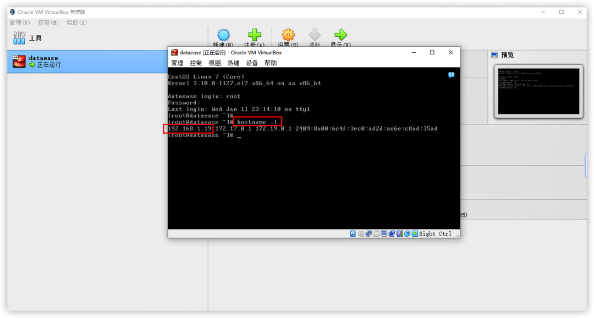
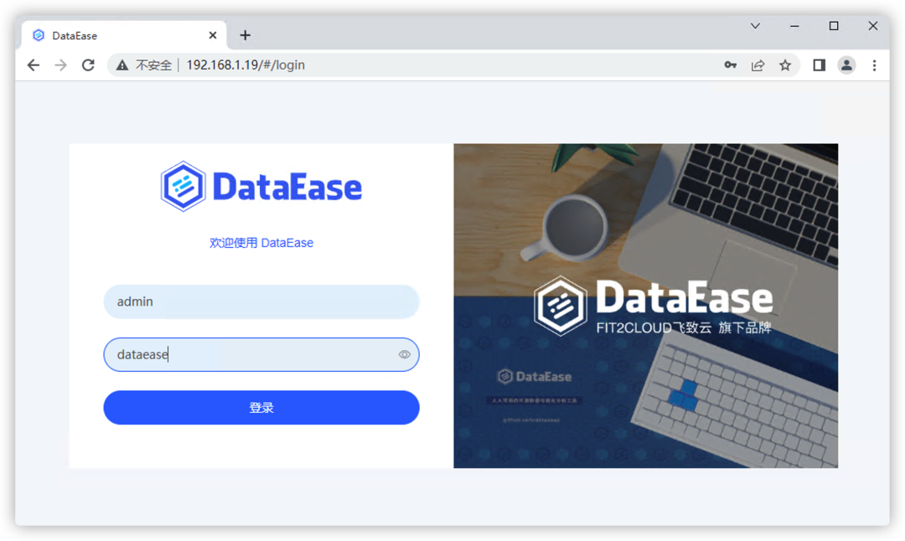

## 1 环境要求

!!! Abstract ""
	**部署服务器要求：**  

    * 操作系统: 可运行 VirtualBox 的 Windows 操作系统
    * CPU/内存: 4核8G
    * 磁盘空间: 200G

## 2 安装部署

### 2.1 安装虚拟化软件

!!! Abstract ""
	电脑上没有安装虚拟化软件的用户，需要安装虚拟化软件，市面上主流的桌面虚拟化软件有 VMware Workstation 和 VirtualBox。如果你的电脑已经安装了其中一款软件，可以直接跳过这一部分。  
	本文示例选择了 VirtualBox。因为 VirtualBox 是免费的，有需求的用户可以自行选择安装收费的 VMware Workstation。  
	VirtualBox 下载链接：https://download.virtualbox.org/virtualbox/7.0.4/VirtualBox-7.0.4-154605-Win.exe。

!!! Abstract ""
	下载 VirtualBox 后，双击安装包进行安装，安装完成后默认打开 VirtualBox。

{ width="900px" }

{ width="900px" }

{ width="900px" }

{ width="900px" }

{ width="900px" }

{ width="900px" }

{ width="900px" }

### 2.2 下载并导入 DataEase OVA 文件

!!! Abstract ""
	虚拟化软件 VirtualBox 已经安装完成了，接下来将 DataEase 虚拟机 OVA 文件导入到 VirtualBox 就可以运行 DataEase 啦!    
	DataEase OVA 文件是虚拟化软件导出的 DataEase 虚拟机，可以导入到其他虚拟机环境直接启动;    
	通过以下链接下载 DataEase OVA 文件: [https://community.fit2cloud.com/#/products/dataease/downloads](https://community.fit2cloud.com/#/products/dataease/downloads)    
	选择“DataEase vxxx AMD64 OVA”下载，建议选择最新版本下载。  
	**系统用户名: root，密码: passwd**

{ width="900px" }

!!! Abstract ""
	DataEase OVA 文件下载完成后，在 VirtualBox 中按下图的操作流程将下载好的 OVA 文件导入到 VirtualBox 中。

{ width="900px" }

{ width="900px" }

{ width="900px" }

{ width="900px" }

!!! Abstract ""
	至此，已经选择了 OVA 文件，继续按照下图所示步骤完成最后的导入操作。

	- 可以自定义修改虚拟机的名称；
	- 设定 DataEase 虚拟机运行的文件夹；
	- 选择“为所有网卡重新生成 MAC 地址”选项。

	修改完以上配置项后，点击 “Finish” 按钮完成导入操作。

{ width="900px" }

!!! Abstract ""
	等待 DataEase 虚拟机完成导入。

{ width="900px" }

### 2.3 启动虚拟机

!!! Abstract ""
	导入完成后，选择导入的虚拟机，点击“启动”按钮。

{ width="900px" }

!!! Abstract ""
	启动后，输入用户名和密码进入系统。  

	* 用户名：root

    * 密码：passwd

{ width="900px" }

!!! Abstract ""
	这时我们需要查看一下虚拟机的 IP 地址，因为用户的环境不一样，虚拟机的 IP 也不一样。输入命令：hostname -I，并按“回车键”。通常显示的第一个 IP 地址就是虚拟机的网卡地址，需要记住这个地址，在后续登录 DataEase 时会使用到。同时，我们可以顺便检查 DataEase 的服务状态，输入命令：dectl status | less，并按“回车键”查看各服务状态。如下图所示，各个服务都是健康状态。

{ width="900px" }

{ width="900px" }

### 2.4 访问DataEase

!!! Abstract ""
	在浏览器中输入上一步查询到的 IP 地址，即可打开 DataEase 登录页面。

{ width="900px" }

### 2.5 修改安装模式 (可选)
!!! Abstract ""
	OVA部署包中，DataEase 的部署模式默认是 simple 模式，如果需要使用 local 模式，可通过以下操作进行切换(v1.18.9 及以后的版本支持该操作，以下操作以 v1.18.9 版本为例):
	```shell

	#修改配置文件
	vi /opt/dataease/.env
	#按 “i” 键进入编辑模式 (双引号中的内容)
	#将 DE_ENGINE_MODE=simple 修改为 DE_ENGINE_MODE=local
	#修改完成后按 “ESC” 键，输入 “:wq” (双引号中的内容) 保存修改；
	
	#切换至安装包目录
	cd /opt/dataease-v1.18.9.offline
	#执行安装脚本
	./install.sh
	
	#安装完成后查看 DataEase 状态
	dectl status

    ```

!!! Abstract ""
	**注意事项：**  
	默认的虚拟机网络是桥接模式，桥接模式下虚拟机在用户电脑上运行时会自动获取与用户电脑同网段的 IP 地址，如果用户电脑的网络发生了变化，DataEase 虚拟机的 IP 就会发生变化，这时需要在虚拟机登录后的界面输入 hostname -I 命令后，重新查看最新的 IP 地址。  
	如果用户想要固定的 IP，可以在虚拟机设置界面的“网络选项”中，将“桥接网卡”更换为“仅主机网路”，“仅主机网络”是使用你电脑中的虚拟机独立网络，虚拟机 IP 地址不会因为电脑的网络发生变化而变化。设置方法如下图所示，设置完后，重启虚拟机即可生效。

{ width="900px" }

!!! Abstract ""
	“桥接网卡”与“仅主机网络”的区别如下：  

	- 桥接网卡：可以访问公网，可以访问电脑的局域网，但会因为切换局域网而改变IP地址；  
	- 仅主机网络：不能访问公网，不能访问电脑所在的局域网，不会因为切换局域网而改变IP地址。