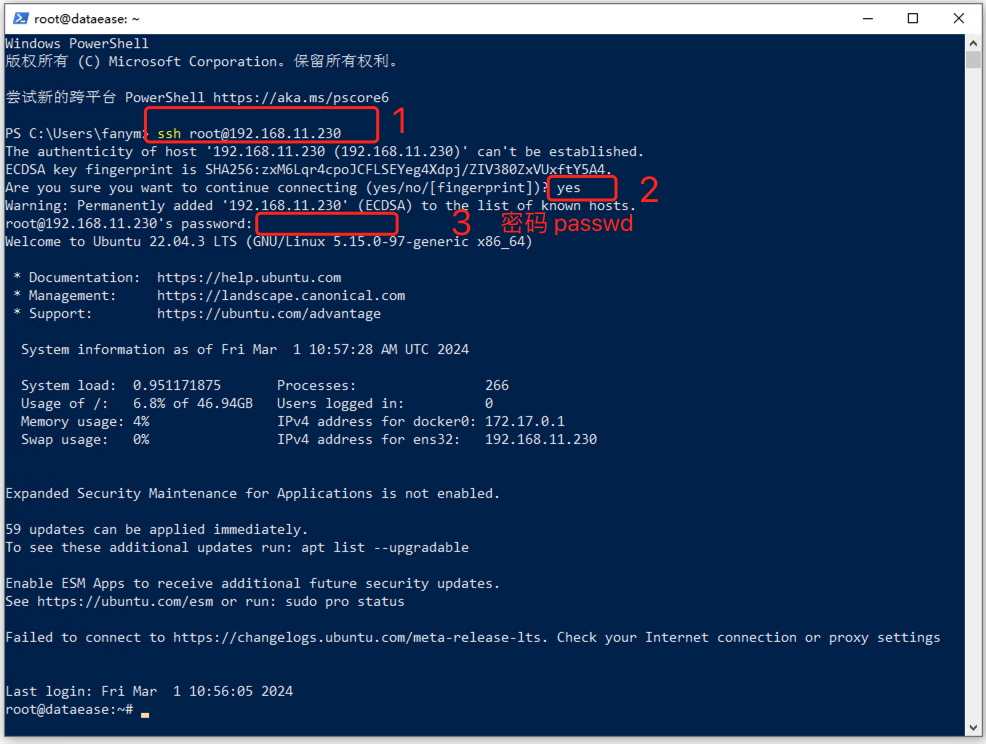
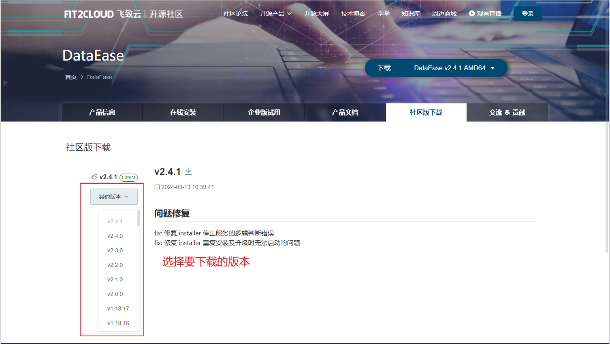
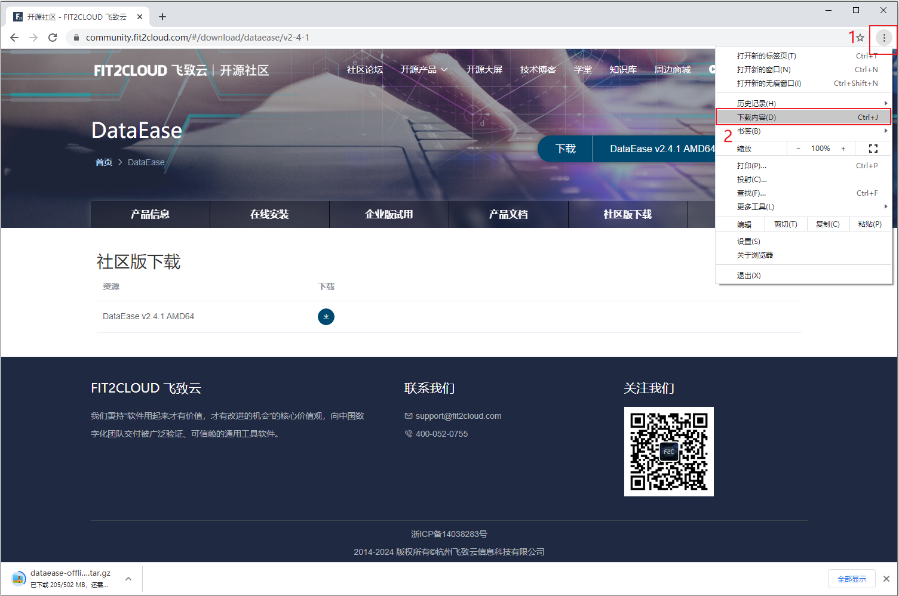
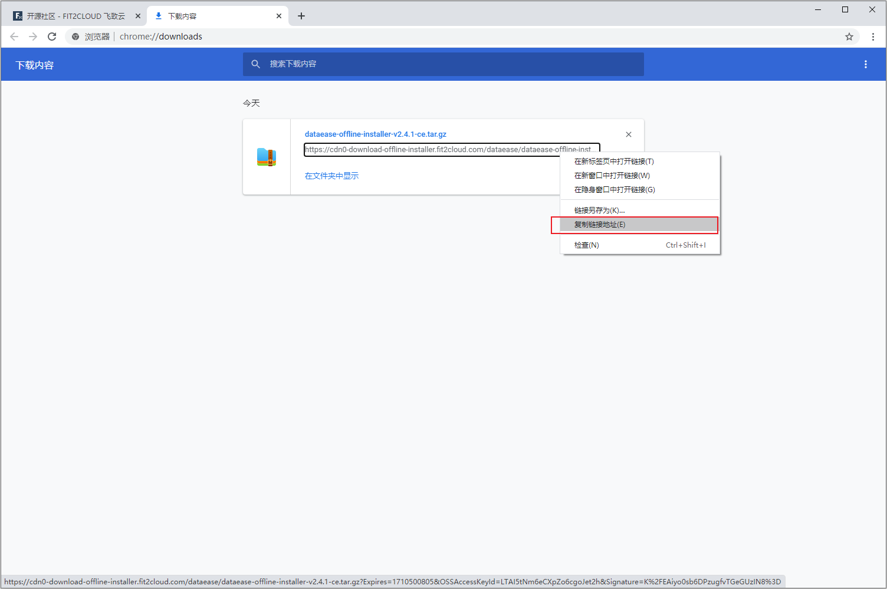
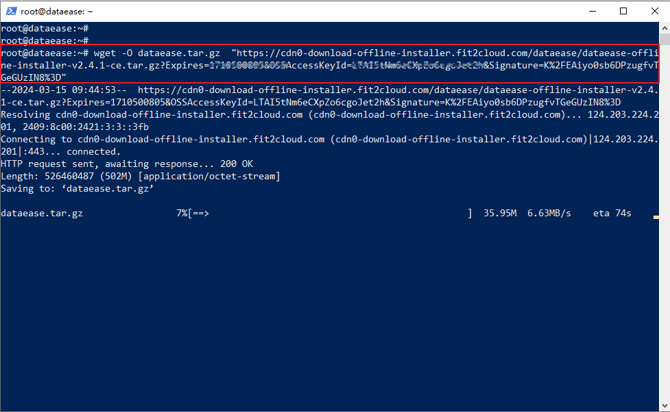

## 1 环境要求

!!! Abstract ""
	**部署服务器要求：**  

    * 操作系统: 可运行 VirtualBox 的 Windows 操作系统
    * CPU/内存: 4核8G
    * 磁盘空间: 200G

## 2 安装部署
### 2.1 在 Windows 系统中安装虚拟机

!!! Abstract ""
	电脑上没有安装虚拟化软件，需要先安装虚拟化软件。市面上主流的桌面虚拟化软件有 VMware Workstation 和 VirtualBox。如果电脑上已经安装了其中一款软件，可以直接跳过这一部分。  
	示例选择了 VirtualBox。因为 VirtualBox 是免费的，有需求的用户可以自行选择安装收费的 VMware Workstation。  
	VirtualBox 下载链接：https://download.virtualbox.org/virtualbox/7.0.14/VirtualBox-7.0.14-161095-Win.exe。

!!! Abstract ""
	下载 VirtualBox 后，双击安装包进行安装，安装完成后默认打开 VirtualBox。

{ width="900px" }

{ width="900px" }

!!! Abstract ""

	虚拟化软件 VirtualBox 已经安装完成，点击 “完成” 会自动打开 VirtualBox 虚拟机。

### 2.2  虚拟机导入 Ubuntu 系统 OVA 包

!!! Abstract ""
	在虚拟机中安装 Ubuntu 系统，可以下载 DataEase 提供的 Ubuntu OVA 文件，直接导入到 VirtualBox 就可以使用，省去安装系统的过程。  
	通过网盘链接下载 Ubuntu OVA 文件: https://pan.baidu.com/s/1lIV8QXQcwiPlYjMxlifdyQ?pwd=DeUb  提取码：DeUb 。

!!! Abstract ""
	在 VirtualBox 界面上，点击 ”导入” ，选择下载好的 Ubuntu OVA 文件，点击 “下一步”。

{ width="900px" }

!!! Abstract ""
	选择一个可用空间在 50G 以上的磁盘位置，点击 “完成”。
{ width="900px" }

!!! Abstract ""
	等待 DataEase 虚拟机完成导入。

{ width="900px" }

!!! Abstract ""
	导入完成后，选择导入的虚拟机，点击“启动”按钮。

{ width="900px" }

!!! Abstract ""
	启动后，输入用户名和密码进入系统。注意：此处密码不显示，输入完成按回车。

	* 用户名：root

    * 密码：passwd

{ width="900px" }

!!! Abstract ""
	查看虚拟机的 IP，输入命令 ip a。每个环境的 IP 地址都不一样，本次演示环境的虚拟机 IP 地址为 192.168.11.230。

{ width="900px" }

### 2.3  Ubuntu 系统中安装 DataEase

!!! Abstract ""
	成功在虚拟机中安装并启动 Ubuntu 系统，右键 Windows 图标，选择“PowerShell”或“终端”(Windows 版本不同，选项不同)。      
	在 PowerShell 界面输入：ssh root@192.168.11.230 登录到 Ubuntu 系统。

{ width="900px" }

!!! Abstract ""
	可以将 DataEase 的安装包下载到 Ubuntu 系统中，访问地址：https://community.fit2cloud.com/#/products/dataease/downloads 下载安装包；

{ width="900px" }

!!! Abstract ""
	浏览器开始下载后，打开浏览器的 “下载内容”；

{ width="900px" }

!!! Abstract ""
	右击下载任务，选择 “复制链接地址”；

{ width="900px" }

!!! Abstract ""
	回到 PowerShell 界面，输入：wget  -O dataease.tar.gz "粘贴复制的链接"

	按回车键开始下载安装包；

{ width="900px" }

!!! Abstract ""
	安装包下载完成就可以开始部署 DataEase。按照 [DataEase 离线部署]( https://dataease.io/docs/v2/installation/offline_installation/)步骤进行操作，即可部署 DataEase。
