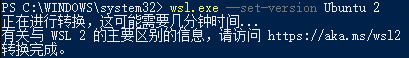
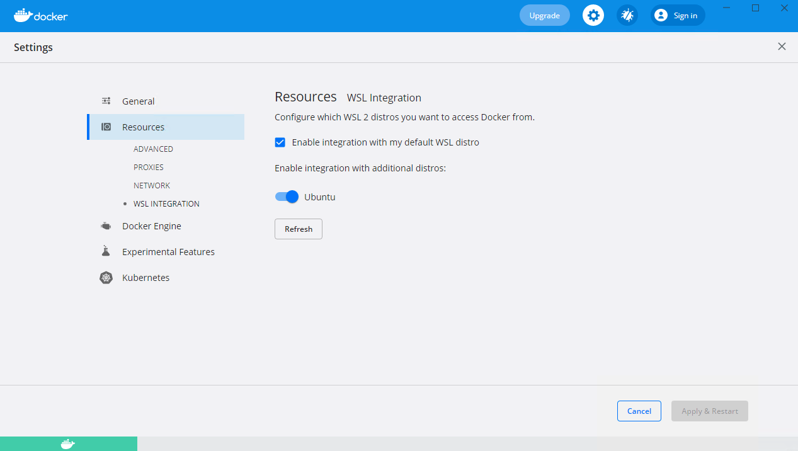
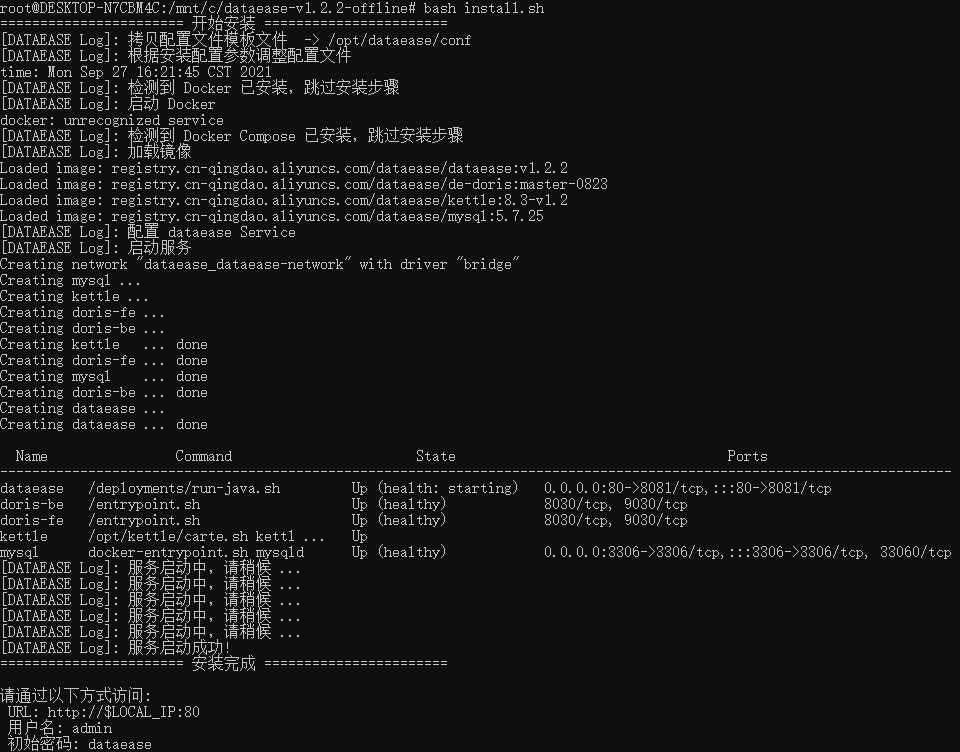

## 1 环境要求

!!! Abstract ""
	得益于 Docker 跨平台应用，DataEase 理论上可以部署在任何可以运行 Docker 的宿主机。  
	我们并非是只支持 Linux 操作系统，我们是支持可以部署 Docker 的任意 x86_64 的宿主机（Windows / Linux / macOS）。  
	**本文将以 Windows 10 为例介绍如何在 Windows 10 上安装 DataEase。**

!!! Abstract ""
	**注意：**  

	* 云虚拟机可能不支持，需要嵌套虚拟化
	* 物理机可以，Hyper-V 支持嵌套虚拟化  

!!! Abstract ""
	**部署服务器要求：**  

    * 操作系统: 可运行 Docker 的 Windows 操作系统
    * CPU/内存: 4核8G
    * 磁盘空间: 200G

## 2 安装部署

### 2.1 安装 WSL

!!! Abstract ""
	参考[在 Windows 10 上安装 WSL | Microsoft Docs](https://docs.microsoft.com/zh-cn/windows/wsl/install)此问题，进行 Windows 宿主机的配置。  

	使用管理员身份运行：
	```powershell
	dism.exe /online /enable-feature /featurename:Microsoft-Windows-Subsystem-Linux /all /norestart
	dism.exe /online /enable-feature /featurename:VirtualMachinePlatform /all /norestart
	```

	重启操作系统  

	下载[适用于 x64 计算机的 WSL2 Linux 内核更新包](https://wslstorestorage.blob.core.windows.net/wslblob/wsl_update_x64.msi)

### 2.2 设置 WSL2 为默认

!!! Abstract ""
	**以管理员身份执行：**

	```powershell
	wsl --set-default-version 2
	```

### 2.3 安装 Ubuntu

!!! Abstract ""
	**在 Windows 10 的应用商店里搜索"Ubuntu"并安装：**

{ width="900px" }


### 2.4 检测 Ubuntu WSL 版本

!!! Abstract ""
	**以管理员身份执行：**
	```powershell
	wsl.exe -l -v
	```

{ width="900px" }

!!! Abstract ""
	**示例中安装的 Ubuntu Name 为 "Ubuntu"， 如像上图出现 Ubuntu 版本为 1， 则继续执行命令：**
	```powershell
	wsl.exe --set-version Ubuntu 2
	```

	**出现下图结果即为成功：**

{ width="900px" }


### 2.5 安装 Docker

!!! Abstract ""
	**下载[Docker Desktop for Windows](https://desktop.docker.com/win/main/amd64/Docker%20Desktop%20Installer.exe)，如果使用的是 macOS，[Install Docker Desktop on Mac | Docker Documentation](https://docs.docker.com/desktop/mac/install/) 。** 

	安装完成后双击 Docker Desktop Installer.exe 安装即可完成安装。


### 2.6 Docker 设置

!!! Abstract ""
	**Docker Desktop 安装完成后，进入 Settings 界面，选择 Resources 菜单下的 WSL INTEGRATION，按下图设置后，点击右下角的 Apply & Restart 即可。**

{ width="900px" }


### 2.7 下载安装包

!!! Abstract ""
	**请自行下载 DataEase 最新版本的离线安装包(v1.2.3及以上版本) ：** 

    安装包下载链接: https://community.fit2cloud.com/#/products/dataease/downloads


### 2.8 启动 Ubuntu

!!! Abstract ""
	**在应用商店里，选择 Ubuntu，点击"启动"按钮启动 Ubuntu，并执行命令切换到 root 用户：**

	```shell
	sudo su -
	```

{ width="600px" }


### 2.9 检查 Docker 环境

!!! Abstract ""
	**在 Ubuntu 命令行中执行命令：**
	```shell
	docker version
	```

	如能像下图一样正常显示 docker 版本信息，则能正常执行 DataEase 后续的安装操作，如出现异常，请根据提示信息解决异常问题。

{ width="600px" }


### 2.10 解压安装包

!!! Abstract ""
	**在 Ubuntu 中，以 root 用户执行如下命令：**

	```sh
	# 假设安装包存放路径为 c:\dataease-v1.5.0-offline.tar.gz
	cd /mnt/c
	# 解压安装包
	tar zxvf dataease-v1.5.0-offline.tar.gz
	```

### 2.11 设置安装参数（可选）

!!! Abstract ""
	DataEase v1.5.0 版本支持以配置文件的形式来设置安装参数，如安装目录、服务运行端口、数据库配置参数等，具体参数请参见安装包中的 install.conf 文件：
	```properties
	# 基础配置
	## 安装目录
	DE_BASE=/opt
	## Service 端口
	DE_PORT=80
	## 部署及运行模式，可选值有 local、simple、cluster，分别对应 本地模式、精简模式、集群模式
	DE_ENGINE_MODE=simple
	## docker 网段设置
	DE_DOCKER_SUBNET=172.19.0.0/16
	## docker 网关 IP
	DE_DOCKER_GATEWAY=172.19.0.1
	## Apache Doris FE IP (外部 Doris 此参数无效)
	DE_DORIS_FE_IP=172.19.0.198
	## Apache Doris BE IP (外部 Doris 此参数无效)
	DE_DORIS_BE_IP=172.19.0.199

	# 数据库配置
	## 是否使用外部数据库
	DE_EXTERNAL_MYSQL=false
	## 数据库地址
	DE_MYSQL_HOST=mysql
	## 数据库端口
	DE_MYSQL_PORT=3306
	## DataEase 数据库库名
	DE_MYSQL_DB=dataease
	## 数据库用户名
	DE_MYSQL_USER=root
	## 数据库密码
	DE_MYSQL_PASSWORD=Password123@mysql
	
	# Apache Doris 配置
	## 是否使用外部 Apache Doris
	DE_EXTERNAL_DORIS=false
	## Doris 地址
	DE_DORIS_HOST=doris-fe
	## Doris 查询连接端口
	DE_DORIS_PORT=9030
	## Doris http端口
	DE_DORIS_HTTPPORT=8030
	## Doris 数据库名称
	DE_DORIS_DB=dataease
	## Doris 用户名
	DE_DORIS_USER=root
	## Doris 密码
	DE_DORIS_PASSWORD=Password123@doris
	
	# Kettle 配置
	## 是否使用外部 Kettle - (目前还不支持外部Kettle，除非不需运行Kettle，否则请不要修改此参数)
	DE_EXTERNAL_KETTLE=false
	## Kettle 服务器地址
	DE_CARTE_HOST=kettle
	## Kettle 访问端口
	DE_CARTE_PORT=18080
	## Kettle 用户名
	DE_CARTE_USER=cluster
	## Kettle 密码
	DE_CARTE_PASSWORD=cluster
	```

### 2.12 执行安装脚本

!!! Abstract ""
	```sh
	# 进入安装包目录
	cd dataease-v1.5.0-offline
	# 运行安装脚本
	/bin/bash install.sh
	```


!!! Abstract ""
	**注意：如果使用外部数据库进行安装，推荐使用 MySQL 5.7 版本。同时 DataEase 对数据库部分配置项有要求，请参考下附的数据库配置，修改环境中的数据库配置文件。**

    ```
    [mysqld]
	datadir=/var/lib/mysql

	default-storage-engine=INNODB
	character_set_server=utf8
	lower_case_table_names=1
	table_open_cache=128
	max_connections=2000
	max_connect_errors=6000
	innodb_file_per_table=1
	innodb_buffer_pool_size=1G
	max_allowed_packet=64M
	transaction_isolation=READ-COMMITTED
	innodb_flush_method=O_DIRECT
	innodb_lock_wait_timeout=1800
	innodb_flush_log_at_trx_commit=0
	sync_binlog=0
	group_concat_max_len=1024000
	sql_mode=STRICT_TRANS_TABLES,NO_ZERO_IN_DATE,NO_ZERO_DATE,ERROR_FOR_DIVISION_BY_ZERO,NO_AUTO_CREATE_USER,NO_ENGINE_SUBSTITUTION
	skip-name-resolve

	[mysql]
	default-character-set=utf8

	[mysql.server]
	default-character-set=utf8
    ```

    **特别注意以下几个参数的设置：**
	```
	character_set_server=utf8
	lower_case_table_names=1
	group_concat_max_len=1024000
	```

    请参考文档中的建库语句创建 DataEase 使用的数据库，DataEase 服务启动时会自动在配置的库中创建所需的表结构及初始化数据。
    ```mysql
    CREATE DATABASE `dataease` DEFAULT CHARACTER SET utf8mb4 COLLATE utf8mb4_general_ci;
    ```


!!! Abstract ""
	安装脚本使用 /opt/dataease 作为默认安装目录，DataEase 的配置文件、数据及日志等均存放在该安装目录。  
	**安装目录目录结构说明：**
    ```
    /opt/dataease/
	├── bin                                         #-- 安装过程中需要加载到容器中的脚本
	├── conf                                        #-- DataEase 各组件及数据库等中间件的配置文件
	├── data                                        #-- DataEase 各组件及数据库等中间件的数据持久化目录
	├── docker-compose-kettle-doris.yml             #-- DataEase 内建的 kettle 和 doris 所需的 Docker  Compose 文件 
	├── docker-compose-mysql.yml                    #-- DataEase 内建的 MySQl 所需的 Docker Compose 文件 
	├── docker-compose.yml                          #-- DataEase 基础 Docker Compose 文件，定义了网络等基础信息 
	├── logs                                        #-- DataEase 各组件的日志文件持久化目录
	└── templates                                   #-- DataEase 各组件及数据库等中间件的配置文件的原始文件
    ```

!!! Abstract ""
	**安装成功后，通过浏览器访问如下页面登录 DataEase：**

	```
	地址: http://目标服务器IP地址:服务运行端口
	用户名: admin
	密码: dataease
	```

{ width="900px" }

!!! Abstract ""
	**由于采用 wsl2 的方案，如果在 Windows 系统中访问 DataEase 服务，需要在 wsl2 中查看网卡 IP 地址（在 18945 版本后，微软对 wsl2 做了改进，可以使用 localhost 访问 wsl2）：**

	```sh
	ifconfig eth0
	```

{ width="600px" }

!!! Abstract ""
	**同时，如果局域网内需要访问此台 Windows 上的 DataEase 服务，可以通过端口转发实现：（Powershell 管理员身份运行）**

	```sh
	netsh interface portproxy add v4tov4 listenport=80 listenaddress=0.0.0.0 connetport=80 connectaddress=localhost
	```

	对于高版本 Windows 支持 localhost 映射为 wsl2 地址，否则请参考上一步获取 wsl2 地址。
	
	查看所有转发规则，如果有如下显示，则说明其他局域网内的主机可以通过此台 Windows 访问 DataEase 服务了。

	```sh
	netsh interface portproxy show all
	```

{ width="600px" }


## 3 其他注意事项

!!! Abstract ""
	注意：内置示例数据以 flyway 的形式在 DataEase 启动时自动插入到了 MySQL 数据库中，如果使用了外部 MySQL 或者修改了内置 MySQL 的容器名称的话，需要登录到 DataEase 控制台，进入到【数据源】页面，选择 "demo" 数据源，将 "demo" 数据源的相关连接信息修改正确，保存后即可正常使用内置示例数据；  
	**提示：Windows 使用 docker-compose 部署 Kettle 及 Doris ，若出现 doris-fe 无限重启问题，可参考此篇[知识库](https://kb.fit2cloud.com/?p=134)。**

{ width="900px" }
