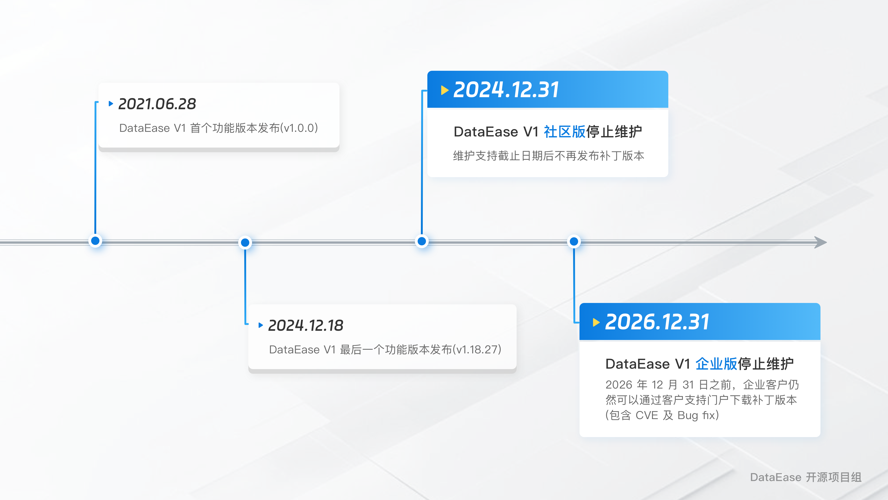

# 生命周期

!!! tip "V1 产品生命周期说明"
    DataEase（https://github.com/dataease）开源项目创立于 2021 年 6 月，已历经 4 年发展历程。 DataEase 经过长期产品迭代，可满足数据集成、可视化分析、自助式 BI、数据报表生成等核心需求，已成为广受欢迎的开源 BI 工具。  

    2021 年 6 月，DataEase 开源 BI 工具发布 V1 版本，坚持按月发布新版本。在 DataEase V1 版本编号内，累计迭代了 19 个小版本（从 v1.0.x 至 v1.18.x ），凭借轻量化部署、简单易用的可视化操作等特性，获得广大用户支持与喜爱，成为 DataEase 早期用户中安装基础最广泛的版本之一。  

    出于产品功能深化及用户需求升级的要求，2023 年 11 月 2 日，DataEase 正式发布 V2 版本，目前已更新至 v2.10.x-lts 版本。DataEase 开源项目组建议仍在使用 DataEase v1.x 版本的社区版和企业版用户，切换至 DataEase v2.x 版本，以体验更丰富的功能并获取更稳定的软件使用体验。  

    请广大 DatEase 用户注意：  

     - DataEase V1 版本（社区版）已终止维护支持（截止 2024 年 12 月 31 日），DataEase V1 版本（企业版）维护支持将持续至 2026 年 12 月 31 日。
     - 仍在使用 V1 版本的用户，建议结合业务规划提前安排向 V2.x 版本的升级迁移。
     - 若企业版用户因业务系统兼容性需延长 V1 版本支持，可联系 DataEase 项目组咨询定制化支持方案。
     - 升级过程中若遇问题，可通过 [官方社区论坛、技术文档或客户支持](https://dataease.io/docs/v1/contact/) 获取建议和指导。

## V1 产品生命周期时间线图
