## 计算字段概述

!!! Abstract ""
    【计算字段】可在当前数据集字段的基础上通过公式或函数生成新的字段，例如需要新的字段为数据集中原有两个字段的和（字段 A + 字段 B）。  
    在计算字段管理中，点击【新建计算字段】按钮，依次输入新建计算字段的"字段名"、"数据类型"、"字段类型”和"字段表达式"后点击确认完成新建。  
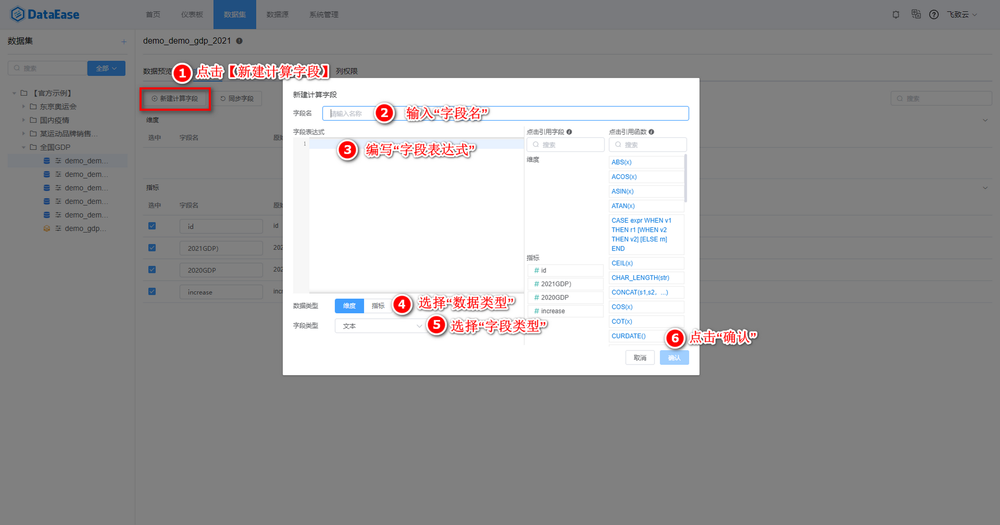{width="950px"}

!!! Abstract ""
    完成一个简单的加法运算示例。
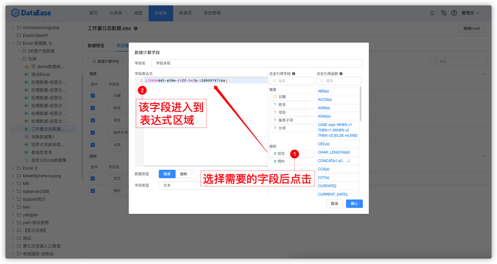{width="950px"}
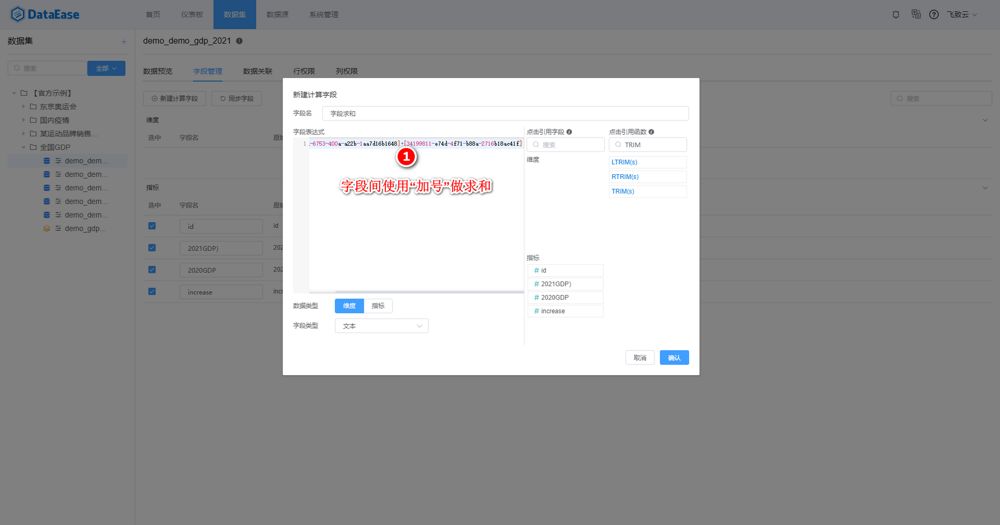{width="950px"}

!!! Abstract ""
    除了简单的公式计算外，计算字段支持使用数据库常用函数，以下内容会针对部分函数做一些示例介绍，抛砖引玉。用户可根据需要查阅本文或更多数据库本身相关函数的说明。  
    **新建计算字段支持的函数与其数据集所使用数据库类型所支持的函数一致，语法同对应数据库。**  
    如日期格式化：  

    - MySQL 使用 DATE_FORMAT(date,format)；
    - Oracle 使用 TO_DATE(X,[,fmt])；
    - 非直连模式数据集，使用 Doris 数据库函数，可参考 Doris 官网 http://doris.apache.org/master/zh-CN/。

    图中字符表达式是由函数和参数构成。函数的用法可通过鼠标悬浮在函数上查看，函数之间可以组合使用。函数参数的数字类型一般用 x 表示，字符类型用 str、s 表示，条件表达式用 expr 表示。
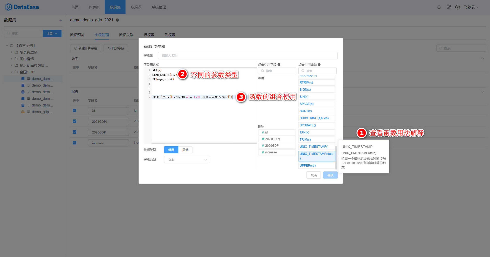{width="950px"}

# Doris 函数示例

!!! Abstract ""
    下面会以非直连数据集为例介绍部分 Doris 的函数信息，更多函数及详细内容可参考 Doris 官网 https://doris.apache.org/zh-CN/。

## 1.字符串函数
### 1.1 大小写转换

!!! Abstract ""
    LOWER(str)：将 str 中的字母全部转换成小写，其中 str 需根据需要选择维度或指标中的一个字段，即将 str 替换为实际的字段即可。  
    **注意：str 是字符串类型。**

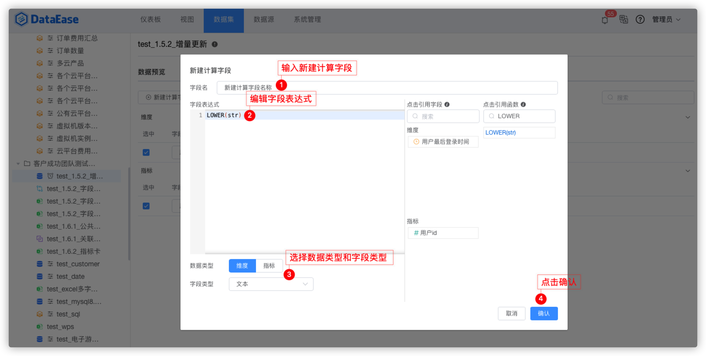{width="950px"}

!!! Abstract ""
    UPPER(str)：将字符串中的字母全部转换成大写，其中 str 需根据需要选择维度或指标中的一个字段，即将 str 替换为实际的字段即可。  
    **注意：str 是字符串类型。**

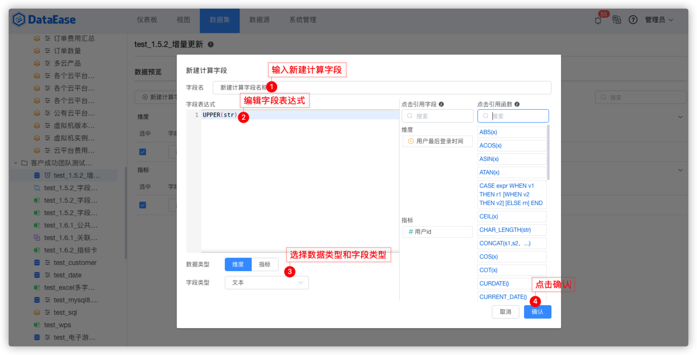{width="950px"}

### 1.2 截取字符

!!! Abstract ""
    SUBSTRING(s,n,len)：获取从字符串 s 中的第 n 个位置开始长度为 len 的字符串，其中 s 需根据需要选择维度或指标中的一个字段。  
    **注意：s 是字符串类型，n 和 len 为正整数。**

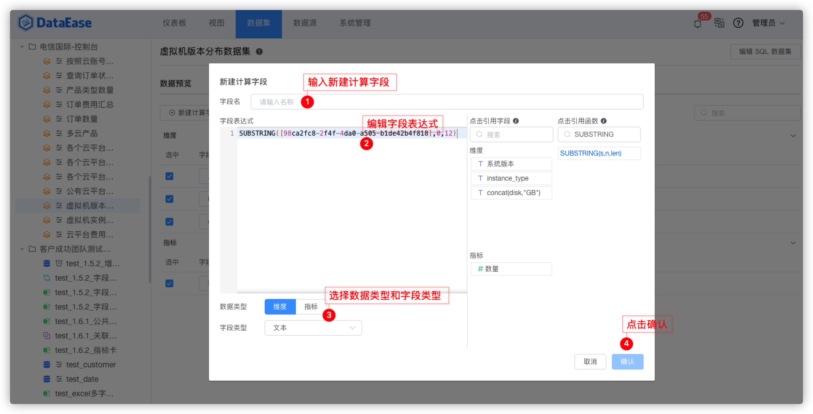{width="950px"}

### 1.3 替换字符

!!! Abstract ""
    REPLACE(s,s1,s2)：返回一个字符串，用字符串 s2 替代字符串 s 中所有的字符串 s1，其中 s 需根据需要选择维度或指标中的一个字段。  
    **注意：s、s1、s2 是字符串类型。**

.png){width="950px"}

### 1.4 去除空格

!!! Abstract ""
    LTRIM(s)去除左边空格：返回字符串 s，其左边所有空格被删除，其中 s 需根据需要选择维度或指标中的一个字段，下图展示了用指标中的"用户 id" 作为参数 s。

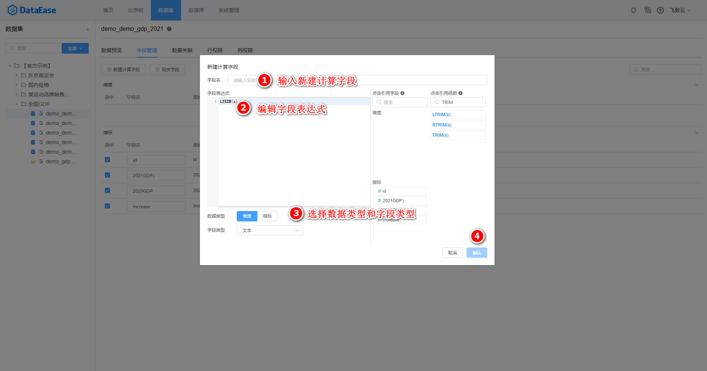{width="950px"}

!!! Abstract ""
    RTRIM(s)去除右边空格：返回字符串 s，其右边所有空格被删除，其中 s 需根据需要选择维度或指标中的一个字段。

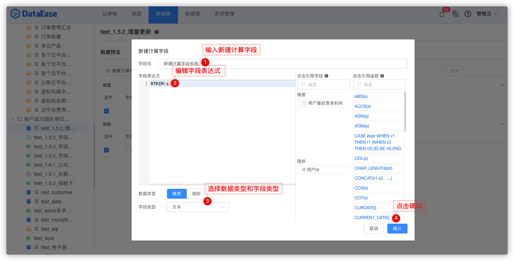{width="950px"}

!!! Abstract ""
    TRIM(s)去除俩边空格：返回字符串 s 删除了两边空格之后的字符串，其中 s 需根据需要选择维度或指标中的一个字段。

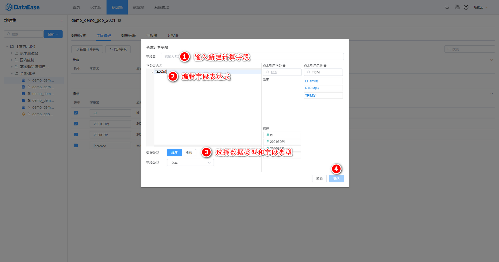{width="950px"}

## 2.时间函数
### 2.1 返回当前时间

!!! Abstract ""
    NOW()：返回当前日期和时间值，格式为 "YYYY_MM-DD HH:MM:SS" 或 "YYYYMMDDHHMMSS"，具体格式根据函数用在字符串或数字语境中而定，不带参数的函数直接返回即可。具体步骤按照下图所示。

.png){width="950px"}

!!! Abstract ""
    LOCALTIME()：返回当前日期和时间值，格式为 "YYYY_MM-DD HH:MM:SS" 或 "YYYYMMDDHHMMSS"，具体格式根据函数用在字符串或数字语境中而定。具体步骤按照下图所示。

.png){width="950px"}

!!! Abstract ""
    CURDATE()：将当前日期按照 "YYYY-MM-DD" 或者 "YYYYMMDD" 格式的值返回，具体格式根据函数用在字符串或是数字语境中而定。具体步骤按照下图所示。

.png){width="950px"}

!!! Abstract ""
    CURRENT_DATE()：将当前日期按照 "YYYY-MM-DD" 或者 "YYYYMMDD" 格式的值返回，具体格式根据函数用在字符串或是数字语境中而定。具体步骤按照下图所示。

.png){width="950px"}

!!! Abstract ""
    UNIX_TIMESTAMP()：返回一个格林尼治标准时间 1970-01-01 00:00:00 到现在的秒数。具体步骤按照下图所示。

.png){width="950px"}

!!! Abstract ""
    UNIX_TIMESTAMP(date)：返回一个格林尼治标准时间 1970-01-01 00:00:00 到指定时间 date 的秒数。其中 date 需根据需要选择维度或指标中的一个字段。注意：date 是时间类型。具体步骤按照下图所示。

.png){width="950px"}

### 2.2 日期转换

!!! Abstract ""
    FROM_UNIXTIME(date)：将时间戳转换为时间，默认格式为 ‘%Y-%m-%d %H:%i:%s’，依据数据库类型的不同对应的使用方法也有差异。

{width="950px"}

## 3.数字运算

.png){width="950px"}

### 3.1 绝对值函数

!!! Abstract ""
    ABS(x)：返回 x 的绝对值。其中 x 需根据需要选择维度或指标中的一个字段或指定数字。注意：x 是数字类型。

.png){width="950px"}

### 3.2 乘方

!!! Abstract ""
    POW(x,y)：x 的 y 次方 ，返回 x 的 y 次乘方的值。其中 x 和 y 需根据需要选择维度或指标中的一个字段或指定数字或指定数字。注意：x和y 是数字类型。

.png){width="950px"}

!!! Abstract ""
    EXP(x)：返回 e 的 x 乘方后的值。其中 x 需根据需要选择维度或指标中的一个字段或指定数字或指定数字。注意：x 是数字类型。

.png){width="950px"}

### 3.3 余数

!!! Abstract ""
    MOD(x,y)：返回 x 被 y 除后的余数。其中 x，y 可需根据需要选择维度或指标中的一个字段或指定数字。注意：x，y 是数字类型。

### 3.4 取整

!!! Abstract ""
    CEIL(x)向上取整 ：返回不小于 x 的最小整数。其中 x 需根据需要选择维度或指标中的一个字段或指定数字或指定数字。注意：x 是数字类型。

.png){width="950px"}

!!! Abstract ""
    FLOOR(x)向下取整 ：返回不大于 x 的最大整数。其中 x 需根据需要选择维度或指标中的一个字段或指定数字或指定数字。注意：x 是数字类型。

.png){width="950px"}

!!! Abstract ""
    ROUND(x)就近取整 ：返回离 x 最近的整数。其中 x 需根据需要选择维度或指标中的一个字段或指定数字或指定数字。注意：x 是数字类型。

.png){width="950px"}

### 3.5 PI()常数

!!! Abstract ""
    PI()：返回圆周率 π，默认显示 6 位小数。

.png){width="950px"}

### 3.6 三角函数

!!! Abstract ""
    COS(x)：返回 x 的余弦，其中 x 为给定的弧度值。对应的还有其他三角函数，比如 SIN(x)。其中 x 需根据需要选择维度或指标中的一个字段或指定数字或指定数字。注意：x 是数字类型。

.png){width="950px"}

## 4.逻辑函数

### 4.1 IF函数

!!! Abstract ""
    在进行数据分析时，用户经常会使用到 IF 判断条件，来对已有的数据进行数据清洗和处理。  
    在IF函数中，如果 expr 是 TRUE 则返回 v1，否则返回 v2。注意：expr 是表达式，v1 和 v2 是确定的返回值。

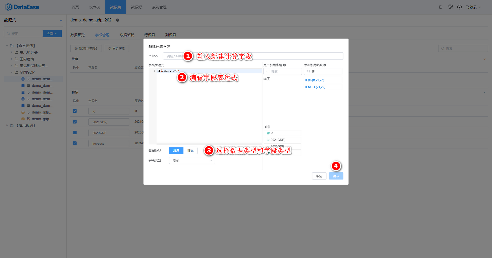{width="950px"}

{width="950px"}

### 4.2 CASE-WHEN函数

!!! Abstract ""
    CASE-WHEN 函数和 IF 的用法类似，区别是对于条件表达式的返回值，CASE-WHEN更加细化（除了能对 v1 和 v2 俩个返回值有不同的结果外，还能对第三种返回值有 rn 的结果），表达式之间也支持嵌套使用。  
    注意：expr 是表达式，v1 和 v2 是确定的返回值。

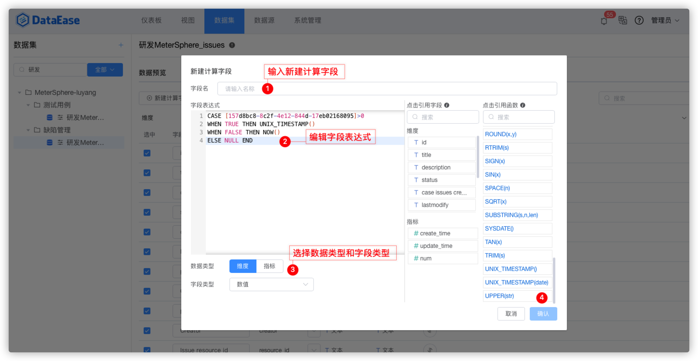{width="950px"}

# MySQL 函数示例

!!! Abstract ""
    下面会介绍 MySQL 数据库特有的常用的函数，注意：有部分 MySQL 的函数和非直连数据集重合的需要参考非直连数据库。

## 1.字符串函数
### 1.1 字符反转函数

!!! Abstract ""
    REVERSE(s)：将字符串 s 反转，其中 str 需根据需要选择维度或指标中的一个字段。注意：str 是字符串类型。

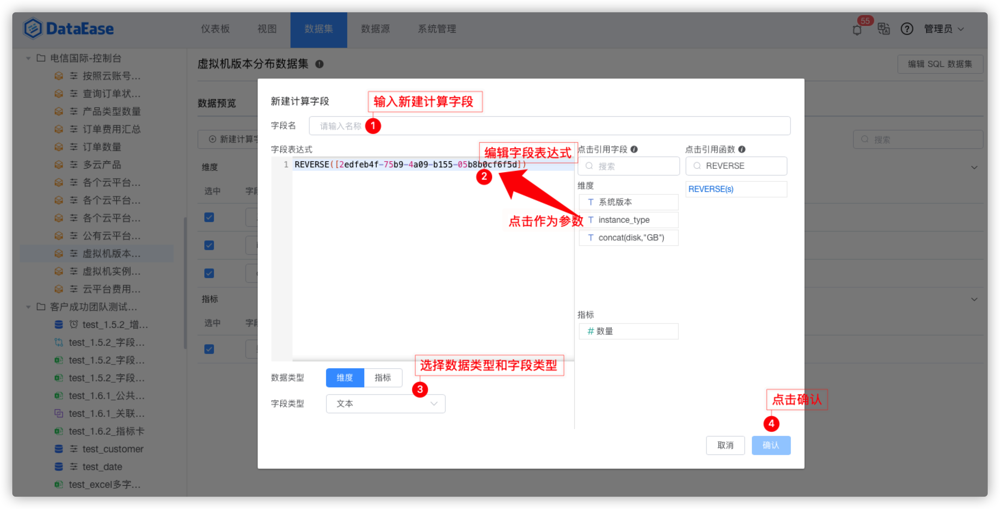{width="950px"}

!!! Abstract ""
    LEFT(s,n)：返回字符串 s 从最左边开始的 n 个字符，其中 s 需根据需要选择维度或指标中的一个字段。注意：s 是字符串类型，n 是正整数。

.png){width="950px"}

!!! Abstract ""
    INSERT(s1,x,len,s2)：返回字符串 s1，其子字符串起始于位置 x，被字符串 s2 取代 len 个字符。注意：s1 和 s2 是字符串类型，x 和 len 为正整数。

.png){width="950px"}

!!! Abstract ""
    REPEAT(s,n)：返回一个由重复字符串 s 组成的字符串，字符串s的数目等于 n。其中 s 需根据需要选择维度或指标中的一个字段。注意：s 是字符串类型，n 为正整数。

.png){width="950px"}

### 1.2 拼接空格字符

!!! Abstract ""
    SPACE(n)：返回一个由 n 个空格组成的字符串。

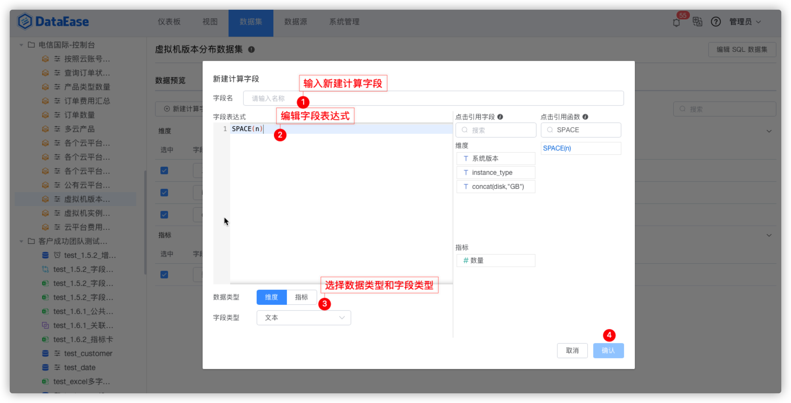{width="950px"}

!!! Abstract ""
    SYSDATE()：返回当前日期和时间值，格式为 "YYYY_MM-DD HH:MM:SS" 或 "YYYYMMDDHHMMSS"，具体格式根据函数用在字符串或数字语境中而定。具体步骤按照下图所示。

.png){width="950px"}

## 2.日期函数

### 2.1 返回当前时间

!!! Abstract ""
    SYSDATE()：返回当前日期和时间值，格式为 "YYYY_MM-DD HH:MM:SS" 或 "YYYYMMDDHHMMSS"，具体格式根据函数用在字符串或数字语境中而定。具体步骤按照下图所示。

.png){width="950px"}

### 2.2 日期转换

!!! Abstract ""
    DATE_FORMAT(date,format)日期转换函数。date 参数是合法的日期，format 规定日期/时间的输出格式。

{width="950px"}

## 3.对数

!!! Abstract ""
    LOG(x)：返回 x 的自然对数，x 相对于基数 e 的对数。其中 x 需根据需要选择维度或指标中的一个字段或指定数字。注意：x 是数字类型。

.png){width="950px"}

