!!! Abstract ""
    通过介绍该仪表板的制作过程，帮助大家快速掌握联动、钻取、地图等的使用。  
    **此仪表板的制作及截图基于 DataEase v1.2.0 版本。**

## 1 添加数据源

!!! Abstract ""
    录入数据源的名称、IP地址、用户名、密码等，校验成功后，点击【保存】按钮，数据源新建成功。

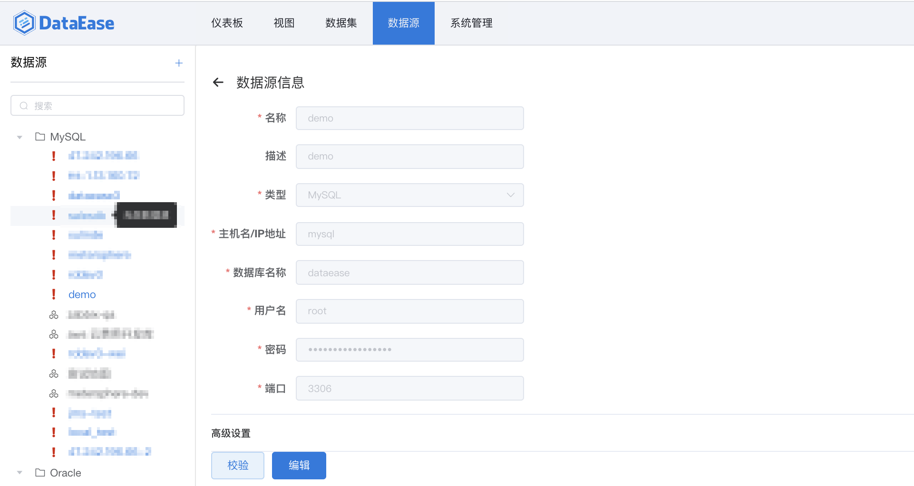{width="900px"}
## 2 添加数据集

!!! Abstract ""
    在【示例数据】分组下，新建分组【全国GDP】，并在该分组下，添加数据集
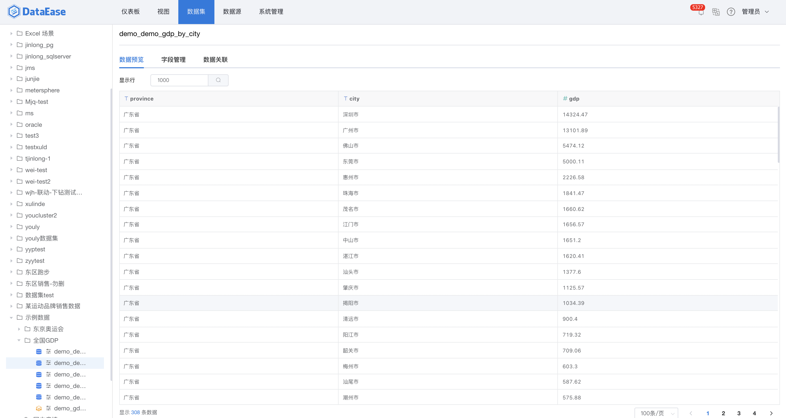{width="900px"}

## 3 制作视图
### 3.1 添加视图分组

!!! Abstract ""
    在【示例数据】分组下，新建分组【全国GDP】，并在该分组下新建视图。
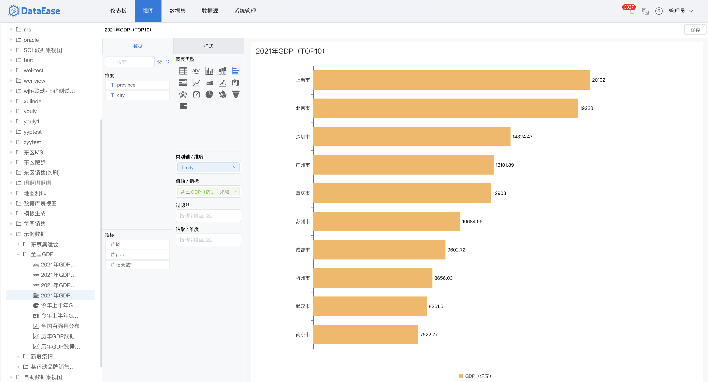{width="900px"}

### 3.2 添加地图

!!! Abstract ""
    在【示例数据->全国GDP】分组下，添加【全国GDP】地图。

!!! Warning "请注意"
    系统采用的是国家行政架构的标准名称，因此建议用户也采用标准名称，否则可能匹配不上，导致数据无法正常展示。
{width="900px"}

!!! Abstract "地图配色"
    如下图所示，选择并自定义配色方案（渐变色系）后，自动根据各省份GDP值的大小在地图中着色。GDP值较小的省份，颜色偏浅；GDP值较大的省份，颜色偏深。

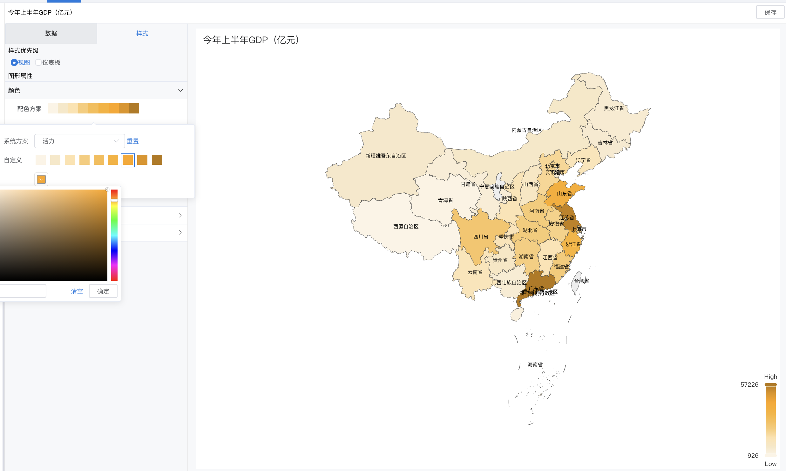{width="900px"}

!!! Abstract "设置钻取目录"
    拖拽钻取字段至【钻取/维度】。
!!! Warning "请注意"
    下钻目录与拖入的字段顺序有关，如下图所示，自上而下依次下钻。
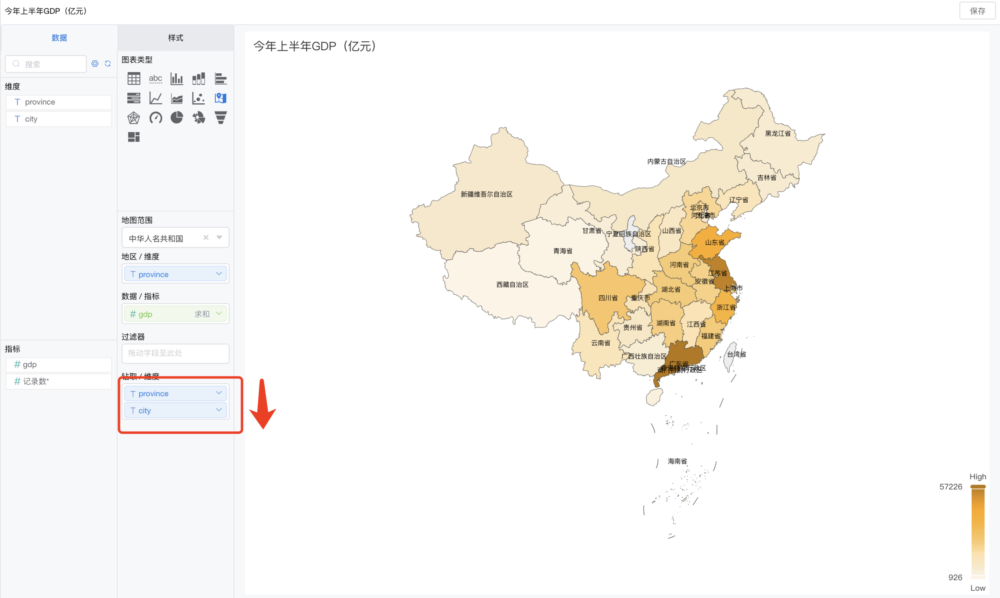{width="900px"}
### 3.3 添加气泡图

!!! Abstract "散点图"
    如下图所示，当【气泡大小/指标】为空时，图表为散点图。横轴为省份，纵轴为省内百强县的个数。散点远离横轴的省份，省内百强县的数目较多；散点靠近横轴的省份，省内百强县的数目较少。

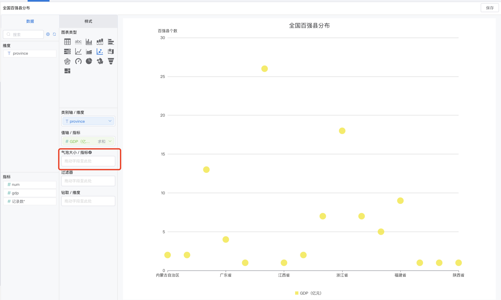{width="900px"}

!!! Abstract "气泡图"
    如下图所示，把字段【gdp】拖拽至【气泡大小/指标】时，百强县的多少判定仍与散点图一致，气泡的大小由该省的GDP大小决定。

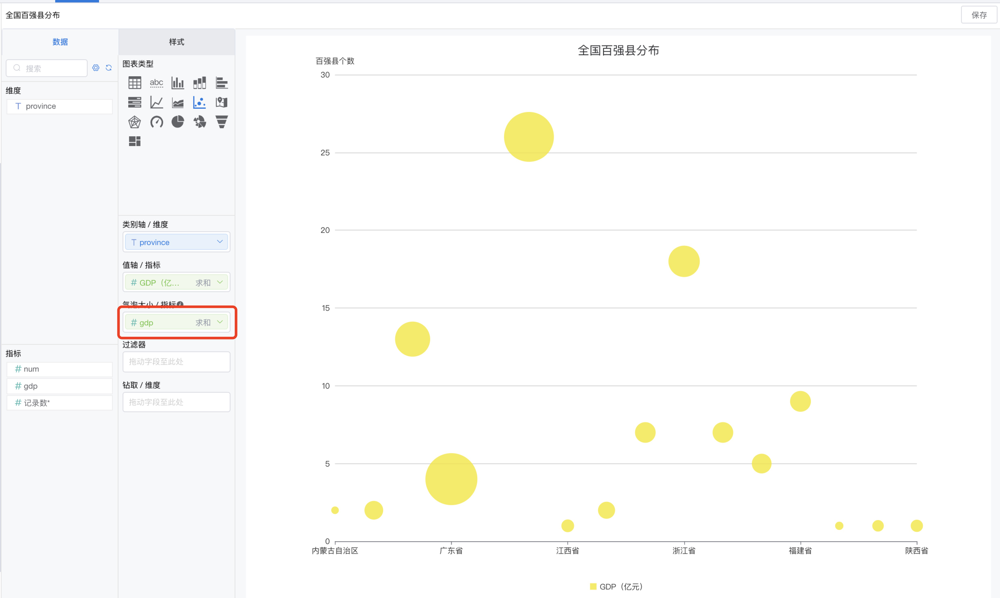{width="900px"}
### 3.4 其他视图

!!! Abstract ""
    按照各图表的用法，制作折线图【历年GDP数据】，横向柱状图【2021年GDP（TOP10）】，饼图【今年上半年GDP产业分布（亿元）】等。

## 4 制作仪表板
### 4.1 设计仪表板

!!! Abstract ""
    在下图目录中，新建仪表板【2021年全国GDP数据】，添加视图，并在画板中排列。

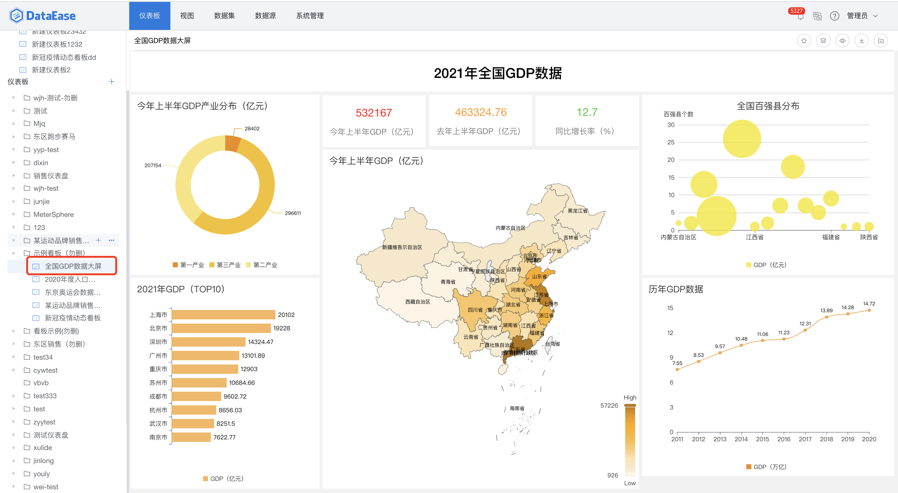{width="900px"}

### 4.2 联动设置

!!! Abstract ""
    如下图，点击展开功能菜单，开始【联动设置】。

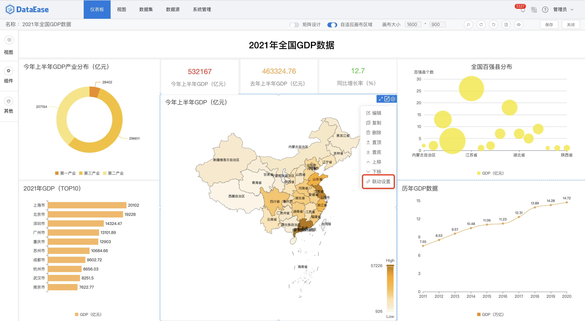{width="900px"}

!!! Abstract "设置联动字段"
    如下图，当设置两个视图联动时，设置相对应的数据集的联动字段。设置完成后，点击【确定】，联动设置完成。

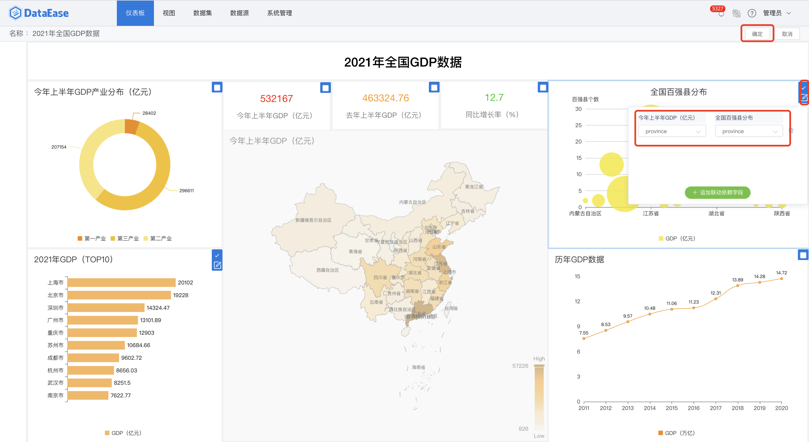{width="900px"}

## 5 仪表板展示
### 5.1 地图联动

!!! Abstract "第一步"
    点击【江苏省】，并选择【联动】。

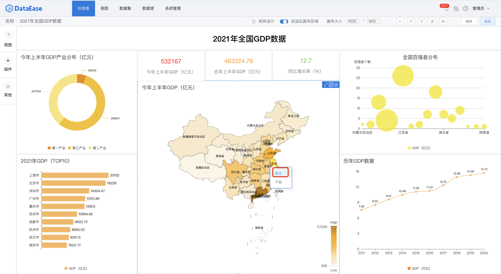{width="900px"}

!!! Abstract "第二步"
    联动结果展示，如下图，设置了联动的两个视图，均只展示江苏省的数据。

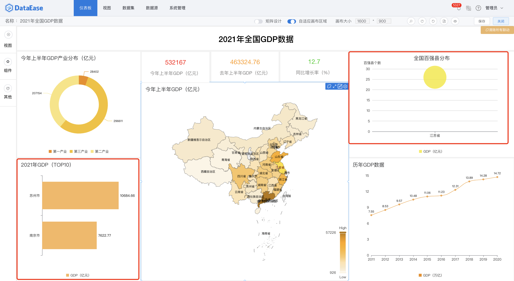{width="900px"}

!!! Abstract "第三步"
    可点击下图所示位置，清除局部联动和所有联动。

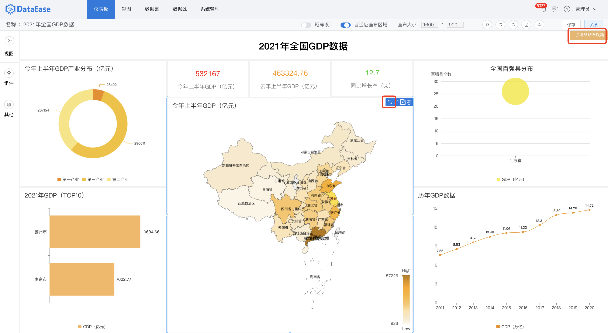{width="900px"}

### 5.2 钻取

!!! Abstract "第一步"
    点击【江苏省】，并选择【下钻】。

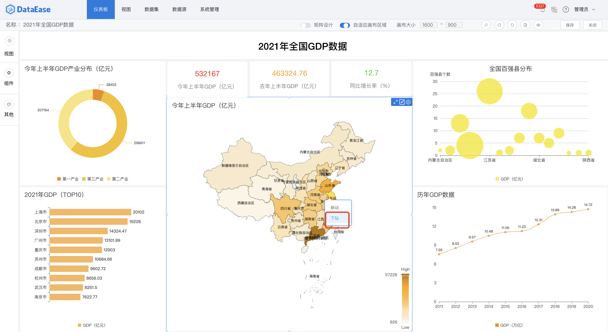{width="900px"}

!!! Abstract "第二步"
    下钻结果展示，如下图，展示江苏省地图。如果想返回上一级，点击下图中【全部】，返回全国地图。

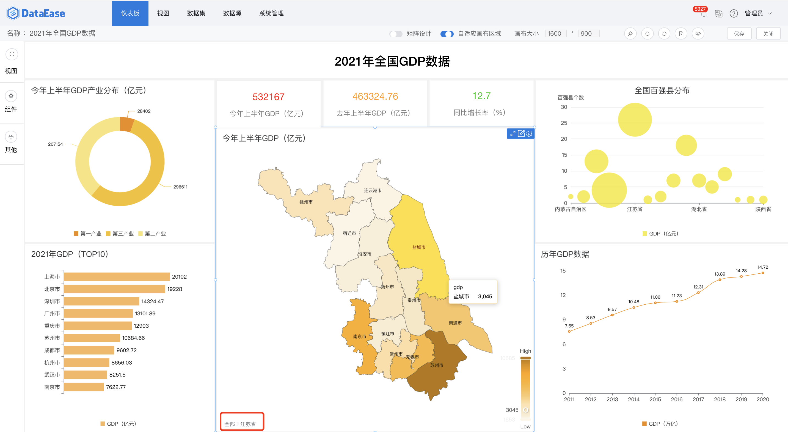{width="900px"}
