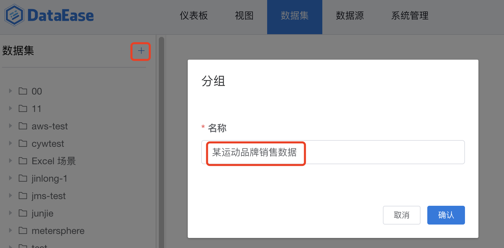
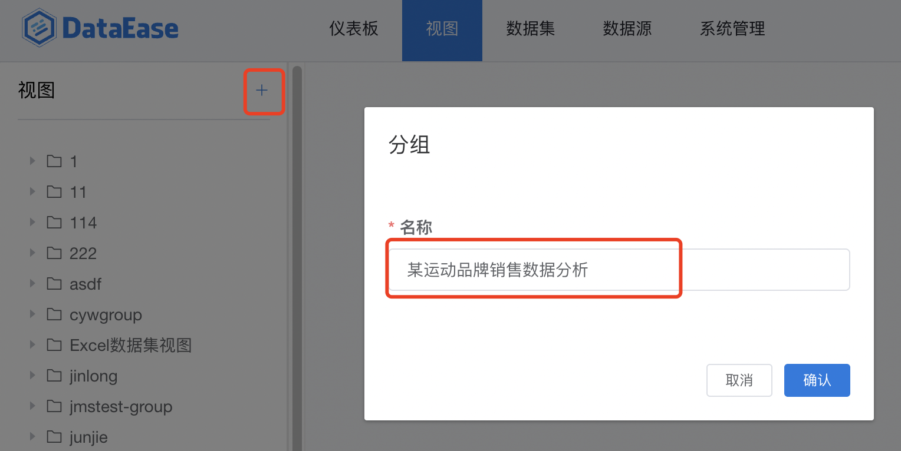
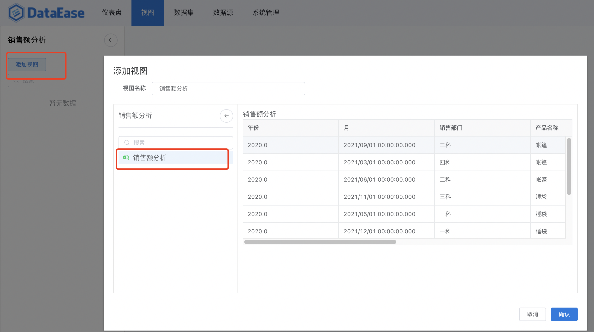
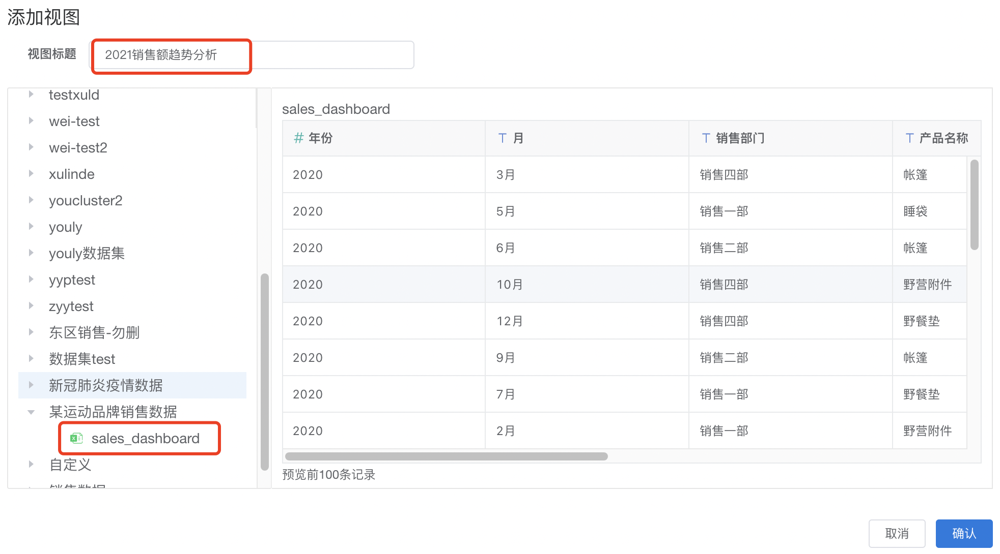
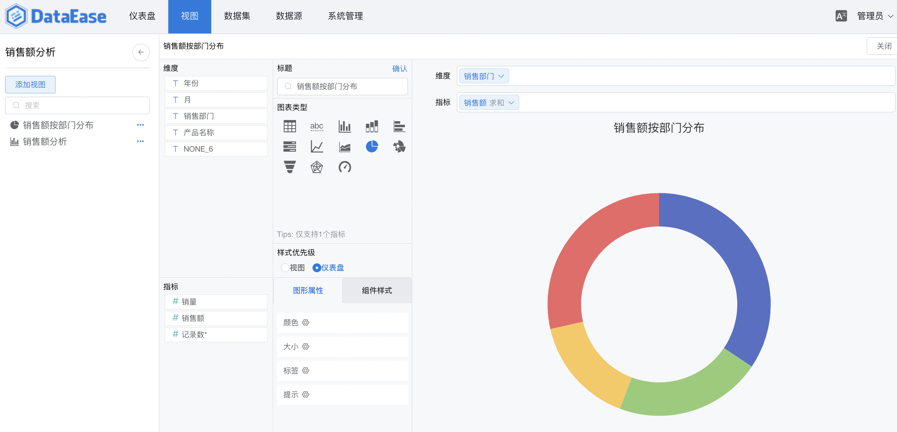
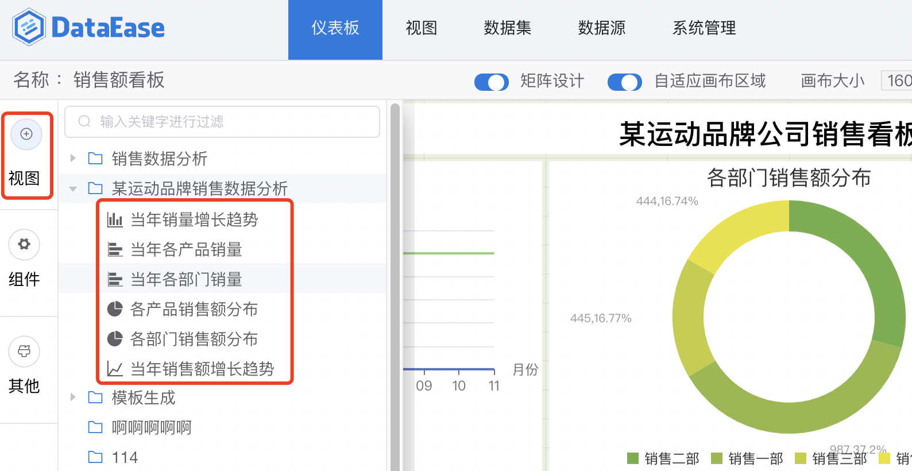
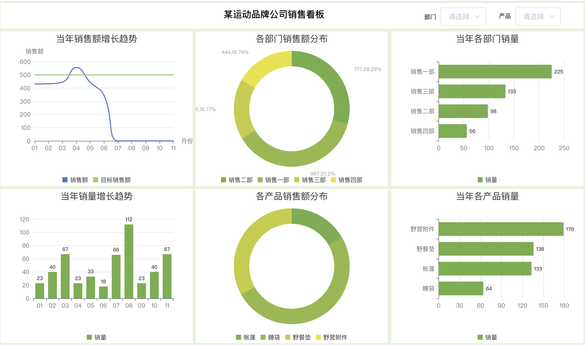
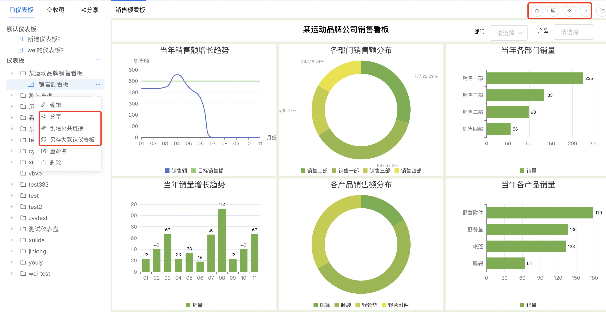

!!! Abstract ""
	我们以 Excel 数据为例，简要介绍如何使用 DataEase 创建一个仪表板。

## 1 添加数据集
### 1.1 添加分组

!!! Abstract ""
	选择【数据集】菜单，点击【添加分组】按钮，分组"某运动品牌销售数据"添加成功；

{width="850px"}

### 1.2 上传 Excel 文件

!!! Abstract ""

{width="850px"}

!!! Abstract ""
	在弹出的页面中，点击【上传文件】，选择 Excel 文件后，点击"确认"，上传成功；

{width="850px"}

!!! tip "演示文件"
	演示文件<a href="../sales_dashboard.xlsx" target="_blank">点此下载</a>

## 2 为 Excel 数据集制作视图
### 2.1 添加视图分组

!!! Abstract ""
	选择【视图】菜单，点击【添加分组】按钮，分组"某运动品牌销售数据分析"添加成功；

{width="850px"}

### 2.2 添加视图

!!! Abstract ""
	在上一步创建的分组下，如下图所示，点击【添加视图】；

{width="850px"}

!!! Abstract ""
	在【视图添加】窗口，选择下图所示的数据集，并输入视图标题，点击【确认】视图创建成功；

{width="850px"}

### 2.3 视图设计

!!! Abstract ""
	从左侧列表中选择刚添加的视图"各部门销售额分布"，进入视图设计页，从左侧【维度】列表中用鼠标拖拽"销售部门"项，拖动到图形区【维度】选择框；同样，从左侧【指标】列表中拖动"销售额"到图形区【指标】选择框。在【图表类型】栏中，选择"饼图"。在【图表类型】下方的【图形属性】页中，选择【大小】选项，将内径设置为 40，即可生成环形图。   
    同样的，可以利用该 Excel 数据集添加多个相关视图。

{width="850px"}

## 3 用视图制作仪表板
### 3.1 创建仪表板

!!! Abstract ""
	选择【仪表板】菜单，创建一个仪表板目录"某运动品牌销售看板"。在该目录下，创建一个空的仪表板"销售额看板"，点击【编辑】，开始设计仪表板；

{width="850px"}

### 3.2 仪表板中增加视图

!!! Abstract ""
	进入仪表板编辑页面后，点击左侧的【视图】，打开视图选择窗口，将需要的视图从视图列表中拖拉至仪表板的画板中，开始设计；

{width="850px"}

### 3.3 仪表板设计

!!! Abstract ""
	在仪表板设计界面，可以通过组件和视图的各种排列组合，生成需要的仪表板看板。然后点击右上角的按钮预览或者保存。至此，以 Excel 为数据源的仪表板 demo 制作完成。

{width="850px"}

## 4 仪表板的使用 

!!! Abstract ""
	仪表板生成后，不仅可以查看仪表板，另外： 点击右上角按钮，对仪表板预览、收藏、导出等等 点击左侧按钮，对仪表板进行重命名、删除、分享等等

{width="850px"}