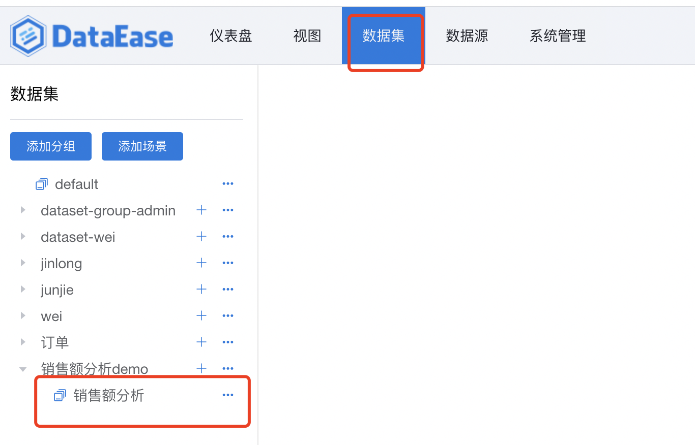
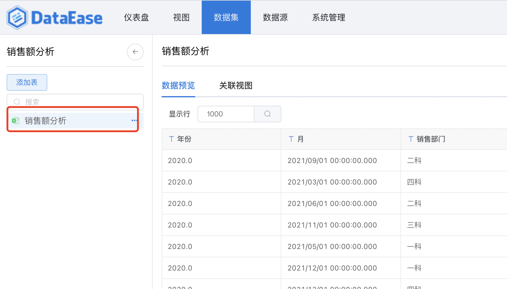
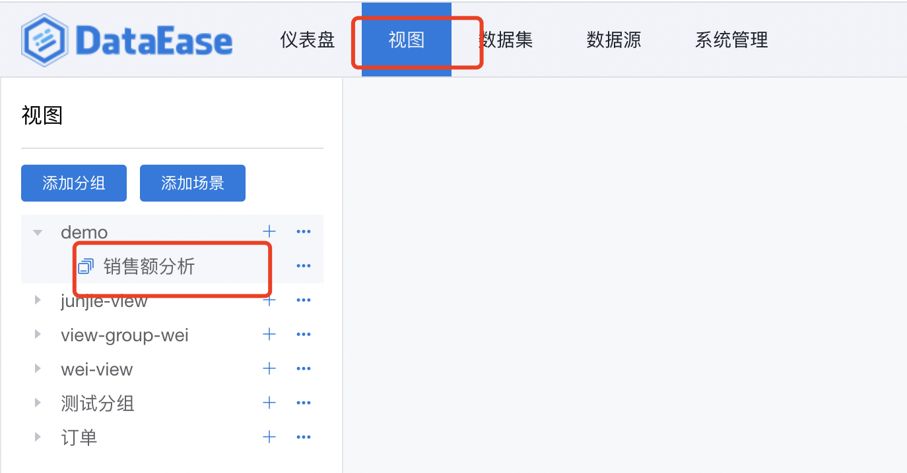
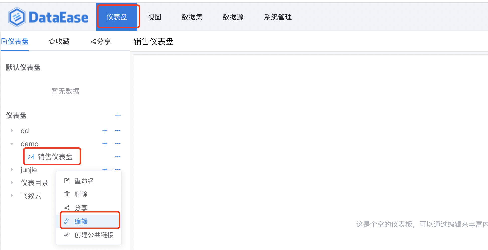
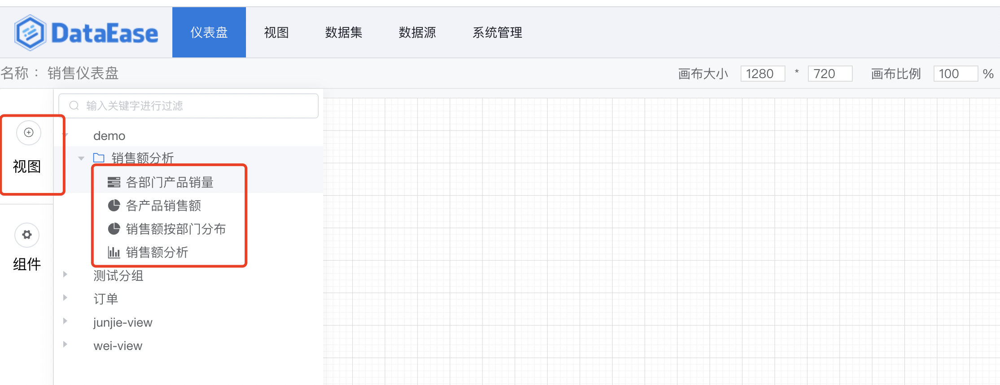
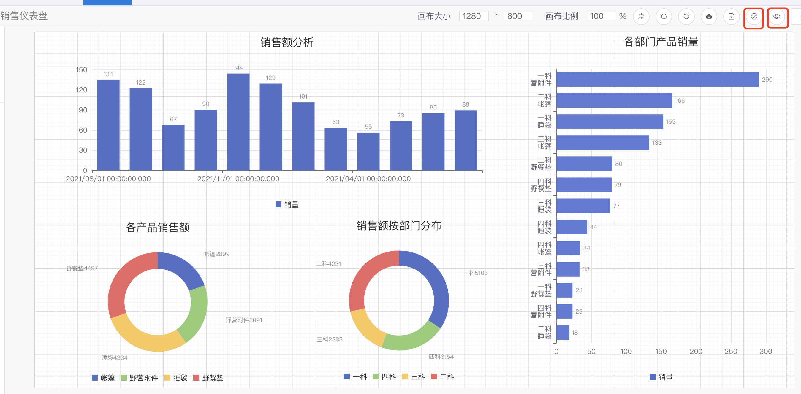
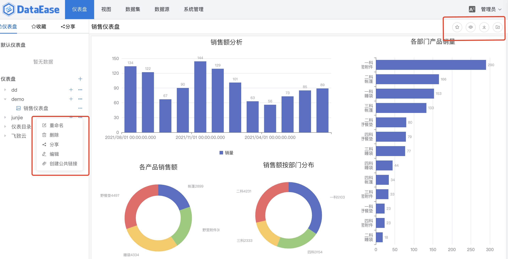

## 1 添加excel数据集
### 1.1 添加场景
> 第一步，添加场景"销售额分析；

## 1.2 为场景添加excel数据集
> 第二步，点击添加表后选择Excel数据集，为该场景添加excel数据集；

## 1.3 上传excel文件
> 第三步，点击上传文件，选择文件后，点击"确认"；

## 1.4 Excel数据集添加成功
> 第四步，Excel数据集添加成功，点击左侧数据集，可预览数据；

## 2 为Excel数据集制作视图
### 2.1 视图的场景添加
> 第一步，添加场景"销售额分析；

### 2.2 添加视图
> 第二步，点击添加视图，跳转至视图添加页面，在此页面，选择excel数据集后确认，视图添加成功；

### 2.3 视图设计
> 第三步，设计视图，包括选择图表，图表样式设置，以及图表的维度和指标选择，设计完成后，点击保存生成视图。

## 3 用视图制作仪表盘
### 2.1 创建仪表盘
> 第一步，创建一个空的仪表盘，点击编辑，开始设计仪表盘；

### 2.2 仪表盘中增加视图
> 第二步，点击视图，打开视图选择窗口，将需要的视图拖拉至仪表盘的画板中，开始设计；

### 2.3 仪表盘设计
> 第三步，在仪表盘设计界面，可以通过组件和视图的各种排列组合，生成需要的仪表盘看板。然后点击右上角的按钮预览或者保存。至此，以Excel为数据源的仪表盘demo制作完成。

## 4 仪表盘的使用 
> 仪表盘生成后，不仅可以查看仪表盘，另外： 点击右上角按钮，对仪表盘预览、收藏、导出等等 点击左侧按钮，对仪表盘进行重命名、删除、分享等等

