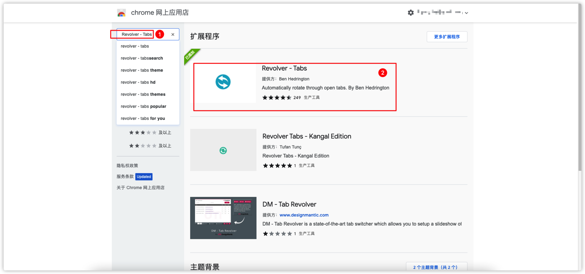
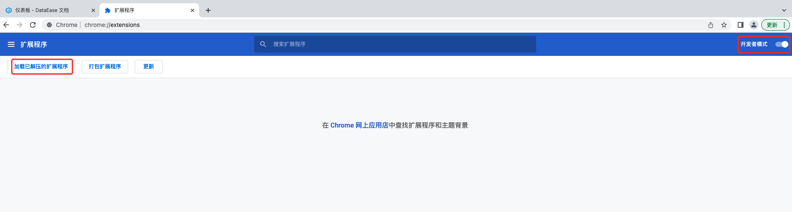
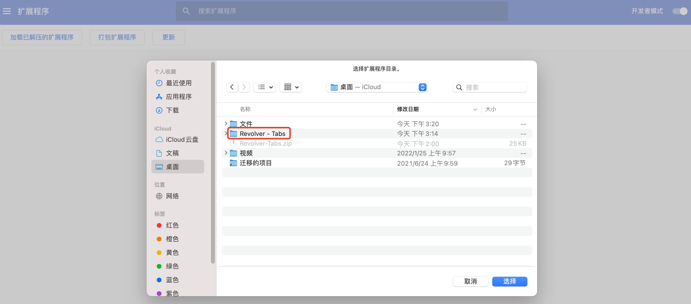
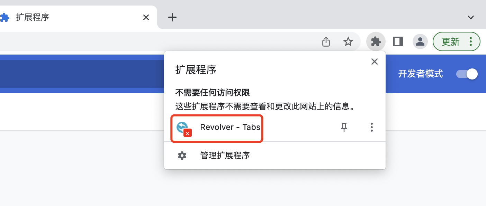

### 1.使用 Tab 组件展示多视图

!!! Abstract ""
    选择"其他"中的【选项卡】组件拖入仪表板中，可根据需求在该组件上增加多个 Tab 窗口，并设置不同的视图，用户可通过切换 Tab 标签查看多视图内容。  
    **提示：目前还不支持仪表板级别的 Tab。**
{width="900px"}
{width="900px"}
{width="900px"}

### 2.设置元素为矩阵/悬浮

!!! Abstract ""
    可设置元素移入仪表板后的分布方式为"矩阵"或"悬浮"：

    - 矩阵：元素可自动对齐，具有相同的间隔距离，用户放置时元素会自动挤压分布，不可多层叠加；
    - 悬浮：元素可完全按照用户移动位置放置，可多个元素叠加，不受其它组件挤压。  

    **提示：新移入仪表板的元素受该设置影响，已存在仪表板的元素不受其修改的影响，可单独修改元素的属性。**
{width="900px"}
{width="900px"}

### 3.设置仪表板刷新时间

!!! Abstract ""
    仪表板支持用户自定义自动刷新时间，时间间隔支持"分钟"、"秒"级别，当仪表板处于查看状态时会根据刷新时间自动重新请求数据。  
    **提示：处于"编辑"状态的仪表板不会执行定时刷新，若需查看效果需退出编辑状态。**
{width="900px"}
{width="900px"}

### 4.仪表板自定义主题

!!! Abstract ""
    通过【样式】设置中对各项参数的修改，用户可根据自身喜好设置各项元素信息后【保存】为个人主题。在仪表板制作过程中可快速切换不同主题。  
    **注意：视图基于仪表板中组件样式背景、图形属性颜色、表格颜色设置的变化而变化需要该视图优先级设置为"仪表板"，可参考本篇"设置视图样式优先级"。**
{width="900px"}

### 5.多个仪表板轮播

!!! Abstract ""
    **该方式仅适用于 Chrome 浏览器，具体操作步骤如下：**  

    1. 在DE上制作多个仪表板大屏；
    2. 将各个仪表板大屏均以 “新 Tab 页预览”方式打开；
    3. 安装扩展插件：Revolver - Tabs（Chrome 网上应用商店安装或下载安装包自行安装）。

{width="900px"}

!!! Abstract ""
    **Chrome 应用商店安装方式如下**
{width="900px"}

!!! Abstract ""
    **如无法访问 Chrome 应用商店，可直接下载插件程序：<a href="../Revolver-Tabs.zip" target="_blank">点此下载</a>。**  
    下载完成后按照如下操作安装。

!!! Abstract ""
    第一步，先在谷歌浏览器中打开扩展程序；
{width="900px"}

!!! Abstract ""
    第二步，打开开发者模式，并出现加载扩展程序选项；
{width="900px"}

!!! Abstract ""
    第三步，加载解压后的扩展程序。
{width="900px"}

!!! Abstract ""
    完成插件安装后，可根据需求设置切换间隔。
{width="900px"}

!!! Abstract ""
    最后，浏览器开启全屏模式。其次，点击下图所示位置，启动轮播，启动后可看到图标上的绿色标记，仪表板的轮播设置全部完成。
{width="900px"}

