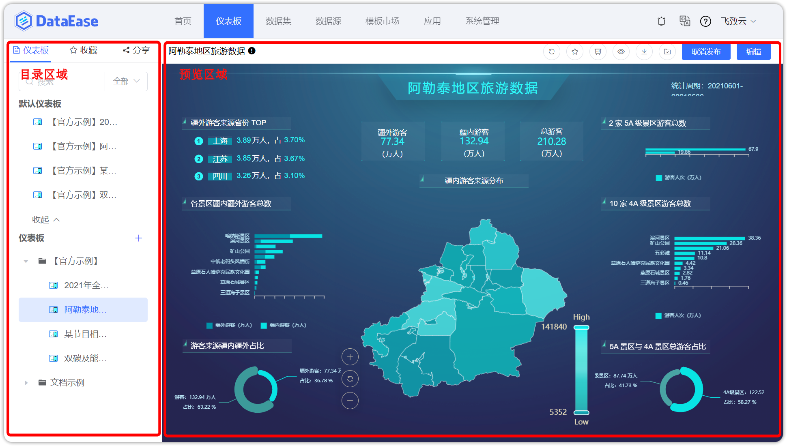
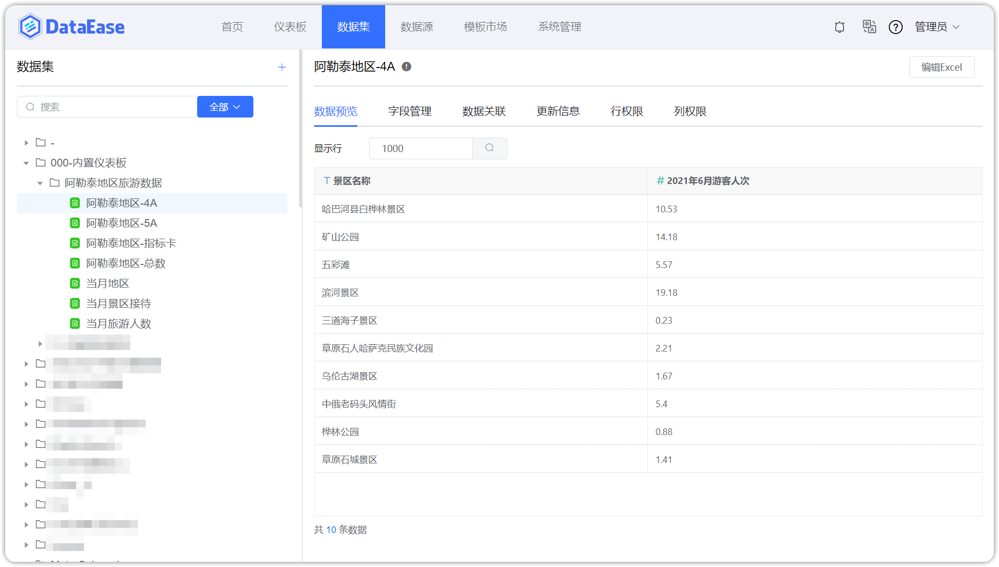
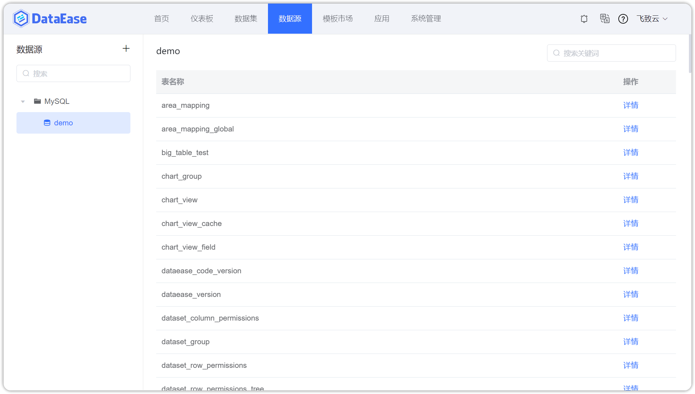
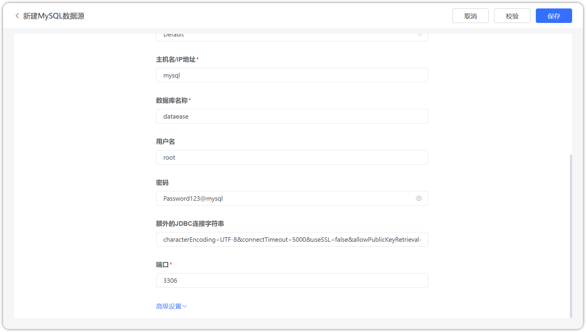
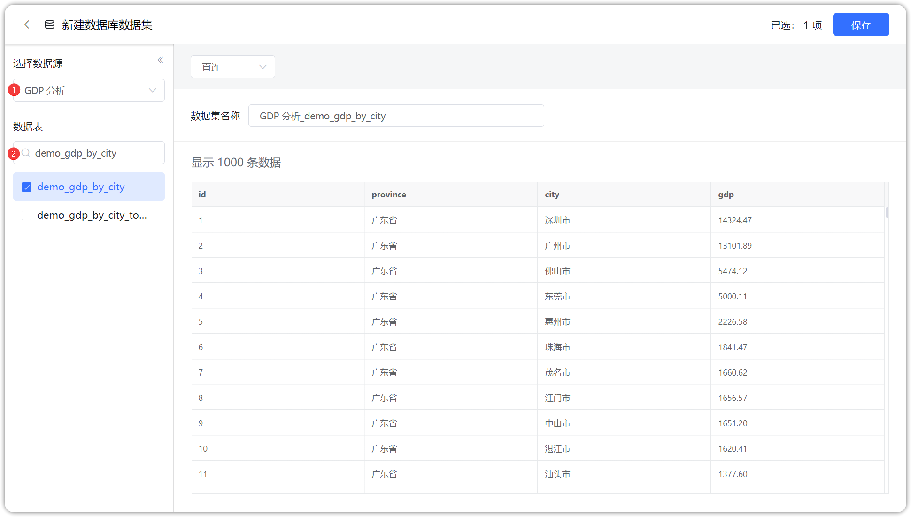
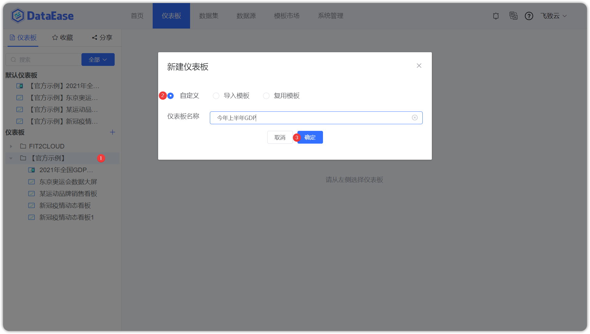
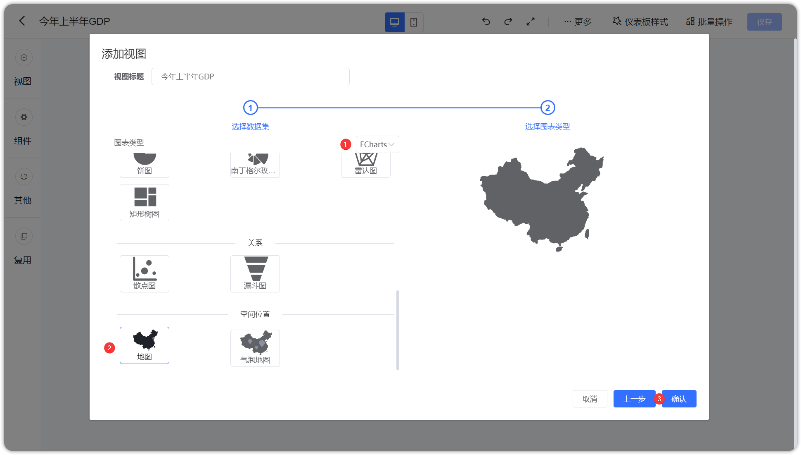
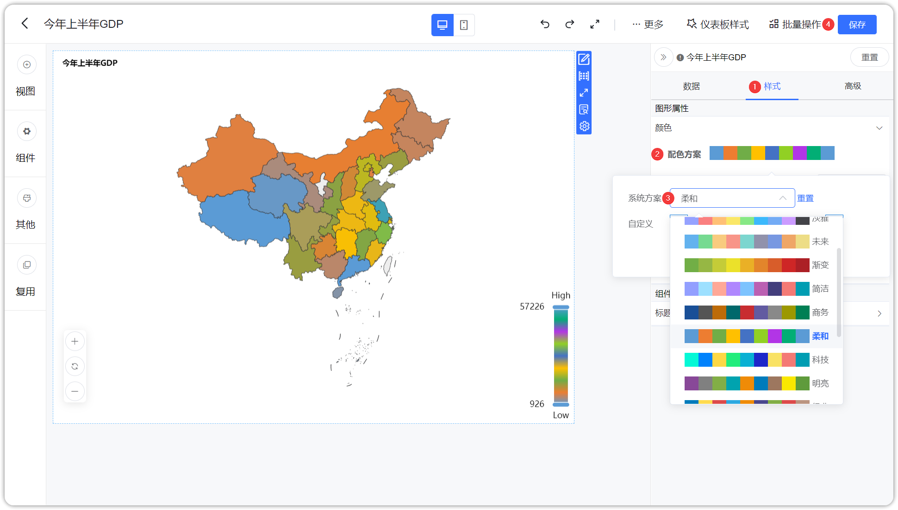
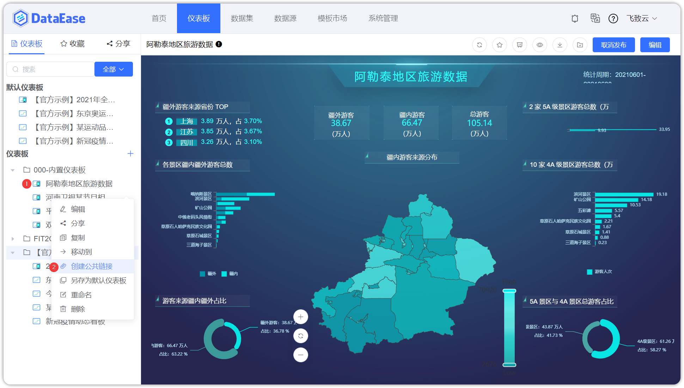
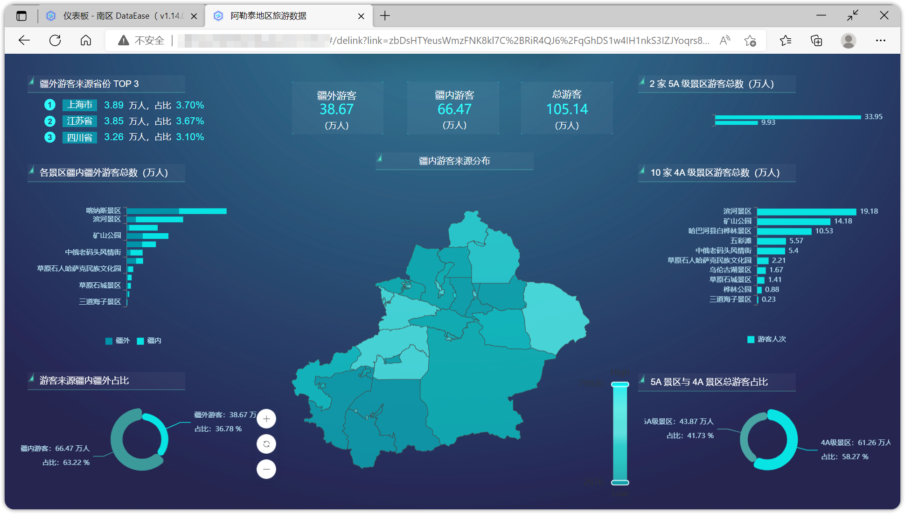

## 1 一键部署

!!! Abstract ""
    按照部署服务器要求准备好部署环境后，可通过 DataEase 快速安装脚本一键快速部署。  
    **注意：** 一键安装采用默认安装参数，更多有关离线部署、集群部署、Windows 部署等方式可查看本文档[安装模式](./installation/installation_mode.md)。  
    **部署服务器要求：**

    * 操作系统: CentOS 7.x
    * CPU/内存: 4核8G
    * 磁盘空间: 200G
    * **可访问互联网**

    执行以下脚本进行一键安装：
    ```
    curl -sSL https://github.com/dataease/dataease/releases/latest/download/quick_start.sh | sh
    ```
    DataEase 是一款 B/S 架构的产品，即浏览器/服务器结构，在服务器安装完成后，客户端通过浏览器访问以下地址，即可开始使用。
    ```
    http://目标服务器 IP 地址：服务运行端口
    使用默认用户名 admin 密码 dataease 进行登录。
    ```

## 2 界面介绍

!!! Abstract ""
    进入 DataEase 主界面后可以看到界面上方导航栏，有【首页】【仪表板】【数据集】【数据源】【模板市场】【应用】【系统管理】七大模块。

{ width="900px" }

!!! Abstract ""  
    【仪表板】模块界面主要分为目录区域与预览区域，业务人员可在此创建图表进行可视化分析。

    - 目录区域：添加目录/仪表板，对仪表板进行编辑、分享等；
    - 预览区域：预览、收藏、导出仪表板等。

    详细功能请参考本文档功能手册[仪表板](./user_manual/dashboard_description.md)。

{ width="900px" }

!!! Abstract ""  
    【数据集】模块，业务员可在此界面为数据分析或可视化分析进行相关的数据准备，具体可参考本文档功能手册[数据集](./user_manual/dataset_description.md)。

{ width="900px" }

!!! Abstract ""  
    【数据源】模块，此界面是用来管理各类数据连接信息，是后续数据分析操作中数据的来源，具体可参考本文档功能手册[数据源](./user_manual/datasource_description.md)。

{ width="900px" }

!!! Abstract ""
    【模板市场】模块，提供丰富的仪表板模板，业务员可按照场景需求，利用优质的仪表板模板轻松快速制作自己的仪表板，具体可参考本文档功能手册[模板市场](./user_manual/template_market.md)。

{ width="900px" }

!!! Abstract ""
    【应用】模块，应用既包含仪表板，也包含其用到的数据集与数据源的关联关系，使用应用可快速制作第三方系统仪表板，具体可参考本文档功能手册[应用](./user_manual/app_template_market.md)。

{ width="900px" }

!!! Abstract ""
    【系统管理】模块，该模块可对用户与租户、角色与权限、系统配置、定时任务等内容进行管理与配置，具体可参考本文档功能手册[系统管理](./user_manual/system_management/user.md)。

{ width="900px" }

## 3 三分钟快速上手

### 3.1 使用场景

!!! Abstract ""
    本章主要介绍如何使用 DataEase 快速制作一个数据看板，帮助大家快速掌握仪表板的制作与分享；  
    仪表板的制作步骤：创建数据源-->创建数据集-->制作仪表板。

###　3.2 创建数据源

!!! Abstract ""
    切换到数据源菜单，新建一个数据源链接，名称为 "GDP 分析"，类型选择 "MySQL"，主机名 "mysql"，数据库名 "dataease"，用户名 "root"，密码 "Password123@mysql" 检验通过后点击保存即可。

{ width="900px" }

### 3.3 创建数据集

!!! Abstract ""
    切换到数据集菜单，在【官方示例】分组下添加数据库数据集，选择上一步创建的数据源 "GDP 分析"，勾选数据表 "demo_gdp_by_city" 点击确认即可。 

{ width="900px" }

{ width="900px" }

### 3.4 可视化分析

!!! Abstract ""
    切换到仪表板菜单，在【官方示例】分组下创建仪表板【今年上半年 GDP】，在仪表板编辑界面添加视图，并选择上一步创建的数据集。

{ width="900px" }

{ width="900px" }

!!! Abstract ""
    在此步骤选择 Echarts 图库的地图视图，点击确认。

{ width="900px" }

!!! Abstract ""
    适当调整视图大小；    
    从图形区【地图范围】选择中华人民共和国，从右侧【维度】列表中用鼠标拖拽"province"项，拖动到图形区【维度】选择框；  
    同样，从右侧【指标】列表中拖动"gdp"到图形区【指标】选择框；  
    设置钻取目录，分别拖拽钻取字段"province""city"至图形区【钻取/维度】选择框，如下图所示，下钻目录与拖入的字段顺序有关，自上而下依次下钻。

{ width="900px" }

!!! Abstract ""
    下钻结果展示，如下图所示，展示江苏省地图，如果想返回上一级，点击下图中【全部】，返回全国地图。

{ width="900px" }

!!! Abstract ""
    调整地图配色，在样式 Tap 页，选择系统配色方案，系统自动根据各省份 GDP 值的大小在地图中着色，GDP 值较小的省份，颜色偏浅；GDP 值较大的省份，颜色偏深，最后点击保存。

{ width="900px" }

### 3.5 分享仪表板

!!! Abstract ""
    如下图所示，点击展开功能菜单，创建公共链接。

{ width="900px" }

!!! Abstract ""
    如下图所示，打开链接分享，并点击复制链接。

{ width="900px" }

!!! Abstract ""
    分享复制的链接，其他人可查看你创建的仪表板。

{ width="900px" }

## 4 新手引导

!!! Abstract ""

    - [教学视频](./instructional_video.md)
    - [常见问题](./faq/configuration_faq/configuration.md)
    - [模板市场](./user_manual/template_market.md)
