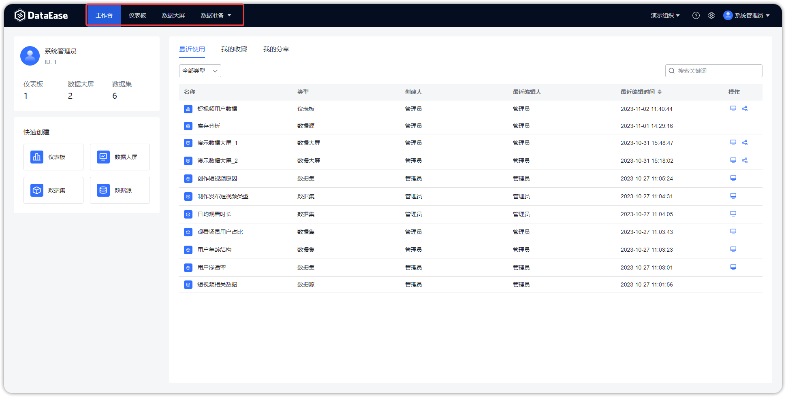

## 1 快速部署

!!! Abstract ""
    按照部署服务器要求准备好部署环境后，可通过 DataEase 安装脚本快速部署。   
    **部署服务器要求：**

    * 操作系统: CentOS/RHEL 7 及以上 64 位系统
    * CPU/内存: 4核8G
    * 磁盘空间: 200G
    * **可访问互联网**

    将上传至服务器的安装包解压好，在安装包目录里执行以下脚本进行快速安装：
    ```
    /bin/bash install.sh
    ```
    DataEase 服务器版是一款 B/S 架构的产品，即浏览器/服务器结构，在服务器安装完成后，客户端通过浏览器访问以下地址，即可开始使用。
    ```
    http://目标服务器 IP 地址：服务运行端口
    使用默认用户名 admin 密码 DataEase@123456 进行登录。
    ```

## 2 界面介绍

!!! Abstract ""
    进入 DataEase 主界面后可以看到界面上方导航栏，有【工作台】【仪表板】【数据大屏】【数据准备】四大模块。
{ width="900px" }
=== "工作台"
    !!! Abstract ""  
        【工作台】模块界面主要分为资源概览、快速创建、模板市场和近期动态四个区域。
        
        - 资源概览：可以查看用户在当前组织下的拥有权限的资源统计；
        - 快速创建：不用切换界面即可快捷创建仪表板、数据大屏、数据集或数据源；
        - 模板市场：作为广大社区用户期待已久的功能之一，模板市场当前版本暂未支持，后续会上线；
        - 近期动态：可以查看最近使用、我的收藏、我的分享的最新操作使用记录。
{ width="900px" }
=== "仪表板"
    !!! Abstract ""  
        【仪表板】模块界面主要分为目录区域与预览区域，业务人员可在此创建图表进行可视化分析，更倾向于快速创建及交互操作。

        - 目录区域：添加目录/仪表板，对仪表板进行编辑、分享等；
        - 预览区域：预览、收藏、导出仪表板等。

         详细功能请参考本文档功能手册[仪表板](./user_manual/dashboard_description.md)。
{ width="900px" }
=== "数据大屏"
    !!! Abstract ""  
        【数据大屏】模块界面主要分为目录区域与预览区域，业务人员可在此创建图表进行可视化分析，更倾向展示效果。

        - 目录区域：添加目录/数据大屏，对数据大屏进行编辑、分享等；
        - 预览区域：预览、收藏、导出数据大屏等。

         详细功能请参考本文档功能手册[数据大屏](./user_manual/panel_description.md)。
{ width="900px" }

=== "数据准备"
    !!! Abstract ""  
        【数据准备】模块分为数据源和数据集，进行相关的数据准备.

        - **数据源**：添此界面是用来管理各类数据连接信息，是后续数据分析操作中数据的来源。详细功能请参考本文档功能手册[数据源](./user_manual/datasource_description.md)。
        - **数据集**：为数据分析或可视化分析进行相关的数据准备。详细功能请参考本文档功能手册[数据集](./user_manual/dataset_description.md)。

         详细功能请参考本文档功能手册【数据准备】。

{ width="900px" }

{ width="900px" }
## 3 三分钟快速上手

!!! Abstract ""
    本章主要介绍如何使用 DataEase 快速制作一个数据看板，帮助大家快速掌握仪表板的制作与分享；  
    仪表板的制作步骤：创建数据源-->创建数据集-->制作仪表板。

###　3.1 创建数据源

!!! Abstract ""
    在数据准备模块，切换到数据源菜单，新建一个数据源链接，名称为 "GDP 分析"，类型选择 "MySQL"，主机名 "mysql"，数据库名 "dataease"，用户名 "root"，密码 "Password123@mysql" 检验通过后点击保存即可。

{ width="900px" }

### 3.2 创建数据集

!!! Abstract ""
    在数据准备模块，切换到数据集菜单，在【官方示例】分组下添加数据库数据集，选择上一步创建的数据源 "demo"，勾选数据表 "demo_gdp_by_city" 点击确认即可。 

{ width="900px" }

{ width="900px" }

{ width="900px" }

### 3.3 可视化分析

!!! Abstract ""
    切换到仪表板菜单，在【官方示例】分组下创建仪表板【2021 年全国GDP数据】。

{ width="900px" }

!!! Abstract ""
    在此步骤选择地图图表，点击确认。

{ width="900px" }


!!! Abstract ""
    适当调整图表大小；    
    在数据 Tap 页的【地区】选择中国，从右侧【维度】列表中用鼠标拖拽"province"项，拖动到图形区【维度】选择框；  
    同样，从右侧【指标】列表中拖动"gdp"到图形区【指标】选择框；  
    设置钻取目录，分别拖拽钻取字段"province""city"至图形区【钻取/维度】选择框，如下图所示，下钻目录与拖入的字段顺序有关，自上而下依次下钻。

{ width="900px" }


!!! Abstract ""
    下钻结果展示，如下图所示，展示福建省地图，如果想返回上一级，点击下图中【全部】，返回全国地图。

{ width="900px" }

!!! Abstract ""
    调整地图配色，在样式 Tap 页，在基础样式中选择系统配色方案，系统自动根据各省份 GDP 值的大小在地图中着色，GDP 值较小的省份，颜色偏浅；GDP 值较大的省份，颜色偏深，最后点击保存。

{ width="900px" }

### 3.4 快速分享

!!! Abstract ""
    如下图所示，点击展开功能菜单，创建公共链接。

{ width="900px" }

!!! Abstract ""
    如下图所示，打开链接分享，并点击复制链接。

{ width="900px" }


!!! Abstract ""
    分享复制的链接，其他人可查看你创建的仪表板。

{ width="900px" }


