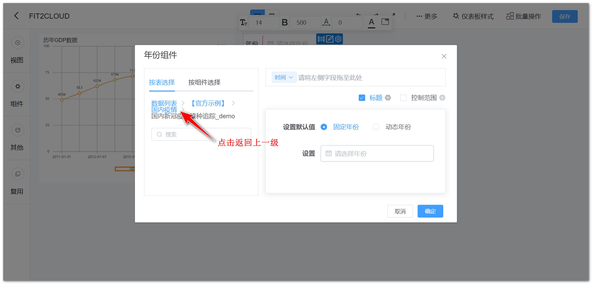
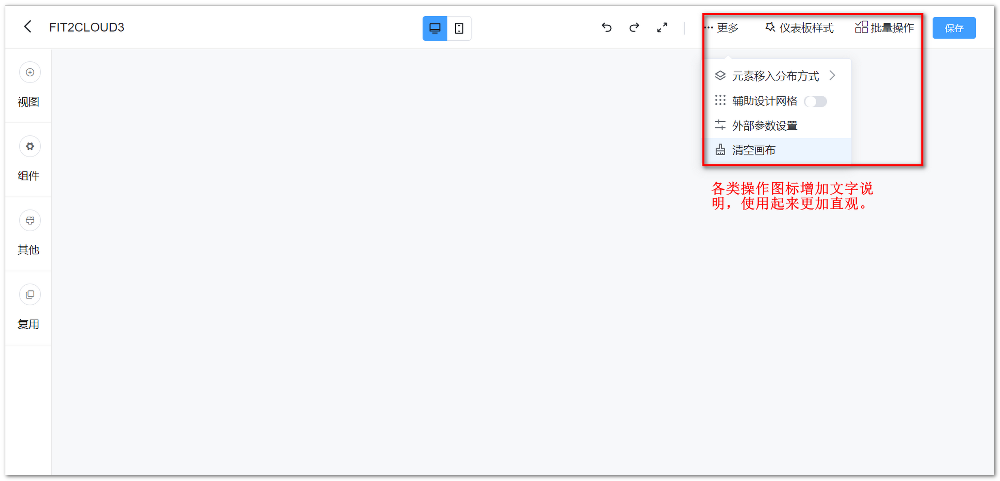
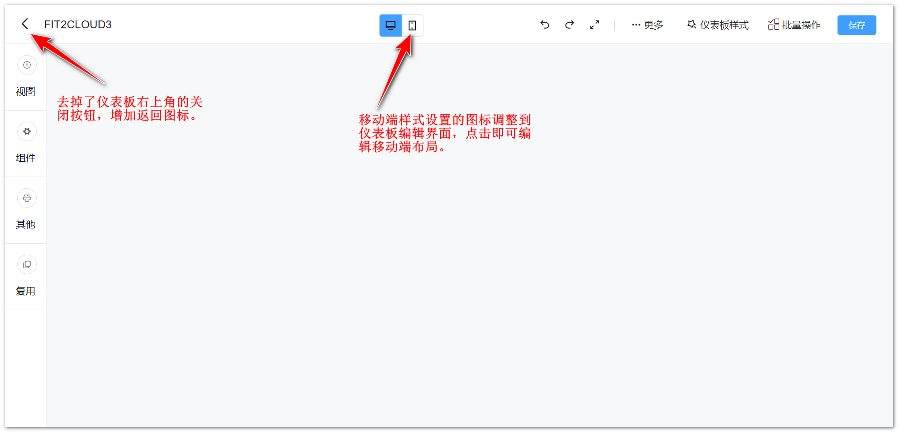
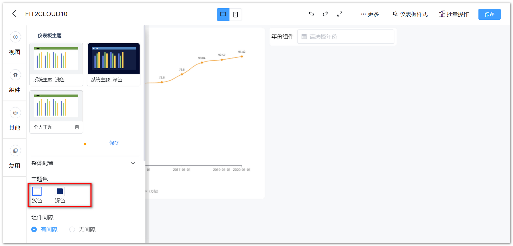
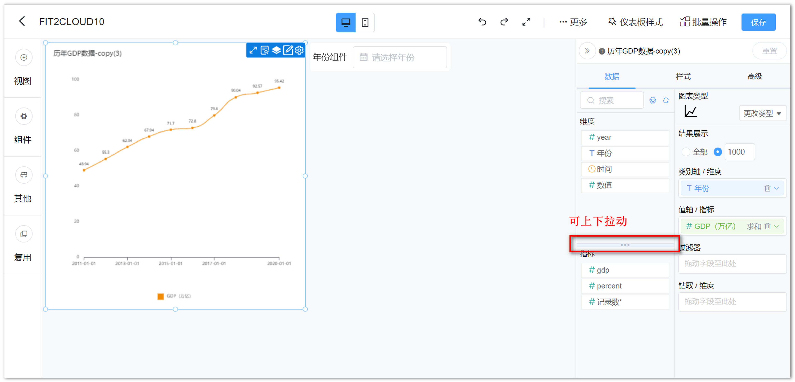
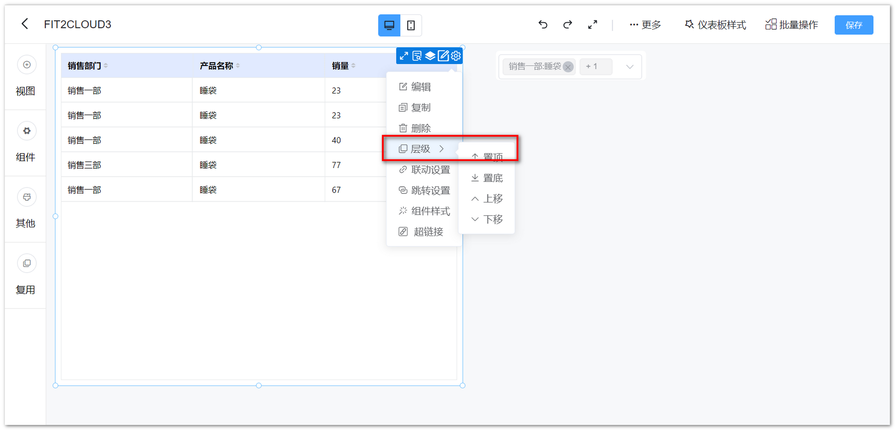
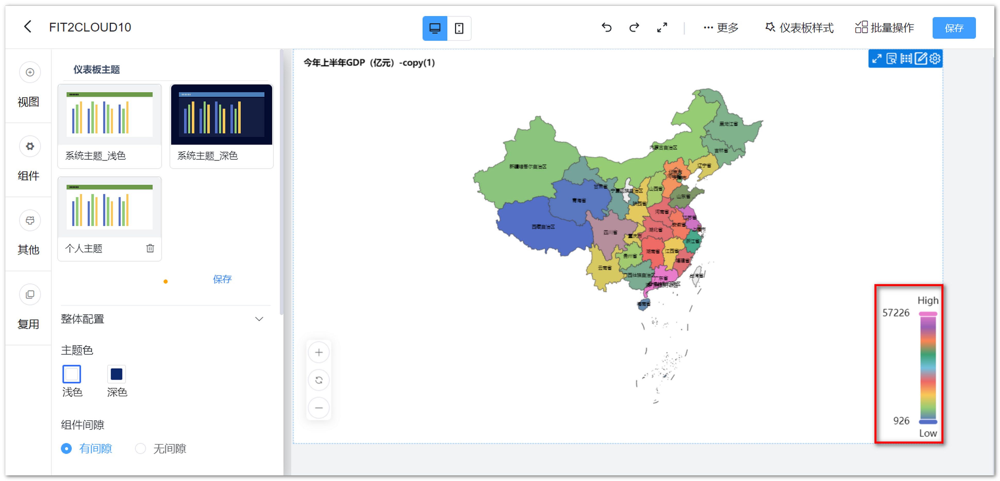
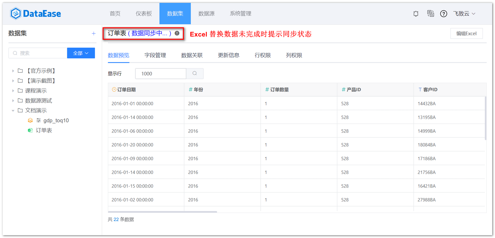
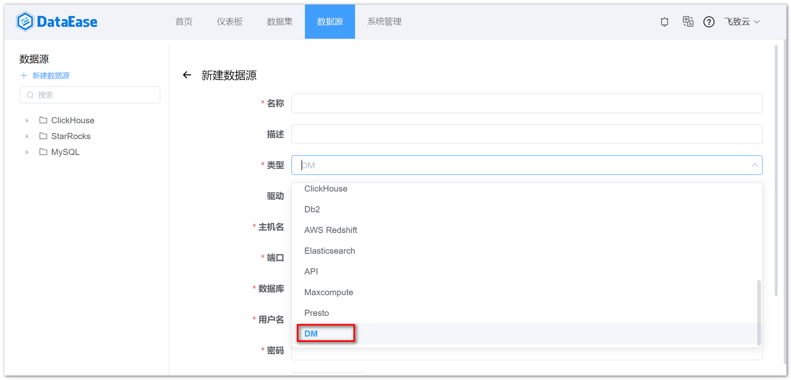
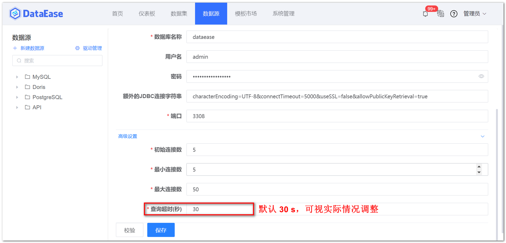

## 1 仪表板

### 1.1 过滤组件输入框支持边框、文字、背景色设置

!!! Abstract ""
    如下图所示，过滤组件输入框支持边框、文字、背景色设置，方便筛选框背景与仪表板背景进行搭配；  
    可在组件样式中设置或仪表板公共样式中设置，区别：组件操作中设置仅影响当前组件，仪表板公共样式中设置影响仪表板所有的过滤组件。

{ width="900px" }

{ width="900px" }

### 1.2 过滤组件选择数据集时支持逐级返回

!!! Abstract ""
    如下图所示，过滤组件选择数据集时支持逐级返回，向下分级时每一级都会显示出来，并且都可以点击返回。

{ width="900px" }

{ width="900px" }

### 1.3 优化仪表板切换时的数据请求策略

!!! Abstract ""
    当仪表板数据量过大时，加载页面出现延时长的情况，此时点击其他仪表板，将自动取消之前未完成的数据请求。

### 1.4 仪表板操作布局优化

!!! Abstract ""
    右上方的各类操作图标重新调整，同时增加文字说明；  
    仪表板样式调整将原需要二次弹出的内容规划到页面中平铺展示，操作步骤更简洁；  
    移动端样式设置的图标居中，同时去掉了仪表板关闭按钮，增加返回图标。

{ width="900px" }

{ width="900px" }

### 1.5 仪表板支持主题色切换

!!! Abstract ""
    支持浅色调与深色调主题。

{ width="900px" }

### 1.6 增加更多的仪表板样式属性

!!! Abstract ""
    除了可在批量操作中调整组件的公共样式，v1.12.0 版本仪表板的样式设置中，增加了更多的组件公共样式属性，同时去掉视图样式中基于视图\仪表板；  
    注意在仪表板样式中设置将影响整个仪表板已存在的组件。

{ width="900px" }

### 1.7 图片组件增加尺寸适应方式

!!! Abstract ""
    图片组件新增图片尺寸适应选项，解决图片在缩放过程中由于自动适配屏幕尺寸导致的变形，图片自动缩放可适配更多不同尺寸的屏幕。

{ width="900px" }

### 1.8 视图联动时，支持联动部分高亮显示

{ width="900px" }

### 1.9 优化下拉树组件模糊搜索

!!! Abstract ""
    优化下拉树组件在多选模式下模糊搜索后全选的展示结果。

{ width="900px" }

### 1.10 过滤组件禁止同数据集同时绑定多字段

!!! Abstract ""
    同数据集在一个过滤组件中同时绑定多个字段并不合理，此处限制同数据集只能选择一个字段。

{ width="900opx" }

### 1.11 支持调整维度/指标的窗口高度

{ width="900opx" }

### 1.12 组件层级设置优化

!!! Abstract ""
    组件在悬浮模式下，组件的置顶、置底、上移、下移归类到层级。

{ width="900px" }

### 1.13 过滤组件支持排序

!!! Abstract ""
    当有多个字段时，除第一个外其他字段排序设置为“不可用”状态。

{ width="900px"}

### 1.14 视图放大与明细分开

!!! Abstract ""
    仪表板预览模式下，视图放大效果支持导出图片，查看视图明细效果支持导出 Excel。

{ width="900px" }

### 1.15 支持组件背景颜色与边框同时设置

!!! Abstract ""
    支持组件背景颜色与边框同时设置，不支持背景图片与边框同时设置，因为边框在实现上其实也是一种图片。

{ width="900px" }

### 1.16 视图重置增加确认提示

!!! Abstract ""
    防止偶然误点的操作。

{ width="900px" }

## 2 视图

### 2.1 新增视图级别计算字段支持

!!! Abstract ""
    原计算字段为数据集级别计算字段，新增视图级别计算字段的支持，视图字段随视图，不影响数据集的计算字段；

    - 支持 AVG、SUM、COUNT、MIN、MAX 等聚合函数；
    - 新建的视图级别指标类字段，如果涉及到聚合函数，则不能单独出现该字段，必须是聚合函数和聚合函数的组合，比如：可以 sum(salary)/count(user) 不能 salary/sum(salary) ；
    - 创建的字段若使用了聚合函数，则只能是指标，不能转维度。

{ width="900px" }

### 2.2 视图提示增加背景选项支持

{ width="900px" }

### 2.3 地图组件 Low 和 High 颜色优化

!!! Abstract ""
    Low 和 High 颜色跟随主题变化，深色主题下为白色，浅色主题下为黑色。

{ width="900px" }
{ width="900px" }

### 2.4 AntV 仪表盘功能增强

!!! Abstract ""
    AntV 图库仪表盘支持设置最小刻度、刻度间隔数，标签支持数值格式设置。

{ width="900px" }

### 2.5 指标卡支持数值格式

!!! Abstract ""
    指标卡支持数值格式设置。

{ width="900px" }

### 2.6 轴值支持数值格式化设置

!!! Abstract ""
    轴值支持数值格式化设置，具有坐标轴的视图（柱状图、折线图），在图表样式的纵轴（横轴）设置中，增加数值格式化支持，横向图的配置项在横轴中。

{ width="900px" }

### 2.7 表格组件支持滚动

!!! Abstract ""
    在视图编辑的高级设置中，加入滚动设置，支持滚动行数和时间间隔设置；  
    目前支持滚动设置的图表：Echarts 图库的明细表、汇总表，AntV 图库的明细表、汇总表；    
    注意：透视表不支持，其中明细表只有在分页模式为下拉时才能生效；  
    其他说明：当开启滚动后，鼠标仍然可以操作图表的滚动，但无法改变当前自动滚动的位置，即：下一次自动滚动，仍然从上一次自动滚动后的位置开始，不会从鼠标滚轮滚动后的位置开始，比如：目前自动滚动到第三行，下一次应该滚动第四行，但在这之间，鼠标滚动了一下到第五行，下次自动滚动仍然为第四行。

{ width="900px" }

## 3 数据集

### 3.1 新建计算字段调整为展示字段名称

!!! Abstract ""
    旧版本的新建计算字段显示 ID，DataEase v1.12.0 版本支持展示字段名称。

{ width="900px" }

### 3.2 直连模式 SQL 数据集支持参数传递

!!! Abstract ""
    直连模式下 SQL 数据集支持设置查询参数，可自定义参数，减少进行筛选的数据量，提高查询的效率。

{ width="900px" }

{ width="900px" }

{ width="900px" }

{ width="900px" }

### 3.3 优化数据集数据预览页面的请求数据策略

!!! Abstract ""
    数据集从数据关联、更新信息、行权限、列权限 Tab 页切换至数据预览 Tab 页时，不再向后端发起数据请求；  
    从字段管理 Tab 页，切换至数据预览 Tab 页时，若字段管理中没有任何变更，则不向后端发起数据请求，否则重新请求数据；  
    更变的判定标准：在字段管理 Tab 页中，向后端发起任何修改请求，即判定为发生变更，包括：新建、编辑、删除计算字段，同步字段，对字段进行选中、字段名、类型、维度指标转换的操作。

{ width="900px" }

### 3.4 Excel 替换数据未完成时提示同步状态

{ width="900px" }

## 4 数据源

### 4.1 支持达梦数据库

!!! Abstract ""
    可将达梦的相关链接信息加入到 DataEase 中，在 DataEase 里对达梦数据库进行展示和分析。

{ width="900px" }

### 4.2 Oracle 数据源支持设置源编码和目标编码

!!! Abstract ""
    旧版本只支持源字符集设置，DataEase v1.12.0 版本支持目标字符集设置，可解决某些场景下会出现中文乱码的情况。

{ width="900px" }

### 4.3 支持查询超时参数设置

!!! Abstract ""
    创建数据源时支持查询超时参数设置，DataEase v1.12.0 之前版本数据源及新增数据源默认超时时间为 30s，若有查询超时情况可通过此项参数调整。

{ width="900" }

