## 1 仪表板

### 1.1 新增查询按钮组件

!!! Abstract ""
    使用场景：当数据表维度比较多，同时使用了多个筛选条件；  
    创建查询按钮，可以绑定一个或者多个筛选组件，绑定按钮后的筛选组件不会自动触发查询请求，需要点击查询按钮才会触发查询请求。  
    **注意：** 一个仪表板只能放置一个查询按钮，拖拉过一个之后置为灰，为不可选择状态。

{ width="900opx" }

### 1.2 仪表板跳转外部链接时支持添加参数

!!! Abstract ""
    组件跳转外部目标 URL 时支持设置参数，参数限制为视图数据中的字段；  
    **注意：** AntV 图库，若为折线图、柱状图等图形，不能出现叠加维度的情况。

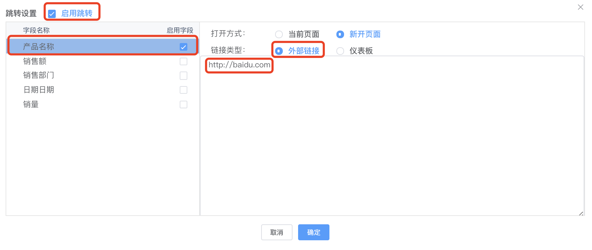{ width="900px" }

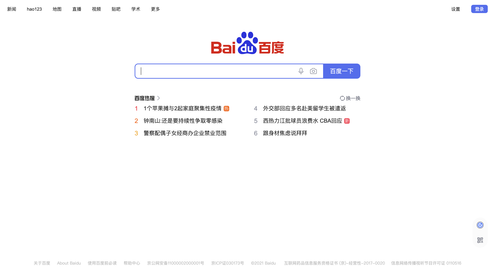{ width="900px" }

### 1.3 支持世界地图

!!! Abstract ""
    支持展示世界地图，【中华人民共和国】为之前默认的地图，同时自定义地图文件可在【系统参数】的【地图设置】中添加。

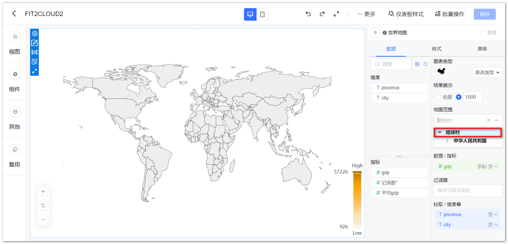{ width="900px" }

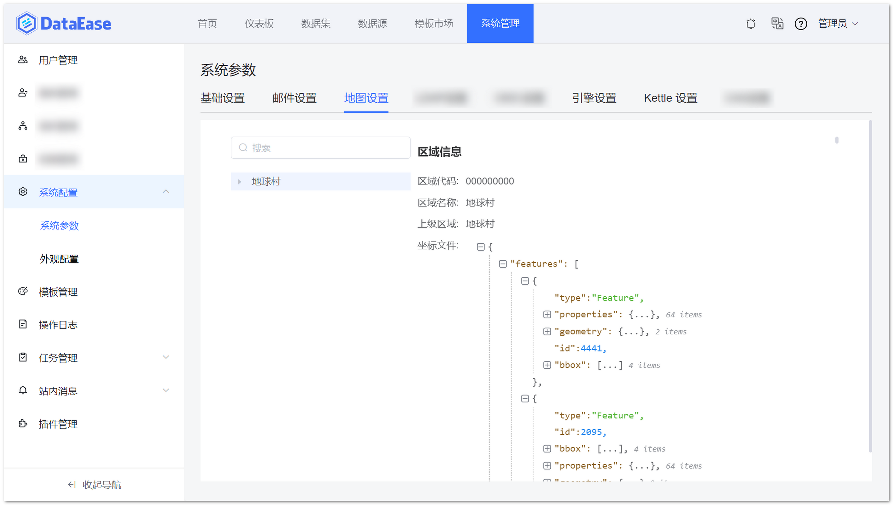{ width="900" }

### 1.4 仪表板的复用支持复用所有的组件

!!! Abstract ""
    复用功能旧版本只能复用视图，v1.13.0 版本的复用功能支持选择仪表板中的各类组件。

{ width="900" }

### 1.5 仪表板背景图支持直接重新上传

!!! Abstract ""
    仪表板背景图增加“重新上传”按钮，可无需删除原图直接上传新图，减少了需先删除原图的操作，同时布局优化，纵向排列—>横向排列。

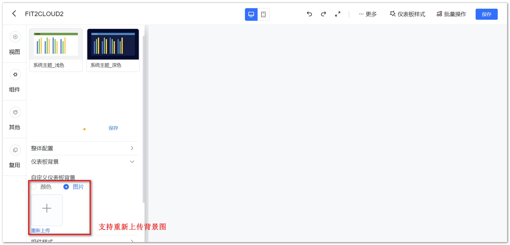{ width="900px" }

### 1.6 视图编辑按钮位置调整

!!! Abstract ""
    视图编辑按钮由组件内侧调整到组件外侧，横向调整为纵向，当视图过小时，操作按钮在外侧可不遮挡视图区域，同时左右位置自适应，会根据视图位置变化，例如：当视图靠近仪表板右侧边缘时，操作按钮自动变为左边显示。

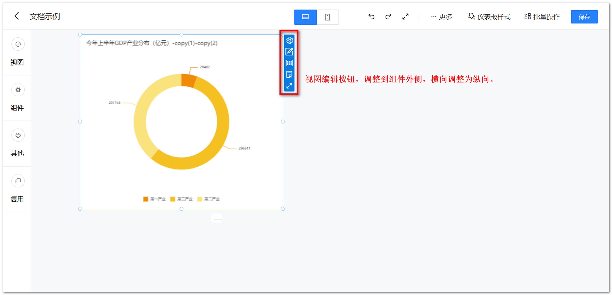{ width="900px" }

### 1.7 仪表板预览界面增加仪表板信息弹出提示

{ width="900px" }

### 1.8 日期过滤组件增加时分秒级别支持

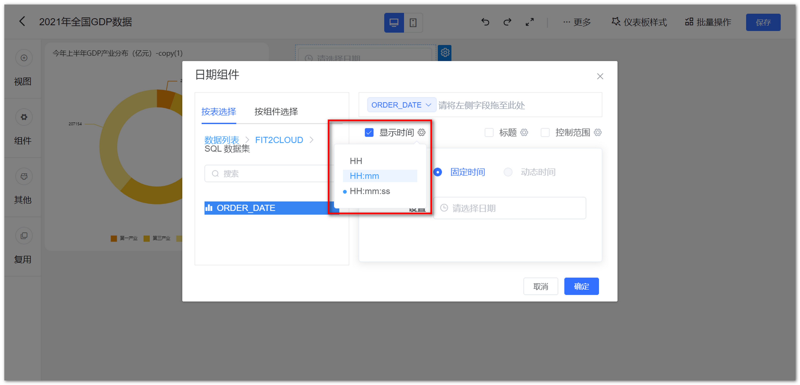{ width="900px" }

{ width="900px" }

## 2 视图

### 2.1 AntV 视图标题支持备注

!!! Abstract ""
    AntV 图库均支持标题备注，可编辑备注信息并进行查看。

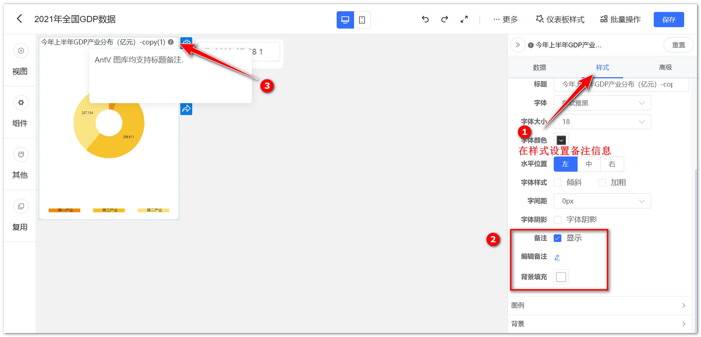{ width="900px" }

### 2.2 AntV 图库视图支持数值格式化

!!! Abstract ""
    AntV 图库图表支持数值格式化（注意除文本卡和符号地图外）。

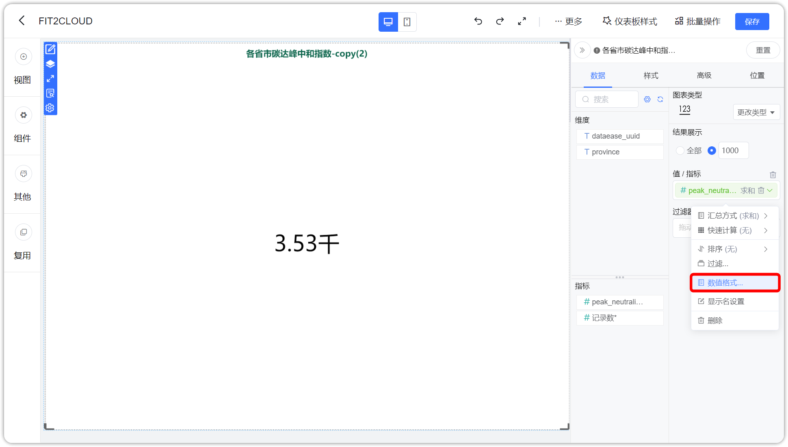{ width="900px" }

### 2.3 AntV 表格支持阈值设置

!!! Abstract ""
    汇总表、明细表、透视表均支持阈值、可配置文字颜色和背景颜色。

{ width="900px" }

{ width="900px" }

### 2.4 AntV 图库支持字体、间距、阴影设置

!!! Abstract ""
    AntV 图库，所有视图标题支持字体、阴影、间距设置；  
    AntV 指标卡、AntV 文本卡，除了标题以外，在样式->大小选项中，对值和名称也支持字体、阴影、间距、粗细设置。

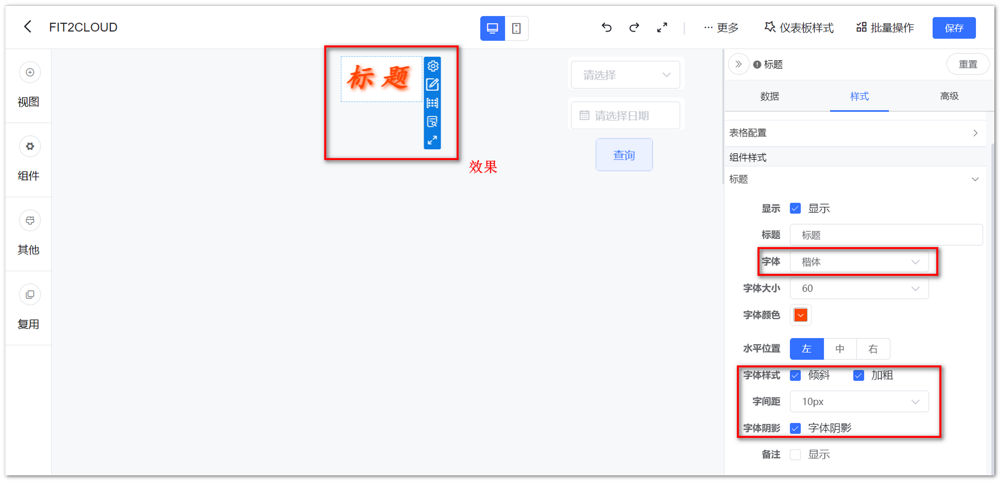{ width="900px" }

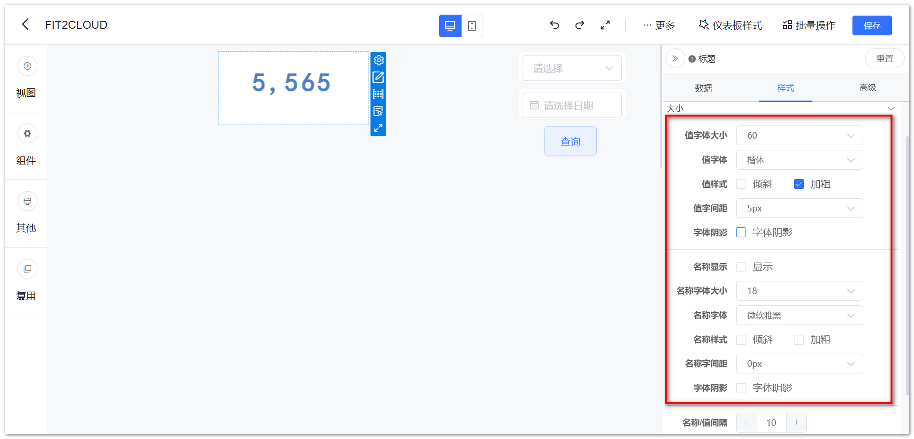{ width="900px" }

### 2.5 字段下钻后支持排序

!!! Abstract ""
    下钻后延续第一层排序规则（仅对升降序有效）。

{ width="900px" }

### 2.6 小数精度位数提升至 8 位

!!! Abstract ""
    可以显示最多八位小数。

{ width="900px" }

### 2.7 ECharts 地图支持标签效果设置

!!! Abstract ""
    可以对 ECharts 地图的标签及提示进行效果设置，如背景色、标签阴影等。

{ width="900px" }

## 3 数据源

### 3.1 基于 mongo-bi-connector 新增对 MongoBD 数据源的支持

!!! Abstract ""
    v1.13.0 版本里用 Mongo-bi-connector 做了一个 MongoDB 的数据源，同时保留了旧版本的 MongoDB 数据源。  
    **注意：** mongo-bi-connector 的使用需要搭建使用环境。

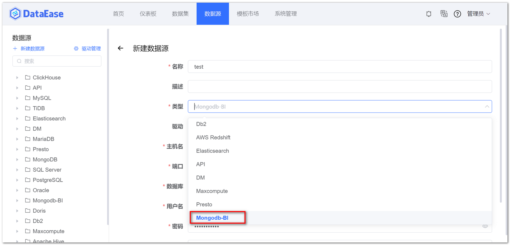{ width="900px" }

### 3.2 API 数据源支持选择及组合多层级中的字段

!!! Abstract ""
    无需自行写 JsonPath，调整为系统解析，使用时直接勾选即可，且可以组合不同层级的字段。

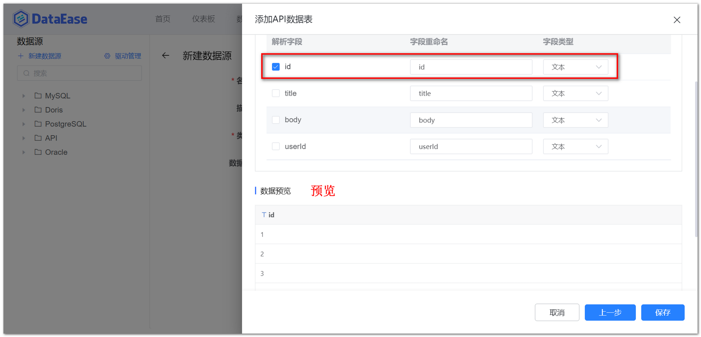{ width="900" }

## 4 系统管理

### 4.1 用户管理交互优化

!!! Abstract ""
    UI 及交互优化，添加用户界面优化。

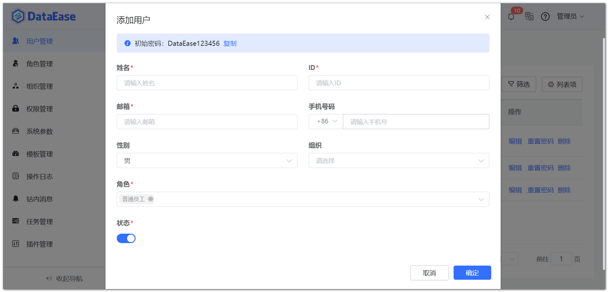{ width="900px" }

!!! Abstract ""
    重置密码只能重置为初始密码。

{ width="900px" }

### 4.2 组织管理交互优化（XPack）

!!! Abstract ""
    增加对组织成员的查看和管理操作的功能。

{ width="900px" }

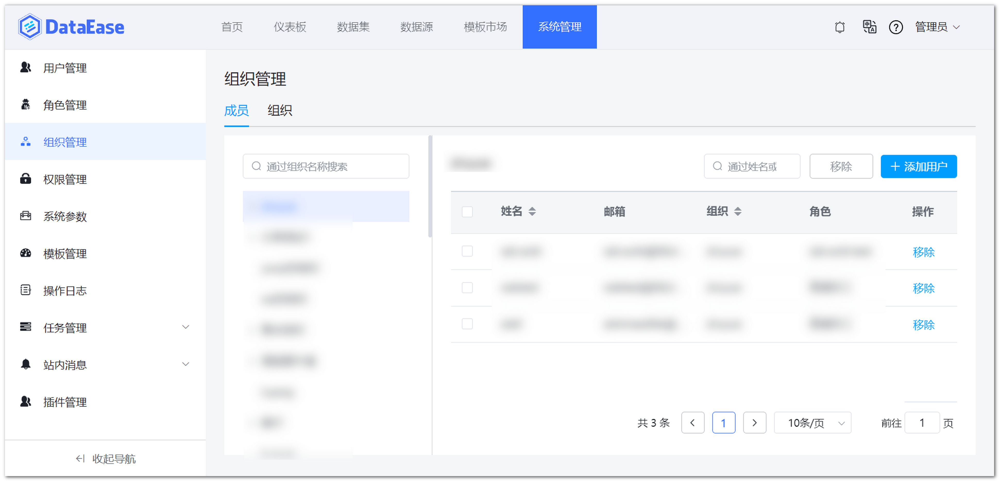{ width="900px" }

### 4.3 角色管理交互优化（XPack）

!!! Abstract ""
    可以在角色管理处进一步管理角色所关联的成员（查看列表、添加、移除）。

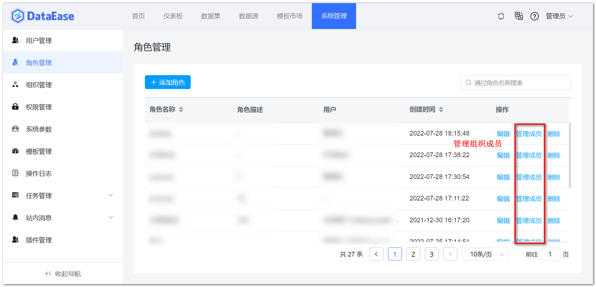{ width="900px" }

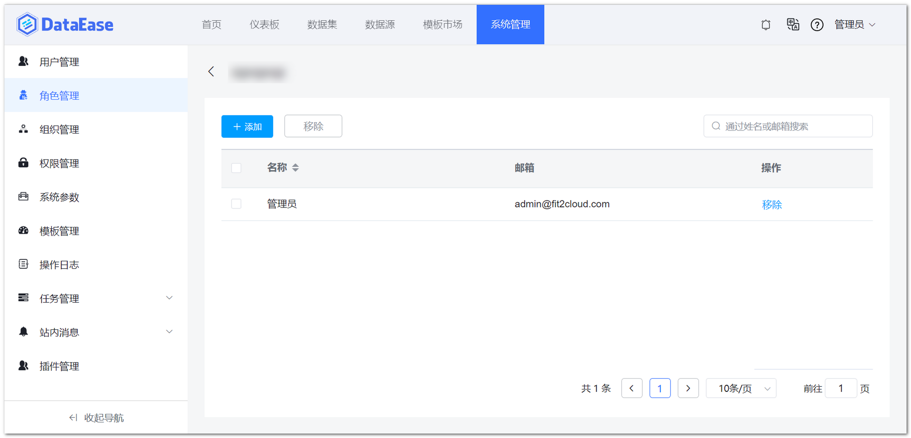{ width="900px" }

### 4.4 优化用户管理增加手机号前缀字段

{ width="900px" }

### 4.5 新增用户时自动过滤账号开头结尾空字符串

!!! Abstract ""
    用户 ID 自动删除头尾空字符串进行保存。

### 4.6 定时报告支持发送选定视图的数据（XPack）

{ width="900px" }

### 4.7 支持查看用户最终权限（XPack）

!!! Abstract ""
    灰色勾选表示当前用户的权限来自其所属组织或角色，蓝色表示权限为当前用户直接被授权；  
    鼠标移动到灰色状态勾选框上，会展示权限来自的组织和角色信息，弹框中也可独自为该用户进行授权。

{ width="900px" }

### 4.8 重构行权限交互及支持配置与或关系（XPack）

!!! Abstract ""
    多条行权限可支持配置与或关系。

{ width="900px" }

!!! Abstract ""
    支持配置多级别与或关系。

{ width="900px" }

### 4.9 重构列权限交互（XPack）

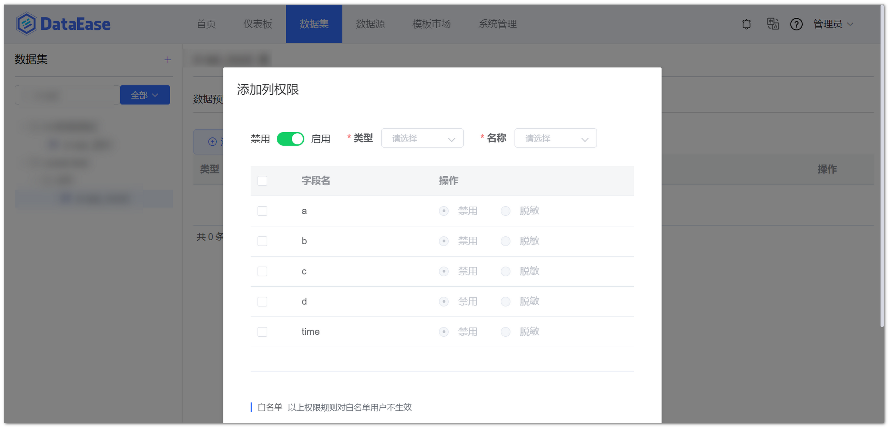{ width="900px" }

### 4.10 行列权限支持白名单设置（XPack）

!!! Abstract ""
    支持设置行列权限的白名单，白名单中的人员不受该规则限制，白名单可添加多人。

{ width="900px" }

{ width="900px" }

## 5 其他

### 5.1 模板市场内嵌

!!! Abstract ""
    新增【模板市场模块】，鼠标悬浮到某一个模板示例图上时，浮现菜单：预览、应用。

{ width="900px" }

{ width="900px" }

{ width="900px" }

!!! Abstract ""
    点击应用模板出现弹框，模板名为默认命名，可自行修改，选择一个仪表板分组后点击确定，成功后即跳转到该仪表板编辑界面下。

{ width="900px" }