## 1 仪表板

### 1.1 日期范围过滤组件增加快捷选项支持

!!! Abstract ""
    日期范围组件新增常用时间范围的快捷选项，比如本周、上周、当月等，可以方便用户查询。

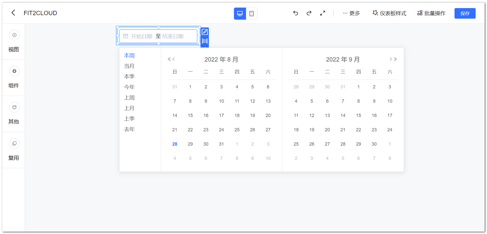{ width="900opx" }

### 1.2 组件样式边框支持自定义颜色

!!! Abstract ""
    系统内置边框图片文件为 SVG 图片，系统新增边框色设置支持，可替换 SVG 图片的颜色。

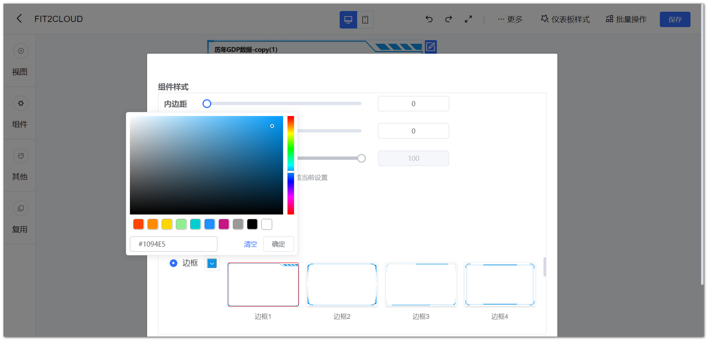{ width="900" }

### 1.3 仪表板编辑时定时缓存未完成的仪表板，若异常退出重新进入可选择是否打开未保存的仪表板

!!! Abstract ""
    - 仪表板每 5 秒检查一次是否有仪表板变动，有变动的话保存一次缓存； 
    - 如果存在异常退出的情况，则再次进入可以选择恢复缓存。  

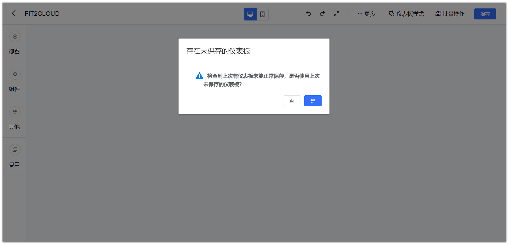{ width="900opx" }

### 1.4 新增清空按钮，可清除查询按钮绑定的过滤条件

!!! Abstract ""
    一个仪表板中只可添加一个【清空】按钮，点击【清空】按钮，清空绑定了查询按钮的过滤组件的选择值，如果没有【查询】按钮，则【清空】按钮不可选。

{ width="900opx" }

!!! Abstract ""
    添加完查询按钮后，可添加清空按钮。

{ width="900opx" }

### 1.5 透视表跳转设置只保留指标字段

!!! Abstract ""
    透视图的跳转因为只能点击指标获得指标的信息，所以在跳转设置的时候只有指标这个属性。

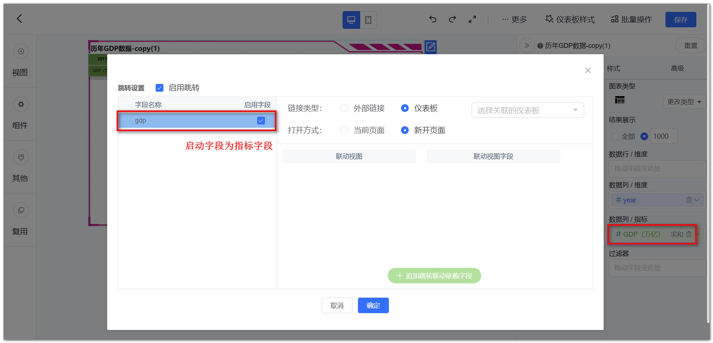{ width="900opx" }

### 1.6 清除联动按钮始终保持在右上方

!!! Abstract ""
    【清除所有联动】按钮保持在右上方，不随页面滚动变换位置。

{ width="900opx" }

### 1.7 视图编辑按钮区对没有点击事件的视图去掉跳转设置和联动设置选项

!!! Abstract ""
    文本卡、指标卡、仪表盘、水波图、词云图、富文本视图本身无跳转事件，设置后，也无法正常使用，因此该功能菜单中将跳转设置与联动设置去掉。

{ width="900opx" }

### 1.8 导出视图明细 Excel ，数值类型按照原格式导出

!!! Abstract ""
    v1.14.0 版本优化了导出 Excel 数值类型按照原格式导出。

### 1.9 跳转设置样式调整默认追加一个字段选择

!!! Abstract ""
    当跳转目标为仪表板时，自动追加一个字段选择，默认为空。  
    **注意：** 如果当前没有选择跳转的仪表板，则为空，且追加按钮为不可用状态。

{ width="900opx" }

### 1.10 日期范围组件允许选择同一天

{ width="900opx" }

{ width="900opx" }

### 1.11 优化日期范围组件时分秒精度设置

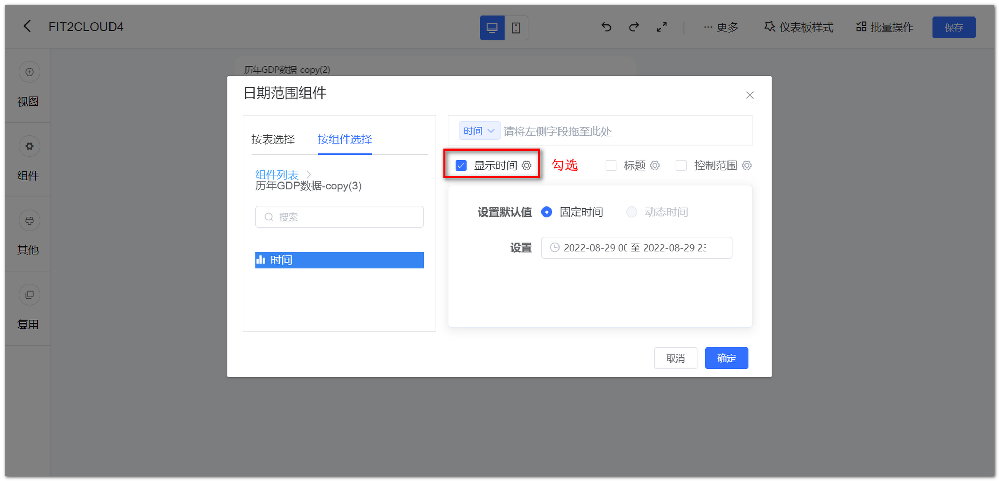{ width="900opx" }

{ width="900opx" }

### 1.12 视图放大效果优化

!!! Abstract ""
    深色主题下，视图放大后，视图背景与原视图背景一致，右下角的 Low，high 等颜色也与原视图一致。

{ width="900opx" }

## 2 视图

### 2.1 新增分组柱状图

!!! Abstract ""
    AntV 图库支持分组柱状图，支持基础柱状图的所有特性，如钻取、辅助线、缩略轴、格式化等。

{ width="900opx" }

!!! Abstract ""
    使用分组柱状图，子类别框为必填项。

{ width="900opx" }

### 2.2 新增基础面积图

!!! Abstract ""
    AntV 图库支持基础面积图，支持基础折线图的所有特性，如钻取、辅助线、缩略轴、格式化等。

{ width="900opx" }

{ width="900opx" }

### 2.3 新增富文本视图

!!! Abstract ""
    类似组件里的富文本组件，双击富文本视图，可定义样式。  
    **注意：** 富文本组件视图编辑区的样式栏没有任何选项。

{ width="900opx" }

!!! Abstract ""
    支持在编辑区引用维度与指标中字段。  
    **注意：** 富文本只选取第一条结果。

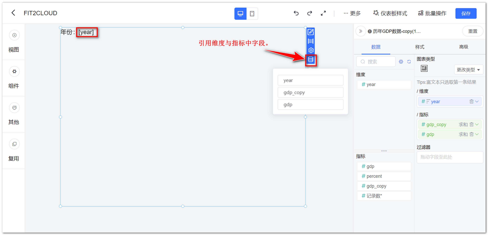{ width="900opx" }

!!! Abstract ""
    退出编辑后，文本内容自动动态替换为字段的一个结果值。

{ width="900opx" }

### 2.4 支持地图边线颜色配置

{ width="900opx" }

### 2.5 AntV 图库仪表盘支持用视图指标来动态设置最大值和最小值

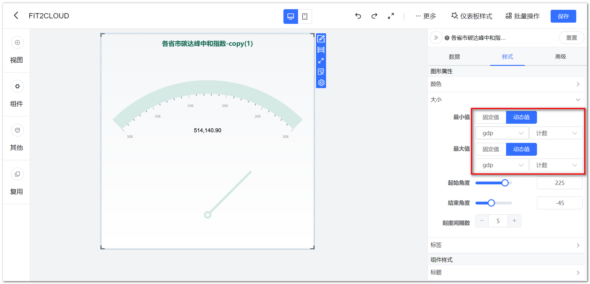{ width="900opx" }

## 3 数据集

### 3.1 支持数据集字段复制

!!! Abstract ""
    支持直接在下图所示位置增加【复制】操作，复制后的字段相当于新建一个计算字段，复制后的字段，字段名：原字段名_copy。  
    **注意：** 仅数据集字段管理里的字段才支持复制。

{ width="900opx" }

### 3.2 数据集字段管理支持全选/全不选

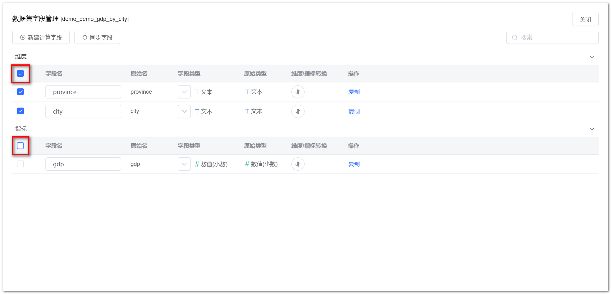{ width="900opx" }

### 3.3 SQL 数据集参数化支持子查询

{ width="900px" }

### 3.4 对 SQL 进行加密传输

!!! Abstract ""
    对 SQL 数据集在查询时的 SQL 进行了 Base64 加密处理。

{ width="900px" }

## 4 数据源

### 4.1 支持复制 API 数据表

!!! Abstract ""
    API 数据表较多的情况下，通过复制后稍微修改即可完成，不必逐个录入，复制后放在原数据表的下侧，表名为：原表名_copy。

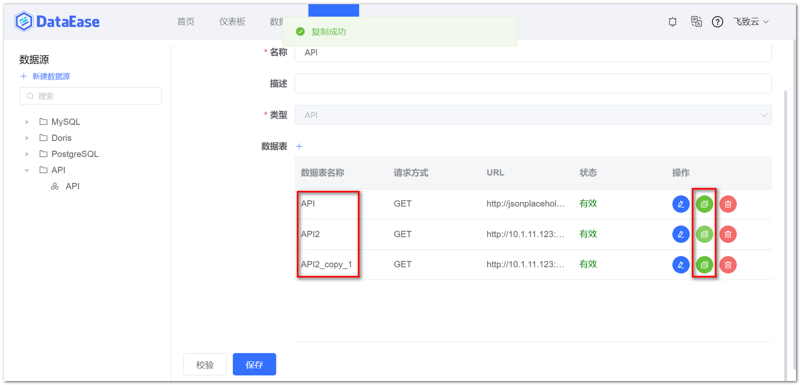{ width="900opx" }

## 5 系统管理

### 5.1 新增日志记录类型，如用户登录、查看仪表板、导出视图数据等。

!!! Abstract ""
    增加用户登录信息（主要包括时间），查看了哪些仪表板；  
    增加操作类型【视图数据导出】，记录视图数据的导出记录（不包含定时任务）；  
    可通过高级搜索，查看系统中用户登录的信息及仪表板被查看的信息。  
    记录规则如下：

    - 定时报告发送，不计查看次数；
    - 视图复用，不计查看次数；
    - 仪表板导出，不计查看次数；
    - 移动端查看，需要记录次数，区分 PC 端和移动端；
    - 编辑仪表板，不计查看次数。

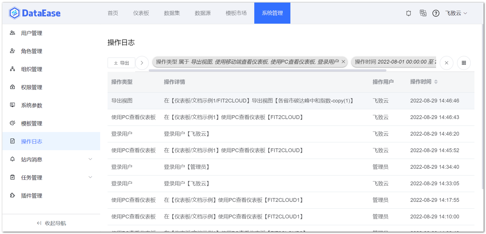{ width="900opx" }

### 5.2 增加 API Keys 管理界面的安全提示

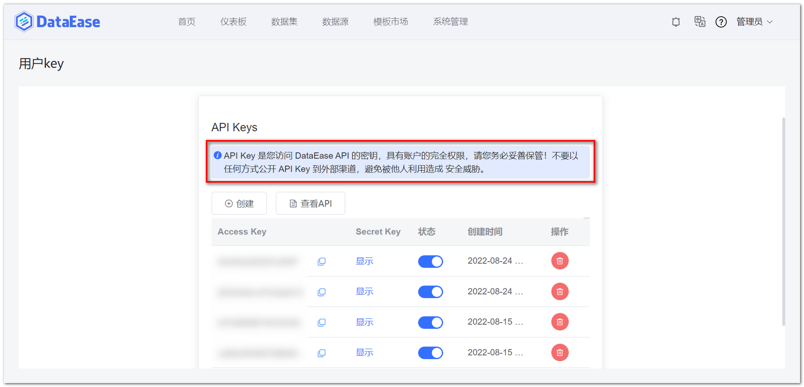{ width="900opx" }

### 5.3 增加主题设置 API 文档

{ width="900opx" }

### 5.4 插件管理交互优化

!!! Abstract ""
    插件管理交互优化，新增更新插件选项；  
    **注意：** 已在使用的插件不支持更新操作。

{ width="900opx" }

### 5.5 站内消息交互优化

!!! Abstract ""
    样式调整，支持批量删除。

{ width="900opx" }

### 5.6 数据同步交互优化

!!! Abstract ""
    样式调整，支持批量删除。

{ width="900opx" }

### 5.7 系统参数页面调整

!!! Abstract ""
    系统参数调整为【系统配置】，下方设置二级目录：系统参数、外观配置，整体页面风格有较大调整。

{ width="900opx" }

{ width="900opx" }

## 6 XPack

### 6.1 增加登录页脚设置

!!! Abstract ""
    在【显示设置】添加登录页页脚设置的支持，可配置启用/禁用，下方提供一个富文本编辑器，用户要显示的内容，可在富文本编辑器里编写，限制在页脚与登录页底部的间距。

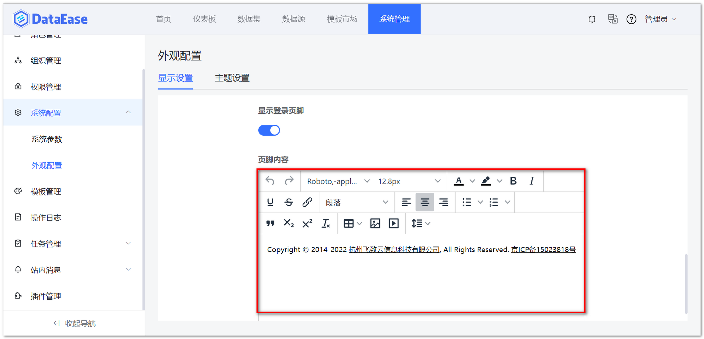{ width="900opx" }

{ width="900opx" }

### 6.2 支持批量导入用户

!!! Abstract ""
    提供 Excel 模版，按照模版格式上传；  
    上传 Excel 后，系统后台自动进行数据校验。

    - 如果文件中所有的数据都合规，那么直接上传成功并返回用户列表；
    - 如果 Excel 文件中存在不合规的数据，那么只提交合规数据，不合规数据，可在当前弹框中下载下来，下载的文件在【状态】列右侧增加【原因】；
    - 可上传的文件大小，10M 以内。

{ width="900opx" }

{ width="900opx" }

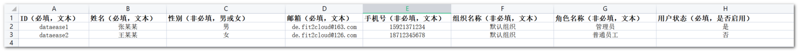{ width="900opx" }

### 6.3 支持设置系统图标 Favicon

{ width="900opx" }

### 6.4 主题设置页面调整

!!! Abstract ""
    主题设置分为系统主题与自定义主题，其中系统主题不可编辑。

{ width="900opx" }

{ width="900opx" }

### 6.5 定时报告交互优化

!!! Abstract ""
    样式调整，支持批量删除定时报告任务。

{ width="900opx" }

## 7 其他

### 7.1 替换新首页

{ width="900px" }