## 1 仪表板

### 1.1 复用视图支持适配当前仪表板样式

!!! Abstract ""
    制作仪表板时，若遇到复制其他仪表板中视图的情况，复制过来的视图将按照当前仪表板的主题进行样式调整；  
    如下图框选的视图从其他完全不一样样式的仪表板新复制到该仪表板中的视图，自动适配了当前仪表板下的样式。

{ width="900px" }

### 1.2 仪表板详情弹框显示用户别名

!!! Abstract ""
    仪表板详情弹框里，创建人显示的是用户名称，而不是 ID，增强了可阅读性。

{ width="900px" }

## 2 视图

### 2.1 支持 ECharts 视图外边距设置

!!! Abstract ""
    “自动”即由系统给的默认值，自动适配，另外支持了手动设置。

{ width="900px" }

!!! Abstract ""
    可配置实际距离或相对的百分比。

{ width="900px" }

{ width="900px" }

### 2.2 缩略轴增加样式配置

!!! Abstract ""
    缩略轴新增背景、选中背景、字体颜色三个样式配置项。

{ width="900px" }

### 2.3 堆叠项支持自定义排序

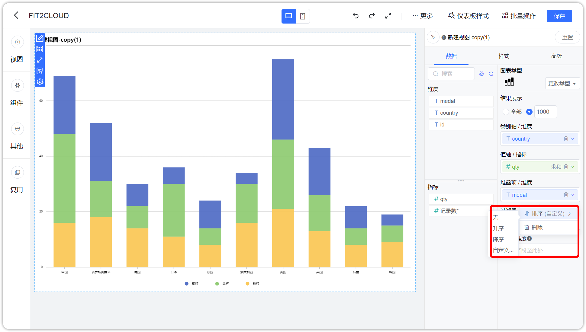{ width="900px" }

### 2.4 辅助线支持动态值

!!! Abstract ""
    AntV 和 ECharts 图库中支持辅助线的图形均支持。

{ width="900px" }

{ width="900px" }

### 2.5 支持表头表格字体颜色分开设置

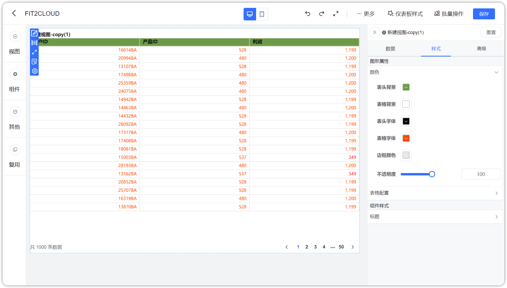{ width="900px" }

### 2.6 AntV 透视表合计小计支持多种聚合方式

{ width="900px" }

### 2.7 阈值默认背景色调整

!!! Abstract ""
    默认调整为透明色。

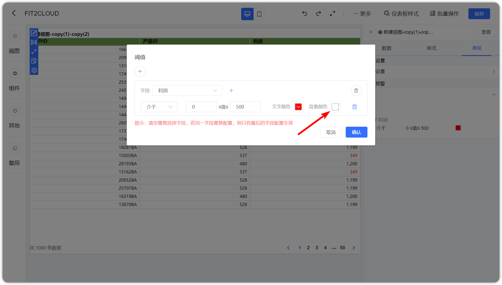{ width="900px" }

### 2.8 阈值设置支持介于选项

!!! Abstract ""
    阈值支持“介于”选项，简化该场景下阈值条件的设置。

{ width="900px" }

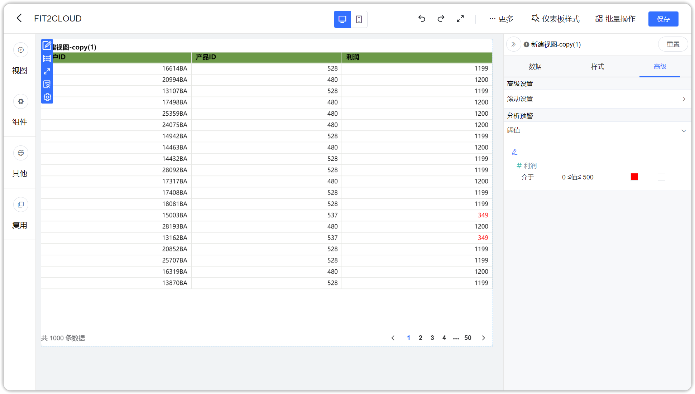{ width="900px" }

### 2.9 下钻区域文字跟随视图背景改变

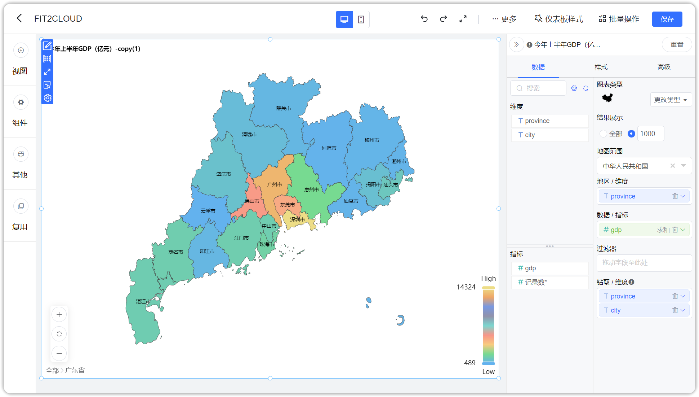{ width="900px" }

{ width="900px" }

## 3 数据集

### 3.1 SQL 数据集支持数据参考功能

!!! Abstract ""
    SQL 数据集支持“数据参考”功能，选择数据源后，点击【数据参考】，在右侧弹框中可查看当前数据源下的数据表的数量以及数据表列表，选择具体数据表，可以查看该表下的数据字段，方便编写 SQL 语句。

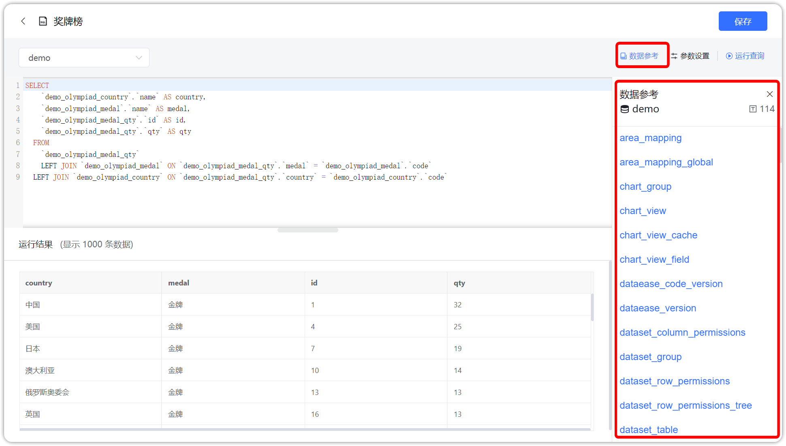{ width="900px" }

{ width="900px" }

### 3.2 SQL 数据集变量支持时间类型

!!! Abstract ""
    与之前的数值及文本类型变量用法类似，新增时间类型变量的支持。

{ width="900px" }

{ width="900px" }

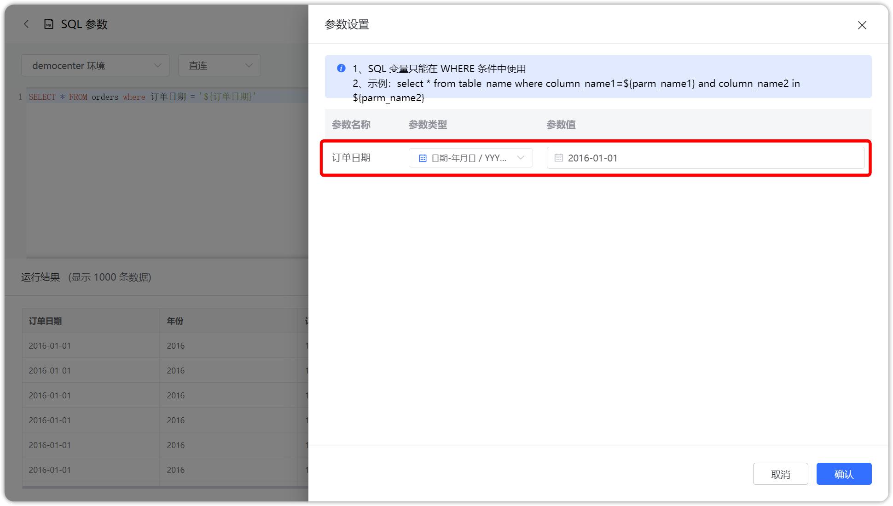{ width="900px" }

### 3.3 Excel 数据集支持 CSV 文件

!!! Abstract ""
    Excel 数据集支持上传 CSV 格式文件。

{ width="900px" }

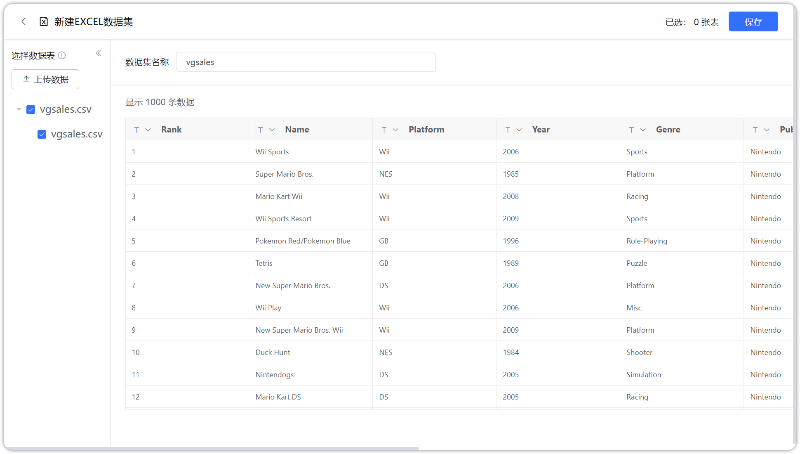{ width="900px" }

### 3.4 数据集交互优化

!!! Abstract ""
    旧版本如下：

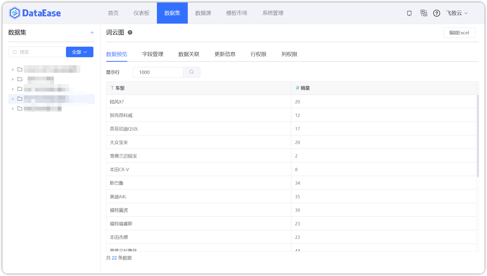{ width="900px" }

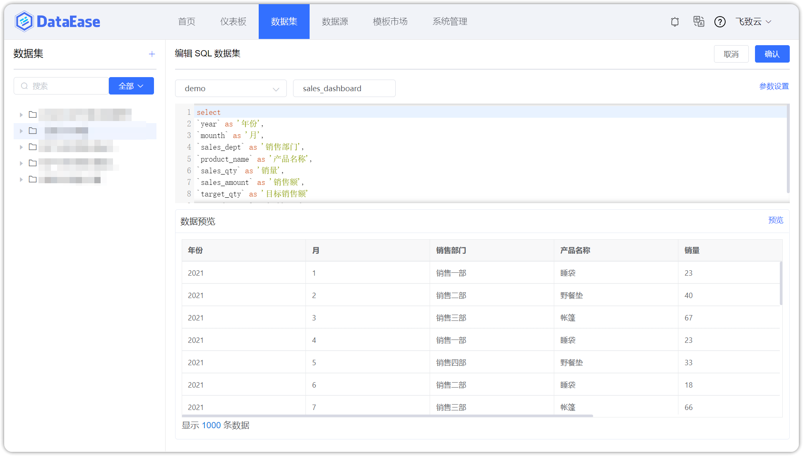{ width="900px" }

!!! Abstract ""
    新版本如下：

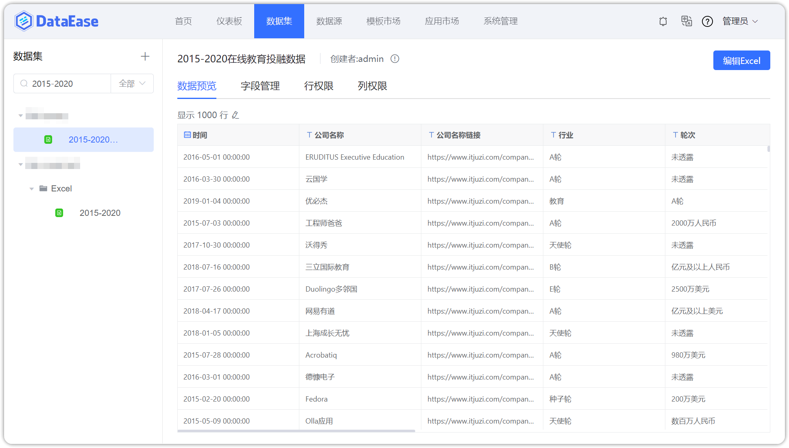{ width="900px" }

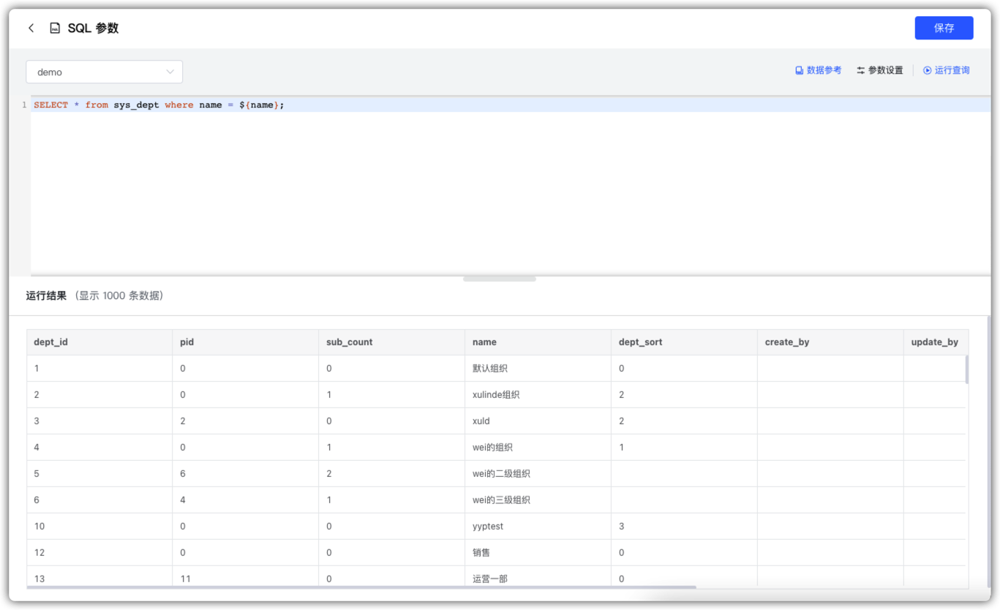{ width="900px" }

## 4 数据源

### 4.1 数据源交互优化

!!! Abstract ""
    旧版本如下：
{ width="900px" }

{ width="900px" }

!!! Abstract ""
    新版本如下：

{ width="900px" }

{ width="900px" }

{ width="900px" }

## 5 系统管理

### 5.1 支持设置数据源有效性检测的间隔时间

!!! Abstract ""
    默认检测间隔时间是 30 分钟。

{ width="900px" }

### 5.2 支持防暴力登录设置以及解锁用户

!!! Abstract ""
    “限制登录失败次数”：触发禁止登录的次数上限；  
    “限制登录失败时间”：从禁止登录到可再次登录之间需要等待的时间。

{ width="900px" }

{ width="900px" }

!!! Abstract ""
    管理员可在后台手动给账号解锁。

{ width="900px" }

### 5.3 系统配置菜单拆分

!!! Abstract ""
    将 LDAP、OIDC、CAS 抽取到【认证设置】中，将新增的企业微信、钉钉、飞书抽取到【平台对接】中。

{ width="900px" }

{ width="900px" }

## 6 X-Pack

### 6.1 模板市场支持权限管理和系统参数叠加权限控制，支持为不同用户开放或关闭“模板市场”菜单

!!! Abstract ""
    原系统参数处的设置保留，同时增加权限管理处的设置。  
    系统参数中的显示控制为总开关，权限管理中的控制优先级低一级，效果如下所述：
    
    - 当系统参数中关闭显示，则不再判断权限管理中权限；
    - 当系统参数中开启显示，则再依据权限管理中的权限控制模板市场的显示与否。

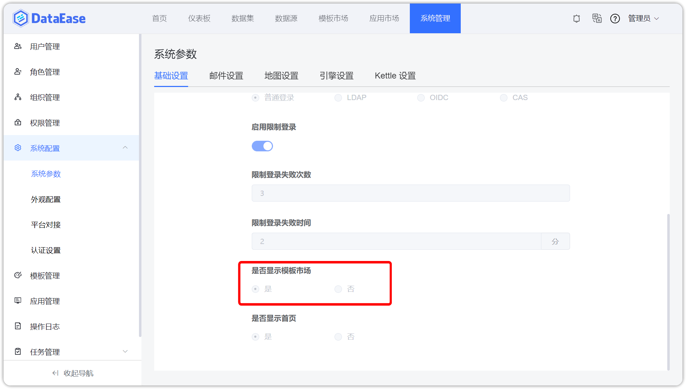{ width="900px" }

{ width="900px" }

### 6.2 支持飞书平台接入，可扫码登录、接收消息和定时报告

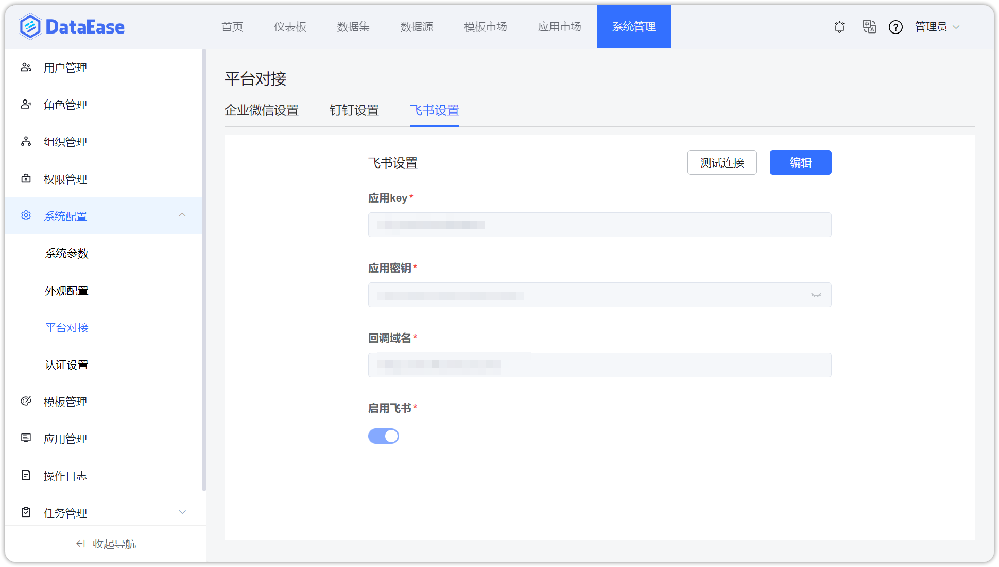{ width="900px" }

!!! Abstract ""
    支持飞书平台接收消息和定时报告。**（以下示图适用于三个平台对接的功能）**

{ width="900px" }

{ width="900px" }

{ width="900px" }

{ width="900px" }

{ width="900px" }

### 6.3 支持钉钉平台接入，可扫码登录、接收消息和定时报告

{ width="900px" }

### 6.4 支持企业微信平台接入，可扫码登录、接收消息和定时报告

{ width="900px" }

## 7 其他

### 7.1 命令行工具功能增强

!!! Abstract ""
    新增 clear-images、clear-logs 命令，可清理 DataEase 相关旧版本镜像以及日志。

{ width="900px" }

!!! Abstract ""
    增强 dectl status 命令，可查询更多 DataEase 相关状态信息

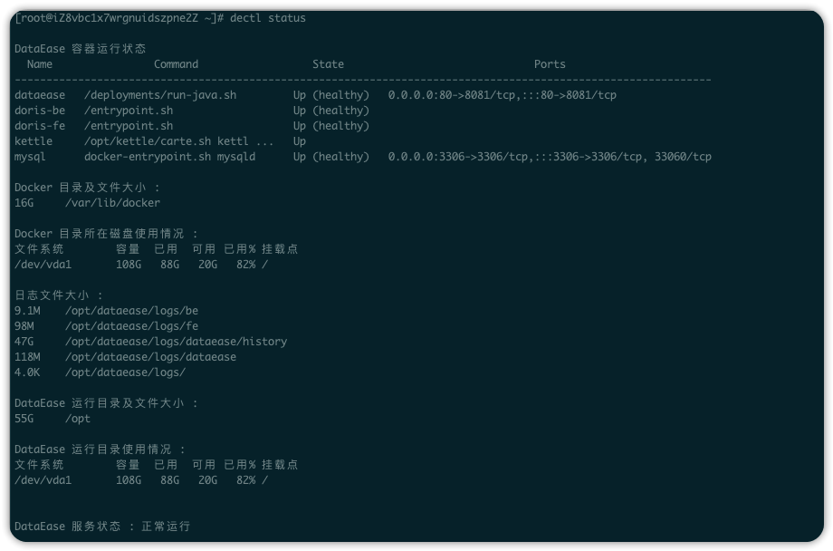{ width="900px" }
