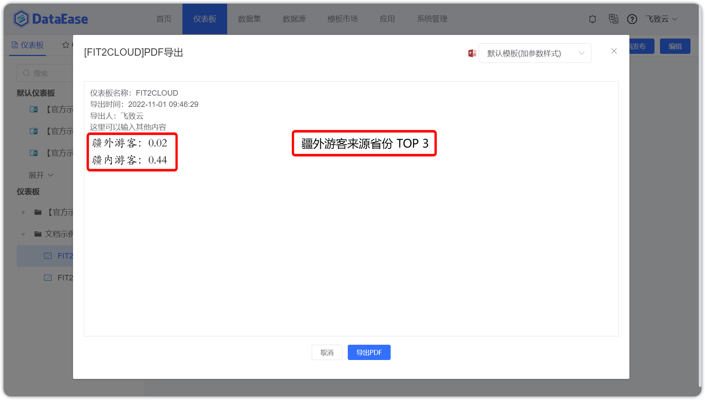
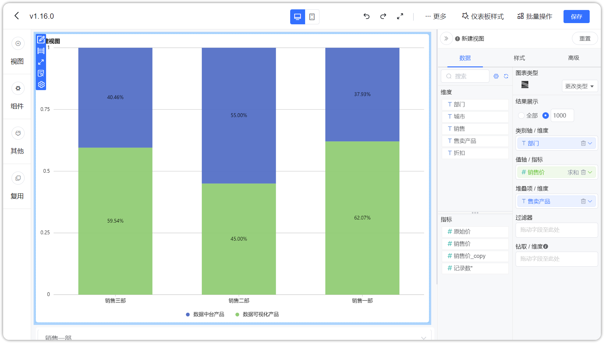
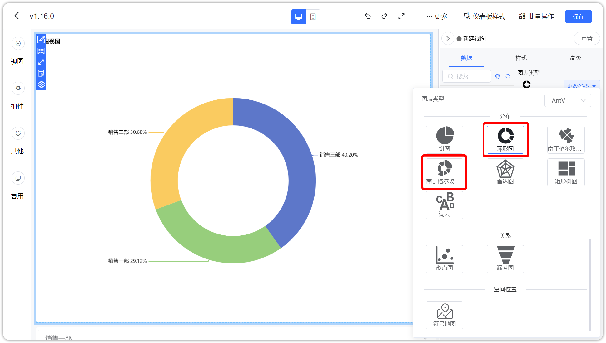
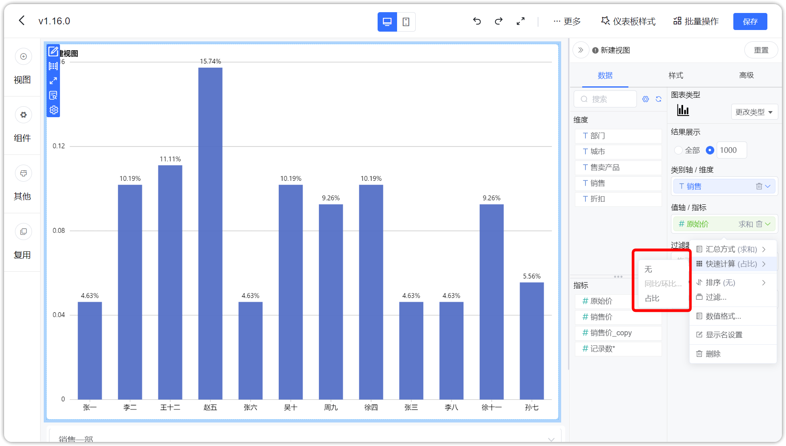
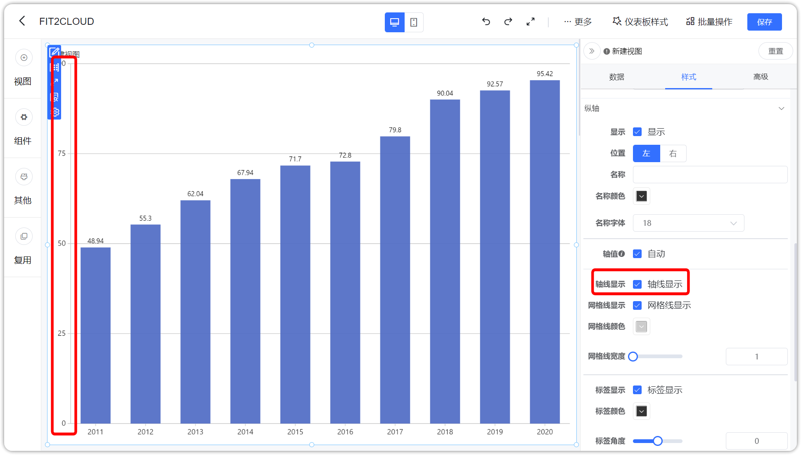
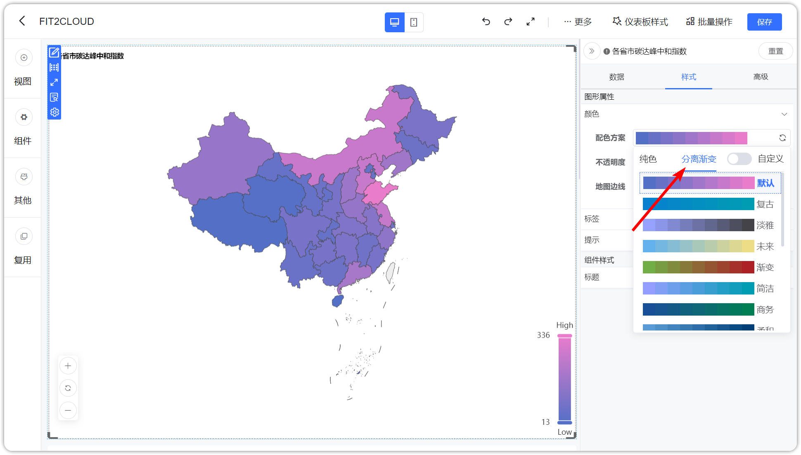
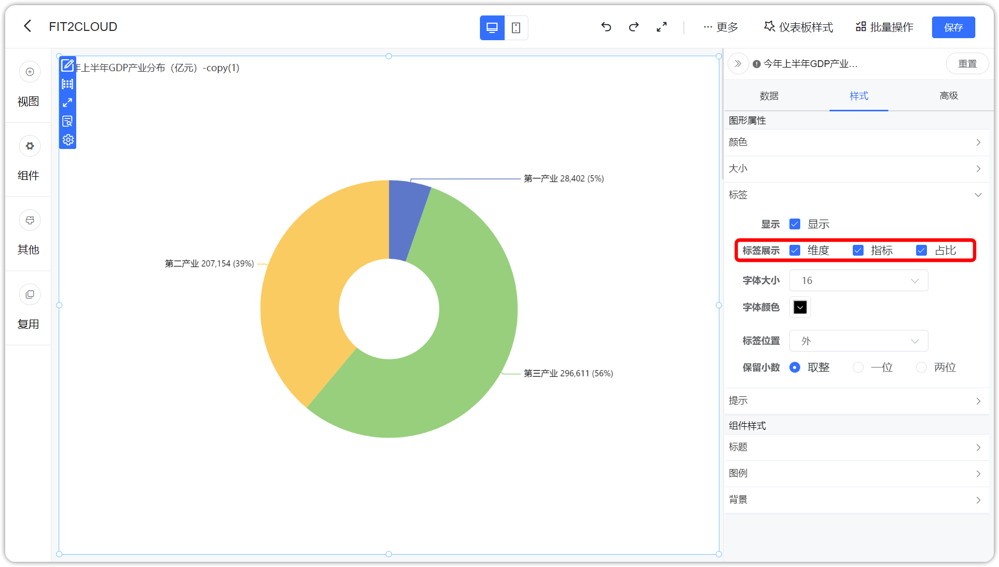
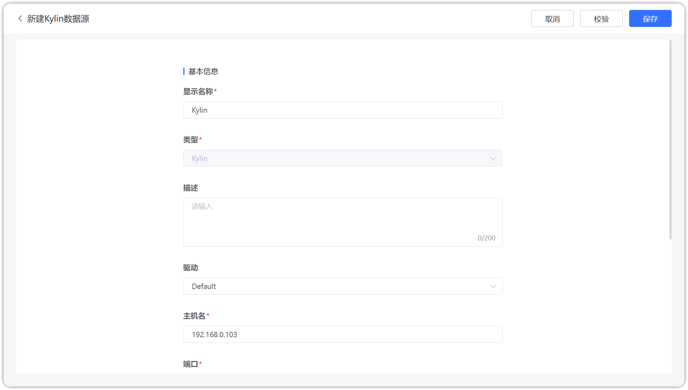
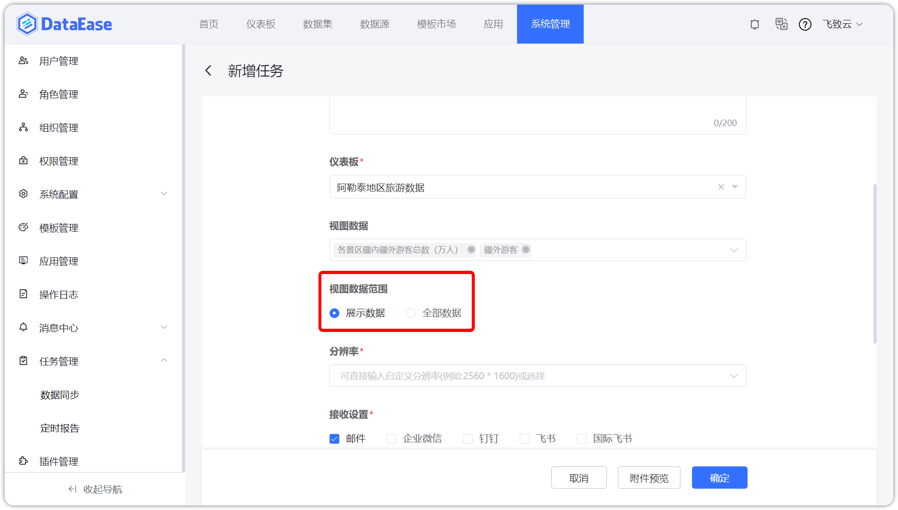

## 1 仪表板

### 1.1 全新的 Tab 组件，支持多组件移入移出自由布局

!!! Abstract ""

    - Tab 组件内支持放置多个组件；
    - 支持在仪表板中以拖拽的形式，将其他组件拖拉至 Tab 组件内；
    - 支持 Tab 项内组件的联动、下钻、跳转等；
    - Tab 组件中不可以再嵌套 Tab。

{ width="900px" }

{ width="900px" }

### 1.2 复制组件后将焦点定位到新视图

!!! Abstract ""
    新复用进来的视图，焦点定位在该视图上。

{ width="900px" }

### 1.3 富文本组件和富文本视图支持自适应缩放

!!! Abstract ""
    视图及富文本内字体大小如下图所示：

{ width="900px" }

!!! Abstract ""
    导出的 PDF 字体大小如下图所示：

{ width="900px" }

## 2 视图

### 2.1 新增分组堆叠柱状图

!!! Abstract ""
    支持同时配置子类别和堆叠项，分组堆叠柱状图可对比同一个分组内部不同分类的数据大小或占比，可对比不同分组内相同分类的数据大小，也可以对比分组的总量。

{ width="900px" }

{ width="900px" }

### 2.2 新增百分比柱状图

!!! Abstract ""
    支持根据数据类目的多个系列自动显示其百分比占比情况，能够更加清晰智能地展示各数据占比值的差异。

{ width="900px" }

{ width="900px" }

### 2.3 新增环形图、玫瑰环形图

!!! Abstract ""
    饼图和玫瑰图去掉了内径大小调整的选项，新增的环形图、玫瑰环形图支持内径占比调整选项。

{ width="900px" }

### 2.4 快速计算方式支持占比计算

{ width="900px" }

{ width="900px" }

### 2.5 水波图目标值支持设置动态值

!!! Abstract ""

{ width="900px" }

### 2.6 AntV 明细表和汇总表增加序号设置

!!! Abstract ""
    同时支持给序号列命名。

{ width="900px" }

### 2.7 支持坐标轴轴线显示控制

!!! Abstract ""
    带坐标系的视图类型支持坐标轴轴线显示控制的选项。

{ width="900px" }

### 2.8 AntV 图库标题支持双击修改

{ width="900px" }

### 2.9 ECharts 地图增加渐变色方案

!!! Abstract ""
    ECharts 图库地图的样式配色方案中新增渐变色选项。

    - 【分离渐变】：系统内置的渐变色方案；
    - 【自定义】：可自定义开始和结束的颜色，系统会自动生成渐变色方案。

{ width="900px" }

{ width="900px" }

### 2.10 AntV 图库玫瑰图，饼图，环形图，玫瑰环形图支持标签内容优化

!!! Abstract ""
    支持通过勾选的方式选择展示的维度、指标、占比。

{ width="900px" }

### 2.11 辅助线数值格式化跟随轴设置

{ width="900px" }

### 2.12 导出视图明细变更为 xlsx 格式

{ width="900px" }

## 3 数据集与数据源

### 3.1 SQL 数据集增加表名字段复制支持

!!! Abstract ""
    支持一键复制表名、字段名。

{ width="900px" }

### 3.2 新增 Kylin 数据源支持

{ width="900px" }

## 4 应用

### 4.1 新增应用版块，支持快速创建第三方系统仪表板

!!! Abstract ""
    支持将仪表板将仪表板【导出为应用】，可将仪表板及其用到的数据集、数据源关联关系一并导出成一个应用文件。

{ width="900px" }

{ width="900px" }

!!! Abstract ""
    系统管理员可以在【应用管理】中上传应用。

{ width="900px" }

!!! Abstract ""
    普通用户可以在【应用】菜单里使用应用，可以预览应用、查看应用的使用记录等。

{ width="900px" }

{ width="900px" }

{ width="900px" }

## 5 X-Pack

### 5.1 支持飞书国际版平台接入，可扫码登录、接收消息和定时报告

{ width="900px" }

### 5.2 定时报告支持视图数据范围选项

!!! Abstract ""
    选择【展示数据】：即页面上显示的数据，页面中过滤组件筛选后的数据；  
    选择【全部数据】：即未被筛选条件过滤的用户有权限的全部数据。

{ width="900px" }