## 1 仪表板

### 1.1 仪表板定时刷新增加开关控制

!!! Abstract ""
    仪表板的定时刷新设置中，新增开关控制，若当前仪表板在长时间没有数据更新的情况下，不需要固定刷新则可关闭刷新功能。

{ width="900px" }

### 1.2 新增仪表板快捷键功能

!!! Abstract ""
    当前支持复制、粘贴、保存、放大。  
    Mac：

    - 复制粘贴组件：command + D
    - 大图查看视图：command + .
    - 保存仪表板：command + s

    其他：

    - 复制粘贴组件：ctrl + D
    - 大图查看视图：ctrl + .
    - 保存仪表板：ctrl + s

### 1.3 悬浮模式下组件支持精确位置及大小设置

!!! Abstract ""
    支持设置组件相对于上方和左方的间距；  
    支持设置组件的高度和宽度值。

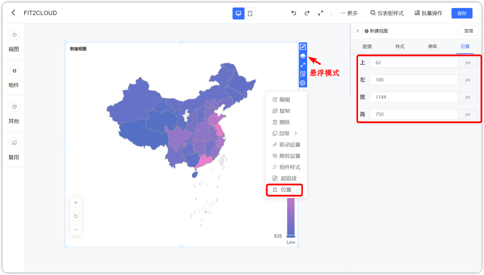{ width="900px" }

### 1.4 移动端支持自定义背景

!!! Abstract ""
    可单独设置移动端的背景颜色或背景图片，以免有时 Web 端设置的背景并不通用于移动端的情况。

{ width="900px" }

### 1.5 进入仪表板菜单默认打开第一个默认仪表板且默认仪表板增加置顶功能

!!! Abstract ""
    切换到仪表板模块时，系统会自动展示位于第一个的默认仪表板，用户可根据需要设定最关注的仪表板为默认的第一个仪表板；  
    默认仪表板栏新增置顶功能，进入仪表板页面后，若默认的仪表板栏存在仪表板，则显示第一个默认的仪表板；  
    用户可通过置顶的功能调整默认显示的仪表板。

{ width="900px" }

### 1.6 公共链接跳转后支持返回

!!! Abstract ""
    访问公共链接后，在页面的右上角的区域有一个较小的功能菜单区，当鼠标移动到右上角时，会出现功能菜单，包括返回上一级、清除所有联动（有联动的时候）、下载；  
    可以通过点击“返回上一级”以回到点击公共链接前的页面；  
    应用场景：使用公共链接做嵌入式，访问后需要返回原系统。

{ width="900px" }

### 1.7 公共链接支持导出 PDF

!!! Abstract ""
    访问公共链接后，在页面的右上角的区域有一个较小的功能菜单区，当鼠标移动到右上角时，会出现功能菜单，包括返回上一级、清除所有联动（有联动的时候）、下载；  
    点击“下载”，则可在公共链接访问仪表板时导出该仪表板的 PDF。

{ width="900px" }

### 1.8 Tab 组件支持设置激活字体大小

!!! Abstract ""
    即该 Tab 页签被选中后，字体的大小。

{ width="900px" }

### 1.9 Tab 组件支持轮播

{ width="900px" }

### 1.10 文本下拉组件支持自定义排序

!!! Abstract ""
    文本过滤组件的排序从字段移出到外部，新增自定义排序，用法类似视图里的自定义排序，可手动拖动排序。

{ width="900px" }

### 1.11 日期范围过滤器动态时间可设置固定时分秒
    
!!! Abstract ""
    选择动态时间的自定义，支持勾选【显示时间】，进行时分秒的设置。

{ width="900px" }

### 1.12 时间范围组件支持动态参数

!!! Abstract ""
    在 SQL 数据集中可以将日期范围的开始和结束时间定义为变量，与其他变量设置一致。

{ width="900px" }

{ width="900px" }

{ width="900px" }

!!! Abstract ""
    在日期范围组件的【参数】中分别选择开始时间和结束时间对应的变量即可。

{ width="900px" }

### 1.13 仪表板自动刷新时清除联动条件

!!! Abstract ""
    仪表板刷新时会同时清除联动条件。
    
### 1.14 组件样式设置中，边框浏览界面展示两排

!!! Abstract ""
    在打开组件样式设置页时，边框浏览界面展示增多一排，展示成两排。

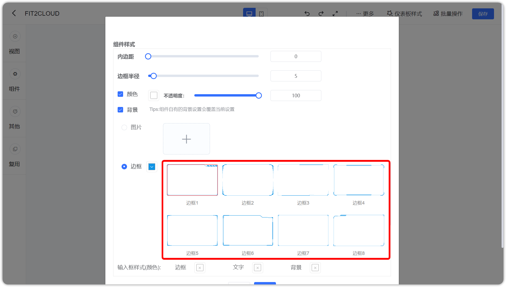{ width="900px" }

### 1.15 组件样式设置中，边框浏览背景颜色自适应

!!! Abstract ""
    边框浏览背景自动适应仪表板的背景色。

{ width="900px" }

### 1.16 优化仪表板过滤组件表格组件的自适应缩放方式

!!! Abstract ""
    防止组件在仪表板不同分辨率下组件大小不适配的问题。

## 2 视图

### 2.1 维度和指标栏增加字段一键清除按钮

!!! Abstract ""
    当该视图需要替换不同的数据集，若遇到字段较多需要清除时，可以避免一个一个操作。

{ width="900px" }

### 2.2 直连模式数据集支持表格的前后端分页

!!! Abstract ""
    直连模式下，AntV 明细表实现了前后端分页。  
    **注意：** 下面几种数据源在 DE 里不支持直连分页，分页为前端分页：
    
    - Apache Kylin
    - SQL Server
    - Elasticsearch
    - Presto
    - Apache Doris
    - StarRocks

### 2.3 ECharts 地图增加悬浮组件显隐设置

{ width="900px" }

{ width="900px" }

### 2.4 视图中过滤增加数值校验

!!! Abstract ""
    示例如下：给数值型字段做过滤时，填写非数值过滤条件，则校验不通过。

{ width="900px" }

### 2.5 ECharts 地图可以切换指标

!!! Abstract ""
    ECharts 地图为单指标类视图，本版本允许拖入多个指标，在地图组件的功能区支持做多个指标的切换。

{ width="900px" }

### 2.6 AntV 折线图支持分组
    
!!! Abstract ""
    AntV 折线图支持配置子类别，增加了分组对比的能力。

{ width="900px" }

### 2.7 折线图支持隐藏无数据的点

!!! Abstract ""
    支持空值的三种处理方式：  

    - 线条断开
    - 置为 0，线条不断开
    - 跳过空值，不展示（线仍然是连贯的，为空的日期自动不展示出来）

    空值的三种处理示例如下:

{ width="900px" }

{ width="900px" }

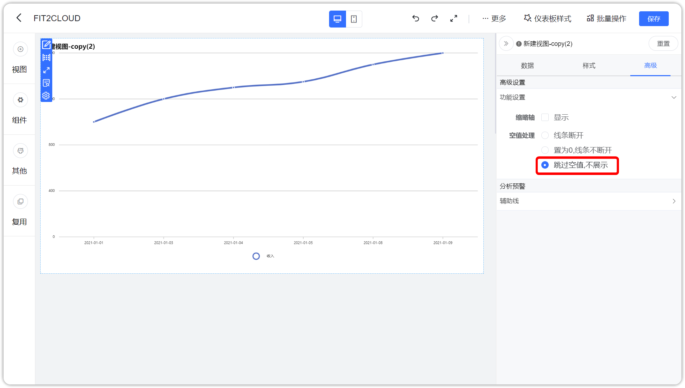{ width="900px" }

### 2.8 AntV 图库增加横向百分比柱状图

{ width="900px" }

### 2.9 AntV 图库透视表行汇总支持按合计排序

!!! Abstract ""
    透视表行汇总新增排序功能，排序时，需要指定进行合计排序的字段。

{ width="900px" }

### 2.10 AntV 表格支持随主题改变滚动条颜色，且支持修改滚动条颜色

{ width="900px" }

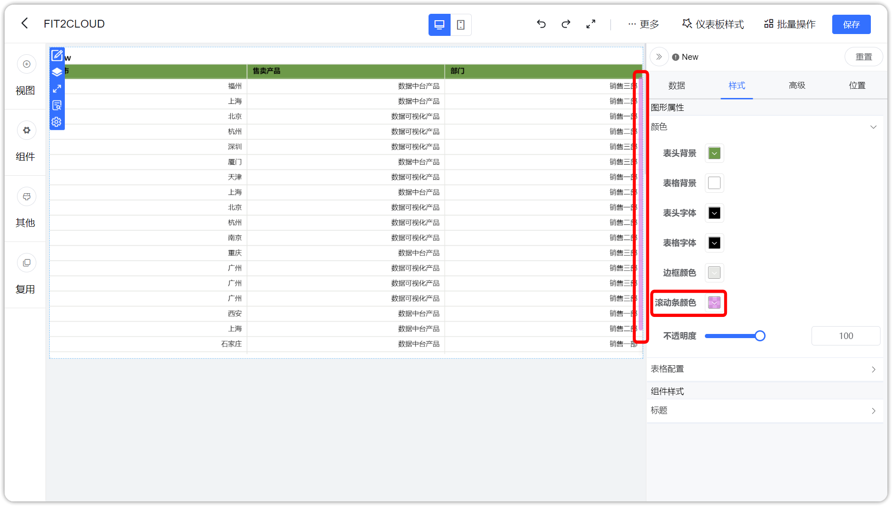{ width="900px" }

### 2.11 AntV 图库的所有柱状图、面积图、仪表盘新增渐变色支持

!!! Abstract ""
    新增渐变开关，支持开启渐变色，渐变色的起始颜色和结束颜色按给定颜色 100 渐变到 30 。

{ width="900px" }

### 2.12 富文本视图允许修改标题

{ width="900px" }
    
## 3 数据集

### 3.1 数据集支持按条件导出 Excel

!!! Abstract ""
    注意：最多支持导出 10 万条数据。

{ width="900px" }

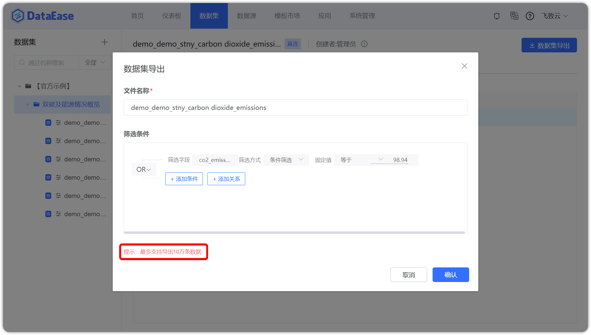{ width="900px" }

### 3.2 数据集字段支持日期解析格式设置

!!! Abstract ""
    为解决日期过滤组件无效的问题；  
    示例：数据库中以 2000/01/01 文本存储的数据，在之前版本中，由于格式差异性，日期类过滤组件无法过滤出来这些数据；  
    新版本中，可将该文本字段改为时间类型，并选择 Y/m/d 格式（具体格式看数据源），则日期类过滤组件可以过滤出来这些数据。  
    注意：目前 Kylin 数据源还不支持。

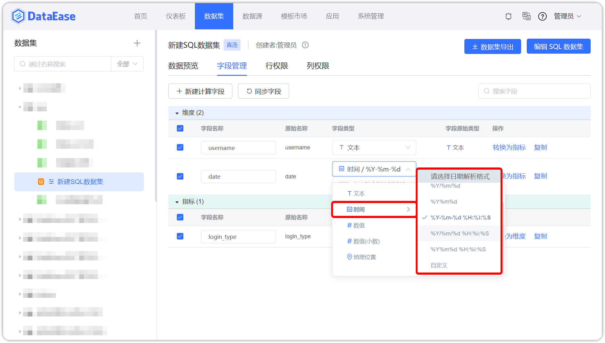{ width="900px" }

### 3.3 单次执行的数据同步的任务，可以手动触发执行一次

!!! Abstract ""
    在【数据集】更新信息页面或【系统管理】任务管理页面，可通过在已执行同步任务的记录上，选择【运行一次】来实现。  

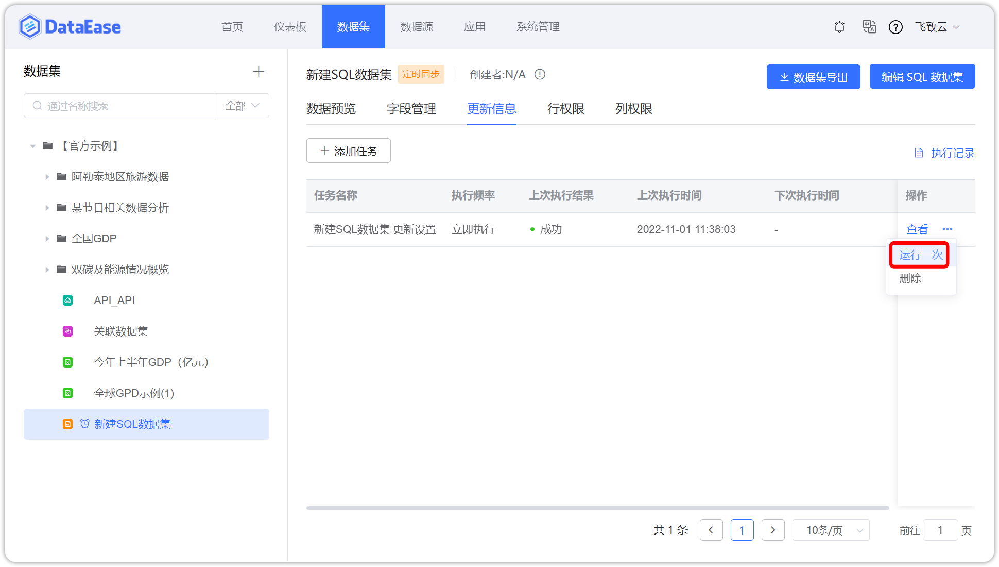{ width="900px" }

{ width="900px" }

## 4 系统管理

### 4.1 系统日志中增加公共链接访问记录

{ width="900px" }

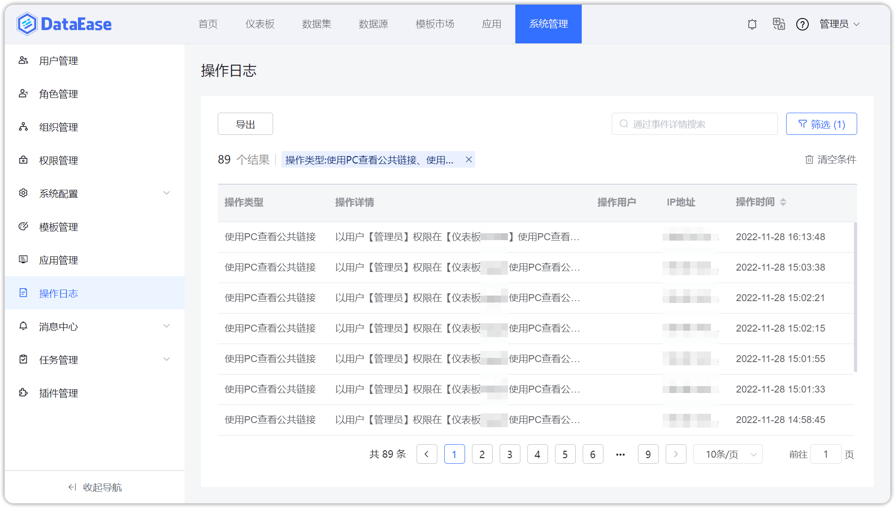{ width="900px" }

### 4.2 系统日志中增加客户端 IP 地址信息

{ width="900px" }

### 4.3 系统日志中增加日志保留期限机制

!!! Abstract ""
    每天 00：00 分清理日志记录，没清理前，会根据日志保留时间的设置，在日志页面仅显示指定保留时间内的日志记录。

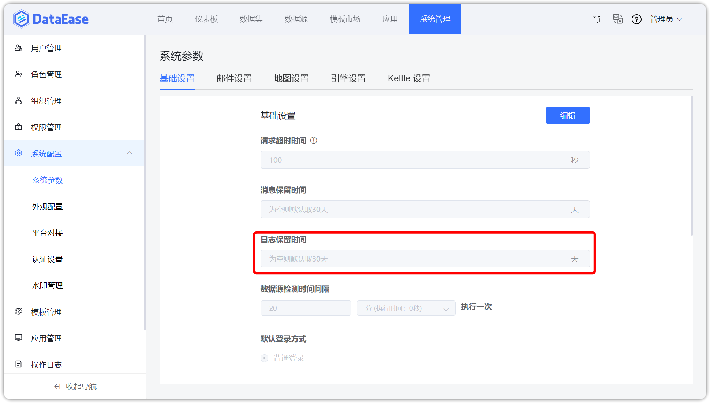{ width="900px" }

### 4.4 系统的默认超时时间设置为 100

!!! Abstract ""
    系统的默认超时时间由 30 调整到 100 。

{ width="900px" }

## 5 Xpack

### 5.1 定时报告支持立即执行功能

!!! Abstract ""
    可根据需要，手动即时做一次单次的执行。

{ width="900px" }

{ width="900px" }

### 5.2 定时报告支持富文本内容

!!! Abstract ""
    定时报告的报告内容编辑器换成富文本编辑器，支持通过邮件、钉钉、飞书、企业微信、国际飞书等渠道发送富文本内容；  
    **注意：** 由于各个第三方平台对富文本支持的不同，不是所有的样式都能支持。 

{ width="900px" }

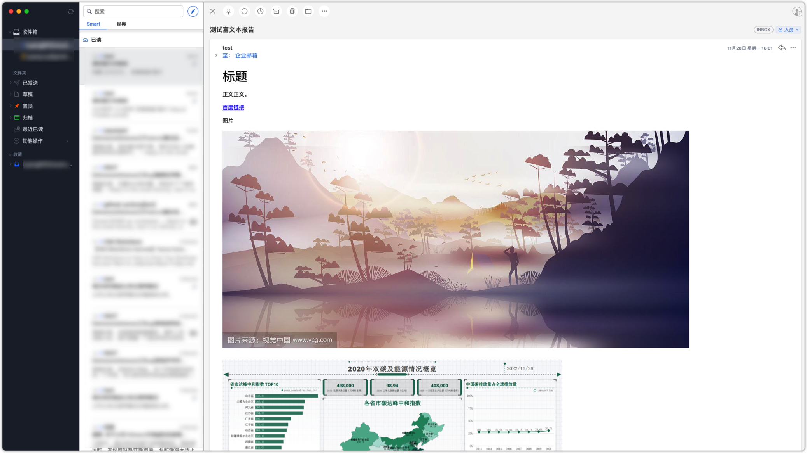{ width="900px" }

### 5.3 支持水印设置

!!! Abstract ""
    支持基本的水印设置，仅影响所有可以看到仪表板的地方。  
    内容支持设置：

    - 自定义公式（可选择以下内容自由组合）
    - 账号
    - 昵称
    - IP
    - 当前时间

    支持设置水印颜色、字号、间距。

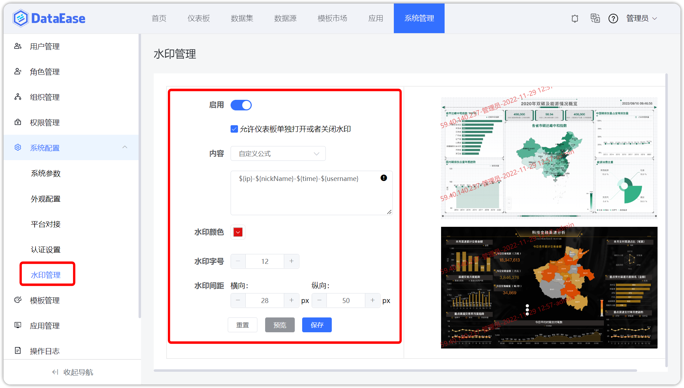{ width="900px" }

!!! Abstract ""
    若开启了允许仪表板单独开关水印，则在仪表板中可选择水印开关。

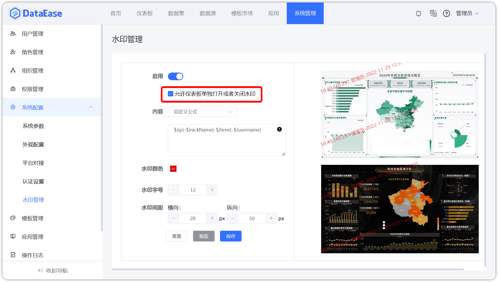{ width="900px" }

{ width="900px" }

### 5.4 支持设置是否禁用扫码自动创建用户

!!! Abstract ""
    之前版本中，使用企业微信账号、飞书账号、钉钉账号、Lark 账号登录，会自动创建新的账号；  
    本版本支持禁止扫码创建用户的配置项，禁止后，只能通过在已有 DataEase 账号的个人信息中绑定平台账号后扫码登录。

{ width="900px" }

### 5.5 数据集支持脱敏规则设置

!!! Abstract ""
    支持相对复杂的脱敏规则；  
    脱敏规则在多条列规则之间可能会有冲突，比如组织、角色、用户三个层面都对同一个数据集的列进行了脱敏规则的设置；  
    这里系统设定了一个优先级：用户 > 角色 > 组织。

{ width="900px" }

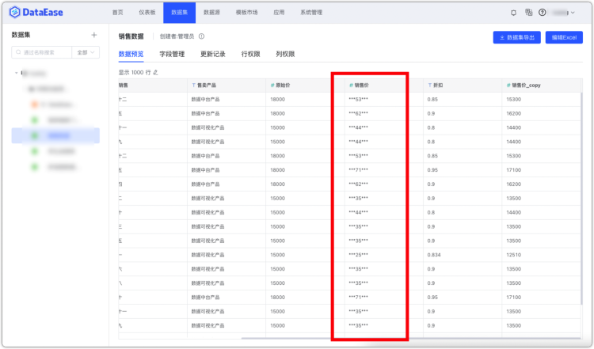{ width="900px" }