## 1 仪表板

### 1.1 透视表支持点击行头列头跳转并在跳转时带入相关字段进行匹配

!!! Abstract ""
    **AntV 透视表** 在跳转设置中放开了维度字段的限制，用户可以在透视表中通过单击表头的维度字段进行跳转传值。  
    **注意：** 指标字段表头不支持跳转点击。

{ width="900px" }

!!! Abstract ""
    点击城市维度跳转，跳转后的仪表板视图被联动。

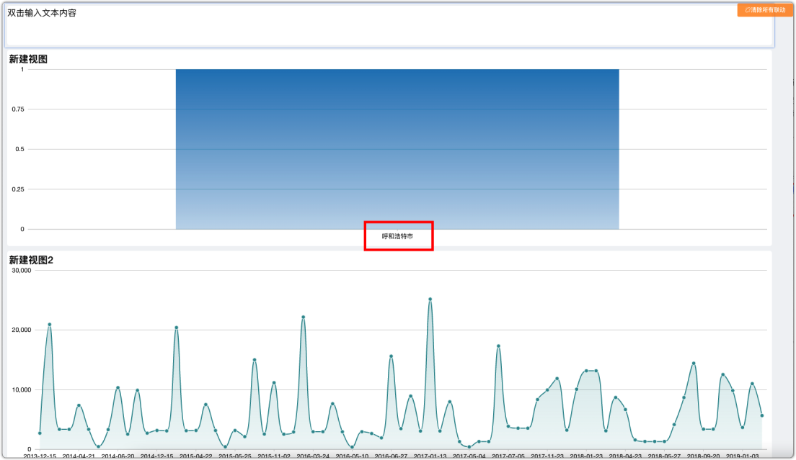{ width="900px" }

!!! Abstract ""
    同时也支持了维度字段进行联动设置。

{ width="900px" }

{ width="900px" }

### 1.2 仪表板刷新时，过滤组件的备选项同时更新

!!! Abstract ""
    历史版本在仪表板自动刷新时只是视图数据重新从后台进行了更新，而过滤组件的选项值未同步更新，此版本对此进行了完善。  
    **注意：** 过滤组件设置的默认值如果在更新后不存在了，过滤组件的默认值保持不变，但备选项中不再有该值。视图的筛选结果依旧根据过滤组件原默认值进行筛选。

### 1.3 仪表板样式及主题设置支持视图背景图片设置

!!! Abstract ""
    仪表板样式中的“组件样式”改名为“视图样式”，支持更多背景相关设置。  
    以下是版本对比情况：

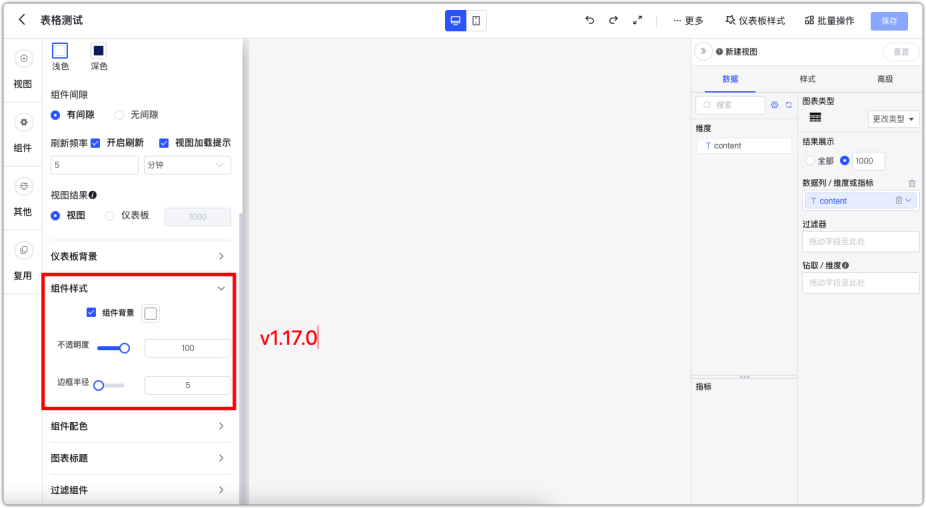{ width="900px" }

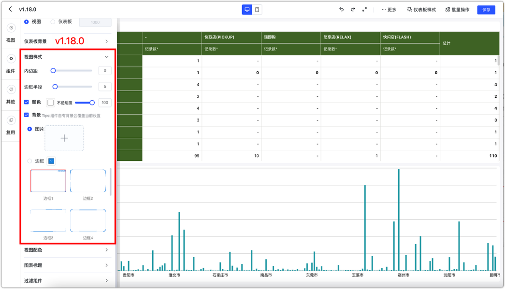{ width="900px" }

### 1.4 编辑状态拖拽事件响应区域变更为边缘部分

!!! Abstract ""
    拖拽区域由组件内几乎所有区域变更为组件四周较小区域，当鼠标移动到拖拽区域后，鼠标指针将变为表示移动状态的指针。

{ width="900px" }

{ width="900px" }

### 1.5 文本下拉组件选项排序方式增加中文排序方式

{ width="900px" }

### 1.6 过滤组件绑定参数优化，可直接展示数据集中的参数

!!! Abstract ""
    创建过滤组件进行 SQL 参数绑定时，自动列出当前仪表板所用到的所有 SQL 数据集中的 SQL 参数。

{ width="900px" }

### 1.7 增加仪表板取消发布时的提示信息

!!! Abstract ""
    由于仪表板取消发布后，除了创建人和编辑人外，拥有查看该仪表板权限的用户均无法再看到，故在用户进行此操作时，给出提示。  
    **提示内容：** 取消发布后，该仪表板不能被查看。确定要取消发布？

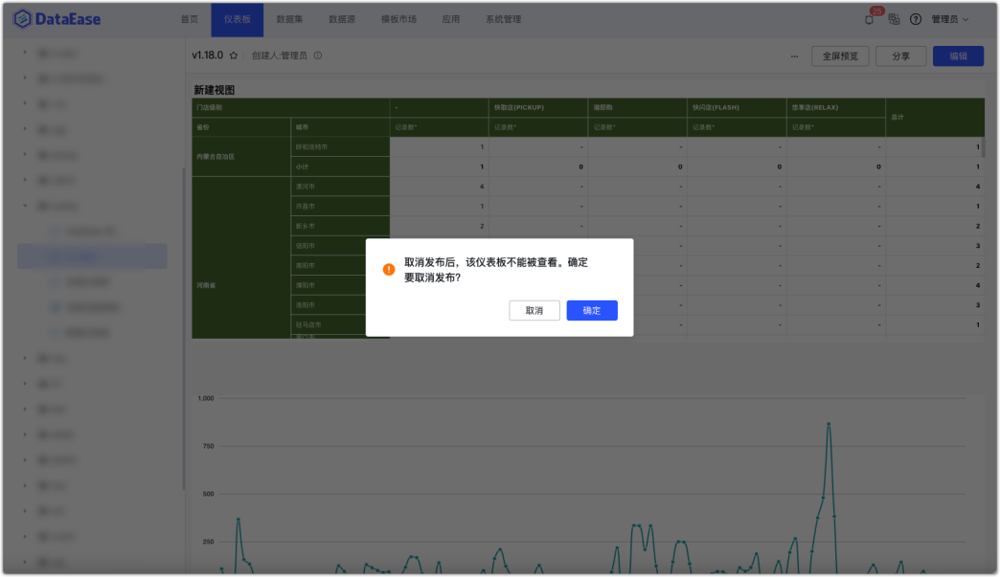{ width="900px" }

### 1.8 网页组件、媒体链接设置的提示文案优化

!!! Abstract ""
    优化组件的提示文案，避免歧义，更清晰一些。

{ width="900px" }

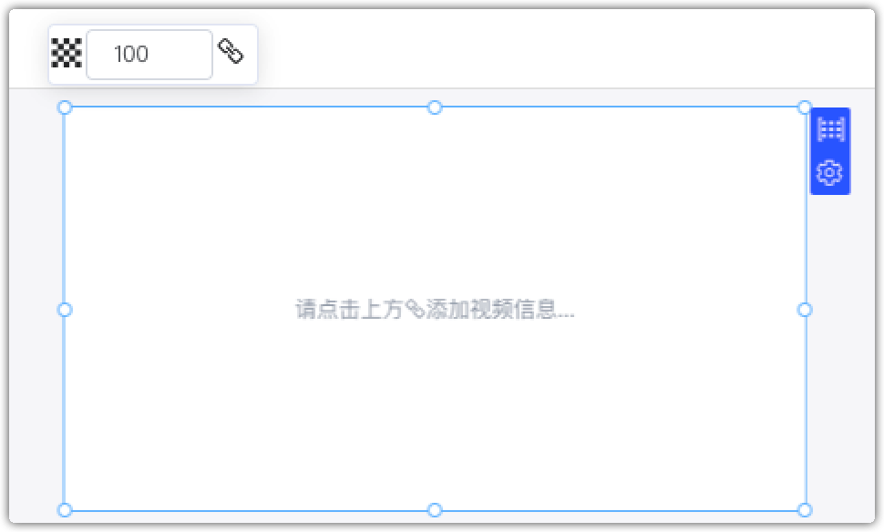{ width="900px" }

### 1.9 新增默认仪表板主题

!!! Abstract ""
    新增 4 款仪表板主题：淡雅浅绿、智慧数据、经典亮蓝、科技大屏。

{ width="900px" }

### 1.10 仪表板预览页交互设计优化

!!! Abstract ""
    仪表板预览页右上角的工具栏优化调整，新旧版本对比如下所示：

    - 之前图标的展示改为文字；
    - 外层仅放置三个最常用功能，其他菜单收进更多的选项中。

{ width="900px" }

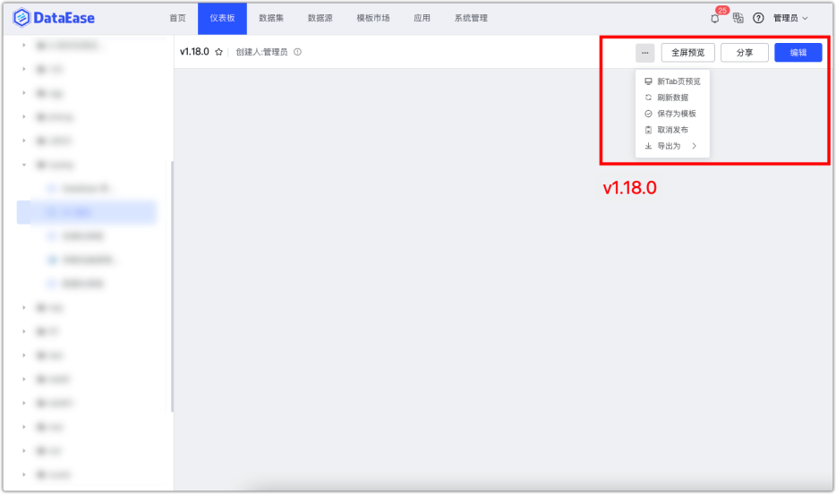{ width="900px" }

## 2 视图

### 2.1 MySQL 时间字段支持按季度、周统计

!!! Abstract ""
    MySQL 数据源中的时间字段，在视图里新增按年季度、年周进行统计，其他数据源暂不支持。

{ width="900px" }

!!! Abstract ""
    年周统计示例：

{ width="900px" }

!!! Abstract ""
    年季度统计示例：

{ width="900px" }

### 2.2 文本卡支持阈值设置

!!! Abstract ""
    文本卡支持阈值设置，由于文本卡只有一个维度，所以在设置阈值的时候不需要再次选择阈值对应的字段。

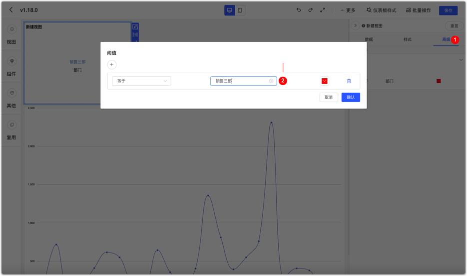{ width="900px" }

{ width="900px" }

### 2.3 柱状图、折线图支持结果隐藏空数据

!!! Abstract ""
    在柱状图、折线图中均加入了空值处理的设置。此设置也可以用来解决同环比情况下，没有对比值的日期在图上显示空值的问题。

{ width="900px" }

### 2.4 Echarts 地图视图增加标记功能

!!! Abstract ""
    Echarts 地图视图增加了标记栏设置的支持，如下图红框部分的经纬度栏。只有添加了经纬度字段后，地图的标记功能才会生效。

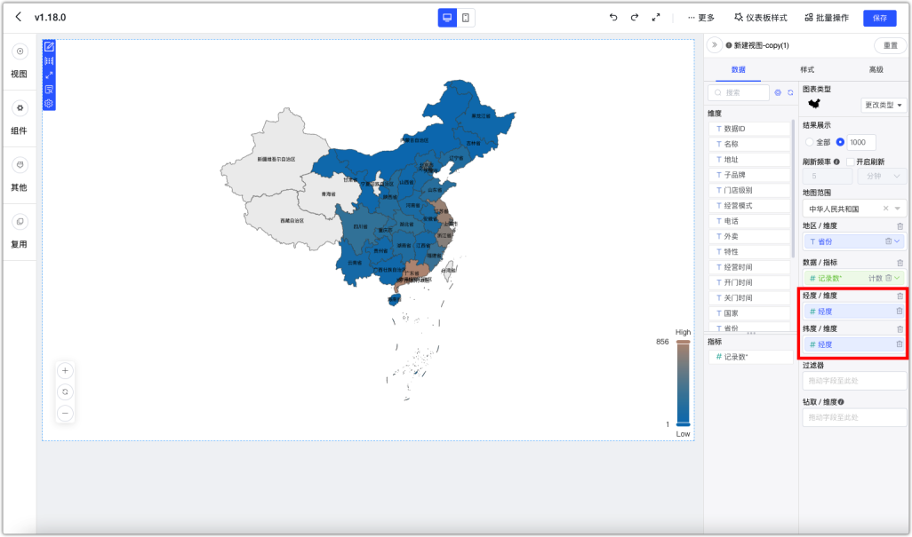{ width="900px" }

!!! Abstract ""
    标记功能内置了一些常用的图标，在样式设置中，可以选择字段，设置不同的阈值条件来显示不同的标记图案。

{ width="900px" }

### 2.5 视图可以单独设置刷新频率

!!! Abstract ""
    仪表板中的刷新设置保留，另外每个视图增加刷新频率设置。  
    **注意：** 若开启了视图刷新设置，则以视图设置优先，具体体现如下：

    - 仪表板设置了刷新，视图没设置刷新 -> 以仪表板设置执行刷新；
    - 仪表板设置了刷新，视图也设置了刷新 -> 以视图设置执行刷新；
    - 仪表板没设置刷新，视图也没设置刷新 -> 不刷新；
    - 仪表板没设置刷新，视图设置了刷新 -> 以视图设置执行刷新。

{ width="900px" }

### 2.6 视图计算字段支持复制

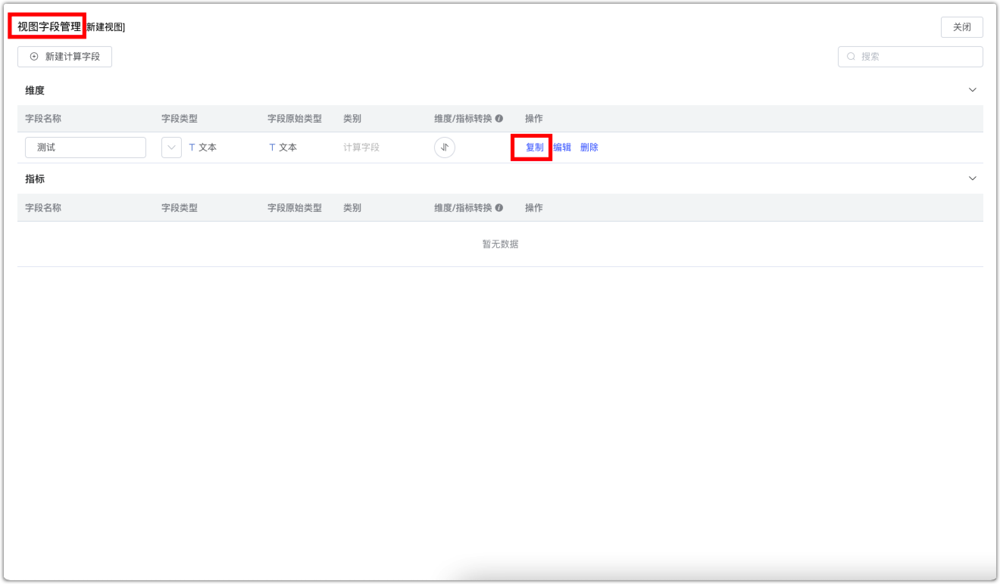{ width="900px" }

### 2.7 透视表列汇总支持按合计排序

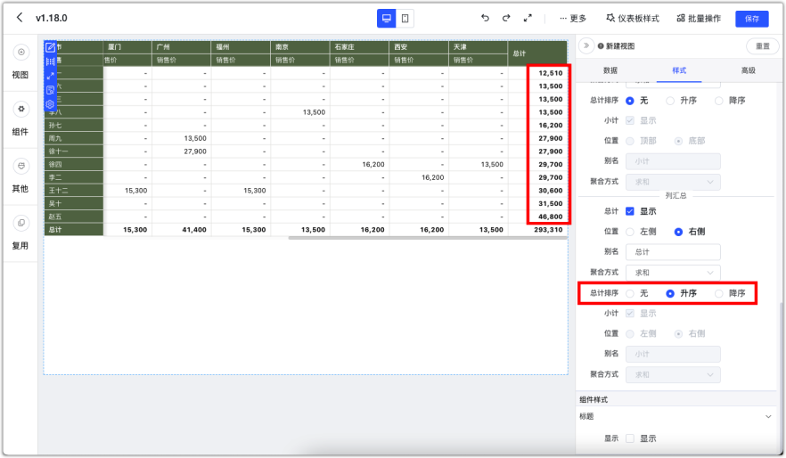{ width="900px" }

### 2.8 优化深色主题下图例翻页标识

!!! Abstract ""
    新版本中，对 ECharts 及 AntV 图库中涉及到深色主题下图例翻页的视图类型，均做了翻页标识的颜色处理。

{ width="900px" }

{ width="900px" }

### 2.9 快速计算占比切换至其他类型时重置数值格式

!!! Abstract ""
    之前版本在快速计算中选择占比计算后，对应的数值格式会切换成百分比显示，但取消快速计算，或改成其他快速计算方式后，对应的数值格式并未改变。新版本解决了这个问题。  
    快速计算为占比时的数值格式：

{ width="900px" }

{ width="900px" }

!!! Abstract ""
    去掉占比计算后的数值格式：

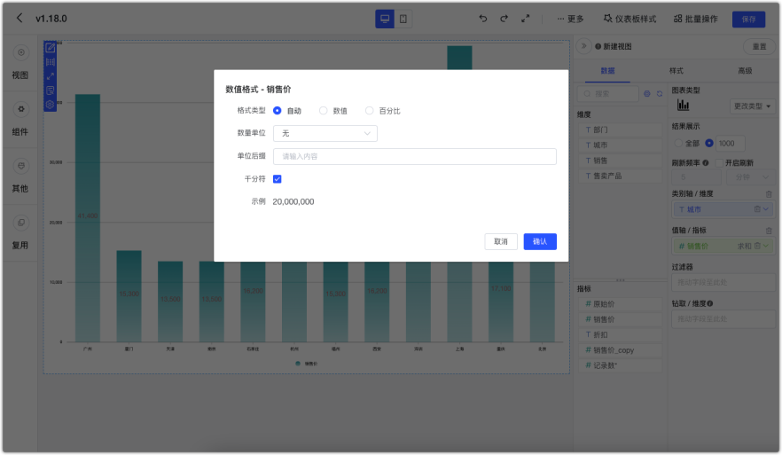{ width="900px" }
    
## 3 数据集

### 3.1 数据源敏感信息加密

!!! Abstract ""
    之前版本中，对数据源的保存和校验时都会将数据源连接信息暴露在请求中，如下图：

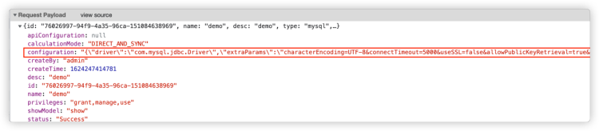{ width="900px" }

!!! Abstract ""
    数据源的保存和校验时都会对数据源连接信息部分进行加密处理，如下图：

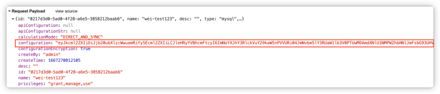{ width="900px" }

### 3.2 数据源分类的改进

!!! Abstract ""
    数据源分类调整为：

    - OLTP 型数据库
    - OLAP 型数据库
    - 数仓/ 数据湖
    - 其他

{ width="900px" }

### 3.3 支持数据源的复制

!!! Abstract ""
    数据源支持复制功能。点击复制按钮后，源数据源的所有配置信息将会被带入到新复制的数据源配置信息中，用户可以快速创建同数据库而不同 Database 的新数据源。

{ width="900px" }

### 3.4 数据源界面优化

!!! Abstract ""
    以前版本默认点击数据源显示为该数据源的表信息，新版本调整为默认展示配置信息，并增加 Tab 标签做切换。

{ width="900px" }

## 4 数据集

### 4.1 定时任务采用分页的方式拉取数据

!!! Abstract ""
    之前版本的 DataEase 在将数据定时同步到 Doris 中时，并没有采用分页方式拉取数据，这样在数据量大的情况下，对于源数据库以及 Doris 来说压力都比较大。  
    新版本的 DataEase 在这部分做了相关优化，在拉取数据时加入了分页拉取的方式。

### 4.2 使用 simple 模式安装后，在数据集创建界面去掉定时同步

!!! Abstract ""
    之前版本的 DataEase 在 simple 模式下会将定时同步选项置灰，给部分用户造成了误会，以为是该功能失效。  
    v1.18.0 版本在 simple 模式下会将定时同步选项移除。

## 5 应用

### 5.1 使用应用创建仪表板时支持选择存量数据源

!!! Abstract ""
    之前版本在通过应用创建仪表板时必须填入完整的数据连接信息，系统生成新的数据源，此版本支持选择存量数据源。

{ width="900px" }

## 6 系统管理

### 6.1 支持数据源、数据集、仪表板的血缘分析

!!! Abstract ""
    系统管理新增血缘分析功能，可以支持对数据源、数据集、仪表板做关联分析。  
    表格展示：

{ width="900px" }

!!! Abstract ""
    关系图展示：

{ width="900px" }

!!! Abstract ""
    在对数据源、数据集进行删除操作时，也可以查看相关联的资源。

{ width="900px" }

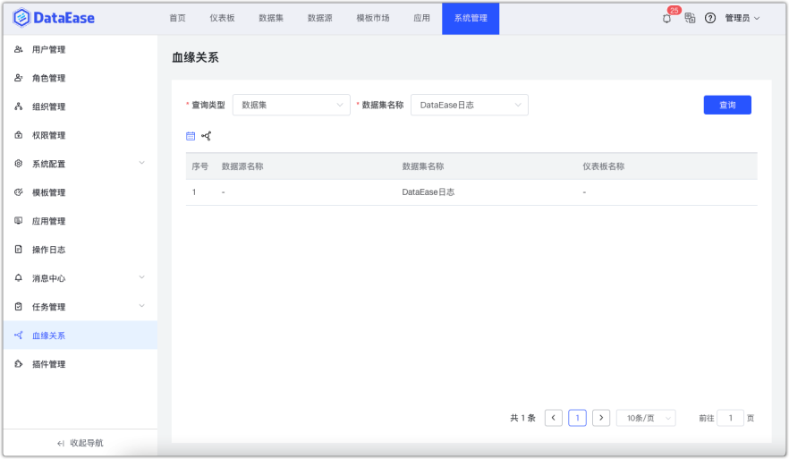{ width="900px" }

### 6.2 限制官方插件更新卸载

!!! Abstract ""
    镜像内置插件不允许更新和卸载，同时，隐藏了 X-Pack 插件的显示。

{ width="900px" }

## 7 Xpack

### 7.1 飞书工作台中支持免登进入 DataEase

!!! Abstract ""
    支持在飞书的工作台里，通过点击飞书里的 DataEase 应用来免登进入 DataEase。  
    在工作台里访问 DataEase，用户将无法退出，以及无法修改密码。

{ width="900px" }

### 7.2 钉钉工作台中支持免登进入DataEase

!!! Abstract ""
    支持在钉钉的工作台里，通过点击钉钉里的 DataEase 应用来免登进入 DataEase。  
    在工作台里访问 DataEase，用户将无法退出，以及无法修改密码。

{ width="900px" }

### 7.3 定时报告任务执行状态优化

!!! Abstract ""
    新版本做了以下几点优化：
    
    - 任务停止后，不修改任务的结束时间，将状态修改为：停止；
    - 如果想要重启任务，直接点击启动按钮即可；
    - 如果任务处于【停止】状态，则隐藏【停止】按钮；如果任务处于【启用】状态，则隐藏【启用】按钮。【启用】按钮和【停止】按钮不会同时出现。

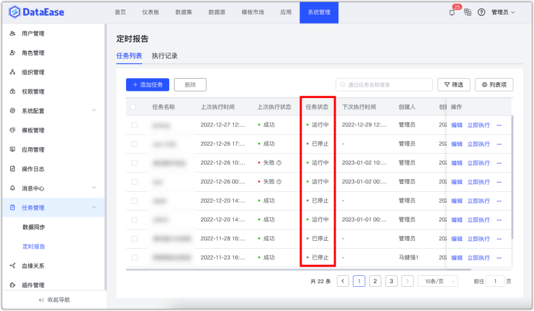{ width="900px" }