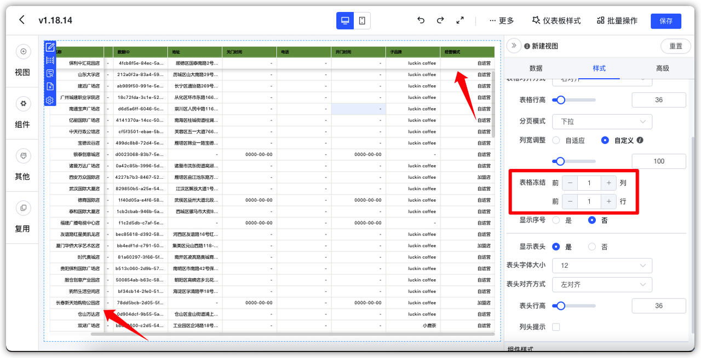
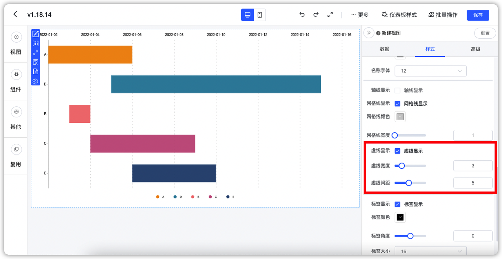
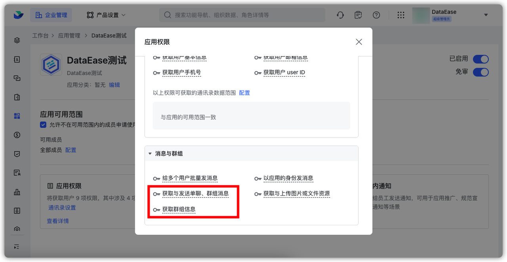
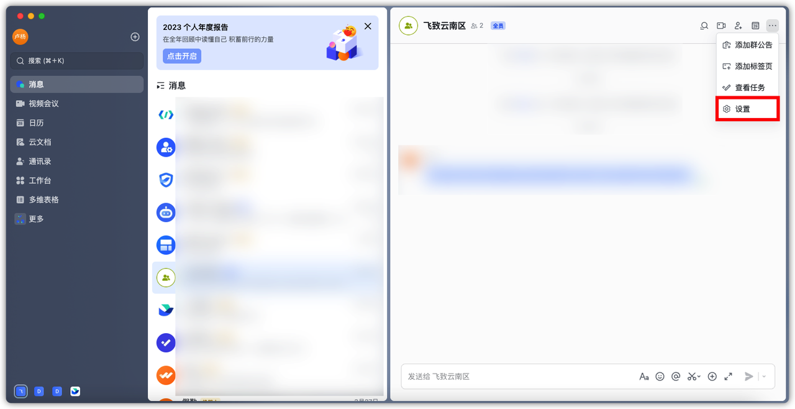

## 1 数据源与数据集
### 1.1 数据源驱动可以标记支持的数据源版本范围
!!! Abstract ""
    上传驱动文件的界面，可以设置驱动支持的版本，多个版本时使用英文逗号“,”进行分隔。
{ width="900px" }
!!! Abstract ""
    创建数据源时，选择驱动列表会同时显示出支持的驱动版本号。
{ width="900px" }
!!! Abstract ""
    保存数据源时对于不在驱动支持范围内的数据源，系统报错提示驱动版本不支持。
{ width="900px" }

### 1.2 Impala、SQLServer、Doris 支持分页查询
!!! Abstract ""
    v1.18.14 对 Impala、SQLServer、Doris 数据源在直连模式下的数据集支持了真分页查询，减少了 DataEase 在查询上的开销。

## 2 视图

### 2.1 折线图、柱状图、透视表等有多个维度的图表类型，支持自定义排序

!!! Abstract ""

    - 折线图、柱状图主要指子类别，v1.18.14 之前版本主维度支持自定义排序，子类别未支持；
    - - 透视图主要指数据行维度，v1.18.14 之前版本数据列维度支持自定义排序，数据行维度未支持。
{ width="900px" }

### 2.2 明细表与汇总表支持冻结前 N 列/行

{ width="900px" }

### 2.3 新增 AntV 区间条形图
!!! Abstract ""
    区间范围字段需要放入两个指标或者时间类型维度字段。

{ width="900px" }
{ width="900px" }
!!! Abstract ""
    支持钻取。
{ width="900px" }
### 2.4 AntV 带轴线的图表支持虚线设置
!!! Abstract ""
    包括虚线设置开关、虚线宽度、虚线间距。
{ width="900px" }

### 2.5 视图过滤组件支持与或关系配置
!!! Abstract ""
    注意：过滤器配置方式有调整，直接点击配置，而非之前的拖动字段配置。
{ width="900px" }}
!!! Abstract ""
    可配置与或关系，更强大和灵活。
{ width="900px" }

## 3 仪表板
### 3.1 公共链接查看仪表板时支持切换全屏预览
{ width="900px" }

### 3.2 跳转设置的联动组件支持配置过滤组件
{ width="900px" }

### 3.3 配置联动与跳转时选择视图和字段均增加搜索支持

{ width="900px" }
{ width="900px" }

### 3.4 下拉组件支持清空按钮
!!! Abstract ""
    下拉组件在编辑时增加了字段一键清空的按钮。

{ width="900px" }

## 4 系统管理
### 4.1 定时报告明细表数据支持全量发送（XPack）
!!! Abstract ""
    v1.18.14 之前只会发送明细表当前页数据。v1.18.14 将会发送该明细表的全量数据。

### 4.2 定时报告的接收对象支持按照角色与组织选择（XPack）
{ width="900px" }
!!! Abstract ""
    飞书应用中需要在权限里加上以下两个权限。
{ width="900px" }
!!! Abstract ""
    在飞书群组中加入 DataEase 应用的机器人。
{ width="900px" }
{ width="900px" }
{ width="900px" }
{ width="900px" }
!!! Abstract ""
    在 DataEase 定时报告的配置中选择发送到具体哪些飞书群。
{ width="900px" }

### 4.4 定时报告支持设置额外等待时间（XPack）

{ width="900px" }

### 4.5 定时报告支持过滤掉已禁用用户（XPack）
!!! Abstract ""
    即当用户状态为「禁用」，则定时报告会自动过滤掉该用户，不会因为配置中有该用户而为他发送报告。

{ width="900px" }