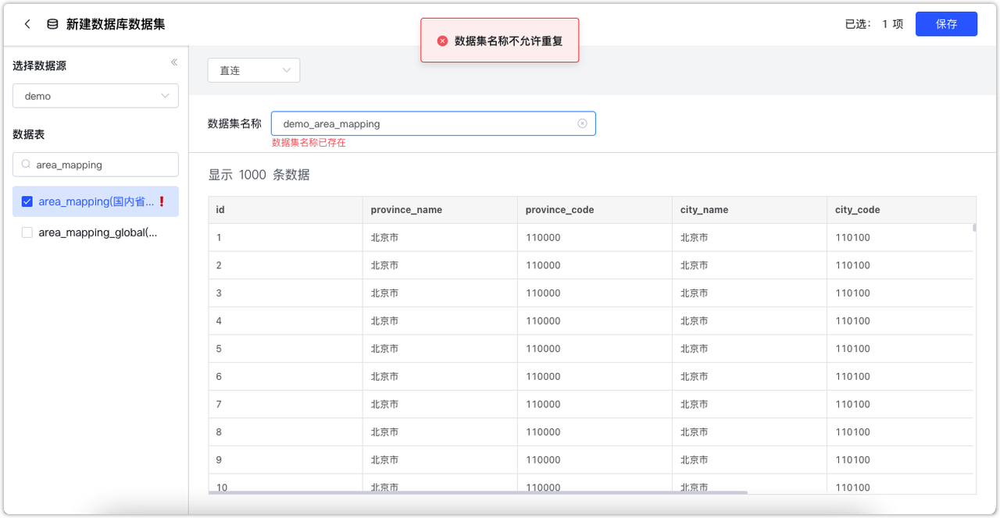
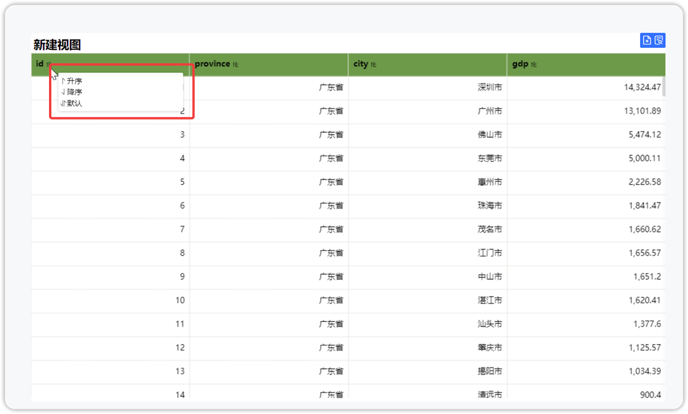

## 1 数据源与数据集
### 1.1 定时同步任务支持在历史数据变动后增量更新到 Doris 中。
!!! Abstract ""
    新建定时同步类型的数据集时，支持设置主键，设置主键后不支持修改主键。设置主键后，添加增量更新任务时可以通过主键自动判断对 Doris 中的数据进行增量 insert 或 update。   
    请注意，此版本之前不支持更新已同步至 Doris 中的数据。
{ width="900px" }
!!! Abstract ""
    字段管理中新增一列字段描述「设置为主键」，当定时同步类型数据集的字段发生变化时（如增加、减少、变更），可以在字段管理中设置新的主键。
{ width="900px" }


### 1.2 1.2 数据库数据表允许被重复创建为数据集
!!! Abstract ""
    一个数据库中的同一个表允许被重复创建为数据库数据集，历史版本中当一个表已经被创建为数据库数据集后，再次创建数据库数据集则无法选择该表。  
    请注意，数据集的名称仍然是不能重复的，所以当再次选择该表作为数据库数据集时，默认名称会冲突，可以手动修改名称后保存。
{ width="900px" }
!!! Abstract ""
    以下图片标注出的两个数据库数据集均来自“area_mapping”表。
{ width="900px" }

## 2 仪表板
### 2.1 词云图支持下钻
!!! Abstract ""
    同其他图表下钻功能。
{ width="900px" }
{ width="900px" }

### 2.2 透视表小计与总计支持按字段配置聚合方式
!!! Abstract ""
    聚合方式的字段可以选择所有在数据列/指标中的字段。
{ width="900px" }
{ width="900px" }

### 2.3 区间条形图支持不聚合，即一行展示多个数据条
!!! Abstract ""
    不聚合时的效果：
{ width="900px" }
!!! Abstract ""
    聚合时的效果：
{ width="900px" }

### 2.4 AntV 明细表与汇总表支持表头排序
!!! Abstract ""
    点击表头字段唤起排序菜单，支持升序、降序、表格默认排序。

{ width="900px" }
!!! Abstract ""
    编辑页面、预览界面均支持，以下为预览页面。
{ width="900px" }

### 2.5 富文本视图与富文本组件进入编辑状态自动聚焦在文档末尾

{ width="900px" }

### 2.6 仪表板增加返回顶部按钮功能
!!! Abstract ""
    当预览仪表板时，向下滚动一定距离，「返回顶部」按钮自动出现，点击可快速回到仪表板最上面。

{ width="900px" }

### 2.7 数字过滤组件支持 SQL 动态参数
!!! Abstract ""
    包括“数字下拉”组件与“数字列表”组件。

{ width="900px" }
{ width="900px" }

### 2.8 视图导出图片时支持选择分辨率

{ width="900px" }
!!! Abstract ""
    不同分辨率导出后的图表图片：
{ width="900px" }


## 3 其他
### 3.1 dectl 脚本支持查询最新版本信息
!!! Abstract ""
    dectl version 命令在历史版本中只会获取当前 DataEase 的版本信息，本次新增从 GitHub 检测最新版本号。

    ```shell
    dectl version
    current version is v1.18.13
    检测 github.com …… ok
    latest version is v2.2.0
    ```

### 3.2 系统日志支持设置最大保留时间为 4000 天
{ width="900px" }