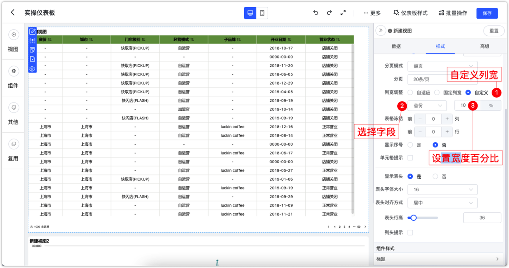

## 1 数据源与数据集
### 1.1 数据集行权限支持设置左右模糊查询（XPack）
!!! Abstract ""
    数据集行权限设置规则新增“开头是”、“结尾是”两种查询条件，对应 SQL 语句中的左右模糊查询。

{ width="900px" }

## 2 仪表板
### 2.1 公共链接支持设置浏览器整体刷新
!!! Abstract ""
    新增刷新设置项，仅对公共链接生效，时间单位仅支持分钟。可解决页面的整体刷新、内存释放问题。
{ width="900px" }

### 2.2 AntV 明细表/汇总表支持按列设置宽度
!!! Abstract ""
    固定列宽并非任何时候都能生效。容器宽度优先级高于列宽，即(表格容器宽度 / 列数 > 指定列宽)，则列宽优先取(容器宽度 / 列数)。
!!! Abstract ""
    方式一：手动针对各个字段配置所占表格宽度的百分比。
{ width="900px" }
!!! Abstract ""
    方式二：手动拖拉。
{ width="900px"}
!!! Abstract ""
    请注意，在预览界面与编辑界面均支持手动拖拉表格宽度，但只有编辑界面下拖拉完成保存后生效，在预览界面拖拉仅用于临时使用，刷新页面后将还原。
{ width="900px"}
### 2.3 优化公共链接下载等按钮显示效果
!!! Abstract ""
    为解决按键遮挡问题，优化了公共链接下载等按钮所在区域。
{ width="900px" } 
{ width="900px" }

### 2.4 指标卡/文本卡在非编辑状态下可以选中并复制内容
{ width="900px" }

### 2.5 表格支持右键复制单元格内容
!!! Abstract ""
    鼠标悬浮到某一单元格上，点击右键，即可复制当前单元格内容（注意，这里不会另外弹出复制按钮，右键之后就已经完成了复制）。
{ width="900px" }

## 3 服务运维
### 3.1 dectl 增加备份与恢复操作
!!! Abstract ""
    dectl 命令新增 backup 和 restore 功能：

    - 备份操作：dectl backup
    - 恢复操作：dectl restore DataEase备份文件.tar.gz

    dectl backup 命令将 DataEase 排除日志目录以外的运行目录（如 /opt/dataease）进行备份压缩，生成备份文件 DataEase备份文件.tar.gz。在安装了同样版本的 DataEase 服务器上，用户可以通过执行 dectl restore DataEase备份文件.tar.gz 将 DataEase 还原为备份的内容。  
    请注意：备份文件中并不包含完整的镜像文件，所以备份和还原操作只能在同版本的情况下执行。