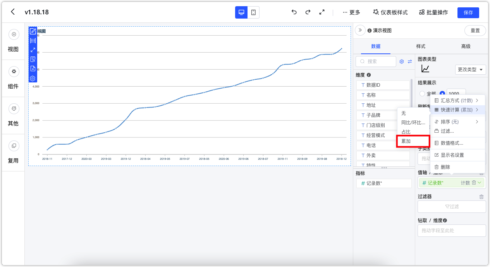
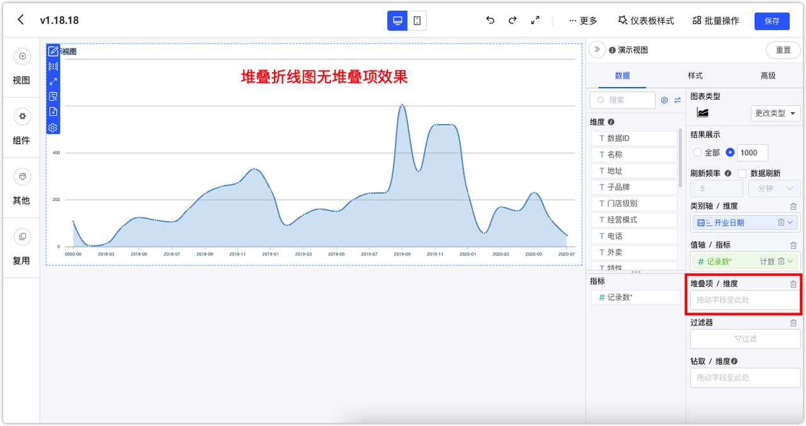
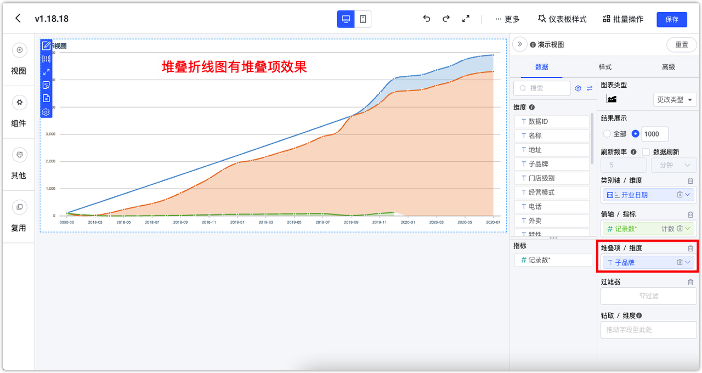
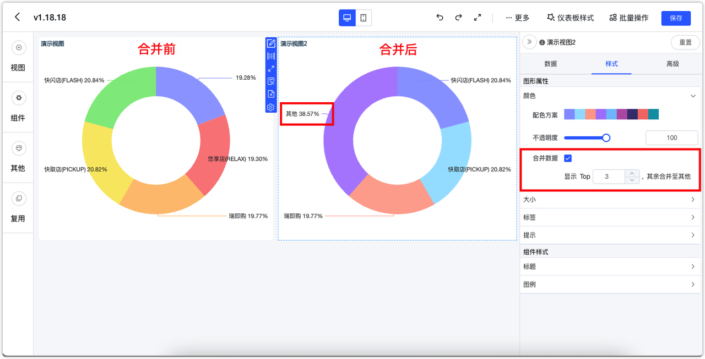
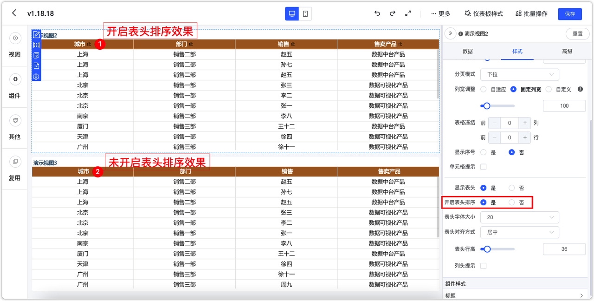

## 1 仪表板
### 1.1 快速计算支持周环比
!!! Abstract ""

    - 当前支持周环比的数据源：MySQL、Oracle、Apache Doris、StarRocks、ClickHouse
    - 操作方式：
         1. 使用时间字段作为维度并设置【日期显示】为【年周】；
         2. 指标【快速计算】选择【同比/环比】下的【周环比】。

{ width="900px" }

{ width="900px" }
!!! Abstract ""
    对于每年的第一周，不同数据源采用的处理逻辑存在差异。具体来说，一些数据源将第一周标记为“w00”，而其他数据源则从“w01”开始。此外，某些数据源在处理每年的第一周时，会用前一年最后一周的几天来填补，以形成完整的第一周。
    在处理环比数据时，如果上一周的数据缺失，那么当前周的环比数据将被设置为 0。

### 1.2 指标快速计算支持累加操作
!!! Abstract ""
    在指标的快速计算类型中选择【累加】，即所显示的数值始终为之前数值的累计值。

{ width="900px" }

!!! Abstract ""
    AntV 和 ECharts 图库大部分视图类型都支持。但以下视图类型需要注意：  
    堆叠折线图需要放置堆叠项、分组柱状图需要放置子类别、堆叠柱状图需要放置堆叠项、分组堆叠柱状图需要放置堆叠项。
{ width="900px" }

{ width="900px" }

### 1.3 ClickHouse、Oracle 数据源支持年季度、年周
!!! Abstract ""
    历史已支持年季度、年周的数据源类型有：Doris、StarRocks、MySQL，本次新增 ClickHouse、Oracle。

{ width="900px" }

### 1.4 饼图/环形图支持显示 TopN
!!! Abstract ""
    AntV 和 ECharts 图库的饼图和环形图均支持 TopN 设置，即显示 TopN，其余的可以合并为其他。

{ width="900px" }

### 1.5 文本下拉组件的选项新增空数据选项
!!! Abstract ""
    文本下拉组件支持过滤空数据。

{ width="900px" }
{ width="900px" }

### 1.6 日期范围筛选组件可设置查询的起止日期
!!! Abstract ""
    区间类型支持以下设置：开始于、结束于、时间区间、动态查询时间窗口（单词查询对多 N 天）。

{ width="900px" }

!!! Abstract ""
    开始于：【开始于】日期前的日期无法被选择，支持设置【固定时间】与【动态时间】。比如，以下设置【开始于】日期为 2024-03-29，则 2024-03-29 前的日期无法再被选择。

{ width="900px" }
{ width="900px" }

!!! Abstract ""
    【结束于】日期后的日期无法被选择，支持设置【固定时间】与【动态时间】。比如，以下设置【结束于】日期为 2024-03-29，则 2024-03-29 后的日期无法再被选择。

{ width="900px" }
{ width="900px" }

!!! Abstract ""
    时间区间：只能选择该区间内的日期进行查询，支持设置【固定时间】与【动态时间】。比如如下设置了一个月的动态时间，则查询组件只能选今天起前一个月内的日期。

{ width="900px" }
{ width="900px" }

!!! Abstract ""
    动态查询窗口：一次最多只能查询 N 天的日期范围，如下所示，设置单次查询时间最多 5 天，则在使用日期范围组件时，无法一次性选择大于 5 天的时间范围。
    
{ width="900px" }
{ width="900px" }

### 1.7 明细表支持隐藏列
!!! Abstract ""
    AntV 和 ECharts 的明细表都支持隐藏列功能，允许用户将数据表中的某些字段设置为“隐藏”状态，这样这些列就不会被显示出来。这一功能特别适用于当用户需要使用特定字段进行排序，但又不希望这些字段在表中显示的情况。

{ width="500px" }

### 1.8 下拉组件支持 radio 风格展示
!!! Abstract ""
    单选的文本下拉组件以及数字下拉组件可在【组件样式】中设置选项平铺展示，展示项最多可设置为 10。

{ width="500px" }

{ width="900px" }

### 1.9 公共链接增加 Ticket 机制
!!! Abstract ""
    公共链接功能现已集成 Ticket 机制，增强了链接的安全性和灵活性。每个 Ticket 均可独立设定有效期。此外，相较于之前版本需要对外部参数进行 base64 编码处理，现在的公共链接外部参数可以直接在 Ticket 参数中简易设置。
    具体操作如下：
    一个仪表板的公共链接为 https://example.dataease.com/link/bcg48L2W；

{ width="500px" }

!!! Abstract ""
    对其进行 Ticket 设置，设置参数为 {"name":"Tony","age":10}，获取到该条 Ticket 的 ticket 为“VMv5FH2o” ；
{ width="500px" }

{ width="500px" }

!!! Abstract ""
    那么，使用 Ticket 的公共链接格式为 https://example.dataease.com/link/bcg48L2W?ticket=VMv5FH2o。在此情况下，无需传递 Ticket 参数，DataEase 将从数据库自动获取 Ticket 相关参数。  
    当启用 Ticket “必选”选项时，只有在 URL 中附带 ticket 参数的情况下，公共链接才能被成功访问。
{ width="500px" }

### 1.10 AntV 折线图支持趋势线
!!! Abstract ""
    目前仅 AntV 折线图支持趋势线设置，支持的算法有：多项式、线性、指数、对数、二次项、幂函数、局部加权。
{ width="900px" }
{ width="900px" }
{ width="900px" }

### 1.11 AntV 漏斗图支持显示转换率

{ width="900px" }

### 1.12 AntV 透视表条件样式支持选择维度字段

{ width="900px" }
{ width="900px" }
{ width="900px" }

### 1.13 AntV 明细表/汇总表可控制是否启用表头排序

{ width="900px" }

### 1.14 AntV 组合图维度字段增加时间字段格式调整功能

{ width="900px" }

## 2 数据填报（XPack）
### 2.1 新增数据填报模块
!!! Abstract ""
    新增【数据填报】模块。可以管理填报表单并下发填报任务。

{ width="900px" }
!!! Abstract ""
    表单配置：配置表单各个字段。
{ width="900px" }
!!! Abstract ""
    保存表单：选择一个具体的数据源，并设置对应表名及表单各个字段对应的数据库表字段名称。后续所填写的表单数据将会被保存至该数据源的库表下。
{ width="900px" }
!!! Abstract ""
    我的填报
{ width="900px" }

## 3 系统配置
### 3.1 OIDC 增加 PKCE 选项（XPack）
!!! Abstract ""
{ width="900px" }

## 4 其他
### 4.1 集成 MaxKB，新增 DataEaseAI 小助手
!!! Abstract ""
    表单配置：配置表单各个字段。
{ width="900px" }

### 4.2 支持配置是否启用 HTML 缓存
!!! Abstract ""
    支持在 /opt/dataease/conf/dataease.properties 配置文件中，通过设置参数 dataease.http.cache 来控制是否启用 html 缓存，默认情况下关闭 html 缓存。
