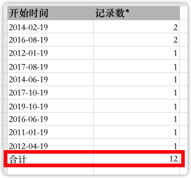

## 1 仪表板
### 1.1 ECharts 组合图支持单独控制主副轴标签

{ width="900px" }

### 1.2 区间条形图支持标签显示间隔值

{ width="900px" }

### 1.3 跳转设置支持选择日期类型的过滤组件联动

{ width="900px" }

### 1.4 支持在视图侧导出视图原始明细数据
!!! Abstract ""
    视图侧支持导出原始明细数据，根据用户权限+视图的过滤条件+仪表板过滤组件+外部传参过滤数据，然后导出该视图所使用的数据集数据，包含数据集所有字段。  
    **注意：公共链接无导出原始明细数据的功能。**

{ width="900px" }

### 1.5 ECharts 汇总表支持导出合计数据

{ width="500px" }

### 1.6 AntV 堆叠柱状图支持按照指标整体排序
!!! Abstract ""

    - 类别轴排序优先级 > 指标排序优先级，即两个都设置了排序规则，会按照类别排序；
    - 堆叠项排序仅影响堆叠项的排列顺序，只作用于每个柱子堆叠项的上下位置；
    - 当未设置维度排序，而设置了指标排序后，会按照指标总值，即所有堆叠项加和后的值排序。

{ width="900px" }
{ width="900px" }
{ width="900px" }

##  2 数据源与数据集
### 2.1 新增数据导出中心
!!! Abstract ""
    视图和数据集页面的 Excel 数据导出功能已进行优化升级。原本版本直接生成 Excel 文件进行导出的机制，现改进为引入一个全新的数据导出中心，以便统一管理所有导出任务。  
    该导出中心默认支持 10 个并发导出任务，并会自动将生成的数据文件导出至 DataEase 服务器。导出任务完成后，用户将会接收到通知，随时可前往导出中心下载文件。
{ width="900px" }
{ width="900px" }

## 3 系统配置
### 3.1 支持用户密码过期策略设置（XPack）
!!! Abstract ""
    支持管理员开启【启用强制修改密码】功能，并设置间隔时间（三个月/半年/一年）。开启后 DataEase 本地用户的密码更换周期受定期更换密码策略的约束。用户将在密码即将过期前一周收到密码即将到期的提醒。一旦密码过期，用户将无法登录，只有管理员能进行处理。  
    通过 CAS、OIDC、LDAP 方式注册的用户不会受到此策略的影响。若 DataEase 本地用户已绑定其他第三方账户，密码过期也将不会影响通过第三方平台进行的扫码登录功能。
{ width="900px" }

## 4  数据填报（XPack）
### 4.1 数据填报加入权限管理
!!! Abstract ""
    数据填报在这个版本中与数据源、数据集和仪表板一并纳入权限控制系统，作为资源进行权限管理。
{ width="900px" }

### 4.2 数据填报支持通过 Excel 批量上传数据
{ width="900px" }

## 5 其他
### 5.1 支持配置动态访问前缀
### 5.2 Pad 端访问被识别为 PC 端布局

