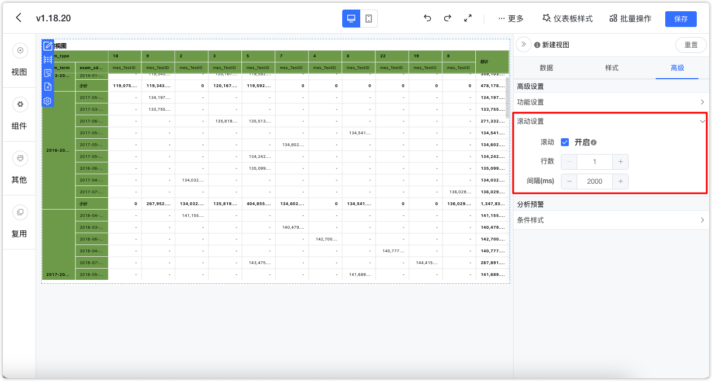
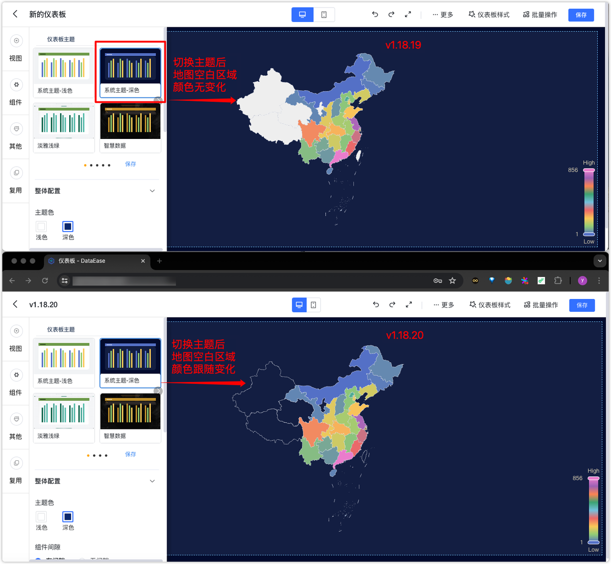
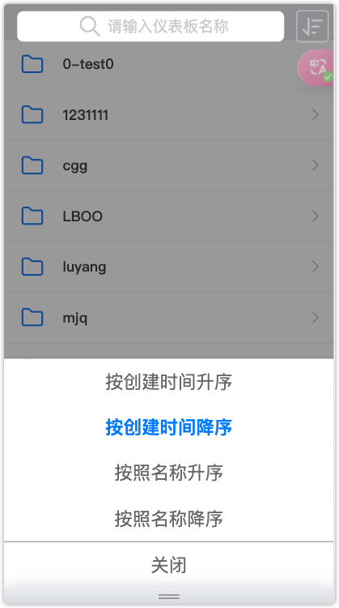
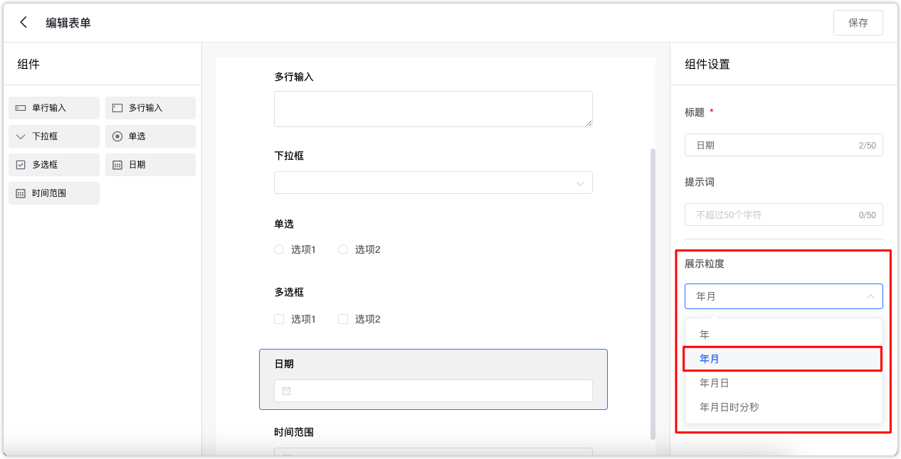
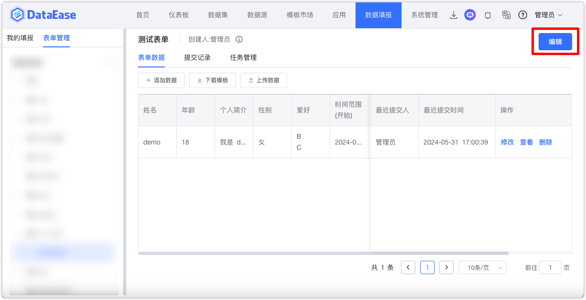

## 1 仪表板
### 1.1 支持根据现有数据生成预测数据
!!! Abstract ""
    支持对 AntV 的基础柱状图和基础折线图做数据预测，使用规则如下：

    - 维度限制为单个时间类型，格式包括年、年季度、年月、年周、年月日；
    - 仅支持计算首个指标，暂不支持多序列；
    - 目前支持的预测模型：多项式拟合、线性回归。

{ width="900px" }

### 1.2 透视表支持表格滚动
!!! Abstract ""
    配置方式与明细表、汇总表一致。

{ width="900px" }

### 1.3 地图空值区域颜色跟随主题

{ width="900px" }
{ width="900px" }

### 1.4 移动端仪表板支持设置排序规则

{ width="600px" }

##  2 数据填报
### 2.1 表单支持年月组件
{ width="900px" }

### 2.2 支持编辑历史表单
{ width="900px" }
!!! Abstract ""
    数字不能切换为其他类型，其他格式类型也不允许切换为数字。

{ width="900px" }

{ width="900px" }
!!! Abstract ""
    原组件若允许多选，在编辑时无法修改为非允许多选，该选项为置灰状态。
{ width="900px" }

!!! Abstract ""
    下拉框、单选、多选框组件的选项值允许编辑，表单的历史数据不做处理，如果历史数据该字段内容不在选项值范围内，那么可以对该数据编辑时，按照最新的选项值选择后，点击「确定」，完成对该条数据的修改。
{ width="900px" }

!!! Abstract ""
    将组件从当前表单中删除后，后台数据表中的物理字段会保留。表单预览数据时，均按照表单中的组件展示，被删除的组件不做展示。
{ width="900px" }

### 2.3 新增复制表单功能
{ width="900px" }
 

## 3 平台对接（XPack）
### 3.1 对接飞书的接口更新为飞书最新 API