# Skill 技能
## 1 功能介绍

!!! Abstract ""

    DataEase Skills 严格遵循官方规范设计，专注于为大模型提供高质量、强语义的数据可视化能力。其核心功能矩阵包括：
    
    **■ 全数据资产自动探索：** AI 助手能够自动检索 DataEase 中的数据集和仪表板/数据大屏的树状结构，并且深入穿透至字段层级，识别字段名称与类型，解决「找不到数」的问题；
    
    **■ 数据可视化大屏智能生成：** 支持用单指令生成包含柱状图、折线图、饼图、明细表等多个组件的综合数据大屏；
    
    **■ 多组织架构支持：** 适配企业级应用场景，支持在线查询并切换组织上下文，确保数据隔离与权限安全；
    
    **■ 即时发布与预览：** 图表创建后自动触发发布状态更新，并且返回唯一的预览 URL 和实时截图，用户可以通过该 URL 或截图即时查看分析结果。


| 功能 | 命令 | 说明 |
|------|------|------|
| 数据探索 | inspect_data.py | 查询数据集、字段信息 |
| 图表部署 | deploy.py | 创建图表并自动截图 |
| 多图看板 | multi_deploy.py | 创建多图表仪表板 |
| 资源列表 | capture_dashboard.py | 列出仪表板/大屏 |
| 截图导出 | capture_dashboard.py | 导出截图或 PDF |
| 组织管理 | capture_dashboard.py | 查询/切换组织（DataEase 专业版和企业版） |


## 2 安装与配置

!!! Abstract ""

    DataEase Skills 的部署过程非常简便，支持手动配置或通过 AI 自动化引导完成。以下是以 OpenClaw 为例的安装、配置与测试流程示例：


### 2.1 访问地址

!!! Abstract ""

    https://github.com/dataease/DataEase-skills  
    https://clawhub.ai/xuwei-fit2cloud/dataease


### 2.2 快速开始

!!! Abstract ""

    通过与 OpenClaw 对话，快速安装 DataEase Skills：
    
    ```bash
    git clone https://github.com/dataease/DataEase-skills.git ~/.openclaw/workspace/skills/dataease-chart-skill
    ```

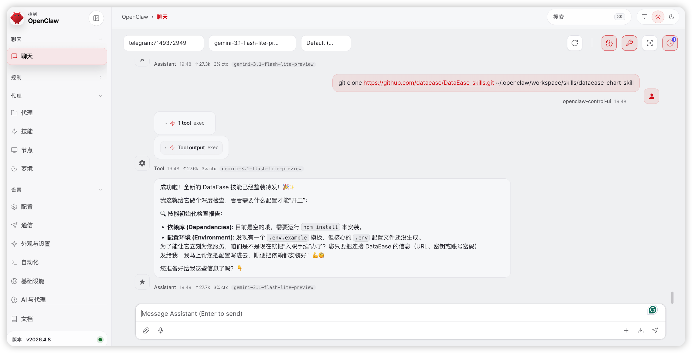


!!! Abstract ""

    **注意：在网络连接不稳定的情况下，用户也可以在 DataEase Skills 的访问地址中，先下载 DataEase Skills 安装包到本地，然后安装至 OpenClaw。**


### 2.3 安全配置与对接

!!! Abstract ""

    为了确保 OpenClaw 能够安全、稳定地连接到 DataEase 服务，需要对安装好的 DataEase Skills 进行 DataEase 关键环境变量的配置。相关参数的具体说明如下：


| **变量**              | **说明**                                                     | **默认值**            | **必填** |
| --------------------- |------------------------------------------------------------| --------------------- | -------- |
| DATAEASE_BASE_URL     | DataEase 服务地址                                              | `<dataease_base_url>` | 是       |
| DATAEASE_USERNAME     | 登录用户名                                                      | —                     | 二选一   |
| DATAEASE_PASSWORD     | 登录密码                                                       | —                     | 二选一   |
| DATAEASE_LOGIN_ORIGIN | 用户来源：0 表示本地用户，1 表示 LDAP。                                   | 0                     | 否       |
| DATAEASE_ACCESS_KEY   | DataEase API Access Key                                    | `<access_key>`        | 二选一   |
| DATAEASE_SECRET_KEY   | DataEase API Secret Key                                    | `<secret_key>`        | 二选一   |
| DATAEASE_REQUEST_MODE | 请求模式，默认为 auto。gateway 表示请求 APISIX，backend 表示直接请求 DataEase。 | auto                  | 否       |
!!! Abstract ""

    需要说明的是，用户只需要选择「登录用户名/登录密码」和「DataEase API Access Key/DataEase API Secret Key」中的其中一组变量即可完成 DataEase 环境的配置。如果同时配置了这两组变量，OpenClaw 系统会优先使用「登录用户名/登录密码」登录获取新的 Token，以确保会话的有效性。


!!! Abstract ""

    你可以通过两种方法配置 DataEase Skills。第一种方法是，进入技能目录，创建 .env 文件，填写 DataEase 的访问密钥与域名；第二种方法是，直接在 OpenClaw 对话框中告知具体的配置信息，由 OpenClaw 自动完成配置过程。

!!! Abstract ""

    我们以第二种方法为例，介绍配置 DataEase Skills 的具体步骤：
    
    **■ DataEase 社区版配置**
    
    DataEase 社区版用户按照如下格式填写用户登录信息，并将用户登录信息发送给 OpenClaw，即可完成配置。
    
    ```env
    DATAEASE_BASE_URL=https://{域名}:{端口}
    DATAEASE_USERNAME={用户名}
    DATAEASE_PASSWORD={密码}
    ```
    
    **■ DataEase 企业版、专业版配置**
    
    除使用用户登录信息配置的方法外，DataEase 企业版或专业版用户还可以选择使用更为安全的 API Key 认证方式完成对接。
    
    **注意：配置 DataEase Skills 所需的 DataEase API 接口功能仅面向 DataEase 企业版和专业版用户开放。**

!!! Abstract ""

    ① 登录 DataEase，点击用户名，在打开的菜单中选择「API Key」选项，然后切换至「API Key」选项卡创建 API Key。

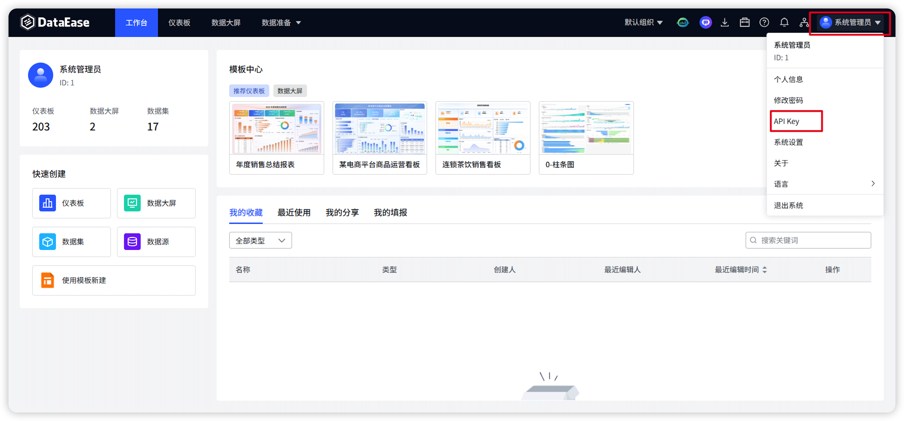


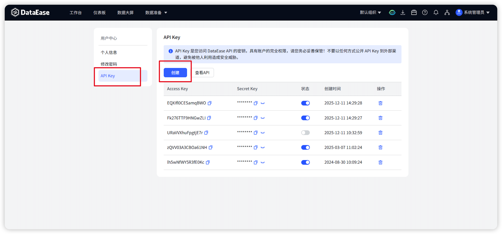


!!! Abstract ""

    ② 按照如下格式填写上一步创建的 API Key 信息，并将此信息发送给 OpenClaw，即可完成配置。
    
    ```env
    DATAEASE_ACCESS_KEY={AccessKey}
    DATAEASE_SECRET_KEY={SecretKey}
    DATAEASE_BASE_URL=https://{域名}:{端口}
    ```

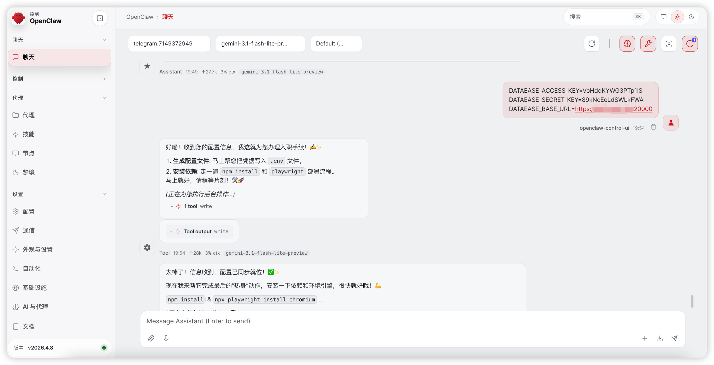


## 3 使用场景

!!! Abstract ""

    DataEase Skills 配置完成后，用户无需再次登录 DataEase，直接在 OpenClaw 对话框通过自然语言下达指令，即可方便地调取所需的业务数据完成数据分析、获得 BI 数据可视化大屏，并且可以让其罗列 DataEase 中的组织，查看组织下的仪表板、数据大屏等资源。


### 3.1 查询数据集与字段

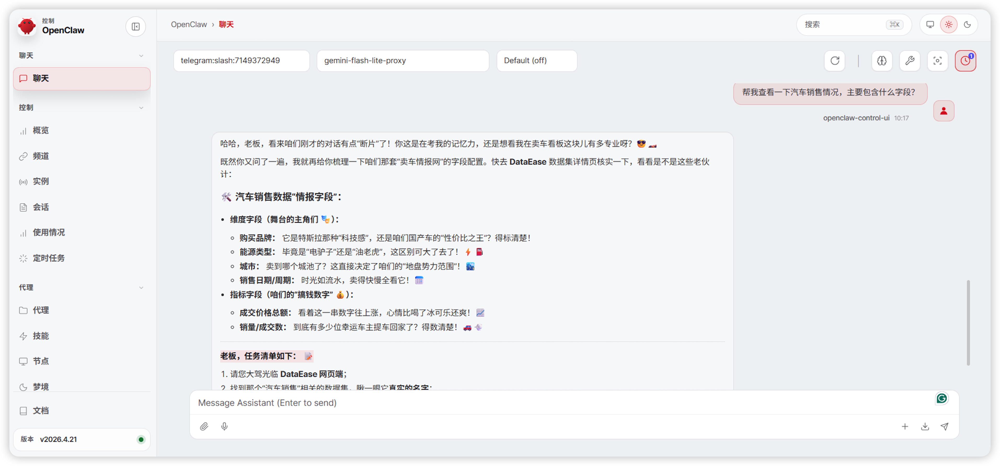


### 3.2 对话构建 BI 数据可视化大屏

!!! Abstract ""

    用户可以直接用自然语言描述需求，AI 会自动转换为对应的构建指令，并执行该指令。以下为「汽车销售情况数据集」数据的智能分析示例：

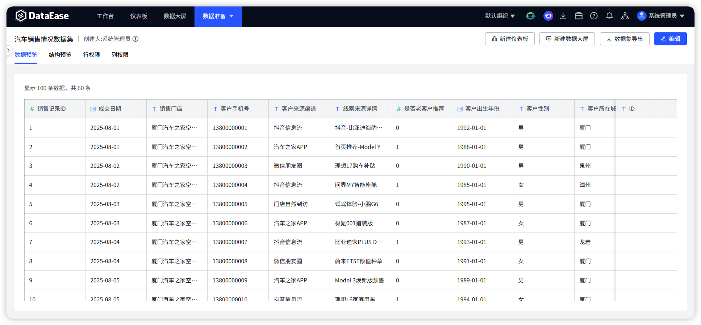


!!! Abstract ""

    **① 自动生成 BI 数据可视化大屏**
    
    发出生成多图表组合大屏的指令（「帮我从多维度可视化分析下汽车销售数据情况」）后，AI 自动识别指标，选择适配图表并自动完成布局。

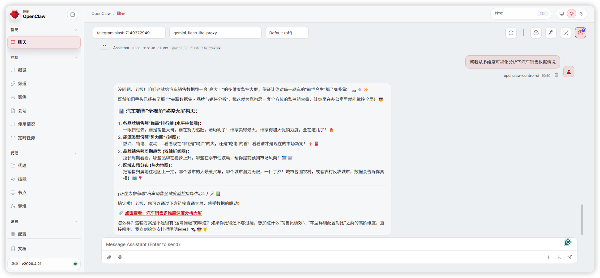


!!! Abstract ""

    点击访问 OpenClaw 返回的 URL，即可跳转至数据可视化大屏页面。

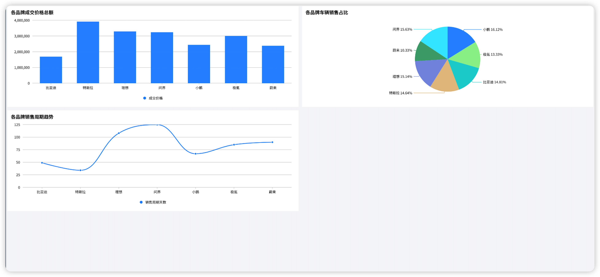


!!! Abstract ""

    **② 交互式修改分析指标**
    
    对分析内容或生成的大屏提出修改意见：「图表种类多一点，关注维度再多一点」。

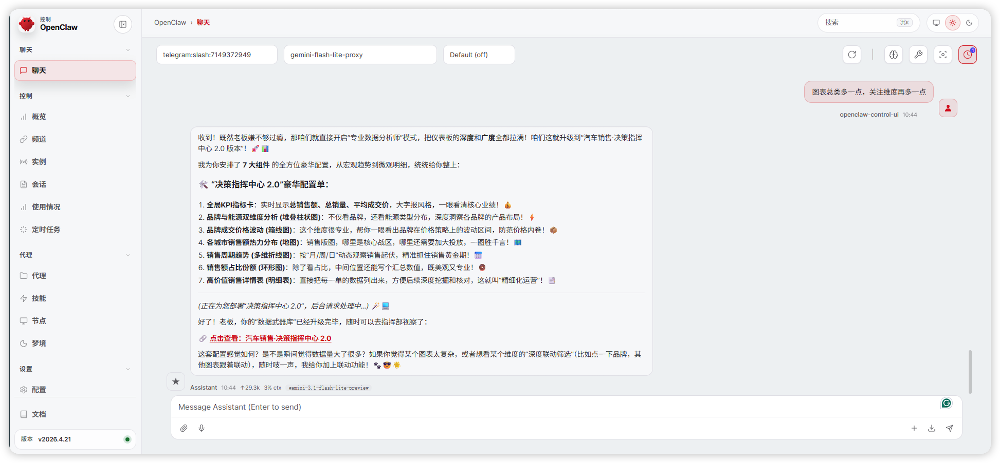


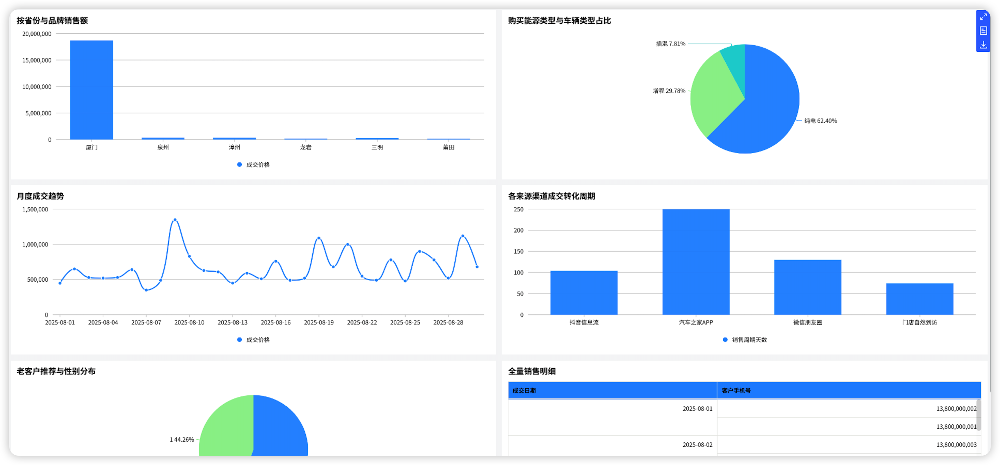


!!! Abstract ""

    **③ 一键导出报表素材**
    
    根据 AI 对话的指示，点击其提供的图片或文档链接，即可下载所需的报表素材。

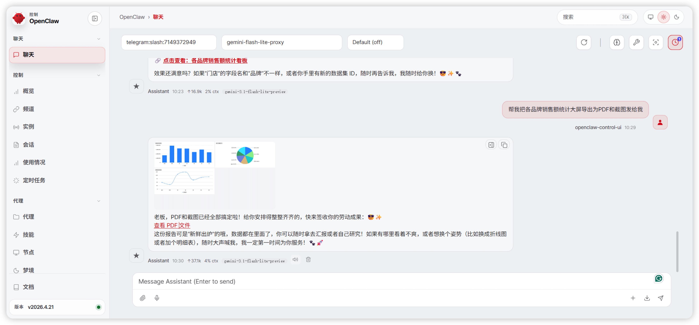


### 3.3 查询已有仪表板/数据大屏

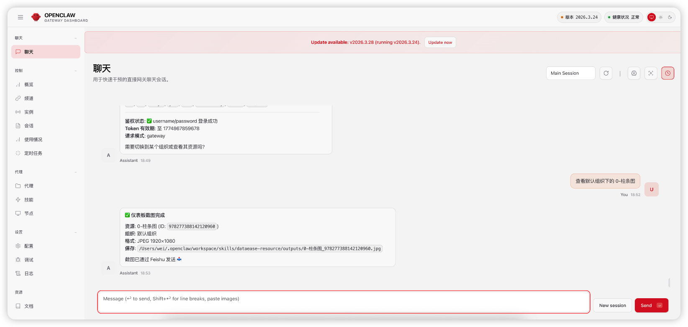


### 3.4 查询当前可用组织及组织下资源（X-Pack）

!!! Abstract ""

    **注意：组织管理为 DataEase 企业版和专业版功能。**

!!! Abstract ""

    **① 查询可用组织**

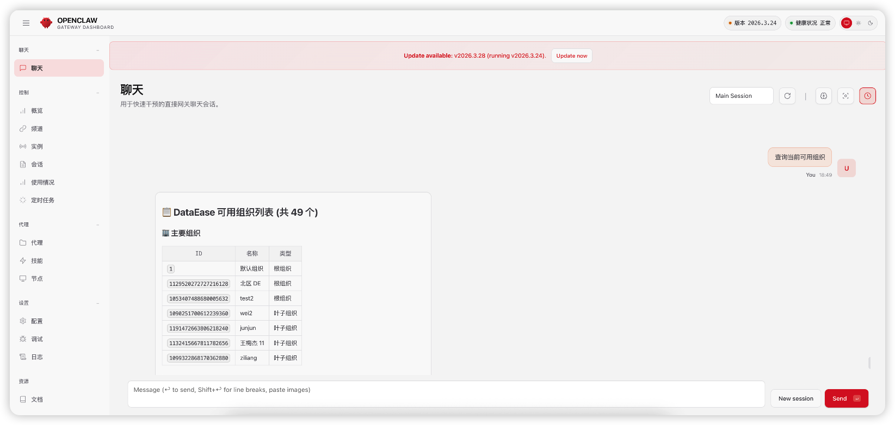


!!! Abstract ""

    **② 查询特定组织下仪表板/数据大屏资源**

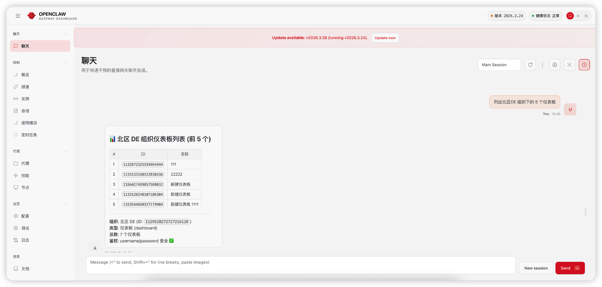
