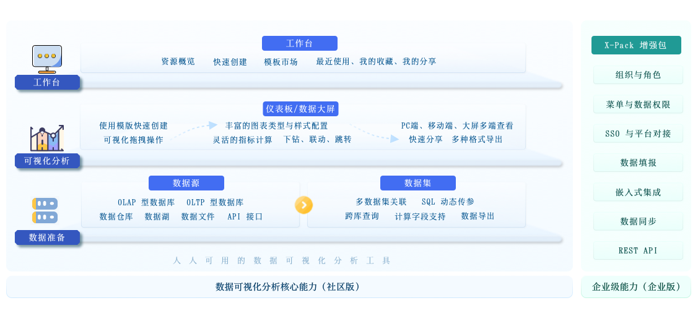
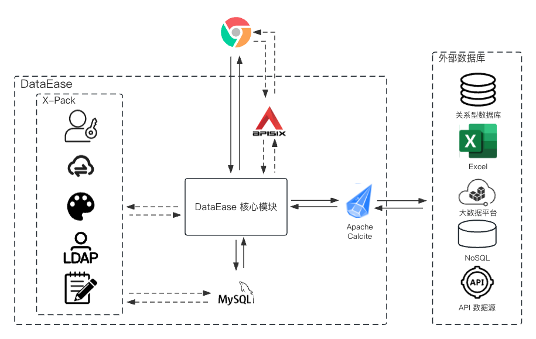

## 1 整体架构

{ width="900px" }

## 2 组件说明

!!! Abstract ""
    - **Frontend**:  DataEase 的前端工程, 基于 Vue.js 进行开发；
    - **Backend**:  DataEase 的后端工程, 基于 Spring Boot 进行开发, 为 DataEase 的功能主体；
    - **MySQL**:  DataEase 项目的主要数据均存储在 MySQL；
    - **Apache Calcite**: 用于对各个数据源做 SQL 方面的统一处理；
    - **Apache Apisix**: API 网关，用来处理路由、认证、IP 访问限制等。

各个组件间的关系可参考下图  
{ width="900px" }

## 3 关键术语

!!! Abstract ""
    **DataEase 中有一些基本概念，下面是这些基本概念的说明：**

    - **数据源**: 用来管理各类数据源连接信息，是后续数据分析操作中数据的来源；
    - **数据集**: 数据的集合，可以是数据表、Excel 表等具体的数据集合，是可视化图形展示的数据来源；
    - **图表**: 可视化展示的最小单元，是组成仪表板的基本元素，可以是折线图、柱状图、饼状图等可视化图形；
    - **仪表板**: 通过可视化效果展示具体数据常见的图形面板，倾向于快速创建及交互操作；
    - **数据大屏**: 通过可视化效果展示具体数据常见的图形面板，更倾向展示效果；
    - **组件**: 仪表板或数据大屏中各种元素的统称，例如图表组件、图片组件、筛选组件等。
    
## 4 技术栈

!!! Abstract ""
    - 后端：[Spring Boot](https://spring.io/projects/spring-boot)
    - 前端：[Vue.js](https://vuejs.org/)、[Element](https://element.eleme.cn/)
    - 中间件：[MySQL](https://www.mysql.com/)
    - 数据处理：[Apache Calcite](https://calcite.apache.org/)
    - 基础设施：[Docker](https://www.docker.com/)
