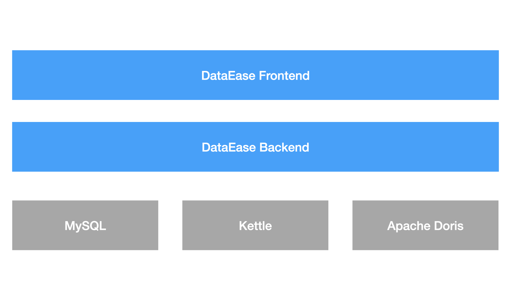
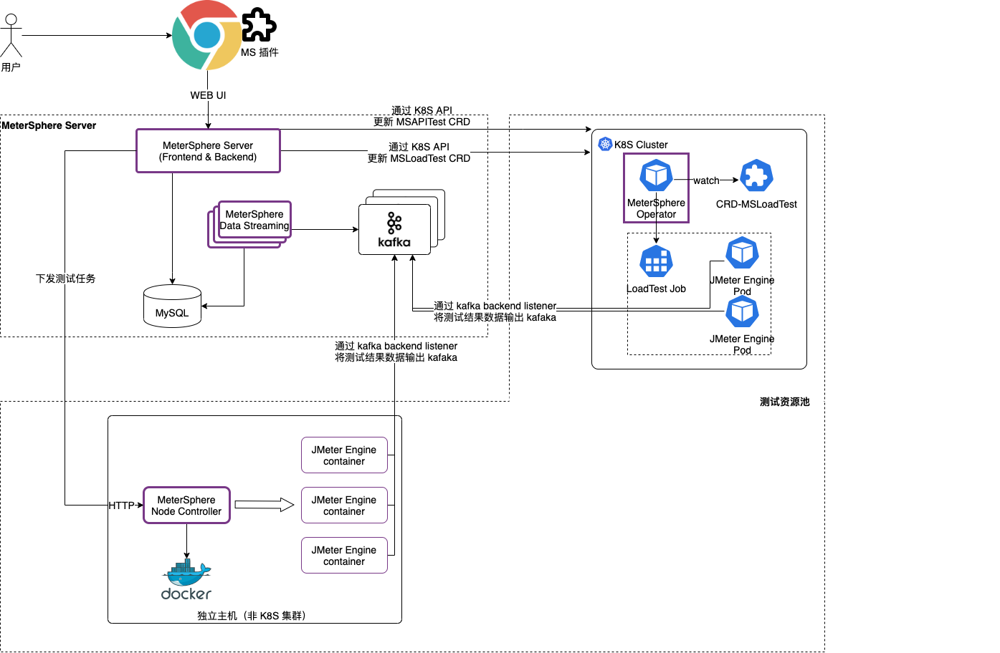

## 整体架构

## 组件说明

!!! Abstract ""
    - **[Frontend](https://github.com/dataease/dataease/tree/main/frontend)**: DataEase 的前端工程, 基于 Vue.js 进行开发
    - **[Backend](https://github.com/dataease/dataease/tree/main/backend)**: DataEase 的后端工程, 基于 Spring Boot 进行开发, 为 DataEase 的功能主体
    - **MySQL**: DataEase 项目的主要数据均存储在 MySQL
    - **[Kettle](https://github.com/pentaho/pentaho-kettle)**: 用于在本地连接模式下抽取和转换来自数据源的数据
    - **[Apache Doris](https://github.com/apache/incubator-doris/)**: 用于提供实时数据分析能力

各个组件间的关系可参考下图

## 关键术语

!!! Abstract "DataEase 中有一些基本概念，下面是这些基本概念的说明。"
    - **数据源**: 用来管理各类数据源连接信息，是后续数据分析操作中数据的来源
    - **数据集**: 数据的集合，可以是数据表、Excel表等具体的数据集合，是可视化图形展示的数据来源
    - **视图**: 可视化展示的最小单元，是组成仪表板的基本元素，可以是折线图、柱状图、饼状图等可视化图形
    - **仪表板**: 通过可视化效果展示具体数据常见的图形面板
    - **模板**: 可用来快速构建仪表板的数据及样式模板
    
## 技术栈

!!! Abstract ""
    - 后端：[Spring Boot](https://spring.io/projects/spring-boot)
    - 前端：[Vue.js](https://vuejs.org/)、[Element](https://element.eleme.cn/)
    - 中间件：[MySQL](https://www.mysql.com/)
    - 数据处理：[Kettle](https://github.com/pentaho/pentaho-kettle)、[Apache Doris](https://github.com/apache/incubator-doris/)
    - 基础设施：[Docker](https://www.docker.com/)
