## 测试目标
使用 MeterSphere 的接口测试功能，测试 MeterSphere 项目管理相关接口是否正常

## 测试场景
- 通过查询项目列表接口，获取现有的项目列表，并判断当前项目列表中没有要创建的项目「接口测试项目」
- 通过创建项目接口，创建一个名称和描述都为「接口测试项目」的项目，并从返回结果中获取该项目的 ID
- 通过查询指定项目接口，传入上一步中获取的「接口测试项目」的 ID，并且判断返回中的项目 ID、名称及描述是否符合预期
- 通过删除项目接口，传入「接口测试项目」的 ID 删除该项目，并通过返回信息判断是否删除成功
- 通过查询指定项目接口，传入「接口测试项目」的 ID 再次查询该项目，通过返回信息再次确认该项目是否删除成功

## 接口分析
MeterSphere 的接口文档位于所部署环境中的 /swagger-ui 路径中，在该文档中的 project-controller 分组中可以找到我们所需的各个接口
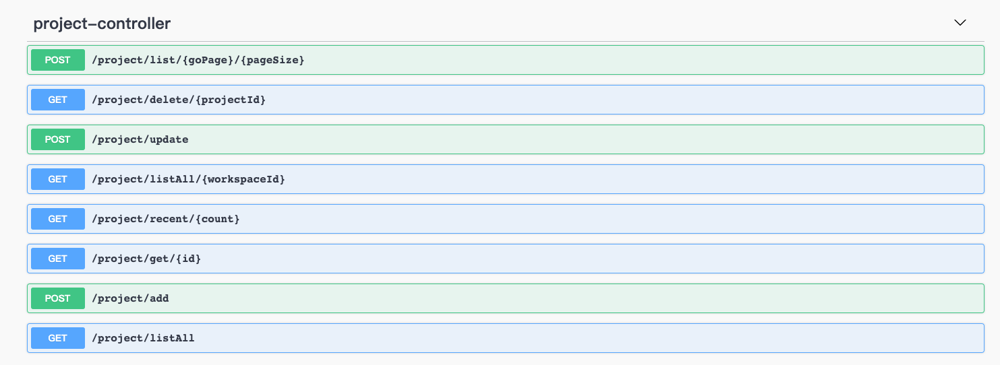


对应上述测试场景，在这里我们需要用到以下接口

- GET /project/listAll
- POST /project/add
- GET /project/get/{id}
- GET /project/delete/{projectId}

依次查看每个接口的定义，可以发现各个接口的返回都是类似如下形式，因此我们可以通过 JSONPath 的方式来获取特定的返回值，判断其是否符合预期或提取为变量供后续请求使用
```json
{
	"success": true,
	"message": "Message",
	"data": {
		"key1": "value1",
		"key2": "value2"
	}
}
```

## 创建接口测试
接下来我们就可以在 MeterSphere 创建一个接口测试，来模拟测试上述测试场景。在本次测试中，我们通过调用登录接口并共享 Cookie 的方式来处理接口的认证问题

### 详细步骤
1. 创建测试并配置场景
在新创建的接口测试场景配置中，新建一个环境配置并填入被测系统的基本信息，同时在场景配置中选择新建的环境并勾选「共享 Cookie」
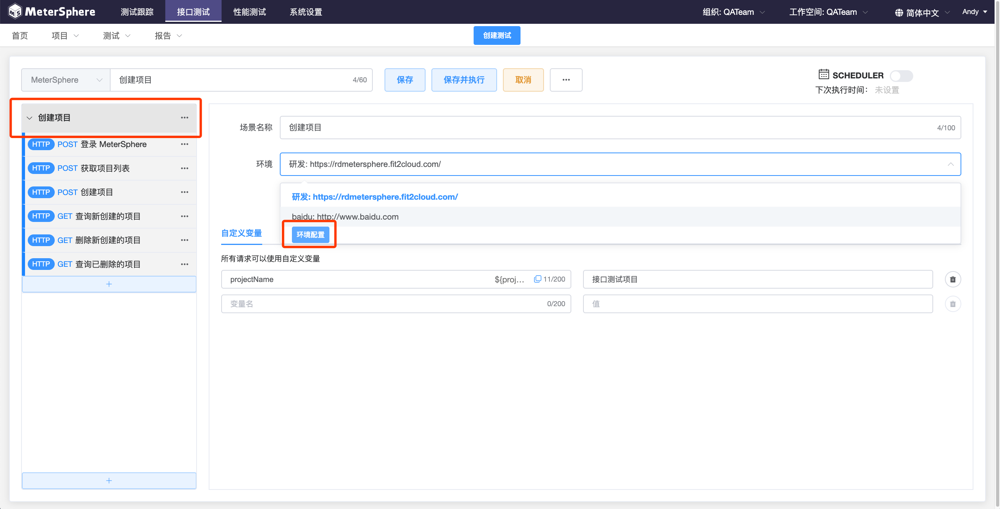
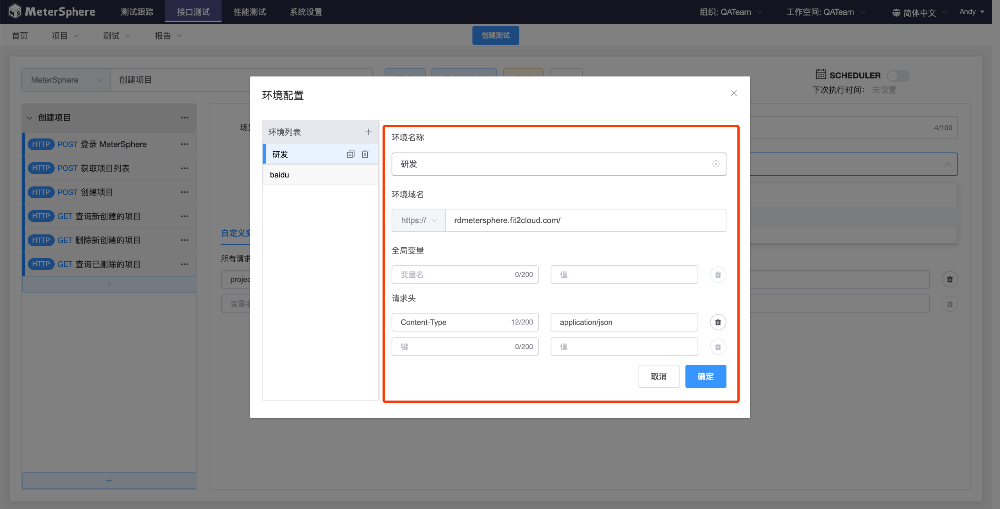
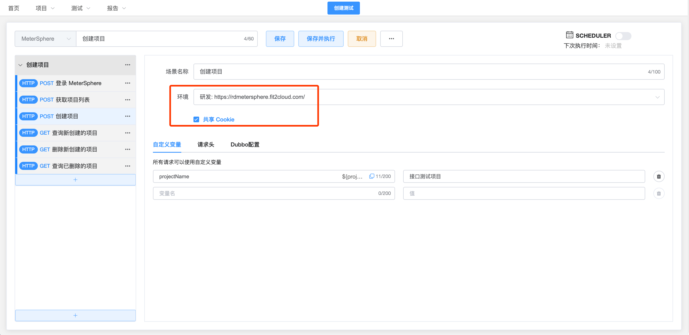

2. 添加一个「登录 MeterSphere」的 HTTP 请求
使用「POST /signin」接口，根据接口定义选择 POST 方法并通过 JSON 的格式传入用户名密码；同时添加断言，判断登录请求是否成功
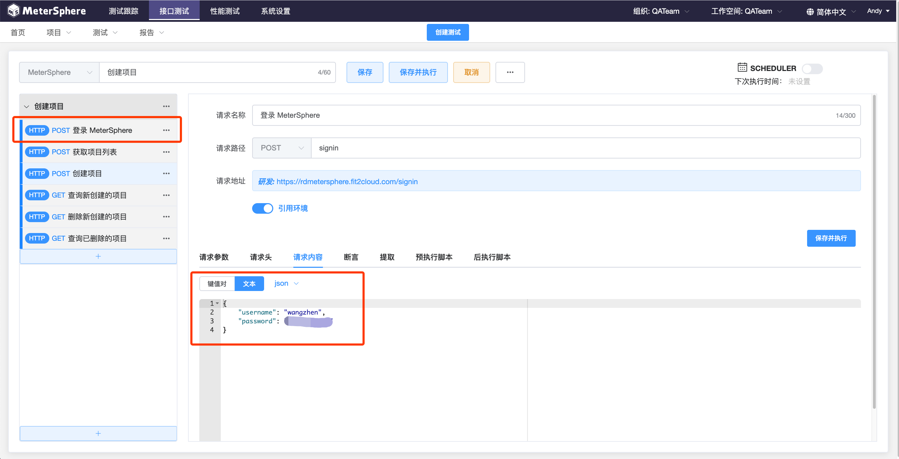
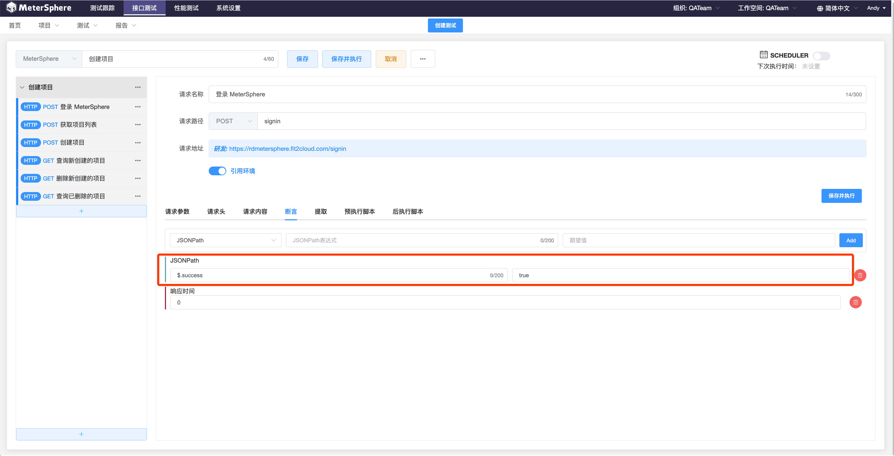

3. 添加一个「获取项目列表」的 HTTP 请求
使用 「GET /project/listAll」接口，在这个接口请求里我们依次添加两个断言：1. 响应内容中的 success 字段值为 true；2. 响应内容中不包含我们要新建的项目名称「接口测试项目」，断言编辑完成后点击「Add」按钮进行添加
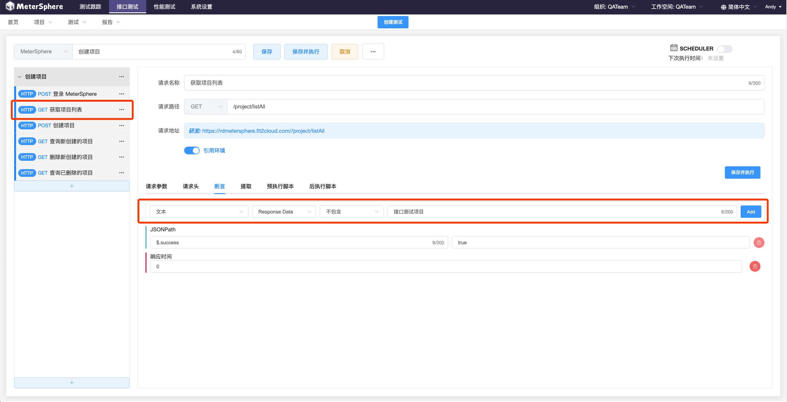

4. 添加一个「创建项目」的 HTTP 请求
使用 「POST /project/create」接口，根据接口定义通过 JSON 格式传入项目名称及描述信息，在这个请求中我们添加一个通用的「响应内容中的 success 字段值为 true」的断言，并通过 JSONPath 格式的提取功能，从返回数据中获取新创建的项目的 ID 存入 projectID 变量中，后续接口可以通过 ${projectID} 格式引用该变量
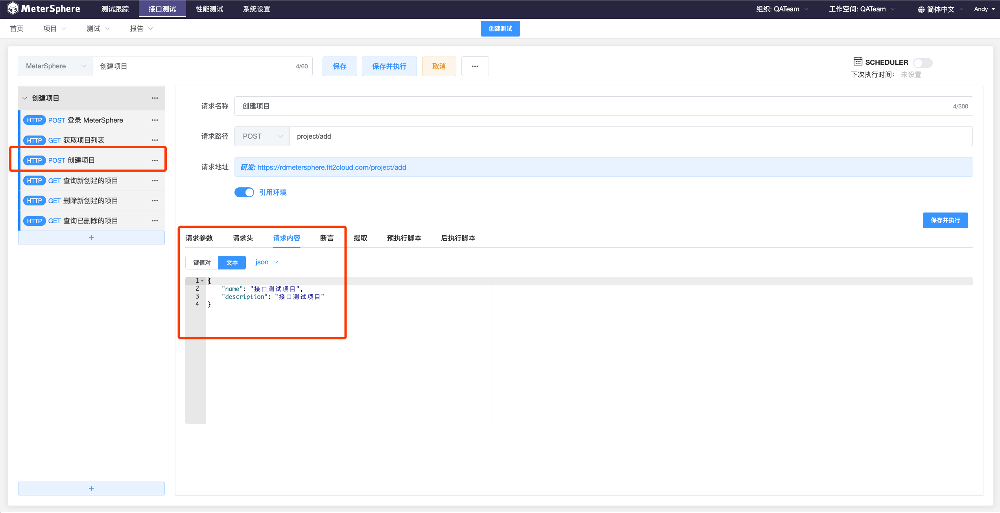
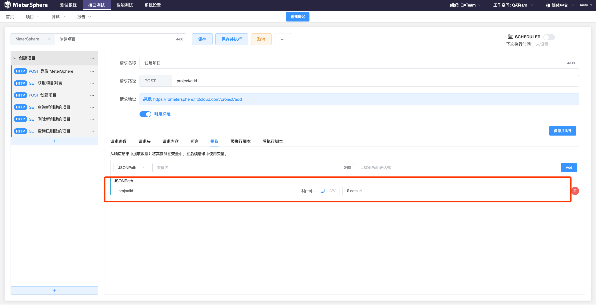

5. 添加一个「查询新创建的项目」的 HTTP 请求
使用「GET /project/get/{id}」接口，在该接口中我们通过在请求 URL 中引用 ${projectId} 变量的方式传入新创建的项目的 ID；同时依次添加4个断言：1. 响应内容中的 success 字段值为 true；2. 响应内容中的项目名称与创建时填写的一致；3. 响应内容中的项目描述与创建时填写的一致；4. 响应内容中的项目 ID 与之前获取的一致
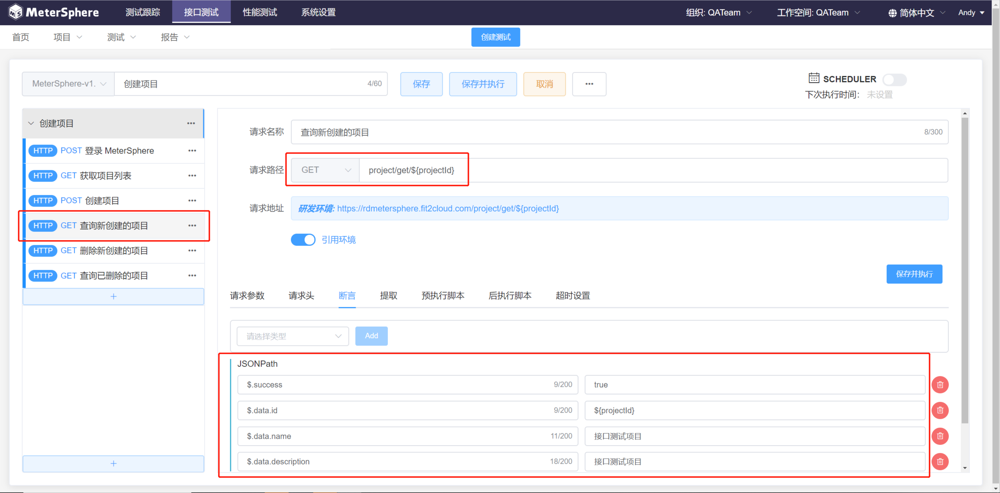

6. 添加一个「删除新创建的项目」的 HTTP 请求
使用 「GET /project/delete/{projectId}」接口，在该接口中我们通过在请求 URL 中引用 ${projectId} 变量的方式传入新创建的项目的 ID；同时添加一个通用的「响应内容中的 success 字段值为 true」的断言
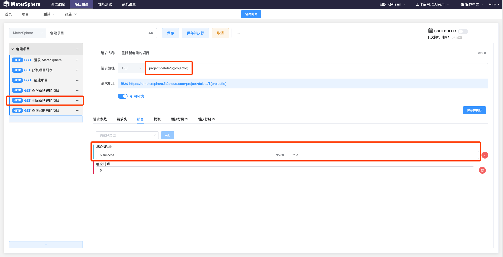

7. 添加一个「查询已删除的项目」的 HTTP 请求
使用「GET /project/get/{id}」接口，在该接口中我们通过在请求 URL 中引用 ${projectId} 变量的方式传入新创建的项目的 ID；由于该项目已删除，根据接口定义其返回内容中的 data 字段应该为空，因而在这个接口中我们依次添加2个断言：1. 响应内容中的 success 字段值为 true；2. 响应内容中 data 字段为空；


## 运行接口测试
至此我们已经通过上面创建的一系列接口请求，实现了我们需要去验证的测试场景，接下来点击「保存并执行」按钮，系统执行完所有测试场景后将自动跳转到测试报告页面，在该页面中我们可以看到所有接口执行结果的概览，同时也可以在左侧的接口列表中选择某个接口查看其详细的请求及响应内容
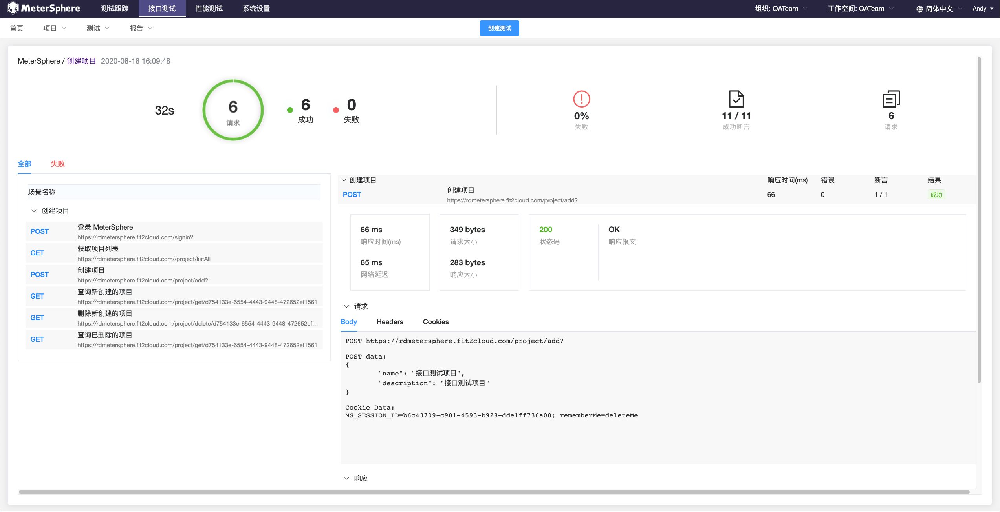
