场景是接口自动化功能中的基本管理单元，由一组用例和接口组装而成。例如用户管理场景，包含用户注册、用户登陆、用户修改、用户注销、用户销户等用例或者接口。

MeterSphere 支持拖拽的方式对场景进行编排和设计，可添加的步骤包括各种协议的请求、断言、自定义脚本、逻辑控制器等。同时场景支持定时、API调用、Jenkins调用等方式触发自动化执行。

## 模块树管理
每个场景都需要属于一个特定的模块，在创建场景前需要先规划并创建模块树。

!!! info "说明"
    接口自动化与接口定义中的模块树相互独立，接口定义中创建的模块不会出现在接口自动化的模块树中。

具体的模块管理操作与接口定义中的模块树类似，请参考接口定义中的 [模块树管理](./api_definition.md#_1)

## 场景管理

### 快速创建场景
在模块树中选择模块，点击模块树上方搜索框右侧的 `创建场景` 按钮 可以仅填写接口基本信息，在该模块下快速创建接口。
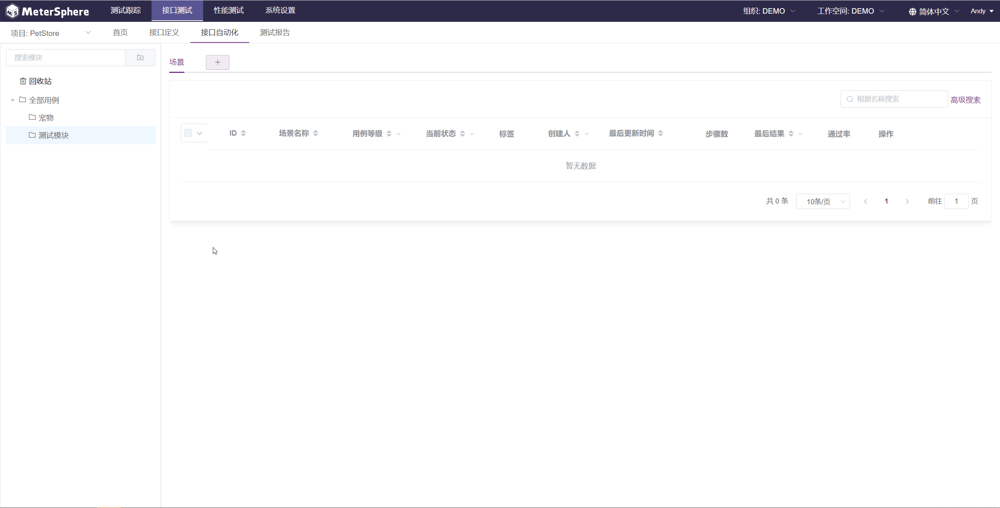

### 编辑场景详情
在场景列表中点击指定场景操作列中的 `编辑` 按钮，进入场景详情编辑页面。在该页面中可以对场景的基础信息，场景的具体步骤等进行进一步编辑。

编辑完成后点击右上角的保存按钮进行保存。
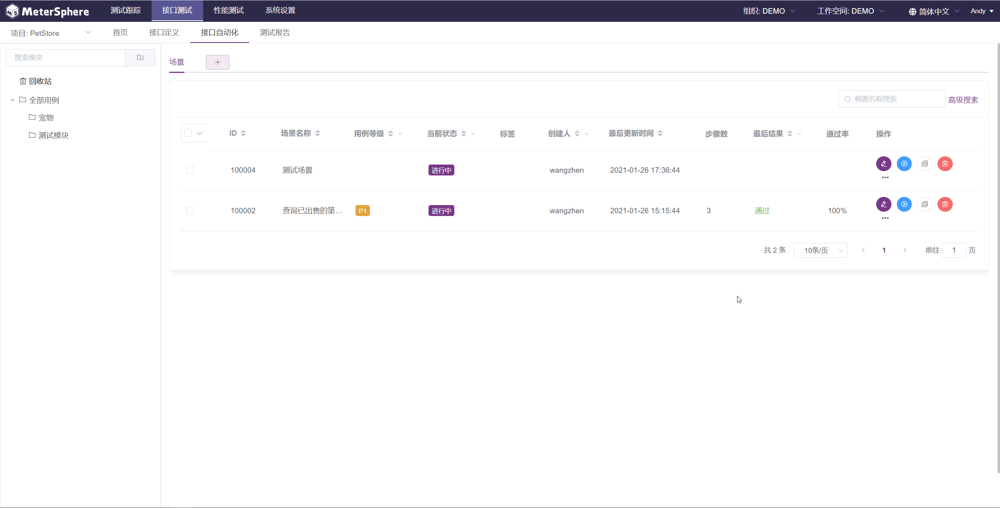

### 场景公共参数配置
在添加场景步骤前可以添加整个场景公用的参数，参数支持多种不同类型，在场景中的步骤均可引用这些参数。
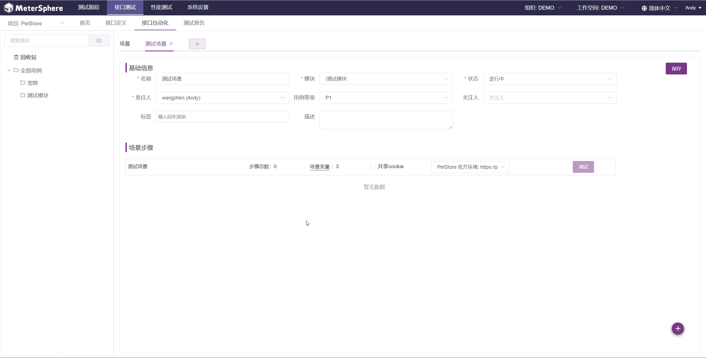

!!! info "参数说明"
    - `常量`
        - `变量名`: 该变量的变量名，可以在场景步骤中通过 ${varName} 的形式引用该变量。
        - `描述`：针对该变量的详细说明。
        - `值`：该变量的值，可以使用 JMeter 中的[内置函数](./functions.md)。
        - **举例说明**：定义变量名为 `varName`，变量值为 `varValue` 的变量，在后续步骤中通过 `${varName}` 引用得到 `varValue`。 
    - `列表`
        - `变量名`: 该变量的变量名，可以在场景步骤中通过 ${varName} 的形式引用该变量。
        - `描述`：针对该变量的详细说明。
        - `值`：以逗号 `,` 分隔的值列表，可以在步骤中通过 ${varName_n} 的形式引用指定位置的值，其中 n 代表要引用的值的位置，从 1 开始。
        - **举例说明**：定义变量名为 `listVar`，变量值为 `value1,value2,value3` 的变量，在后续步骤中通过 `${listVar_1}` 引用得到 `value1`，通过 `${listVar_2}` 引用得到 `value2`。 
    - `CSV`
        - `变量名`: CSV 文件的名称，仅起到标记作用，无法在场景步骤中通过 ${varName} 的形式引用该变量。
        - `描述`：针对该变量的详细说明。
        - `添加文件`：CSV 文件选择，从本地上传 CSV 文件。
        - `Encoding`：CSV 文件的编码格式。
        - `分隔符`：CSV 文件中的数据分隔符，默认为 `,`。
        - **举例说明**：上传 CSV 中的内容如下所示，第一列为变量名列，可以在场景的后续步骤中通过 `${name}`，`${age}` 分别引用第一列和第二列的值。当在循环控制器外引用变量时，变量值为第一个数据值，`${name}=Andy`，`${age}=20`；当在循环控制器内引用变量时，每迭代一次都会取下一行的数据值。

            ```csv
            name,age
            Andy,20
            Tom,22
            ```
    - `计数器`
        - `变量名`: 该变量的变量名，可以在场景步骤中通过 ${varName} 的形式引用该变量。
        - `描述`：针对该变量的详细说明。
        - `开始`：计数器变量的起始值，即最小值。
        - `结束`：计数器变量的结束值，即最大值。
        - `增量`：计数器变量每次增加的增量值，默认为 1。
        - **举例说明**：定义变量名为 `counter1` 的计数器变量，开始值为 `1`，结束值为 `100`，增量为 `1`。当在循环控制器外引用变量时，变量值不会递增，一直为当前值；当在循环控制器内引用变量时，每迭代一次变量值都会增加一次。
    - `随机数`
        - `变量名`: 该变量的变量名，可以在场景步骤中通过 ${varName} 的形式引用该变量。
        - `描述`：针对该变量的详细说明。
        - `最小值`：随机范围的最小值。
        - `最大值`：随机范围的最大值。
        - `输出格式`：随机数的输出格式，例如设定最小值 `1`，最大值 `100`，输出格式为 `000`，则变量值为 `013`，`074` 这样的格式。
        - **举例说明**：定义变量名为 `random1`，最小值 `1`，最大值 `100`，输出格式为 `000` 的变量。当在循环控制器外引用变量时，多次引用变量值不会重新随机，一直为当前值；当在循环控制器内引用变量时，每迭代一次变量值都会重新随机一次。


### 场景步骤编排
#### 添加一级步骤
在场景详情编辑页面，点击页面右下方的 `添加` 按钮，可以在当前场景中添加步骤。点击步骤条目的空白处，可以展开查看步骤详情。
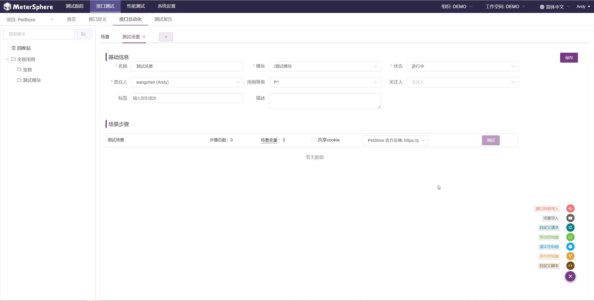

#### 添加子步骤
选中场景中的某一步骤后，右下方可添加的步骤会根据当前选中的步骤进行筛选，点击某个步骤后将其添加为当前选中步骤的子步骤。点击步骤条目左侧的 `展开/收起` 按钮，可以展开/收起该步骤下的子步骤。
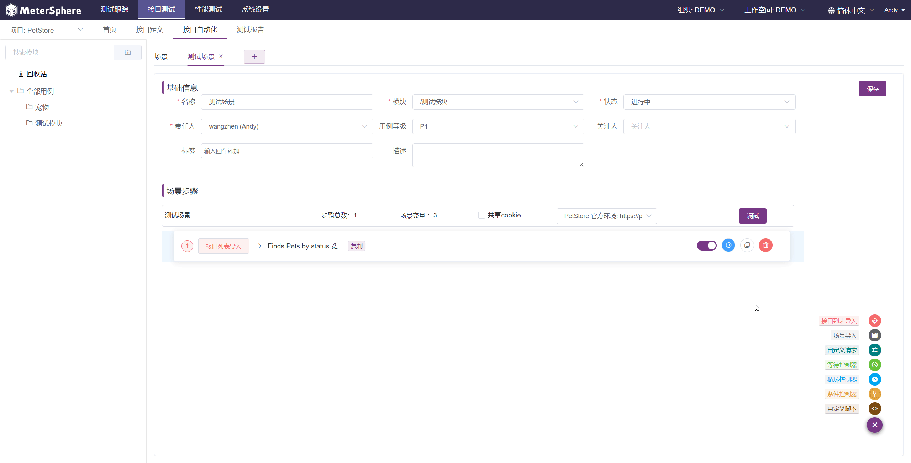

#### 调整步骤顺序及层级
选中某个步骤后长按鼠标左键可以对步骤进行拖拽，拖拽支持调整步骤顺序及层级，通过拖拽可将其变为一级步骤或某个步骤的子步骤。
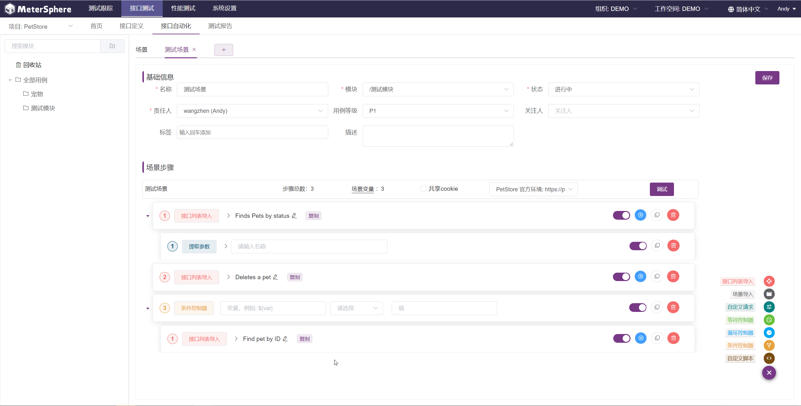

#### 针对步骤的其他操作
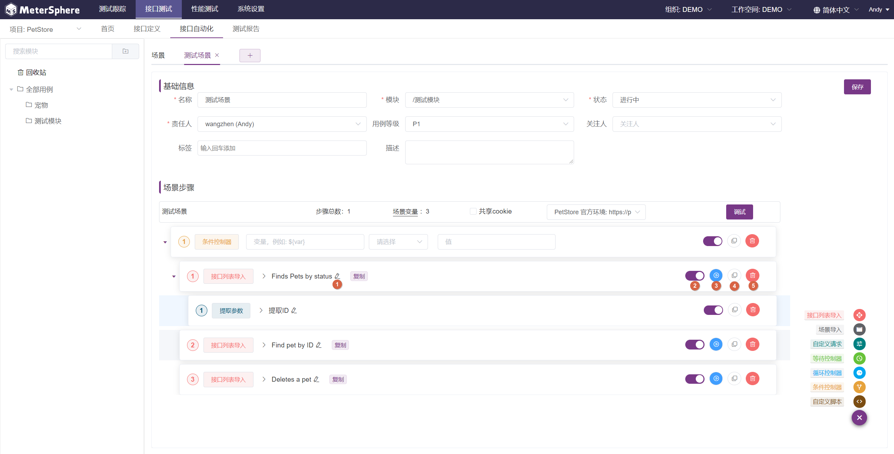

!!! info "操作说明"
    1. **编辑名称**：对于支持配置名称的步骤，点击该按钮可以修改该步骤的名称。
    2. **启用/禁用**：点击该按钮启用/禁用该步骤。
    3. **调试**：对于支持单独执行的步骤，点击该按钮可以单独执行步骤，执行后点击步骤空白处可以在其详情中查看执行结果。
    4. **复制**：复制该步骤。
    5. **删除**：删除该步骤。

!!! info "说明"
    针对不同步骤的详细说明请参考 [用例步骤说明](./api_step.md#_10)。

### 调试指定场景
场景及场景中的步骤创建完成后，在场景详情编辑页面选择场景执行环境并点击 `调试` 按钮，弹出执行结果页面，当场景执行完成后可查看到详细的执行结果。调试产生的结果仅临时存在，无法保存为测试报告供后续查看。
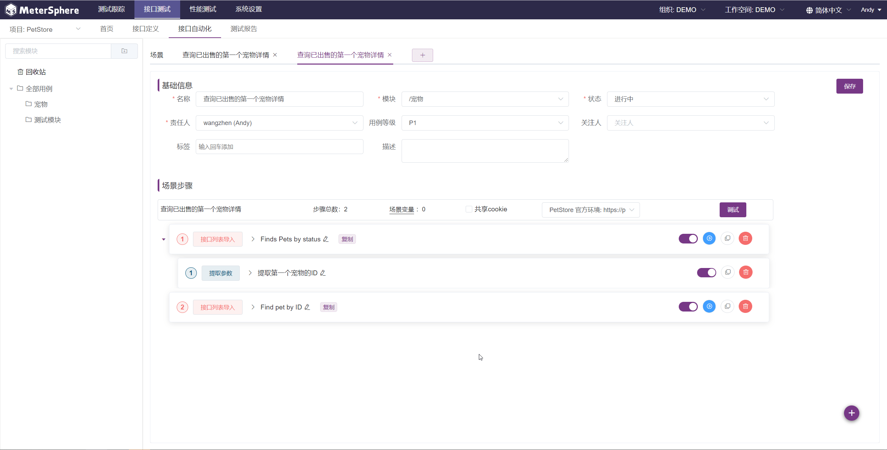

### 执行指定场景
在场景列表中点击指定场景操作列中的 `执行` 按钮，弹出执行结果页面，当场景执行完成后可查看到详细的执行结果。同时点击场景列表中指定场景的 `最后结果` 列，可查看该场景最后一次的执行结果。执行产生的结果可以保存为测试报告供后续查看，当不手动保存为测试报告时，只保留场景最近一次执行的结果。
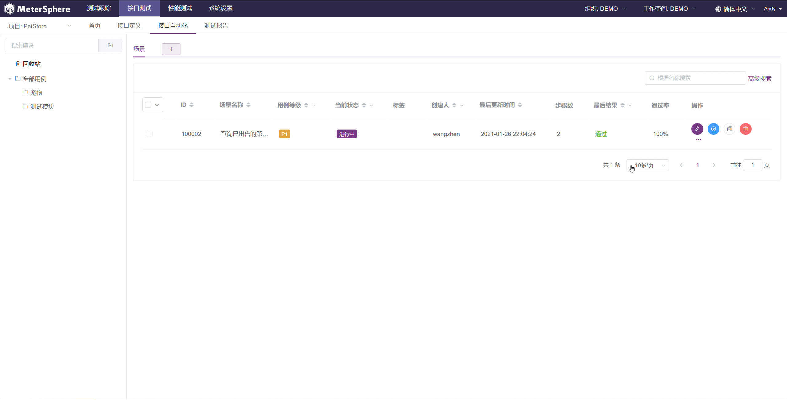

### 批量执行场景用例
在场景列表中选中多个场景后点击批量操作按钮中的 `批量执行`，所有用例执行完成后可进入 `测试报告` 页面查看执行结果。
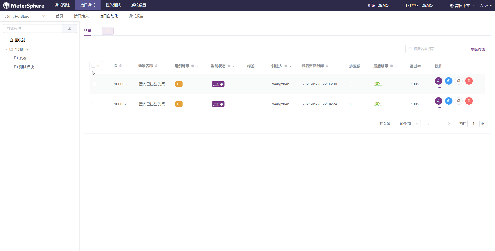

### 将场景移入回收站
在场景列表中点击指定场景操作列中的 `删除` 按钮，该场景将被移入回收站，同时场景变为 `废弃` 状态。用户可以点击左侧模块树中的 `回收站` 查看已废弃的场景。
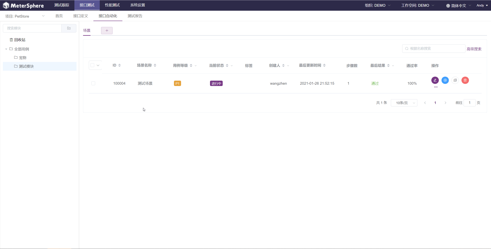

### 恢复场景
点击左侧模块树中的 `回收站`，选择要恢复的场景点击操作列中的 `恢复` 按钮。


### 彻底删除场景
点击左侧模块树中的 `回收站`，选择要彻底删除的场景点击操作列中的 `删除` 按钮。


!!! error "注意"
    从回收站中删除某个场景时，该场景将从数据库中删除且无法恢复，请谨慎使用该功能。
