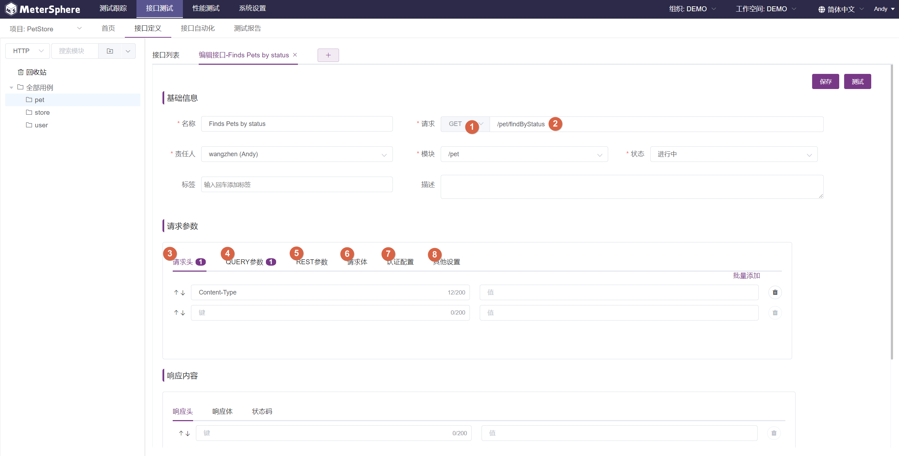

## HTTP 请求

!!! info "参数说明"
    1. HTTP 请求方法：该接口对应的 HTTP 方法，支持 GET、POST、PUT、DELETE 等。
    2. HTTP 接口相对 URL：该接口的相对 URL，不需要填写协议及域名信息。
    3. 请求头：该接口需要携带的请求头。
    4. QUERY 参数：该接口支持的 QUERY 参数，请求发送时参数会以 `?para1=value1&para2=value2` 的形式追加在 URL 之后
    5. REST 参数：该接口在 URL 路径中的参数，例如接口 URL 为 `/pet/{petId}`，则需要填写一个参数键为 `petId`，参数值为需要查询的宠物 ID 的 REST 参数。
    6. 请求体：该接口所需的 HTTP Boby 定义，支持 `form-data`，`json`，`xml`，`binary` 等格式。
    7. 认证配置：支持常见的 HTTP 认证配置，例如 HTTP Basic 认证。
    8. 其他设置：该接口的其他设置，例如超时时间、是否跟随重定向等设置。

## DUBBO 请求

## TCP 请求

### TCP 接口定义

## SQL 请求

