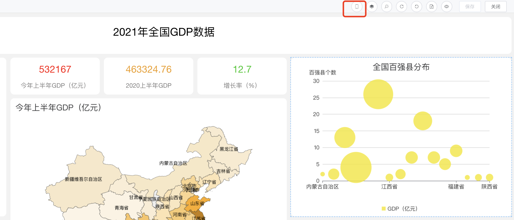
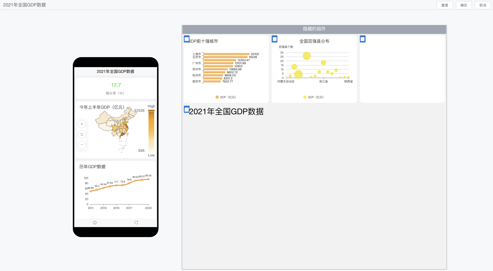

## 功能概述

!!! Abstract ""
    仪表板除了可以在PC端查看外，还可以在移动端查阅，满足用户随时随地查阅报表的需求。  
    **请注意：访问移动端无需安装 APP，使用浏览器直接访问 DataEase 链接信息即可。**

## 移动端布局设计

!!! Abstract ""
    一、在仪表板的编辑页面点击下图所示位置，由PC端布局设计切换至手机端布局设计页面。

!!! Abstract ""
    二、手机端的布局设计操作相对也比较简单，可点击组件左上角选中后展示在移动端，并可通过拖拉调整组件的位置、大小等。

## 移动端-主页

!!! Abstract ""
    主页用于快捷查看高频使用的仪表板，主要展示用户收藏、最近浏览、分享给我的仪表板列表。 

## 移动端-目录

!!! Abstract ""
    展示全部的仪表板，不在主页中的仪表板可以查看。

## 移动端-我的

!!! Abstract ""
    可查看个人信息、切换语言、系统版本等

## 仪表板查看

!!! Abstract ""
    仪表板查看页面，支持收藏、刷新仪表板，另外支持视图的放大、联动、钻取等

