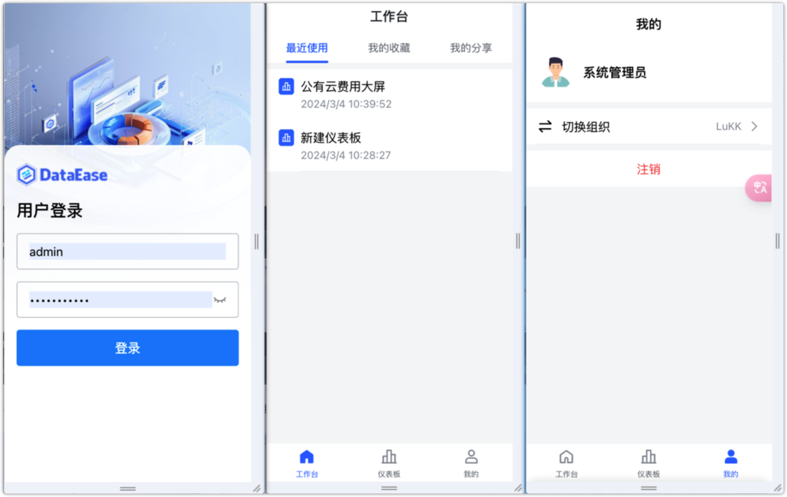
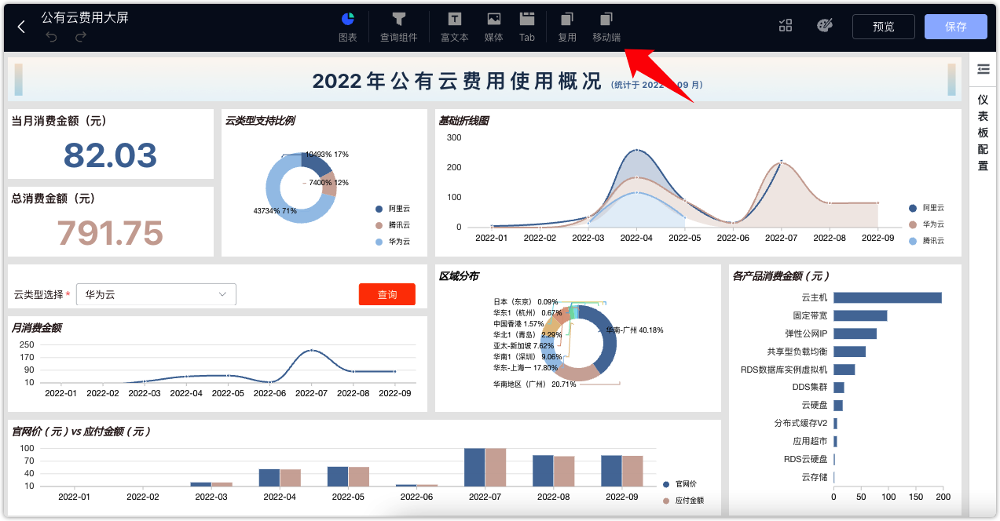
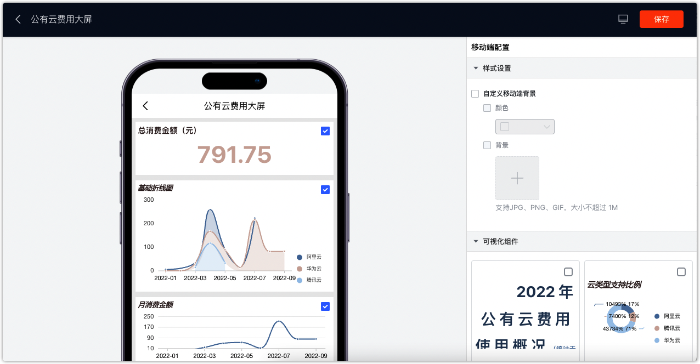

## 1 移动端概述

!!! Abstract ""
    仪表板除了可以在 PC 端查看外，还可以在移动端查阅，满足用户随时随地查阅报表的需求。  
    **请注意：访问移动端无需安装 APP，使用浏览器直接访问 DataEase 链接信息即可。**

## 2 移动端界面

!!! Abstract ""
    首页用于快捷查看高频使用的仪表板，主要展示用户收藏、最近浏览、分享给我的仪表板列表。
    功能说明：

    - 移动端共有“工作台”、“仪表板”和“我的”三个 Tab 栏；
    - 工作台类似 PC 端工作台场景，可以查看“最近使用”、“我的收藏”、“我的分享”；
    - 移动端仅支持查看仪表板资源（数据大屏由于使用场景和分辨率问题，不考虑在移动端支持）；
    - 支持在“我的”中切换当前组织。

{ width="900px" }

## 3 移动端布局设计

!!! Abstract ""
    在仪表板的编辑页面点击下图所示位置，由 PC 端布局设计切换至移动端布局设计页面。
    移动端的布局设计操作相对也比较简单，可点击组件左上角选中后展示在移动端，并可通过拖拉调整组件的位置、大小等；  
    移动端支持自定义背景，可单独设置移动端的背景颜色或背景图片。

{ width="900px" }

{ width="900px" }

