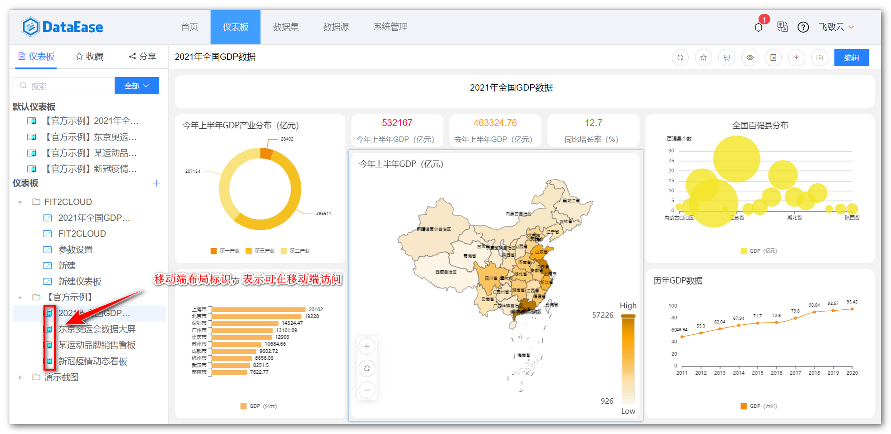

## 1 移动端布局设计

!!! Abstract ""
    在仪表板的编辑页面点击下图所示位置，由 PC 端布局设计切换至移动端布局设计页面。

{ width="900px" }

!!! Abstract ""
    移动端的布局设计操作相对也比较简单，可点击组件左上角选中后展示在移动端，并可通过拖拉调整组件的位置、大小等；  
    移动端支持自定义背景，可单独设置移动端的背景颜色或背景图片。

{ width="900px" }

!!! Abstract ""
    **完成移动端布局设计后，仪表板列表界面会显示具有移动端布局的标识，不具备移动端标识的仪表板不会出现在移动端的查看列表中。**

{ width="900px" }

## 2 移动端仪表板访问

!!! Abstract ""
    在移动端浏览器直接访问 DataEase 链接信息，输入密码信息即可访问。  
    仪表板查看页面，支持收藏、刷新仪表板，另外支持视图的放大、联动、钻取等。

