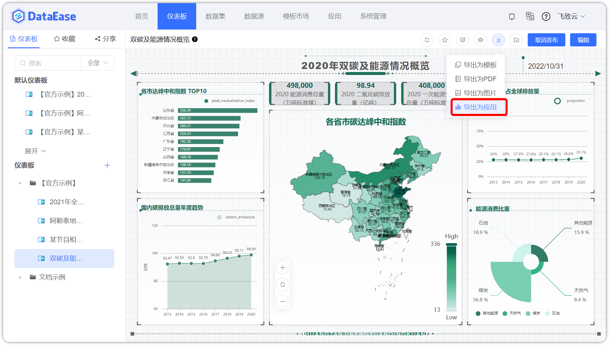
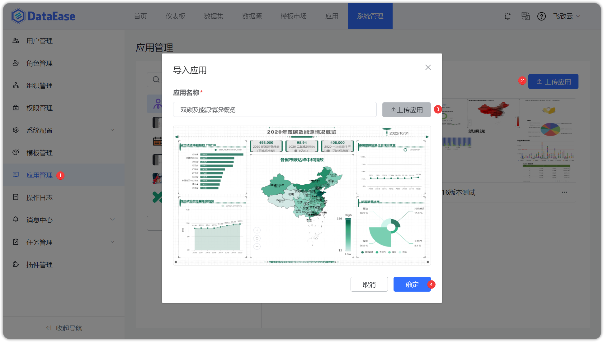
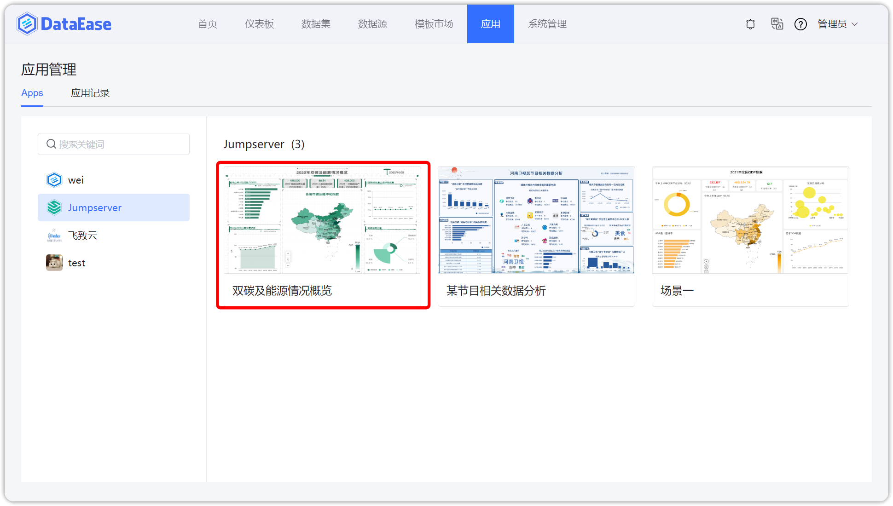
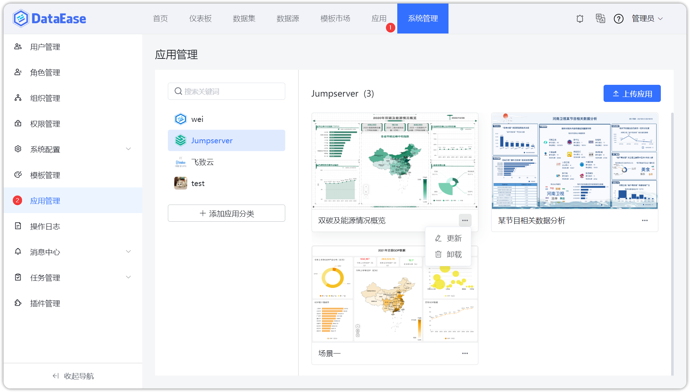
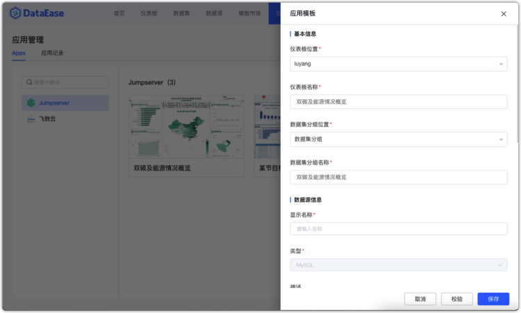
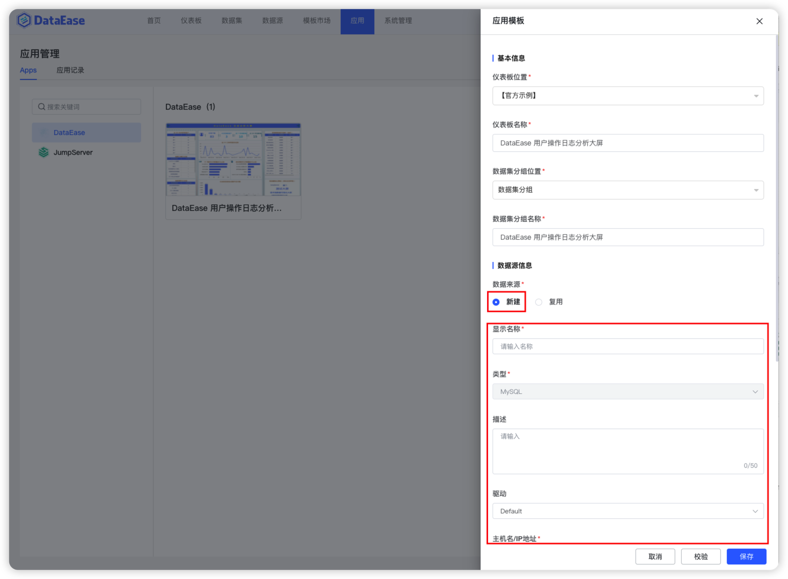

## 1 应用概述

!!! Abstract ""
    支持快速创建第三方系统仪表板，支持将仪表板【导出为应用】，可将仪表板及其用到的数据集、数据源关联关系一并导出成一个应用文件。

## 2 应用导出

!!! Abstract ""
    支持将仪表板【导出为应用】，如下图所示。

{ width="900px" }

{ width="900px" }

## 3 应用上传

!!! Abstract ""
    系统管理员可在【应用管理】中上传应用。

{ width="900px" }

{ width="900px" }

## 4 应用管理

!!! Abstract ""
    【系统管理】【应用管理】中支持应用分类管理，应用的更新、卸载、移动等操作。

{ width="900px" }

!!! Abstract ""
    普通用户可以在【应用】菜单里使用应用，可以预览应用、查看应用的使用记录等。

{ width="900px" }

{ width="900px" }

{ width="900px" }

## 5 应用使用

!!! Abstract ""
    选择一个应用并点击【应用】，在弹出的对话框中，【基本信息】系统会自动填充，若不满足要求，可自行调整；  
    【数据源信息】里数据来源选择"新建"则填写第三方系统的数据源连接信息，选择"复用"则选择存量数据源。点击【保存】后，DE 自动创建数据源、数据集、仪表板。

{ width="900px" }

!!! Abstract ""
    选择"新建"的情况如下：

{ width="900px" }

!!! Abstract ""
    选择"复用"的情况如下：

{ width="900px" }