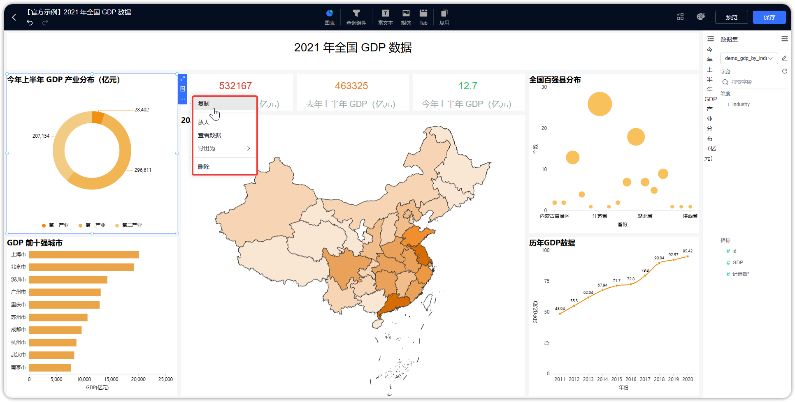

## 1 编辑仪表板

!!! Abstract ""
	点击下图所示的位置或者新建仪表板，进入仪表板编辑界面。

{ width="900px" }

{ width="900px" }

## 2 撤销

!!! Abstract ""
	点击下图按钮，撤销上一步操作。

{ width="900px" }

## 3 恢复

!!! Abstract ""
	点击下图按钮，可以对组件操作恢复。

{ width="900px" }

## 4 样式

!!! Abstract ""
	点击【样式】按钮，左侧弹出仪表板样式编辑页面。

{ width="900px" }

### 4.1 仪表板主题

!!! Abstract ""
	可在此位置设置仪表板的主题，包括系统主题与自定义主题，如下图所示，点击【保存】，可保存为仪表板主题。
	
{ width="900px" }

### 4.2 仪表板整体配置

!!! Abstract ""
	如下图所示，可调整仪表板主题色、组件间隙，主题色支持浅色与深色切换。  
	**提示：** 设置组件间隙有或无。

{ width="900px" }

!!! Abstract ""
	如下图所示，可设置仪表板的刷新频率，支持到秒级刷新时间。  
	**提示：** 此设置在仪表板编辑页面不生效。

{ width="900px" }

!!! Abstract ""
	如下图所示，可调整图表展示结果，选择【仪表板】，则覆盖图表的结果展示数量，取值范围 1~10000。

{ width="900px" }

### 4.3 仪表板背景
!!! Abstract ""
	如下图所示，点击【仪表板背景】，设置仪表板背景颜色或图片，支持重新上传背景图片。

{ width="900px" }

### 4.4 图表样式

!!! Abstract ""
	仪表板的样式设置支持调整所有组件的共用样式，即将影响整个仪表板已存在的组件，同时在图表层面也可做微调；  
	如下图所示，支持设置组件背景颜色、透明度、边框半径以及背景；

{ width="900px" }

### 4.5 组件配色

!!! Abstract ""
	如下图所示，支持调整图表的配色方案，支持调整卡片的配色，包括文本卡与指标卡的配色，支持调整表格的配色，包括汇总表、明细表与透视表。

{ width="900px" }

### 4.6 图表标题

!!! Abstract ""
	如下图所示，支持统一设置标题样式，标题样式首先基于仪表板，各图表可再在组件层面做微调。

{ width="900px" }

### 4.7 过滤组件
	
!!! Abstract ""
	如下图所示，支持设置过滤组件标题样式，包括位置调整与颜色调整，支持输入框样式调整。

{ width="900px" }

## 5 批量操作

!!! Abstract ""
	点击批量操作按钮，选择图表，可批量设置图表样式属性，且根据所选择的图表不同，可修改的属性不同，如下图所示。

{ width="900px" }

!!! Abstract ""
	当勾选多个不同类别的图形时，只能批量修改共性的属性。

{ width="900px" }

## 6 复用

!!! Abstract ""
	支持复用所有的组件，复用图表支持适配当前仪表板样式。

{ width="900px" }

!!! Abstract ""
	复制上图不一样样式的仪表板中的图表会自动适配当前仪表板下的样式。

{ width="900px" }

## 7 保存

!!! Abstract ""
	点击下图所示的保存按钮，保存仪表板。

{ width="900px" }

## 8 返回

!!! Abstract ""
	点击下图所示的返回按钮，关闭仪表板。

{ width="900px" }

## 9 快捷键使用

!!! Abstract ""
	仪表板支持快捷键功能，支持复制、放大、查看数据、导出。  

{ width="900px" }

