## 1 编辑仪表板

!!! Abstract ""
	点击下图所示的位置，进入仪表板编辑界面。

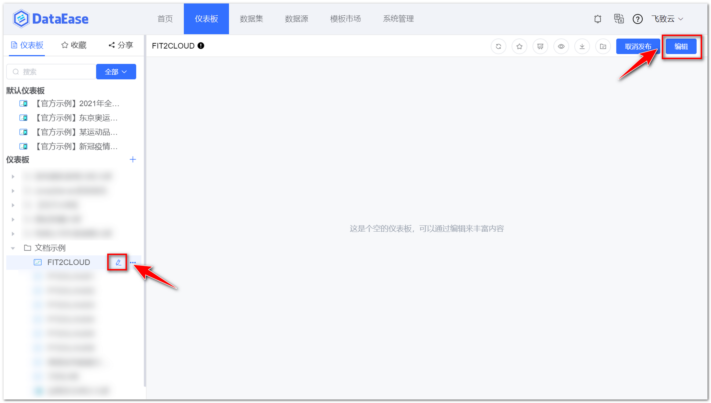{ width="900px" }

!!! Abstract ""
	当仪表板处于编辑的场景下，前进后退浏览器会弹出提示信息，避免在操作过程中由于使用触摸板不小心退出编辑的情况。

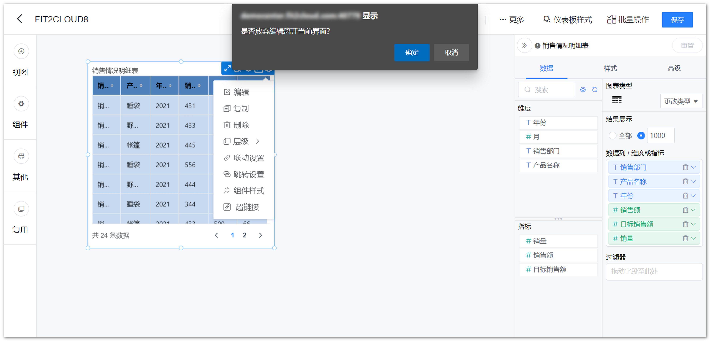{ width="900px" }

!!! Abstract ""
	当编辑仪表板且未保存最新的内容，出现直接快捷键切掉浏览器界面（或是异常退出），重新打开 DataEase 选择到刚才的仪表板并编辑，出现如下提示，选择 “是” 后即可恢复原先并未点击保存但系统自动缓存的仪表板的内容。  

    - 仪表板每 5 秒检查一次是否有仪表板变动，有变动的话保存一次缓存；
    - 如果存在异常退出的情况，则再次进入可以选择恢复缓存。

{ width="900px" }

## 2 清空画布

!!! Abstract ""
	v1.12.0 版本开始，仪表板编辑界面右上方元素，比如：元素移入布局方式，辅助设计网格，外部参数设置，清空画布的操作图标归类到【更多】，并增加了文字说明。  
	点击下图的按钮，清空画布，可以重新添加组件。

{ width="900px" }

## 3 重做

!!! Abstract ""
	点击下图按钮，可以对组件重做。

{ width="900px" }

## 4 撤销

!!! Abstract ""
	点击下图按钮，撤销上一步操作。

{ width="900px" }

## 5 样式

!!! Abstract ""
	点击【样式】按钮，左侧弹出仪表板样式编辑页面。

{ width="900px" }

### 5.1 仪表板主题

!!! Abstract ""
	可在此位置设置仪表板的主题，包括系统主题与自定义主题，如下图所示，点击【保存】，可保存为仪表板主题。
	
{ width="900px" }

### 5.2 仪表板整体配置

!!! Abstract ""
	如下图所示，可调整仪表板主题色、组件间隙，主题色支持浅色与深色切换。  
	**提示：** 设置组件间隙有或无，适用于"矩阵"模式。

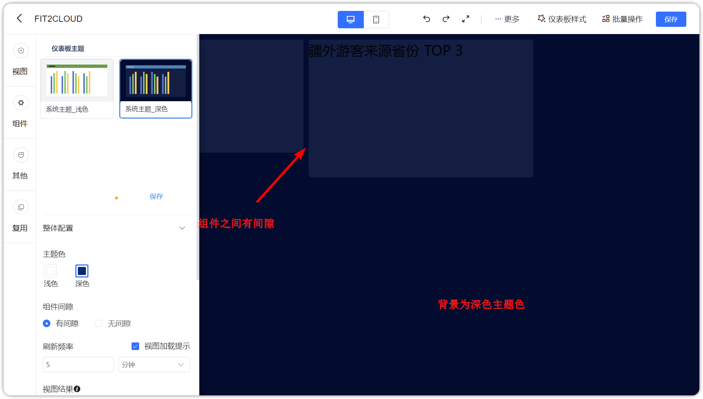{ width="900px" }

!!! Abstract ""
	如下图所示，可设置仪表板的刷新频率，支持到秒级刷新时间。  
	**提示：** 此设置在仪表板编辑页面不生效。

{ width="900px" }

!!! Abstract ""
	如下图所示，可调整视图展示结果，选择【仪表板】，则覆盖视图的结果展示数量，取值范围 1~10000。

{ width="900px" }

### 5.3 仪表板背景
!!! Abstract ""
	如下图所示，点击【仪表板背景】，设置仪表板背景颜色或图片，支持重新上传背景图片。

{ width="900px" }

### 5.4 视图样式

!!! Abstract ""
	v1.12.0 版本开始，仪表板的样式设置支持调整所有组件的共用样式，即将影响整个仪表板已存在的组件，同时在视图层面也可做微调；  
	如下图所示，支持设置组件背景颜色、透明度、边框半径以及背景；  
	**提示：** DataEase v1.12.0 之前版本，此处设置需要将视图样式设置为 [「样式优先级」](../view_module/view_design/#3) 跟随仪表板才会生效。

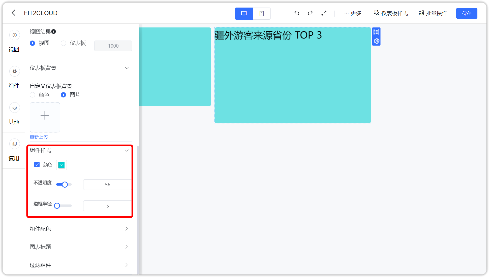{ width="900px" }

### 5.5 组件配色

!!! Abstract ""
	如下图所示，支持调整视图组件的配色方案，支持调整卡片的配色，包括文本卡与指标卡的配色，支持调整表格的配色，包括汇总表、明细表与透视表。

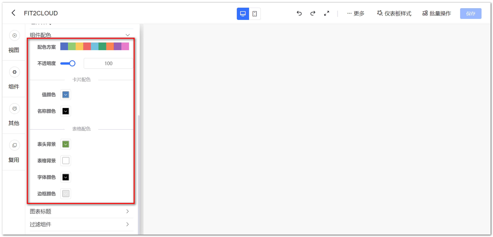{ width="900px" }

### 5.6 图表标题

!!! Abstract ""
	如下图所示，支持统一设置标题样式，标题样式首先基于仪表板，各图表可再在视图层面做微调。

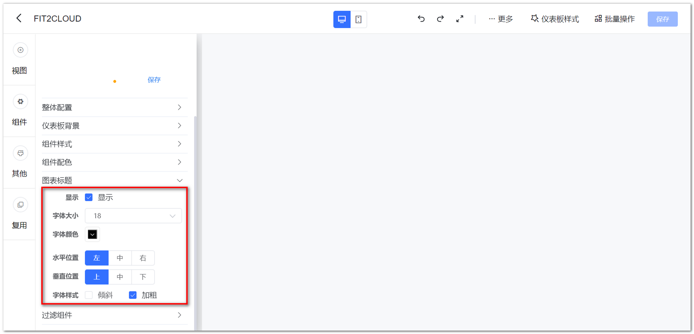{ width="900px" }

### 5.7 过滤组件
	
!!! Abstract ""
	如下图所示，支持设置过滤组件标题样式，包括位置调整与颜色调整，支持输入框样式调整。

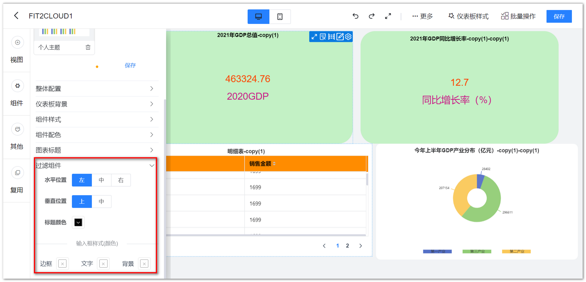{ width="900px" }

## 6 元素移入分布方式

!!! Abstract ""
	可设置元素移入仪表板后的分布方式为"矩阵"或"悬浮"：

    - 矩阵：元素可自动对齐，具有相同的间隔距离，用户放置时元素会自动挤压分布，不可多层叠加；
    - 悬浮：元素可完全按照用户移动位置放置，可多个元素叠加，不受其它组件挤压。  

    **提示：新移入仪表板的元素受该设置影响，已存在仪表板的元素不受其修改的影响，可单独修改元素的属性。**

{ width="900px" }  
{ width="900px" }

## 7 组件自适应
!!! Abstract ""
	开启组件自适应选项后，仪表板缩放时，所有组件（包括视图和过滤组件）均会跟随缩放。

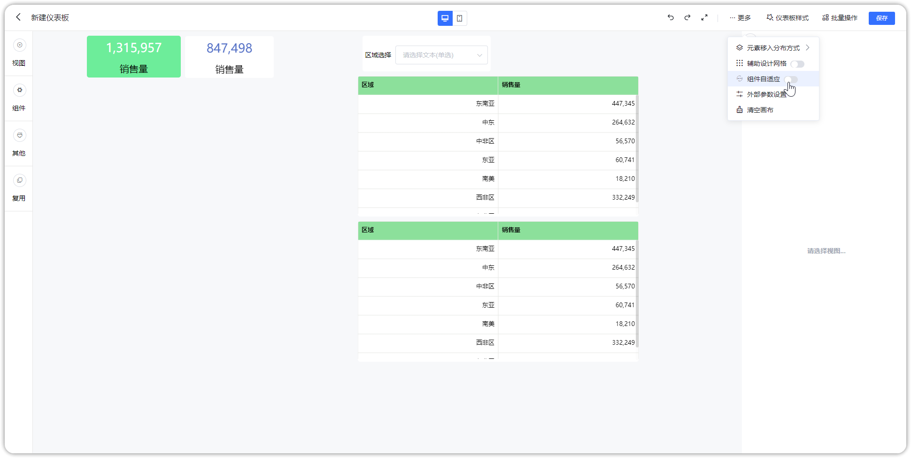{ width="900px" }

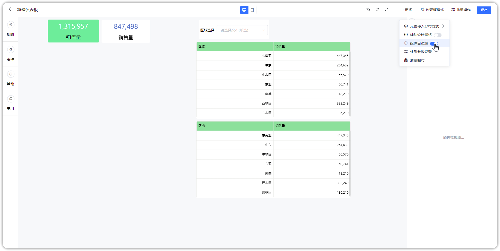{ width="900px" }

## 8 外部参数设置

!!! Abstract ""
	点击下图按钮，弹出外部参数设置页面，外部参数设置步骤：

	- 【序号 1】：增加一个参数并命名，启用参数，可设置多个参数；
	- 【序号 2】：配置联动视图与联动视图的字段；
	- 【序号 3】：点击【确定】保存。

{ width="900px" }  
{ width="900" }

!!! Abstract ""
	**公共链接参数组装，对传参进行 base64 处理，以下为示例：**  
	配置参数名为"省份"，关联了 “2021 年全国 GDP 数据” 仪表板中“今年上半年 GDP” 和 “GDP 前十强城市” 的 province
	字段，组装参数为 {"省份":"北京市"}，使用 base64 加密处理，该示例通过电脑终端进行，其它方式均可。
	```shell
	echo '{"省份":"北京市"}'|base64
	```
	加密结果为：eyLnnIHku70iOiLljJfkuqzluIIifQo= ，组装规则如下:  
	< 仪表板公共链接 > + < ?attachParams= > + < 加密后的结果 >  
	构建完整的 URL 为：<仪表板公共链接>?attachParams=eyLnnIHku70iOiLljJfkuqzluIIifQo=  
	以公共链接的形式访问仪表板，关联的内容被过滤。

	**注意：** 在做完 base64 编码后，再做一次 encodeURIComponent 的 URL 编码，以防有些内容编码后存在特殊字符，浏览器无法解析的情况。  
	存在这类字符时，会提示”外部参数解析错误未生效，请按规定编码方式传参“。

{ width="900px" }

!!! Abstract ""
	公共链接外部参数支持一参多传，可通过数组形式传入多值，对组件进行多选，如下示例，对参数进行处理。  
	**提示：** 传参处理时，若拼接后的 URL 带特殊符号，需做转换处理，示例如：+ 用 %2B 替代。
	```shell
	echo '{"省份":["山东省","四川省","广东省","河南省"]}'|base64
	```
	访问构建后的 URL 结果如下。

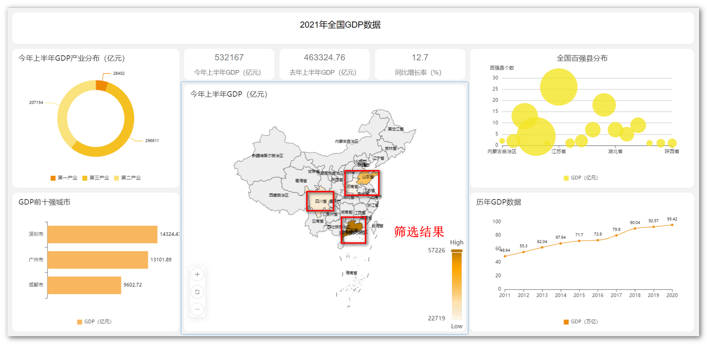{ width="900px" }

!!! Abstract ""
	公共链接外部参数支持多参数传参，将外部参数名称及过滤的数据组合成 Json 再对传参进行 base64 处理，以下为示例：
	
	```shell
	echo '{"省份":"广东省","年份":"2020"}'|base64
	```
	加密结果为：eyLnnIHku70iOiLlub/kuJznnIEiLCLlubTku70iOiIyMDIwIn0K  
	配置参数"省份"。

{ width="900px" }

!!! Abstract ""
	配置参数"年份"。

{ width="900px" }

!!! Abstract ""
	访问：<仪表板公共链接>?attachParams=eyLnnIHku70iOiLlub/kuJznnIEiLCLlubTku70iOiIyMDIwIn0K，结果如下。

{ width="900px" }

!!! Abstract ""
	仪表板外部参数支持与过滤组件进行匹配，外部传参可以传入到筛选条件中，且支持多选的情况。筛选条件参数优先级为：外部参数 > 动态条件（如本月、昨天） > 默认参数。

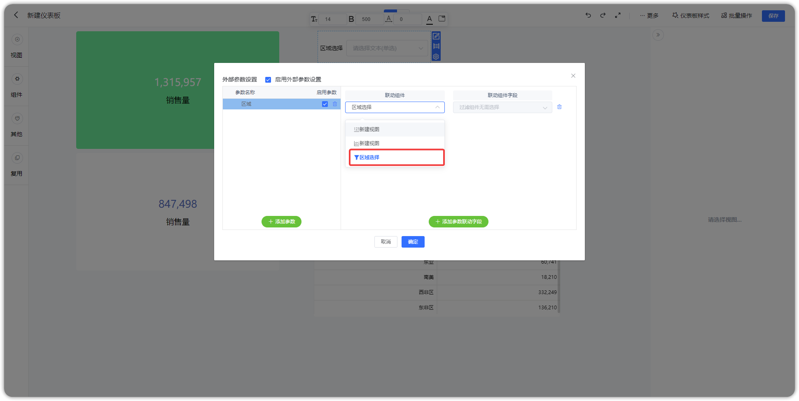{ width="900px" }

!!! Abstract ""
	注：新 Tab 预览页面的链接也支持外部参数设置，如果需要将仪表板嵌入到第三方系统中，同时要考虑数据的安全性和数据权限的过滤，建议使用新 Tab 预览页面的链接进行嵌入。

## 9 辅助设计网格

!!! Abstract ""
	点击下图按钮，可快速打开或关闭【辅助设计网格】，打开辅助设计网格后仪表板中显示网格线，可辅助仪表板制作，视图和组件可通过参考网格对齐，网格内部细化，可为矩阵模式提供更精细的定位。

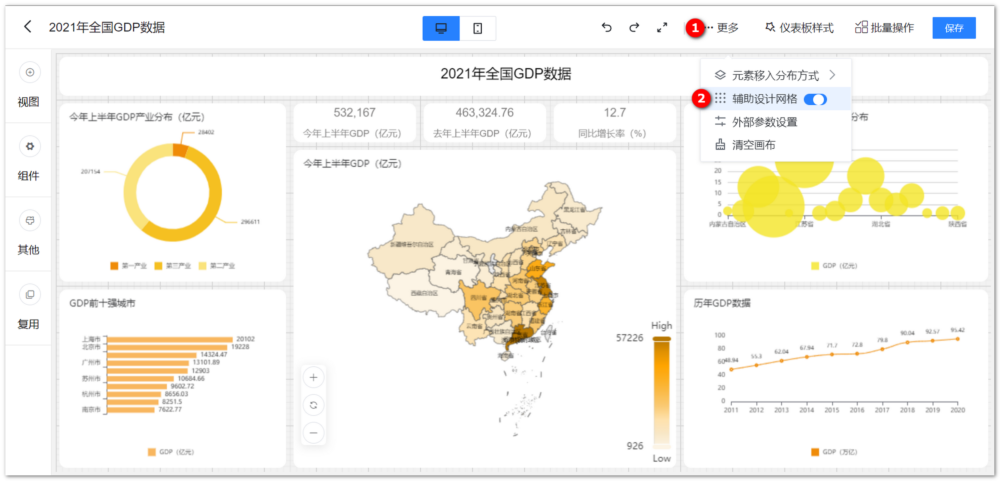{ width="900px" }

## 10 批量操作

!!! Abstract ""
	点击批量操作按钮，选择视图，可批量设置视图样式属性，且根据所选择的视图不同，可修改的属性不同，如下图所示。

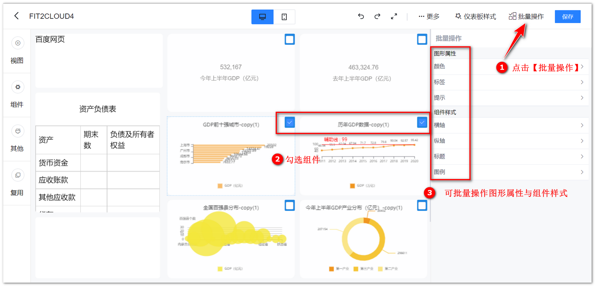{ width="900px" }

!!! Abstract ""
	当勾选多个不同类别的图形时，只能批量修改共性的属性。

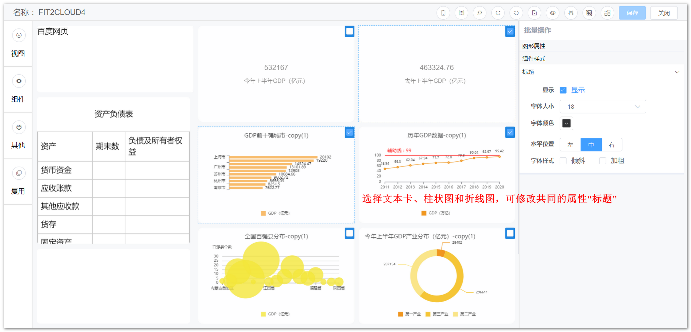{ width="900px" }

## 11 复用

!!! Abstract ""
	支持复用所有的组件，复用视图支持适配当前仪表板样式。

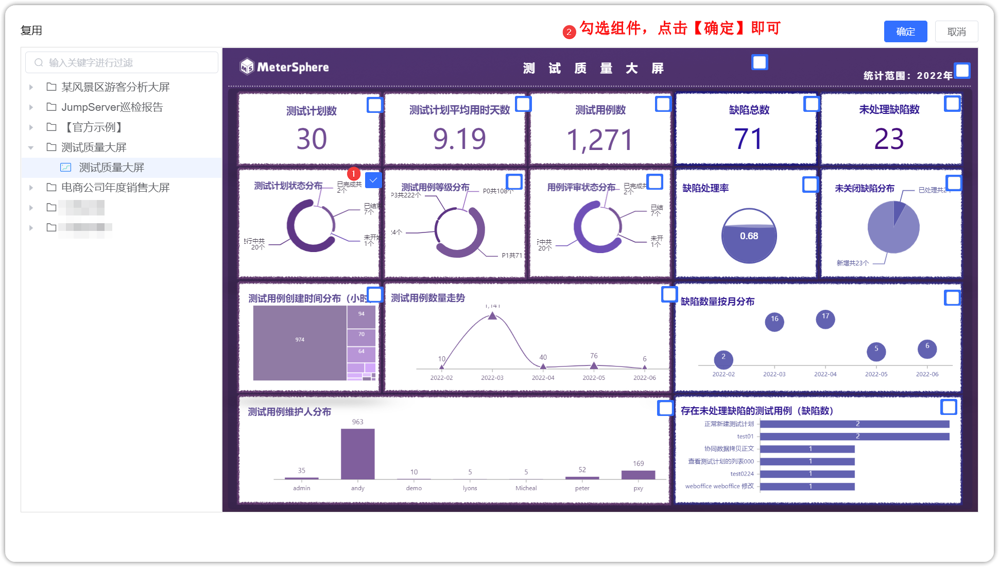{ width="900px" }

!!! Abstract ""
	复制上图不一样样式的仪表板中的视图会自动适配当前仪表板下的样式。

{ width="900px" }

## 12 保存

!!! Abstract ""
	点击下图所示的保存按钮，保存仪表板。

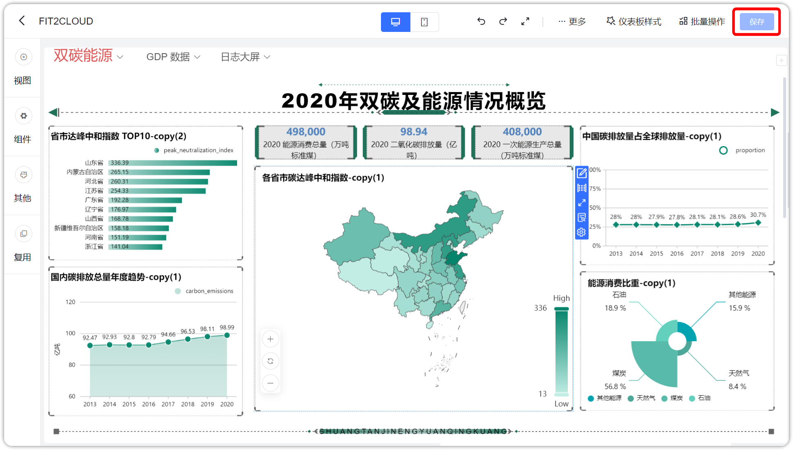{ width="900px" }

## 13 返回

!!! Abstract ""
	点击下图所示的返回按钮，关闭仪表板。

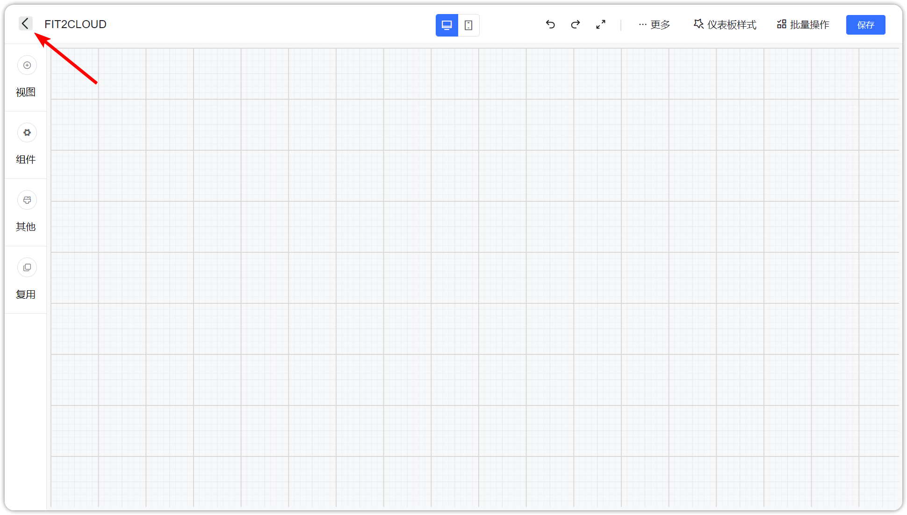{ width="900px" }

## 14 快捷键使用

!!! Abstract ""
	仪表板支持快捷键功能，支持复制、粘贴、保存、放大。  
	Mac：

	- 复制粘贴组件：command + D
	- 大图查看视图：command + .
	- 保存仪表板：command + s

    其他：

    - 复制粘贴组件：ctrl + D
    - 大图查看视图：ctrl + .
    - 保存仪表板：ctrl + s


