## 1 编辑仪表板

!!! Abstract ""
	点击下图所示的位置或者新建仪表板，进入仪表板编辑界面。

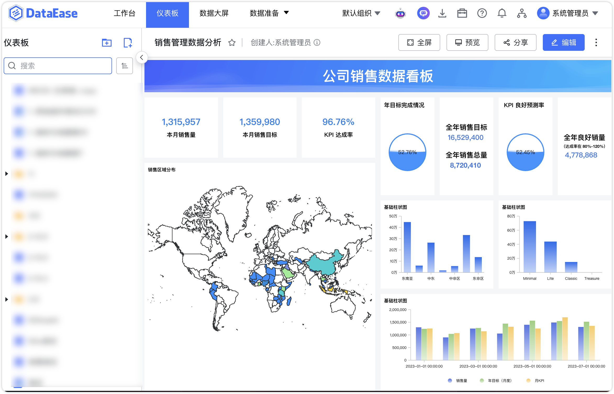{ width="900px" }

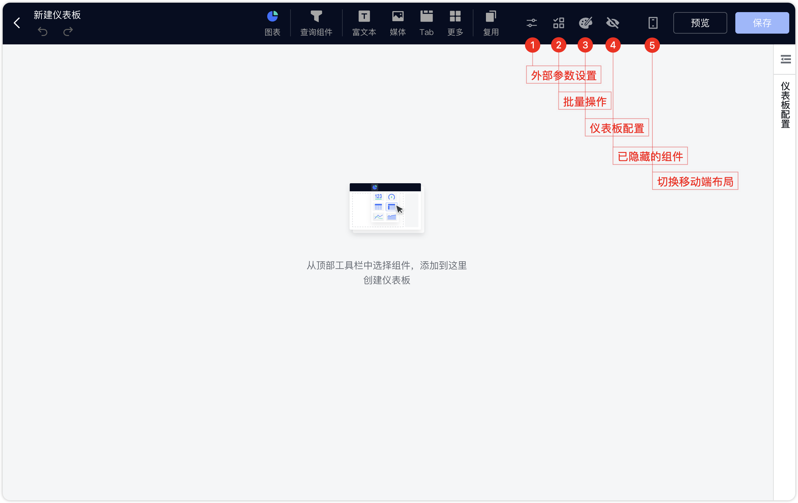{ width="900px" }

## 2 保存与发布
!!! Abstract ""
	仪表板提供发布版本与草稿版本两种版本，支持保存、发布、取消发布、恢复及预览操作。其中发布与取消发布影响发布版本，而保存和恢复至发布版本则作用于草稿版本。       
	使用示例:

    - 新建仪表板并修改内容，此时仅能【保存】为草稿，不能直接预览或分享。
    - 点击【发布】，草稿版本正式成为发布版本，供用户查看和使用，可以访问、分享和收藏。
    - 点击【取消发布】，则撤销已发布版本，使其变为草稿版本。
    - 若需要调整内容，可修改并【保存】，生成新的草稿版本。点击【恢复到已发布版本】，放弃当前修改，将草稿版本还原至已发布版本。

{ width="900px" }

{ width="900px" }

!!! Abstract ""
	**功能与逻辑介绍:**

    - **发布与取消发布**
        - 发布逻辑：发布操作用于发布草稿版本，仅当存在草稿版本时可执行发布。
        - 取消发布逻辑：
            - 仅存在已发布版本时，如果取消发布后，已发布版本变为草稿版本；
            - 同时存在草稿版本和已发布版本 ，在取消发布后，已发布版本被放弃，仅保留草稿版本；
            - 无已发布版本时，无法执行取消发布，只能保存草稿版本。

    - **预览和查看**
        - 预览页查看的是已发布的仪表板版本，而非未发布的草稿版本。
        - 若存在已发布版本和草稿版本，则预览显示已发布版本；
        - 若仅存在草稿版本，则无法预览。
        - 预览页的仪表板信息栏新增状态提示，若存在未发布的草稿版本，则显示【有更新】。

    - **列表展示**
        - 取消发布或者仅存在草稿版本在列表中置灰，不可查看、分享、收藏；
        - 已发布过的仪表板和数据大屏若取消发布后（即仅存在草稿版本），原先创建的分享链接和收藏记录不删除。通过分享链接访问时，将提示仪表板未发布，同时在收藏栏中无法点击查看。

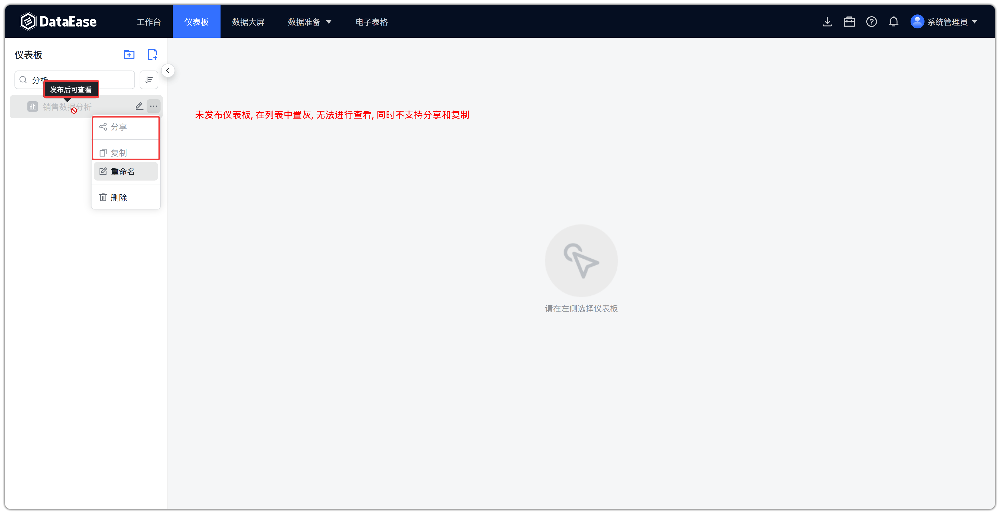{ width="900px" }

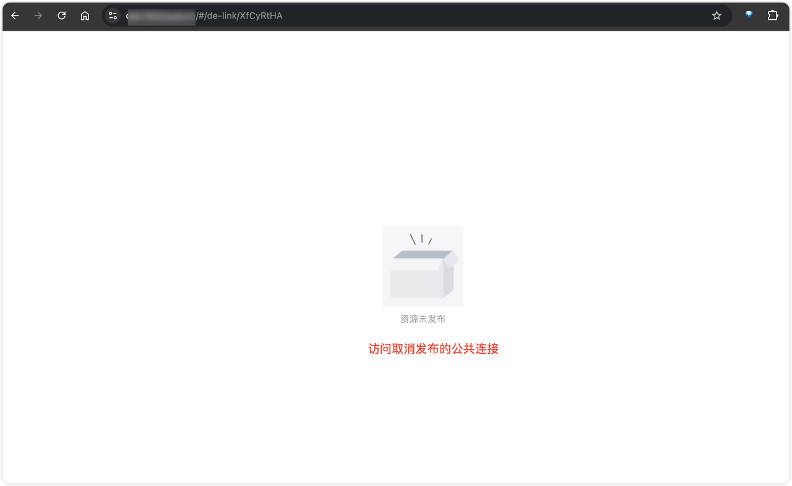{ width="900px" }


## 3 撤销

!!! Abstract ""
	点击下图按钮，撤销上一步操作。

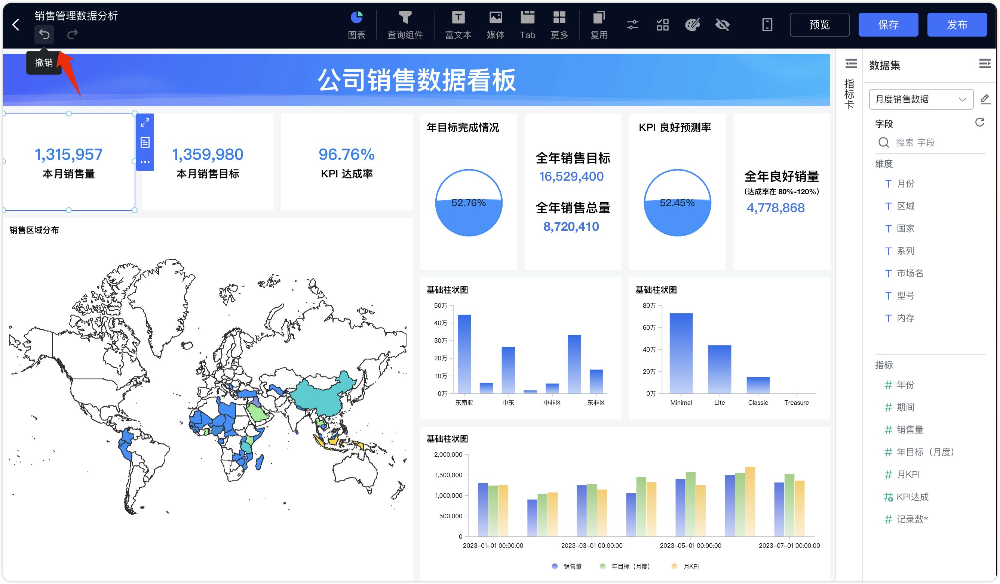{ width="900px" }

## 4 恢复

!!! Abstract ""
	**点击下图按钮，可以对组件操作恢复。**

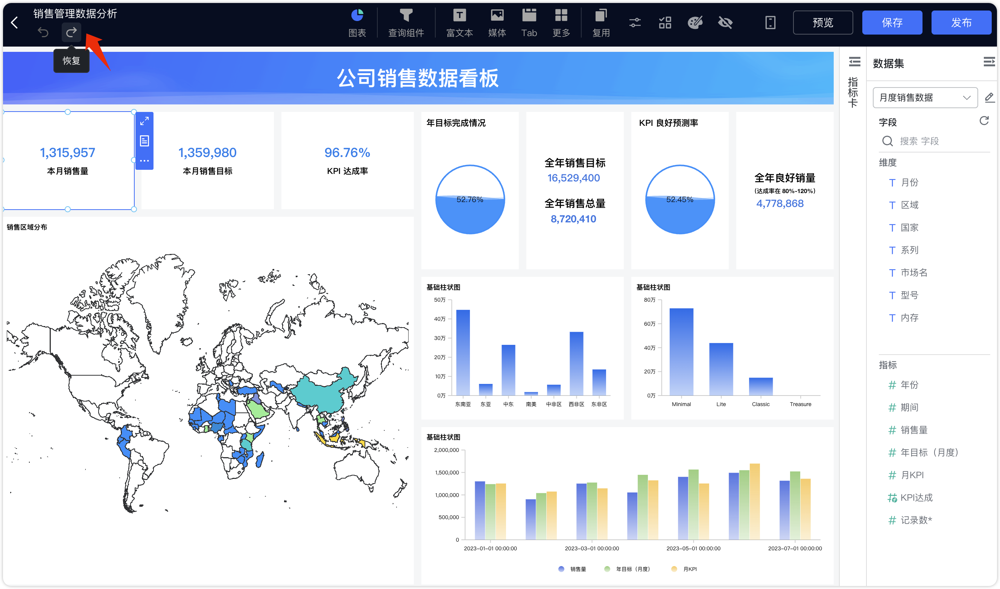{ width="900px" }

## 5 样式

!!! Abstract ""
	点击【样式】按钮，左侧弹出仪表板样式编辑页面。

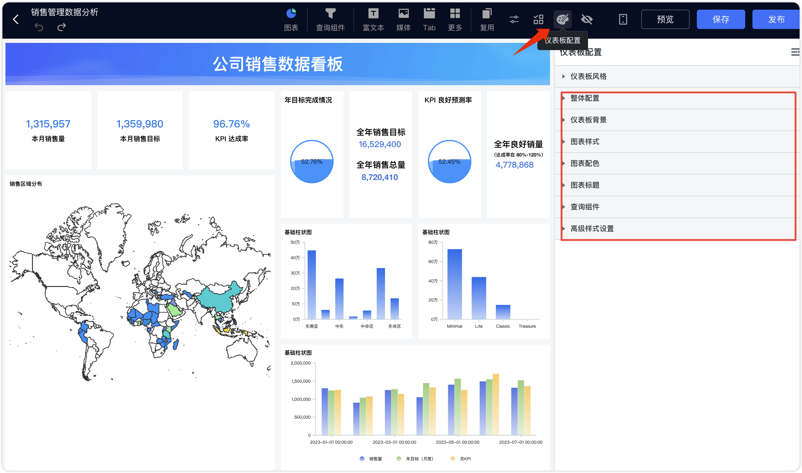{ width="900px" }

### 5.1 仪表板主题

!!! Abstract ""
	可在此位置设置仪表板的主题，包括系统主题与自定义主题，如下图所示，点击【保存】，可保存为仪表板主题。
	
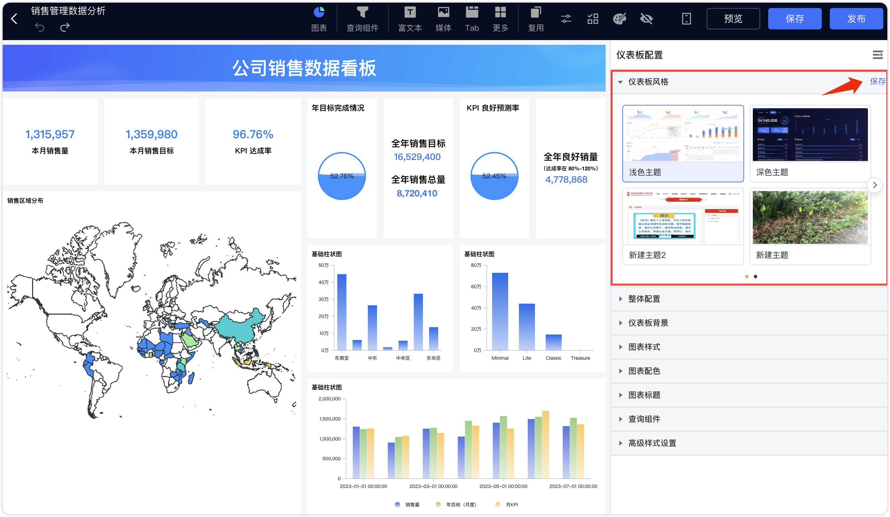{ width="900px" }

### 5.2 仪表板整体配置

!!! Abstract ""
	如下图所示，可调整仪表板主题色、组件间隙、缩放模式以及数据的刷新频率（整体刷新仅在公共链接生效）。  
	仪表板提供两种缩放显示方式：

    - 按画布比例缩放：高度和宽度独立按画布比例缩放。组件在设计阶段于画布中所占的比例将在预览阶段保持一致，从而确保布局的高度还原。
    - 按组件比例缩放：保持组件高度与宽度的比例固定。设计阶段设置的组件高度与宽度的比例将在预览阶段严格保持不变，确保视觉一致性。

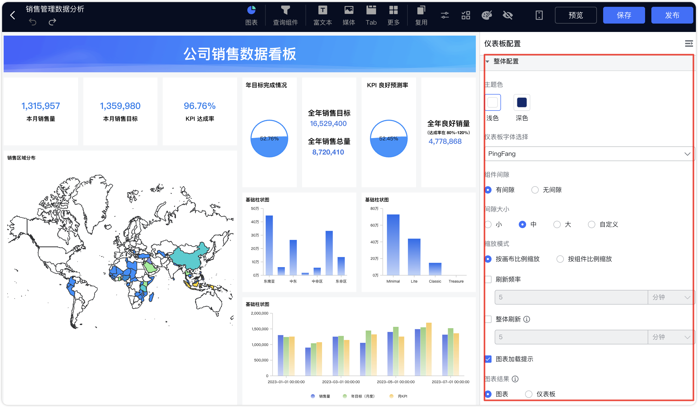{ width="900px" }

!!! Abstract ""
	仪表板支持间距大小设置，支持自定义组件间距提供大、中、小三种内置间距选项，支持自定义间距范围为 0 到 10。

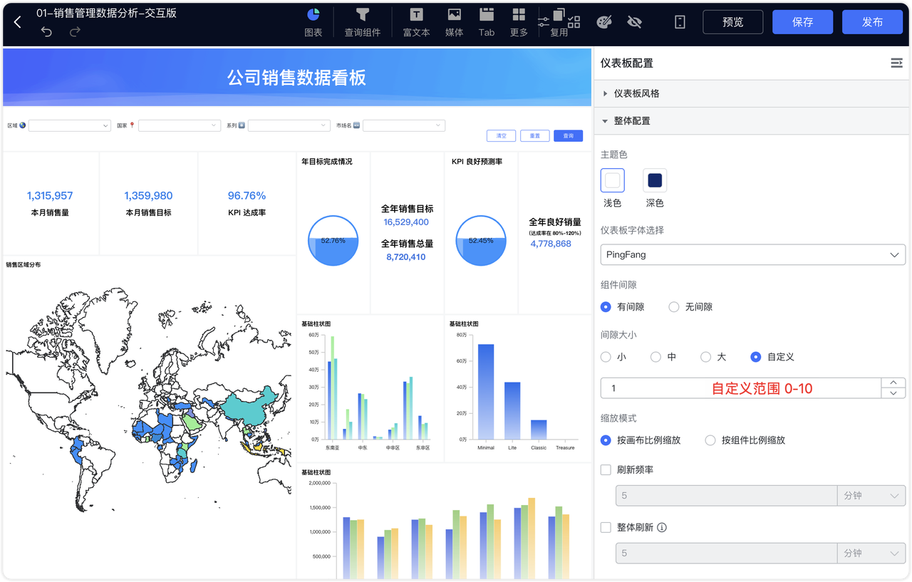{ width="900px" }

!!! Abstract ""
	仪表板支持字体更换。

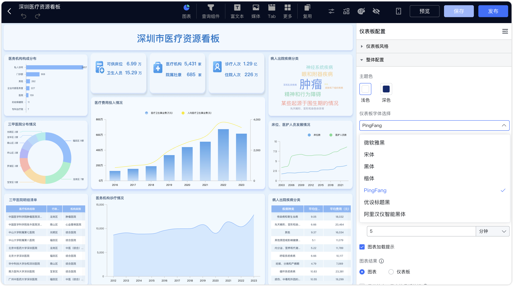{ width="900px" }


!!! Abstract ""
	如下图所示，可设置仪表板的刷新频率，支持到秒级刷新时间。  
	**提示：** 此设置在仪表板编辑页面不生效。

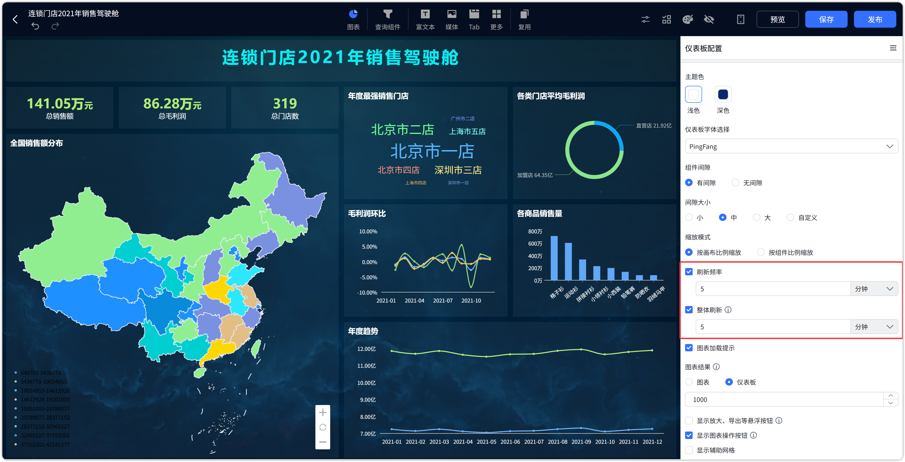{ width="900px" }

!!! Abstract ""
	如下图所示，可调整图表展示结果，选择【仪表板】，则覆盖图表的结果展示数量，取值范围 1~10000。

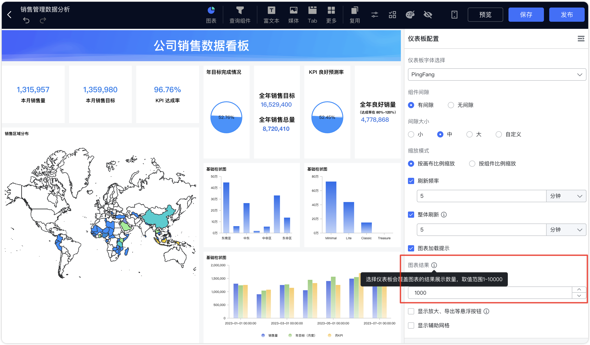{ width="900px" }

### 5.3 仪表板背景
!!! Abstract ""
	如下图所示，点击【仪表板背景】，设置仪表板背景颜色或图片，支持重新上传背景图片。

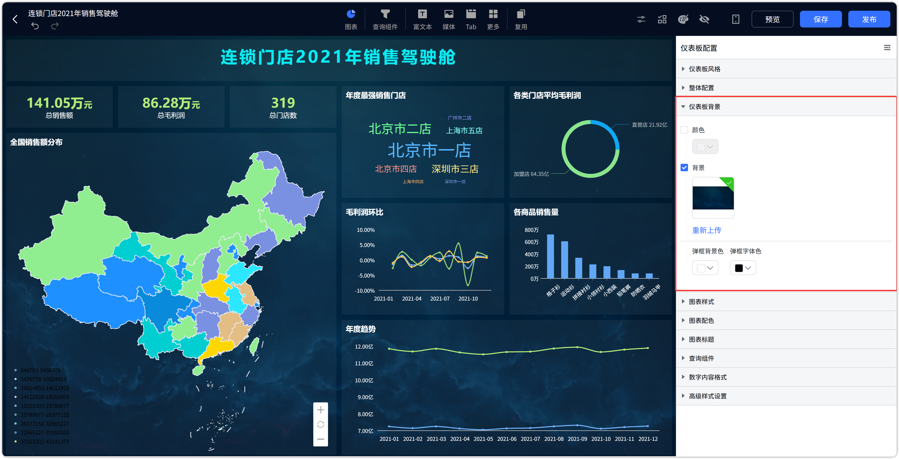{ width="900px" }

### 5.4 图表样式

!!! Abstract ""
	仪表板的样式设置支持调整所有组件的共用样式，即将影响整个仪表板已存在的组件，同时在图表层面也可做微调；  
	如下图所示，支持设置组件内边距、背景颜色、透明度、边框半径以及背景；

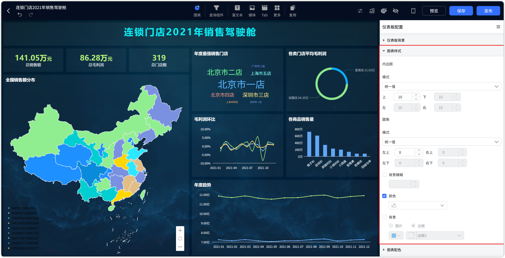{ width="900px" }

### 5.5 组件配色

!!! Abstract ""
	如下图所示，支持调整图表的配色方案，支持调整卡片的配色，包括文本卡与指标卡的配色，支持调整表格的配色，包括汇总表、明细表与透视表。

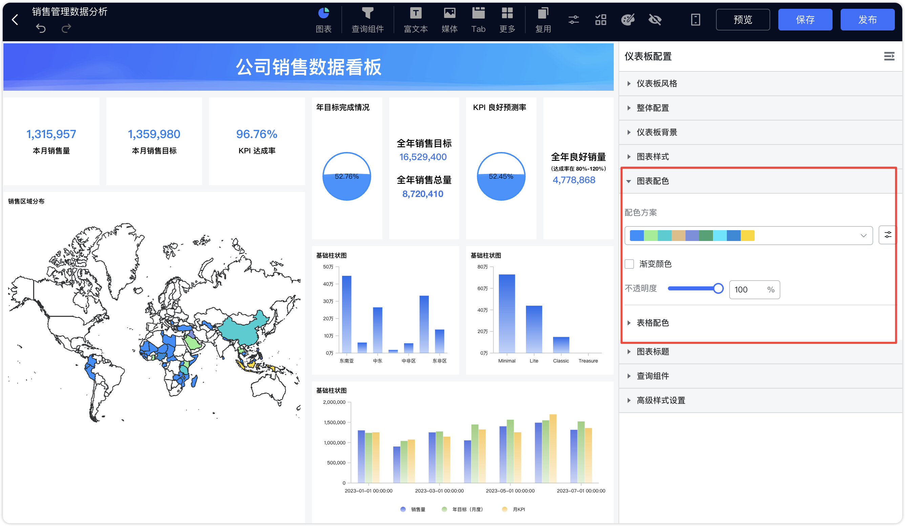{ width="900px" }

### 5.6 图表标题

!!! Abstract ""
	如下图所示，支持统一设置标题样式，标题样式首先基于仪表板，各图表可再在组件层面做微调。

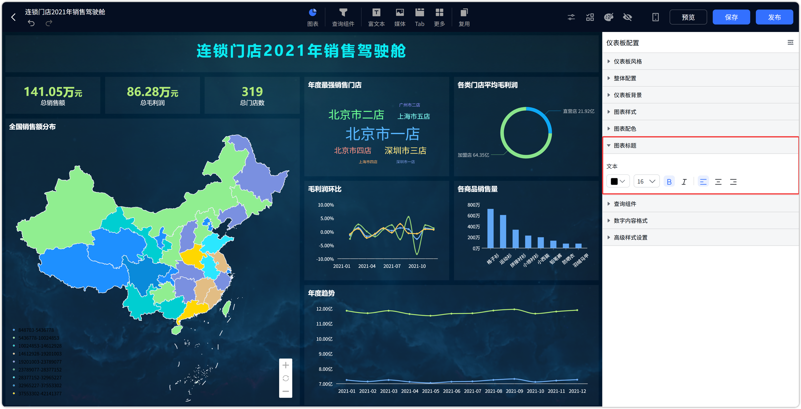{ width="900px" }

### 5.7 查询组件
	
!!! Abstract ""
	如下图所示，支持设置过滤组件标题样式，包括位置调整与颜色调整，支持输入框样式调整。

{ width="900px" }


## 6 外部参数设置

!!! Abstract ""
	点击下图按钮，弹出外部参数设置页面，外部参数设置步骤：
	增加一个参数并命名，启用参数，可设置多个参数；配置联动视图与联动视图的字段；  
	新版本中，对关联组件做了分类，分为查询组件和图表两类。查询组件的关联需要选择关联条件。图表关联则可以通过数据集批量关联，减少重复操作。且图表的关联支持直接选择与数据集参数进行关联。  
	**注意：外部传参同时关联查询组件与图表时，以查询组件的优先级优先。**

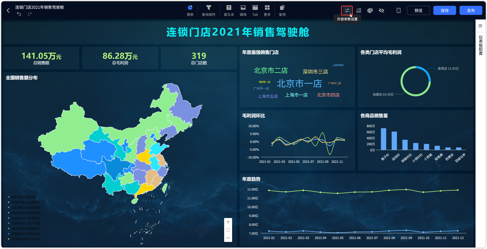{ width="900px" }

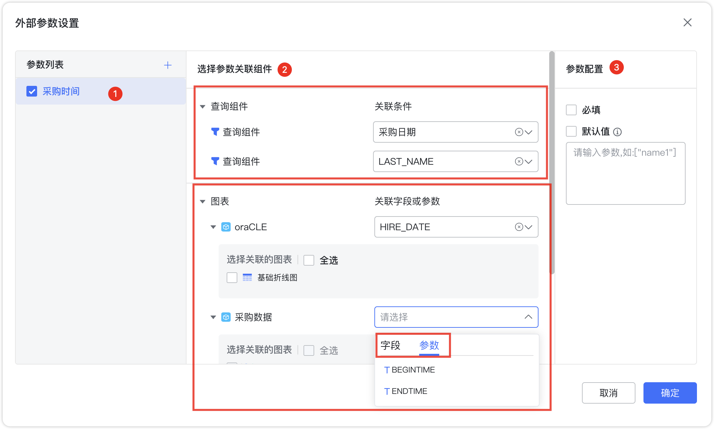{ width="900px" }

!!! Abstract ""
	**推荐直接在公共链接的 [Ticket 机制](dashboard_using_copy.md)中进行设置。相较于外部参数进行 Base64 编码处理后拼接，公共链接外部参数可以直接在 Ticket 参数中简易设置。  
	注意：使用 Ticket 设置和 Base64 加密组装均需要开启外部参数，进行参数设置。**   

!!! Abstract ""
	公共链接参数组装对传参进行 Base64 处理，以下为示例：配置参数名为"省份"，关联了仪表板中【省份】文本下拉过滤组件（也可关联对应的图表字段），组装参数为 {"省份":"北京市"}，使用 base64 加密处理，该示例通过电脑终端进行，其它方式均可。
	```
	echo '{"省份":"北京市"}'|base64
	```
	加密结果为：eyLnnIHku70iOiLljJfkuqzluIIifQo= ，组装规则如下:  
	< 仪表板公共链接 > + < ?attachParams= > + < 加密后的结果 >  
	构建完整的 URL 为：<仪表板公共链接>?attachParams=eyLnnIHku70iOiLljJfkuqzluIIifQo=
	以公共链接的形式访问仪表板，关联的内容被过滤。  

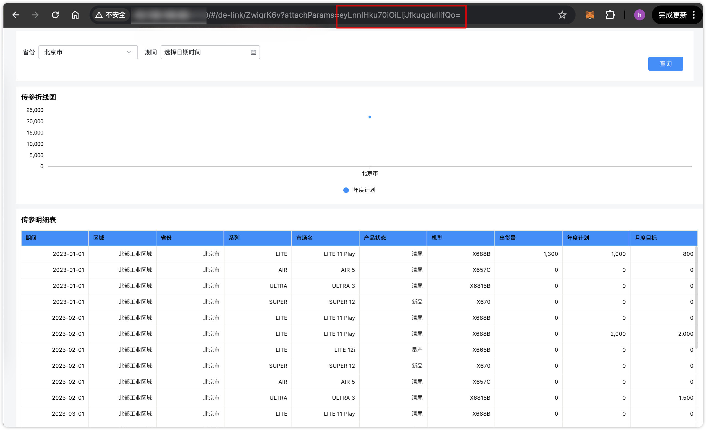{ width="900px" }

!!! Abstract ""
	公共链接外部参数支持一参多传、多参数传参，可通过数组形式传入多值，对组件进行多选，如下示例，对参数进行处理。   
	提示： 传参处理时，若拼接后的 URL 带特殊符号，需做转换处理，示例如：+ 用 %2B 替代。  
	```
	echo '{"省份":["山东省","四川省","广东省","河南省"]}'|base64
	```
	```
	echo '{"省份":"广东省","年份":"2023"}'|base64
	```
	注意： 在做完 Base64 编码后，再做一次 encodeURIComponent 的 URL 编码，以防有些内容编码后存在特殊字符，浏览器无法解析的情况。  
	存在这类字符时，会提示”外部参数解析错误未生效，请按规定编码方式传参“。

## 7 组件隐藏
!!! Abstract ""
	仪表板编辑页面【隐藏设置】 按钮，可在 PC 端样式中隐藏指定组件。隐藏后原有布局会受到影响，其他组件将自动补位，但不影响移动端显示。

    隐藏设置操作：
    
    - 组件隐藏入口：点击仪表板顶部菜单栏【隐藏设置】按钮，进入组件隐藏设置状态。
    - 隐藏组件：左侧组件的隐藏图标，点击该图标可将组件加入 已隐藏组件列表。
    - 查看已隐藏组件：右侧显示已隐藏组件列表，可随时查看隐藏的组件状态。点击已隐藏组件，即可恢复显示。


    隐藏设置状态的退出方式：

    - 点击仪表板顶部菜单栏【隐藏设置】按钮可退出。
    - 点击除组件右上角隐藏图标以外的任意区域，如点击仪表板，显示仪表板属性设置栏。
    - 点击顶部功能按钮（如外部参数、仪表板配置、移动端布局、图表、复用等），退出隐藏设置状态并执行相应操作。

{ width="900px" }

!!! Abstract ""
	在单个组件的右上角菜单中，点击【隐藏】选项，可直接进入隐藏设置状态，并将该组件添加至【已隐藏组件列表】。其余操作与隐藏设置流程一致。

{ width="900px" }

!!! Abstract ""
	在【已隐藏组件】列表中，点击组件可恢复显示，操作方式与移动端布局一致。

{ width="900px" }

## 8 批量操作

!!! Abstract ""
	点击批量操作按钮，选择图表，可批量设置图表样式属性，且根据所选择的图表不同，可修改的属性不同，如下图所示。

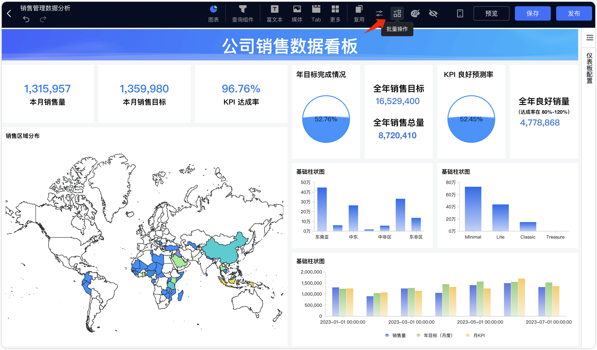{ width="900px" }

!!! Abstract ""
	**请注意：当勾选多个不同类别的图形时，只能批量修改共性的属性。**

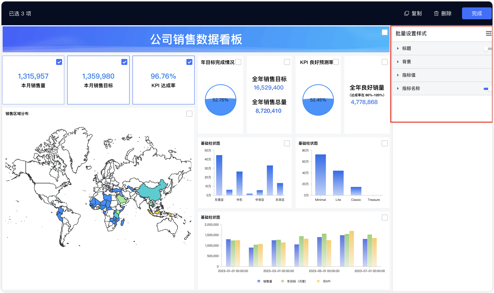{ width="900px" }

## 9 复用

!!! Abstract ""
	支持复用所有的组件，复用图表支持适配当前仪表板样式。

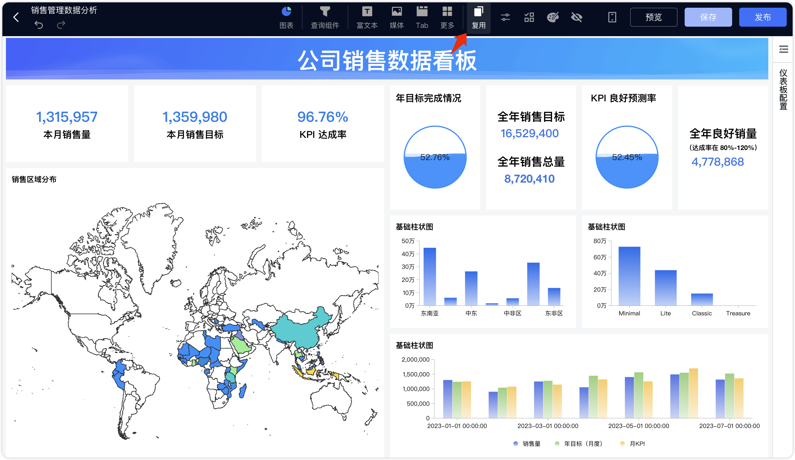{ width="900px" }

!!! Abstract ""
	复制上图不一样样式的仪表板中的图表会自动适配当前仪表板下的样式。

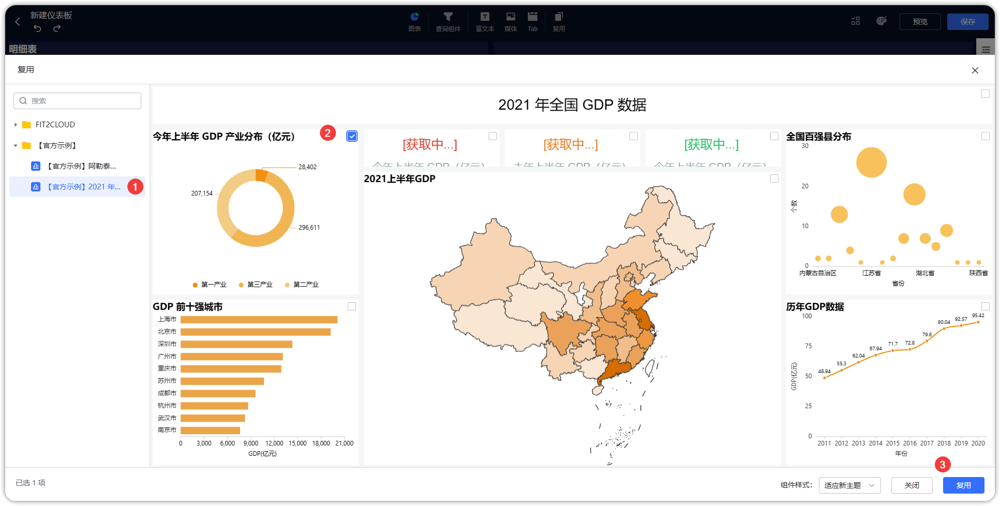{ width="900px" }


## 10 返回

!!! Abstract ""
	点击下图所示的返回按钮，关闭仪表板。

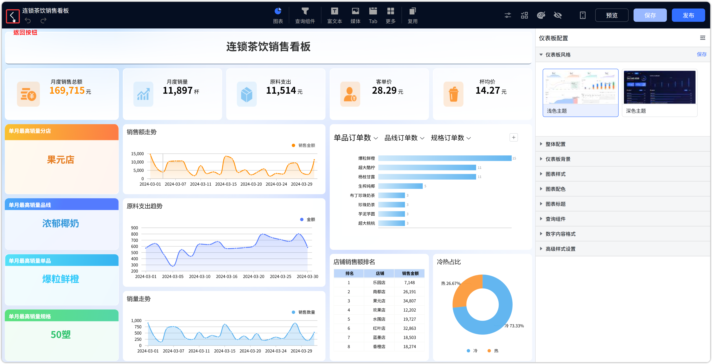{ width="900px" }


