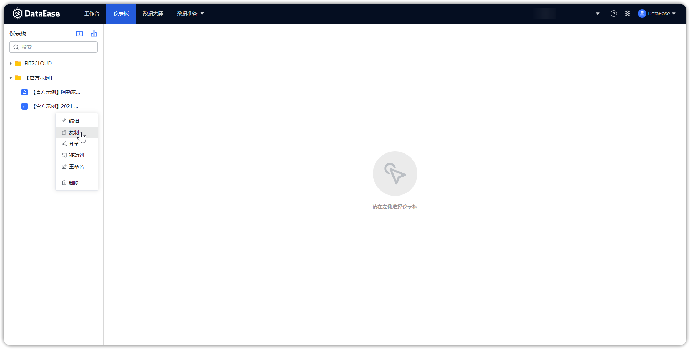
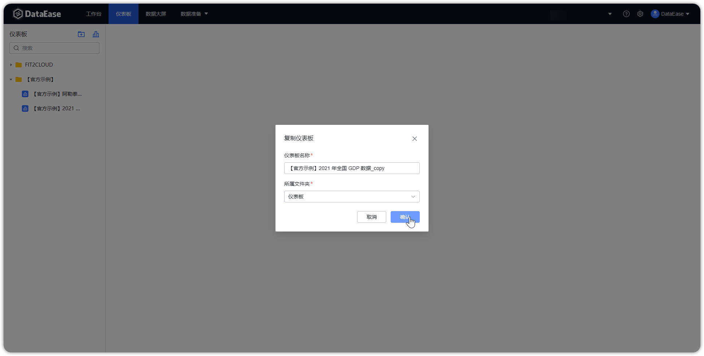

## 1 自定义仪表板

!!! Abstract ""
	点击【序号 1】 或【序号 2】位置新建仪表板，根据下图所示操作，在目录下新建仪表板；

{ width="900px" }  

## 2 复制仪表板

!!! Abstract ""
	复制模版，按下图所示，选择对应的仪表板进行复制，保存复制的仪表板。

{ width="900px" }  
{ width="900px" }

