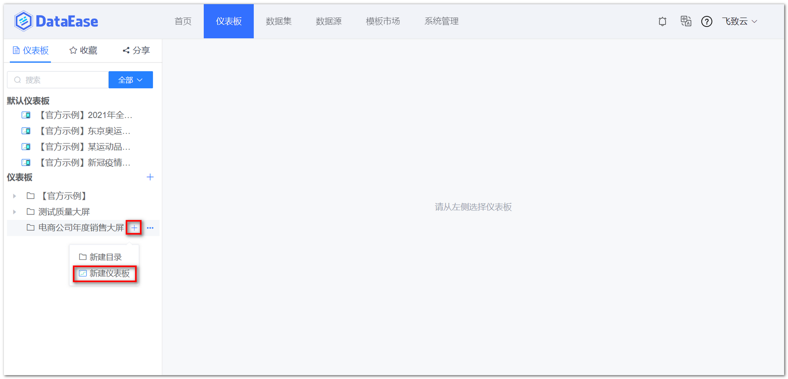
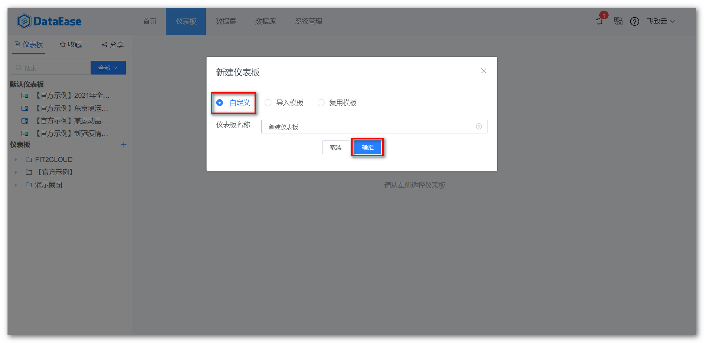
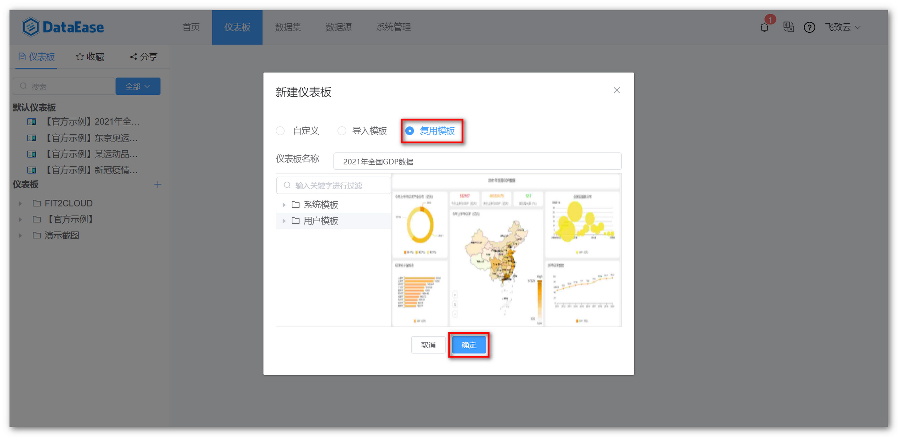
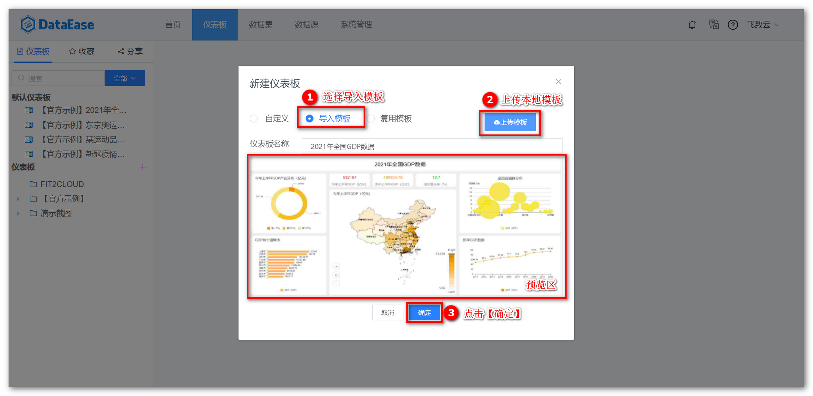

## 1 自定义仪表板

!!! Abstract ""
	点击【新建仪表板】，根据下图所示操作，在目录下自定义模版；

{ width="900px" }  
{ width="900px" }

## 2 复用仪表板

!!! Abstract ""
	复用模版，按下图所示，选择系统内保存的模板，新建仪表板。

{ width="900px" }

## 3 导入仪表板

!!! Abstract ""
	如下图所示，选择【导入模板】，上传 .DET 模板文件，点击【确定】即可。

{ width="900px" }